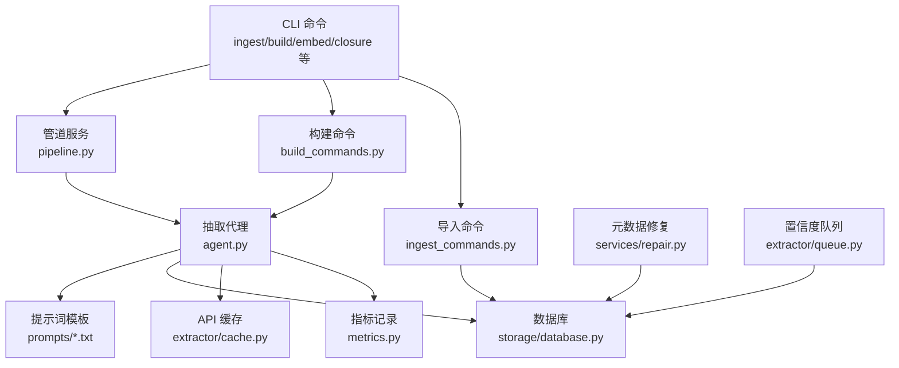
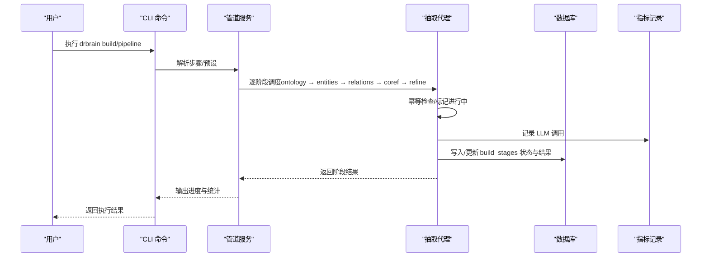
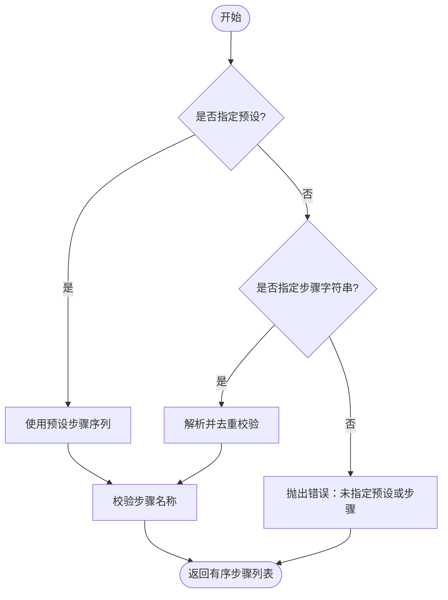
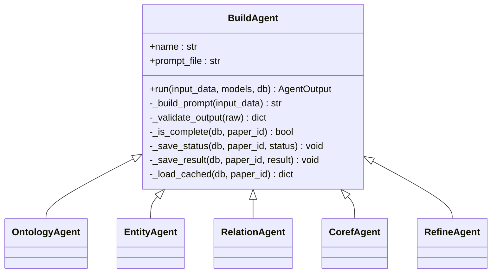
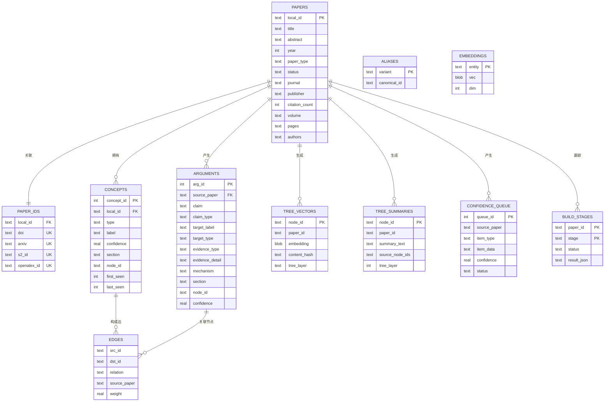
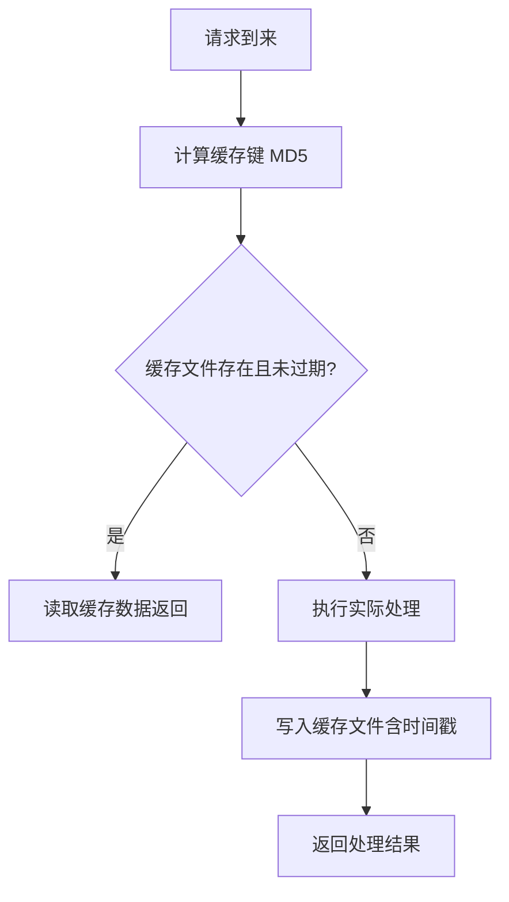
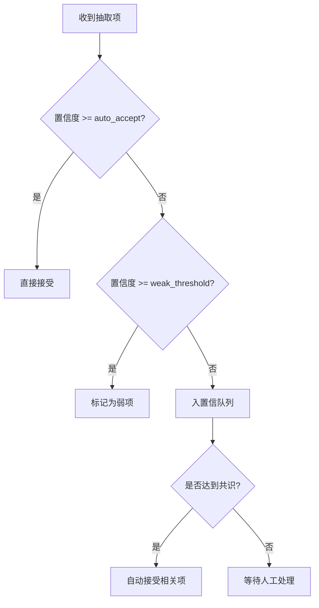
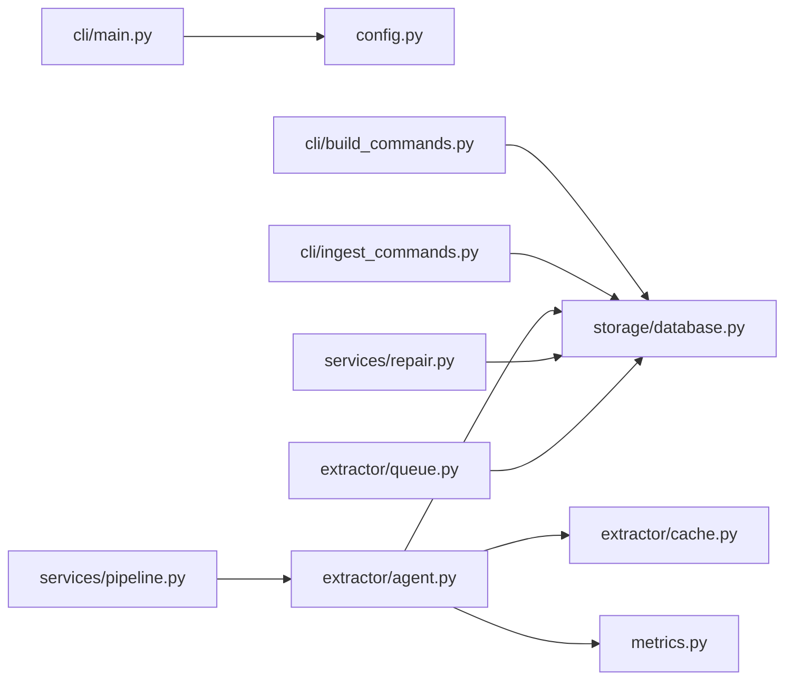

# 抽取工作流程

<cite>
**本文引用的文件**
- [src/drbrain/extractor/__init__.py](file://src/drbrain/extractor/__init__.py)
- [src/drbrain/extractor/agent.py](file://src/drbrain/extractor/agent.py)
- [src/drbrain/extractor/cache.py](file://src/drbrain/extractor/cache.py)
- [src/drbrain/extractor/queue.py](file://src/drbrain/extractor/queue.py)
- [src/drbrain/services/pipeline.py](file://src/drbrain/services/pipeline.py)
- [src/drbrain/storage/database.py](file://src/drbrain/storage/database.py)
- [src/drbrain/config.py](file://src/drbrain/config.py)
- [src/drbrain/cli/main.py](file://src/drbrain/cli/main.py)
- [src/drbrain/cli/build_commands.py](file://src/drbrain/cli/build_commands.py)
- [src/drbrain/cli/ingest_commands.py](file://src/drbrain/cli/ingest_commands.py)
- [src/drbrain/metrics.py](file://src/drbrain/metrics.py)
- [src/drbrain/services/repair.py](file://src/drbrain/services/repair.py)
- [prompts/entities.txt](file://prompts/entities.txt)
- [prompts/relations.txt](file://prompts/relations.txt)
</cite>

## 目录
1. [简介](#简介)
2. [项目结构](#项目结构)
3. [核心组件](#核心组件)
4. [架构总览](#架构总览)
5. [详细组件分析](#详细组件分析)
6. [依赖分析](#依赖分析)
7. [性能考虑](#性能考虑)
8. [故障排查指南](#故障排查指南)
9. [结论](#结论)
10. [附录](#附录)

## 简介
本技术文档围绕 DrBrain 的“知识抽取工作流程”展开，系统性阐述从原始文本到结构化知识的完整转换过程，覆盖预处理、抽取、后处理与验证阶段；同时记录缓存机制（数据缓存、结果缓存）与性能优化策略，解释配置项与自定义方法（阶段选择、参数调整、质量控制），并提供启动抽取任务与监控执行状态的操作指引，说明与存储系统的集成与数据持久化机制，以及性能监控与故障诊断方法。

## 项目结构
DrBrain 将抽取工作流划分为多个层次：
- CLI 层：对外提供命令入口，加载配置与日志，组织工作流调用。
- 服务层：定义管道步骤、修复与元数据增强等服务。
- 抽取器层：构建阶段代理（Agent）与提示词模板，负责结构化抽取。
- 存储层：SQLite 数据库，承载论文、概念、关系、别名、嵌入、树向量、置信队列等实体。
- 缓存层：基于文件的 API 响应缓存，支持 TTL 过期控制。
- 指标层：SQLite 记录 LLM 调用与通用事件，支持线程安全与 WAL 模式。

图表来源
- [src/drbrain/cli/main.py:77-146](file://src/drbrain/cli/main.py#L77-L146)
- [src/drbrain/services/pipeline.py:23-50](file://src/drbrain/services/pipeline.py#L23-L50)
- [src/drbrain/extractor/agent.py:53-136](file://src/drbrain/extractor/agent.py#L53-L136)
- [src/drbrain/storage/database.py:159-258](file://src/drbrain/storage/database.py#L159-L258)
- [src/drbrain/extractor/cache.py:14-65](file://src/drbrain/extractor/cache.py#L14-L65)
- [src/drbrain/metrics.py:49-181](file://src/drbrain/metrics.py#L49-L181)
- [src/drbrain/services/repair.py:265-337](file://src/drbrain/services/repair.py#L265-L337)
- [src/drbrain/extractor/queue.py:10-106](file://src/drbrain/extractor/queue.py#L10-L106)

章节来源
- [src/drbrain/cli/main.py:77-146](file://src/drbrain/cli/main.py#L77-L146)
- [src/drbrain/services/pipeline.py:23-50](file://src/drbrain/services/pipeline.py#L23-L50)

## 核心组件
- 管道与步骤定义：通过预设与步骤列表解析，确定执行顺序与作用域（收件箱/论文/全局）。
- 抽取代理（Agent）：封装每个构建阶段（本体、实体、关系、共指消解、精炼），统一输入输出契约、重试与幂等。
- 数据库：Schema 自动初始化与迁移，提供论文、概念、关系、别名、嵌入、树向量、置信队列等表操作。
- API 缓存：文件型 JSON 缓存，按键哈希存储，带 TTL 过期。
- 指标记录：SQLite WAL 模式，线程安全记录 LLM 调用与事件。
- 元数据修复：多源外部 API 增强与修复，提升抽取质量。
- 置信队列：根据置信阈值路由抽取结果，支持共识检测与批量处理。

章节来源
- [src/drbrain/services/pipeline.py:53-109](file://src/drbrain/services/pipeline.py#L53-L109)
- [src/drbrain/extractor/agent.py:53-196](file://src/drbrain/extractor/agent.py#L53-L196)
- [src/drbrain/storage/database.py:159-258](file://src/drbrain/storage/database.py#L159-L258)
- [src/drbrain/extractor/cache.py:14-65](file://src/drbrain/extractor/cache.py#L14-L65)
- [src/drbrain/metrics.py:49-181](file://src/drbrain/metrics.py#L49-L181)
- [src/drbrain/services/repair.py:265-337](file://src/drbrain/services/repair.py#L265-L337)
- [src/drbrain/extractor/queue.py:10-106](file://src/drbrain/extractor/queue.py#L10-L106)

## 架构总览
抽取工作流以“导入 → 构建 → 嵌入 → 闭包推理”为主线，其中“构建”阶段采用五步 Agent 流水线，每步均具备幂等、校验与持久化能力，并通过数据库状态表跟踪阶段完成情况。

图表来源
- [src/drbrain/services/pipeline.py:53-109](file://src/drbrain/services/pipeline.py#L53-L109)
- [src/drbrain/extractor/agent.py:73-136](file://src/drbrain/extractor/agent.py#L73-L136)
- [src/drbrain/storage/database.py:159-258](file://src/drbrain/storage/database.py#L159-L258)
- [src/drbrain/metrics.py:74-152](file://src/drbrain/metrics.py#L74-L152)

## 详细组件分析

### 阶段与步骤解析
- 步骤定义：包含名称、作用域（收件箱/论文/全局）、描述。
- 预设：full/quick/embed 三种常用组合，便于快速执行。
- 解析逻辑：支持按预设或逗号分隔步骤字符串解析，进行去重与校验。

图表来源
- [src/drbrain/services/pipeline.py:53-89](file://src/drbrain/services/pipeline.py#L53-L89)

章节来源
- [src/drbrain/services/pipeline.py:23-50](file://src/drbrain/services/pipeline.py#L23-L50)
- [src/drbrain/services/pipeline.py:53-109](file://src/drbrain/services/pipeline.py#L53-L109)

### 抽取代理（Agent）体系
- 统一契约：AgentInput/AgentOutput 定义输入输出字段，包含阶段状态与差异信息。
- 幂等与重试：通过数据库状态表判断是否已完成；失败时标记失败状态。
- 提示词模板：各阶段对应 prompts 下的 txt 文件，Agent 动态读取。
- 结果持久化：将验证后的结构化结果写入 build_stages 表，供后续阶段复用。

图表来源
- [src/drbrain/extractor/agent.py:53-196](file://src/drbrain/extractor/agent.py#L53-L196)
- [src/drbrain/extractor/agent.py:199-368](file://src/drbrain/extractor/agent.py#L199-L368)

章节来源
- [src/drbrain/extractor/agent.py:53-196](file://src/drbrain/extractor/agent.py#L53-L196)
- [prompts/entities.txt:1-19](file://prompts/entities.txt#L1-L19)
- [prompts/relations.txt:1-24](file://prompts/relations.txt#L1-L24)

### 数据库模型与持久化
- Schema 自动初始化与迁移：首次连接即执行脚本创建表与索引，并按版本号顺序应用迁移。
- 关键表：
  - papers/paper_ids：论文与外部 ID 映射。
  - concepts/arguments/edges：概念、论点与关系三元组。
  - aliases：别名映射。
  - embeddings/tree_vectors/tree_summaries：向量与树摘要。
  - confidence_queue：置信队列。
  - build_stages：构建阶段状态与结果。
- 查询与维护：提供插入、查询、删除、演进信号检测等接口。

图表来源
- [src/drbrain/storage/database.py:10-156](file://src/drbrain/storage/database.py#L10-L156)
- [src/drbrain/storage/database.py:159-258](file://src/drbrain/storage/database.py#L159-L258)

章节来源
- [src/drbrain/storage/database.py:159-258](file://src/drbrain/storage/database.py#L159-L258)

### 缓存机制（数据缓存与结果缓存）
- API 缓存：文件型 JSON 缓存，键经 MD5 哈希映射到文件，保存时间戳与数据；过期时间由 TTL 控制。
- 结果缓存：Agent 在数据库中保存已完成阶段的结果，避免重复计算；幂等运行时可直接读取缓存。

图表来源
- [src/drbrain/extractor/cache.py:21-49](file://src/drbrain/extractor/cache.py#L21-L49)
- [src/drbrain/extractor/agent.py:151-195](file://src/drbrain/extractor/agent.py#L151-L195)

章节来源
- [src/drbrain/extractor/cache.py:14-65](file://src/drbrain/extractor/cache.py#L14-L65)
- [src/drbrain/extractor/agent.py:151-195](file://src/drbrain/extractor/agent.py#L151-L195)

### 后处理与验证（置信队列与共识检测）
- 路由策略：高置信度直接接受，中等置信度进入弱队列，低置信度入队等待人工/自动处理。
- 共识检测：当同一标签在多篇论文中出现且平均置信度达标时，自动接受相关队列项。
- 批量处理：支持按类型与最大置信度过滤，批量接受或拒绝。

图表来源
- [src/drbrain/extractor/queue.py:10-46](file://src/drbrain/extractor/queue.py#L10-L46)
- [src/drbrain/extractor/queue.py:48-106](file://src/drbrain/extractor/queue.py#L48-L106)

章节来源
- [src/drbrain/extractor/queue.py:10-106](file://src/drbrain/extractor/queue.py#L10-L106)

### 配置选项与自定义方法
- 配置加载：支持基础配置与本地覆盖合并，环境变量占位符解析。
- 关键配置项：
  - dirs：目录路径（收件箱、待处理、论文、报告、缓存、日志）。
  - db：数据库路径。
  - llm：模型列表。
  - api：第三方 API 凭证与缓存 TTL。
  - extract：并发控制。
  - queue：弱阈值与自动接受阈值。
  - fetch：并发、超时、回退顺序、代理等。
  - embed：嵌入模型、设备、top_k、下载源等。
  - backup：备份目标（SSH/rsync）。
- 自定义方法：
  - 步骤选择：通过预设或步骤字符串定制执行链。
  - 参数调整：修改并发、阈值、模型与嵌入参数。
  - 质量控制：利用置信队列与共识检测，结合人工审核。

章节来源
- [src/drbrain/config.py:195-292](file://src/drbrain/config.py#L195-L292)
- [src/drbrain/services/pipeline.py:53-89](file://src/drbrain/services/pipeline.py#L53-L89)

### 启动抽取任务与状态监控
- 启动任务：
  - 导入：drbrain ingest 或 drbrain ingest-link。
  - 构建：drbrain build（可选 --all、--skip-refine）。
  - 管道：drbrain pipeline --preset full/quick/embed 或 --steps 指定步骤。
- 监控执行状态：
  - CLI 输出进度与统计。
  - 数据库 build_stages 记录阶段状态与结果。
  - 指标系统记录 LLM 调用耗时、Token 使用与事件详情。

章节来源
- [src/drbrain/cli/build_commands.py:97-200](file://src/drbrain/cli/build_commands.py#L97-L200)
- [src/drbrain/cli/ingest_commands.py:26-110](file://src/drbrain/cli/ingest_commands.py#L26-L110)
- [src/drbrain/storage/database.py:159-258](file://src/drbrain/storage/database.py#L159-L258)
- [src/drbrain/metrics.py:74-152](file://src/drbrain/metrics.py#L74-L152)

### 与存储系统的集成与数据持久化
- 导入阶段：解析 PDF → 识别 → 树结构生成 → 写入论文与 ID 映射。
- 构建阶段：基于树结构逐节抽取，写入概念、关系、别名、树向量与摘要。
- 嵌入与闭包：训练 TransE 图嵌入与树文本嵌入，执行规则推理。
- 元数据修复：多源 API 增强与修复，写回数据库。

章节来源
- [src/drbrain/cli/ingest_commands.py:26-110](file://src/drbrain/cli/ingest_commands.py#L26-L110)
- [src/drbrain/services/repair.py:265-337](file://src/drbrain/services/repair.py#L265-L337)

## 依赖分析
- 组件耦合：
  - CLI 依赖配置加载与日志初始化，再委派至具体命令。
  - 管道服务与抽取代理共同依赖数据库状态表与提示词模板。
  - 指标模块与缓存模块分别独立，但都与 Agent 协同工作。
- 外部依赖：
  - LLM 客户端（acall_with_fallback）用于模型调用与回退。
  - 多个外部 API（CrossRef/OpenAlex/arXiv）用于元数据修复与检索。
- 循环依赖规避：指标模块通过延迟导入避免循环依赖。

图表来源
- [src/drbrain/cli/main.py:80-92](file://src/drbrain/cli/main.py#L80-L92)
- [src/drbrain/config.py:195-292](file://src/drbrain/config.py#L195-L292)
- [src/drbrain/services/pipeline.py:53-109](file://src/drbrain/services/pipeline.py#L53-L109)
- [src/drbrain/extractor/agent.py:73-136](file://src/drbrain/extractor/agent.py#L73-L136)
- [src/drbrain/storage/database.py:159-258](file://src/drbrain/storage/database.py#L159-L258)
- [src/drbrain/extractor/cache.py:14-65](file://src/drbrain/extractor/cache.py#L14-L65)
- [src/drbrain/metrics.py:49-181](file://src/drbrain/metrics.py#L49-L181)
- [src/drbrain/services/repair.py:265-337](file://src/drbrain/services/repair.py#L265-L337)
- [src/drbrain/extractor/queue.py:10-106](file://src/drbrain/extractor/queue.py#L10-L106)

章节来源
- [src/drbrain/cli/main.py:80-92](file://src/drbrain/cli/main.py#L80-L92)
- [src/drbrain/extractor/agent.py:83-130](file://src/drbrain/extractor/agent.py#L83-L130)

## 性能考虑
- 并发控制：配置中提供提取与抓取并发参数，建议根据资源与速率限制合理设置。
- 缓存策略：API 缓存与结果缓存双管齐下，显著降低重复计算与外部调用成本。
- 数据库优化：WAL 日志模式、索引与迁移管理，确保查询与写入效率。
- 指标监控：记录 Token 用量与耗时，辅助容量规划与成本控制。
- 建议：
  - 对高并发场景启用合理的并发上限与队列长度。
  - 定期清理过期缓存与数据库冗余数据。
  - 利用共识检测减少人工干预，提高吞吐。

[本节为通用指导，无需列出章节来源]

## 故障排查指南
- 常见问题定位：
  - 导入失败：检查 PDF 是否存在、解析是否成功、数据库连接是否正常。
  - 构建中断：查看 build_stages 中对应阶段状态，确认 LLM 调用是否成功。
  - 缓存异常：检查缓存目录权限与磁盘空间，确认 TTL 设置是否合理。
  - 指标缺失：确认指标数据库 WAL 模式与会话 ID 生成。
- 处理建议：
  - 使用 --json 输出机器可读日志，便于自动化排查。
  - 对置信队列中的项进行批量接受/拒绝，缓解积压。
  - 启用元数据修复服务，提升抽取质量与一致性。

章节来源
- [src/drbrain/cli/ingest_commands.py:26-110](file://src/drbrain/cli/ingest_commands.py#L26-L110)
- [src/drbrain/extractor/agent.py:112-130](file://src/drbrain/extractor/agent.py#L112-L130)
- [src/drbrain/extractor/cache.py:31-48](file://src/drbrain/extractor/cache.py#L31-L48)
- [src/drbrain/metrics.py:74-152](file://src/drbrain/metrics.py#L74-L152)
- [src/drbrain/extractor/queue.py:77-106](file://src/drbrain/extractor/queue.py#L77-L106)
- [src/drbrain/services/repair.py:265-337](file://src/drbrain/services/repair.py#L265-L337)

## 结论
DrBrain 的抽取工作流通过“管道 + Agent + 数据库 + 缓存 + 指标”的协同设计，实现了从原始文本到结构化知识的高效、可追溯与可扩展的流水线。其幂等与重试机制、置信队列与共识检测、文件型 API 缓存与 WAL 数据库，共同保障了稳定性与性能。配合灵活的配置与命令行工具，用户可以按需定制执行链路并持续监控与优化整体效果。

[本节为总结性内容，无需列出章节来源]

## 附录
- 启动示例（路径参考）：
  - 导入：drbrain ingest
  - 构建：drbrain build --all
  - 管道：drbrain pipeline --preset full
- 关键文件路径参考：
  - 管道定义：[src/drbrain/services/pipeline.py:23-50](file://src/drbrain/services/pipeline.py#L23-L50)
  - Agent 实现：[src/drbrain/extractor/agent.py:53-196](file://src/drbrain/extractor/agent.py#L53-L196)
  - 数据库接口：[src/drbrain/storage/database.py:159-258](file://src/drbrain/storage/database.py#L159-L258)
  - API 缓存：[src/drbrain/extractor/cache.py:14-65](file://src/drbrain/extractor/cache.py#L14-L65)
  - 指标记录：[src/drbrain/metrics.py:49-181](file://src/drbrain/metrics.py#L49-L181)
  - 元数据修复：[src/drbrain/services/repair.py:265-337](file://src/drbrain/services/repair.py#L265-L337)
  - 置信队列：[src/drbrain/extractor/queue.py:10-106](file://src/drbrain/extractor/queue.py#L10-L106)
  - 配置加载：[src/drbrain/config.py:195-292](file://src/drbrain/config.py#L195-L292)
  - CLI 主入口：[src/drbrain/cli/main.py:77-146](file://src/drbrain/cli/main.py#L77-L146)

[本节为补充信息，无需列出章节来源]