# 知识抽取系统

<cite>
**本文引用的文件**
- [README.md](file://README.md)
- [llm_client.py](file://src/drbrain/extractor/llm_client.py)
- [concept.py](file://src/drbrain/extractor/concept.py)
- [agent.py](file://src/drbrain/extractor/agent.py)
- [queue.py](file://src/drbrain/extractor/queue.py)
- [raptor.py](file://src/drbrain/extractor/raptor.py)
- [reasoner.py](file://src/drbrain/extractor/reasoner.py)
- [canonical.py](file://src/drbrain/extractor/canonical.py)
- [confidence_propagation.py](file://src/drbrain/extractor/confidence_propagation.py)
- [detection.py](file://src/drbrain/extractor/detection.py)
- [ontology.txt](file://prompts/ontology.txt)
- [entities.txt](file://prompts/entities.txt)
- [relations.txt](file://prompts/relations.txt)
- [coreference.txt](file://prompts/coreference.txt)
- [refine.txt](file://prompts/refine.txt)
</cite>

## 目录
1. [简介](#简介)
2. [项目结构](#项目结构)
3. [核心组件](#核心组件)
4. [架构总览](#架构总览)
5. [详细组件分析](#详细组件分析)
6. [依赖分析](#依赖分析)
7. [性能考虑](#性能考虑)
8. [故障排除指南](#故障排除指南)
9. [结论](#结论)
10. [附录](#附录)

## 简介
本技术文档面向 DrBrain 的知识抽取系统，聚焦“本体扩展、实体抽取、关系抽取、共指消解、迭代精炼”五大阶段，系统性阐述其提示工程与输出格式规范、概念实体数据模型与关系边设计、LLM 客户端配置与调用模式、与图引擎及存储的集成方式、以及性能优化与故障排除策略。文档同时给出可视化流程图与序列图，帮助读者快速理解从论文树结构到知识图谱的完整管线。

## 项目结构
DrBrain 将知识抽取能力封装在 extractor 子模块中，围绕“树结构优先”的 PageIndex 思想，结合 RAPTOR 递归摘要树，形成“结构化提示 + 多阶段 LLM 抽取 + 图谱构建”的流水线。关键目录与文件如下：
- 提示模板：prompts/*.txt（本体、实体、关系、共指、精炼）
- 抽取器：src/drbrain/extractor/*.py（LLM 客户端、概念抽取、Agent 化阶段、队列路由、RAPTOR 树、推理工具、规范化对齐、置信度传播、类型检测）
- 图引擎与查询：src/drbrain/graph/*.py（检索增强与路径推理）
- 存储与导出：src/drbrain/storage/*.py（数据库、导出、工作区）

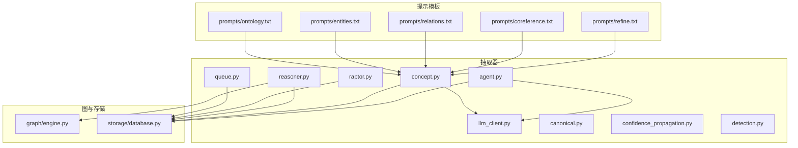

**图表来源**
- [concept.py:20-25](file://src/drbrain/extractor/concept.py#L20-L25)
- [llm_client.py:12-19](file://src/drbrain/extractor/llm_client.py#L12-L19)
- [agent.py:53-136](file://src/drbrain/extractor/agent.py#L53-L136)
- [queue.py:10-32](file://src/drbrain/extractor/queue.py#L10-L32)
- [raptor.py:176-201](file://src/drbrain/extractor/raptor.py#L176-L201)
- [reasoner.py:16-24](file://src/drbrain/extractor/reasoner.py#L16-L24)
- [canonical.py:110-128](file://src/drbrain/extractor/canonical.py#L110-L128)

**章节来源**
- [README.md: 41-66:41-66](file://README.md#L41-L66)

## 核心组件
- LLM 客户端：支持多模型回退链、统一响应解析、指标记录与异步文本/JSON 调用。
- 概念抽取器：基于树结构的分段抽取、本体扩展、实体/关系/共指/精炼五阶段流水线。
- Agent 化阶段：每个阶段封装为可幂等执行的 Agent，具备输入输出校验与持久化。
- 队列与共识：按置信度路由，支持批量仲裁与自动接受。
- RAPTOR 树：在 PageIndex 叶节点之上构建递归摘要树，提升跨节主题检索。
- 推理工具：以工具调用形式访问图与树结构，进行双向一致性验证与假设生成。
- 规范化与对齐：标签标准化、别名表与 BM25+LLM 的混合对齐。
- 置信度传播：按章节与路径进行不确定性衰减与合并。
- 类型检测：启发式 + LLM 的论文类型分类。

**章节来源**
- [llm_client.py: 12-154:12-154](file://src/drbrain/extractor/llm_client.py#L12-L154)
- [concept.py: 54-901:54-901](file://src/drbrain/extractor/concept.py#L54-L901)
- [agent.py: 53-368:53-368](file://src/drbrain/extractor/agent.py#L53-L368)
- [queue.py: 10-106:10-106](file://src/drbrain/extractor/queue.py#L10-L106)
- [raptor.py: 176-349:176-349](file://src/drbrain/extractor/raptor.py#L176-L349)
- [reasoner.py: 16-677:16-677](file://src/drbrain/extractor/reasoner.py#L16-L677)
- [canonical.py: 110-252:110-252](file://src/drbrain/extractor/canonical.py#L110-L252)
- [confidence_propagation.py: 31-87:31-87](file://src/drbrain/extractor/confidence_propagation.py#L31-L87)
- [detection.py: 61-138:61-138](file://src/drbrain/extractor/detection.py#L61-L138)

## 架构总览
下图展示从提示模板到最终图谱产物的关键交互：

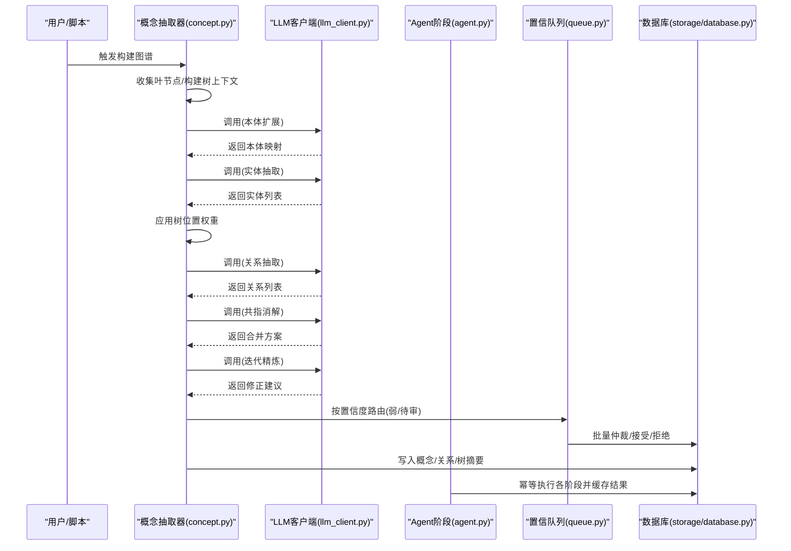

**图表来源**
- [concept.py: 419-495:419-495](file://src/drbrain/extractor/concept.py#L419-L495)
- [llm_client.py: 66-114:66-114](file://src/drbrain/extractor/llm_client.py#L66-L114)
- [agent.py: 73-135:73-135](file://src/drbrain/extractor/agent.py#L73-L135)
- [queue.py: 10-32:10-32](file://src/drbrain/extractor/queue.py#L10-L32)

## 详细组件分析

### LLM 客户端与提示工程
- 统一调用接口：支持同步/异步 JSON 与纯文本调用；内置回退链与超时控制；记录请求耗时与令牌用量。
- 温度与最大令牌：默认温度较低以稳定 JSON 输出；文本调用可设为确定性输出。
- 提示工程要点：
  - 严格 JSON 输出约束，避免多余文本与 Markdown。
  - 分阶段提示：本体扩展、实体抽取、关系抽取、共指消解、迭代精炼分别对应独立模板。
  - 结构化注入：将树结构、章节标题、子类别等作为上下文注入，提升抽取稳定性。

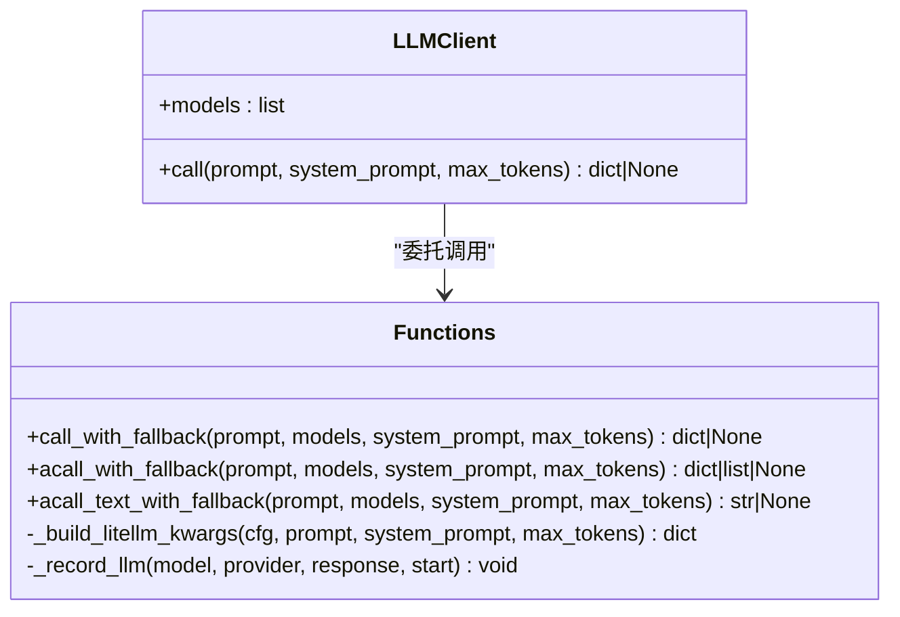

**图表来源**
- [llm_client.py: 12-154:12-154](file://src/drbrain/extractor/llm_client.py#L12-L154)

**章节来源**
- [llm_client.py: 12-154:12-154](file://src/drbrain/extractor/llm_client.py#L12-L154)
- [ontology.txt: 1-23:1-23](file://prompts/ontology.txt#L1-L23)
- [entities.txt: 1-19:1-19](file://prompts/entities.txt#L1-L19)
- [relations.txt: 1-24:1-24](file://prompts/relations.txt#L1-L24)
- [coreference.txt: 1-14:1-14](file://prompts/coreference.txt#L1-L14)
- [refine.txt: 1-21:1-21](file://prompts/refine.txt#L1-L21)

### 本体扩展（Ontology Extension）
- 输入：论文树形目录（含父子层级）。
- 方法：先以目录层级生成初始本体，再随机采样叶节点内容进行迭代扩展，采用“增长阈值”检测收敛。
- 输出：针对六类概念（问题、方法、结论、缺口、争议、参与者）的子类别映射。

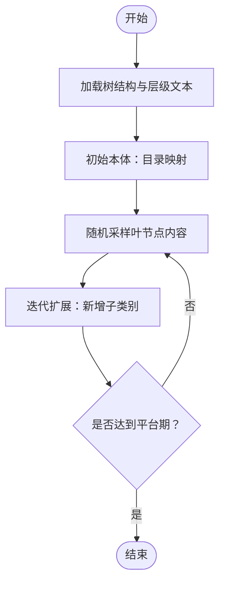

**图表来源**
- [concept.py: 498-585:498-585](file://src/drbrain/extractor/concept.py#L498-L585)

**章节来源**
- [concept.py: 498-601:498-601](file://src/drbrain/extractor/concept.py#L498-L601)

### 实体抽取（Entity Extraction）
- 输入：树叶节点内容 + 本体子类别 + 章节类型倾向。
- 方法：按“高信号”章节优先排序，为每节构造带倾向性的提示，提取三元组（标签、类型、子类别、置信度），并标注来源章节与节点 ID。
- 输出：实体列表，包含置信度与出处信息。

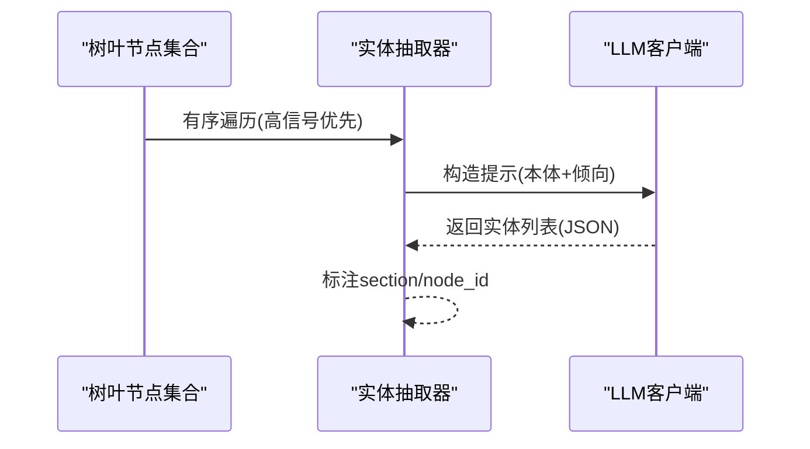

**图表来源**
- [concept.py: 670-737:670-737](file://src/drbrain/extractor/concept.py#L670-L737)

**章节来源**
- [concept.py: 670-737:670-737](file://src/drbrain/extractor/concept.py#L670-L737)

### 关系抽取（Relation Extraction）
- 输入：实体列表（含来源）。
- 方法：将实体转为“标签: 类型”清单，交由 LLM 建模有向关系；继承源实体的节点 ID 与章节信息，确保溯源。
- 输出：关系列表，包含头尾实体、关系类型与出处。

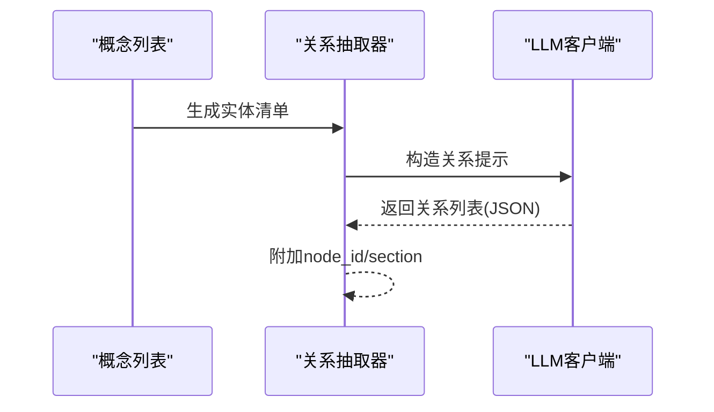

**图表来源**
- [concept.py: 740-767:740-767](file://src/drbrain/extractor/concept.py#L740-L767)

**章节来源**
- [concept.py: 740-767:740-767](file://src/drbrain/extractor/concept.py#L740-L767)

### 共指消解（Coreference Resolution）
- 输入：实体列表。
- 方法：提示 LLM 判定语义相同但表述不同的标签应合并，并保留更完整的标签作为规范形式。
- 输出：实体合并后的列表与合并方案。

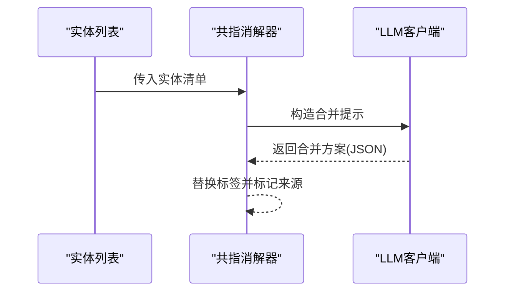

**图表来源**
- [concept.py: 770-799:770-799](file://src/drbrain/extractor/concept.py#L770-L799)

**章节来源**
- [concept.py: 770-799:770-799](file://src/drbrain/extractor/concept.py#L770-L799)

### 迭代精炼（Iterative Refinement）
- 输入：实体与关系。
- 方法：提示 LLM 自检，识别矛盾、冗余、缺失关系、错误类型与低置信度项，并输出修正建议。
- 输出：修正清单（删除、新增关系、合并、重分类）。

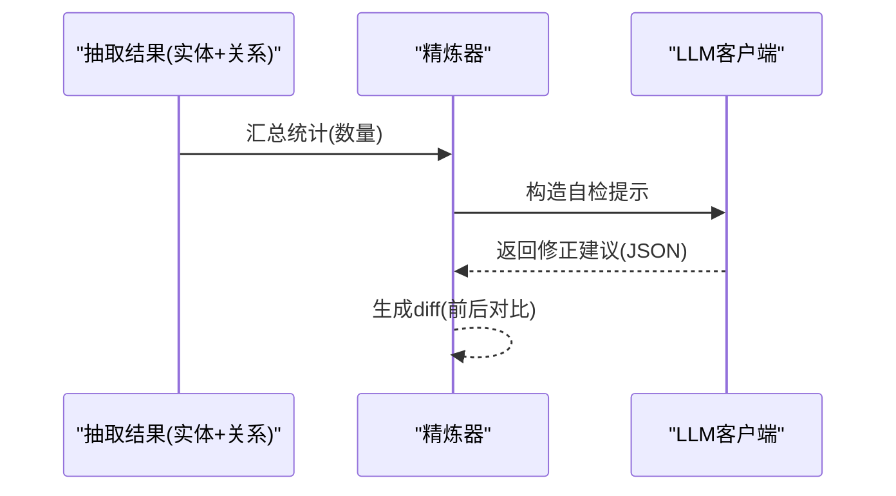

**图表来源**
- [concept.py: 802-813:802-813](file://src/drbrain/extractor/concept.py#L802-L813)

**章节来源**
- [concept.py: 802-813:802-813](file://src/drbrain/extractor/concept.py#L802-L813)

### Agent 化阶段与幂等执行
- 每个阶段封装为 BuildAgent，具备：
  - 名称与系统提示文件映射
  - 输入/输出契约（AgentInput/AgentOutput）
  - 幂等性：检查状态、写入进度、缓存结果
  - 数据库持久化：状态与结果 JSON
- 支持按阶段独立运行与重放。

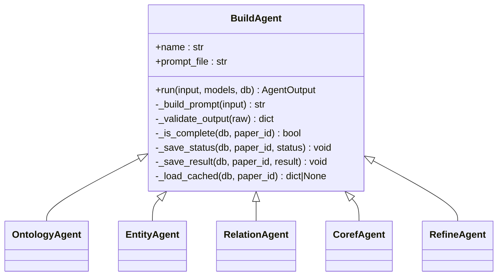

**图表来源**
- [agent.py: 53-368:53-368](file://src/drbrain/extractor/agent.py#L53-L368)

**章节来源**
- [agent.py: 53-368:53-368](file://src/drbrain/extractor/agent.py#L53-L368)

### 置信队列与共识检测
- 路由策略：高置信度直接接受；中等置信度进入弱队列；低置信度入队等待仲裁。
- 共识判定：同一标签在多篇论文中出现且平均置信度达标即触发自动接受。
- 批量处理：支持按类型与上限置信度筛选并批量接受/拒绝。

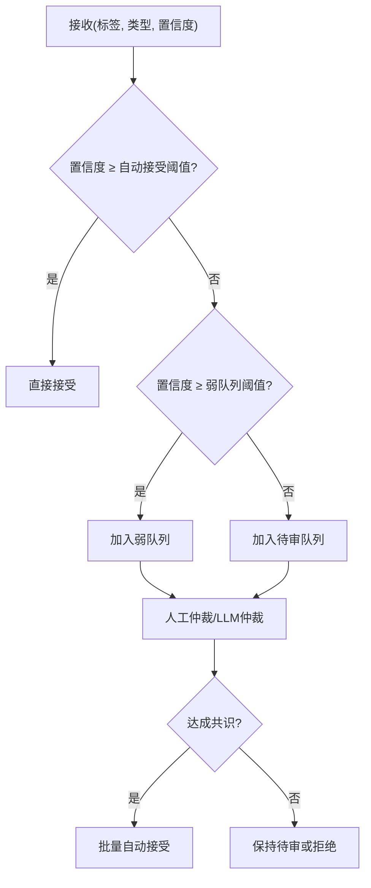

**图表来源**
- [queue.py: 10-106:10-106](file://src/drbrain/extractor/queue.py#L10-L106)

**章节来源**
- [queue.py: 10-106:10-106](file://src/drbrain/extractor/queue.py#L10-L106)

### RAPTOR 递归摘要树
- 流程：收集 PageIndex 叶节点 → 向量化 → UMAP 降维 → GMM 聚类 → LLM 摘要 → 重复直至收敛。
- 存储：将摘要节点写入 tree_summaries，并为其生成嵌入存入 tree_vectors，支持跨层检索。

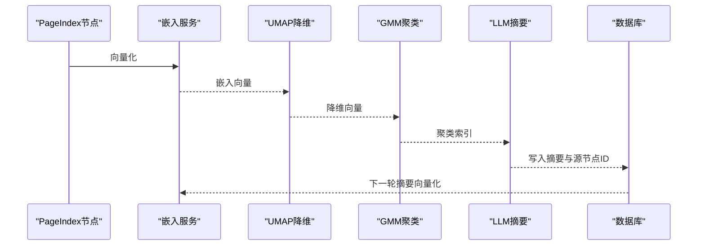

**图表来源**
- [raptor.py: 176-349:176-349](file://src/drbrain/extractor/raptor.py#L176-L349)

**章节来源**
- [raptor.py: 176-349:176-349](file://src/drbrain/extractor/raptor.py#L176-L349)

### 推理工具与双向一致性验证
- 工具集：概念搜索、邻居遍历、最短路径、文档树结构、章节内容、跨纸树检索、RAPTOR 摘要。
- 双向验证：LLM 提出假设 → KG 校验（TBox/RBox 与模式检测）→ 反馈修订 → 循环直到一致或达轮次上限。

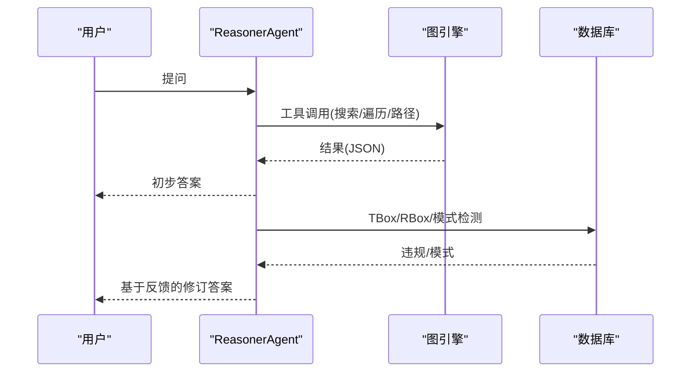

**图表来源**
- [reasoner.py: 282-390:282-390](file://src/drbrain/extractor/reasoner.py#L282-L390)
- [reasoner.py: 583-677:583-677](file://src/drbrain/extractor/reasoner.py#L583-L677)

**章节来源**
- [reasoner.py: 16-677:16-677](file://src/drbrain/extractor/reasoner.py#L16-L677)

### 规范化与概念对齐
- 标签标准化：去除停用词、符号与多余空白，简单单数化处理。
- 别名表：维护规范化键到概念 ID 的映射，支持别名注册。
- 混合对齐：精确匹配 → BM25 模糊匹配（自动/待审阈值）→ LLM 批仲裁 → 新建概念 ID。

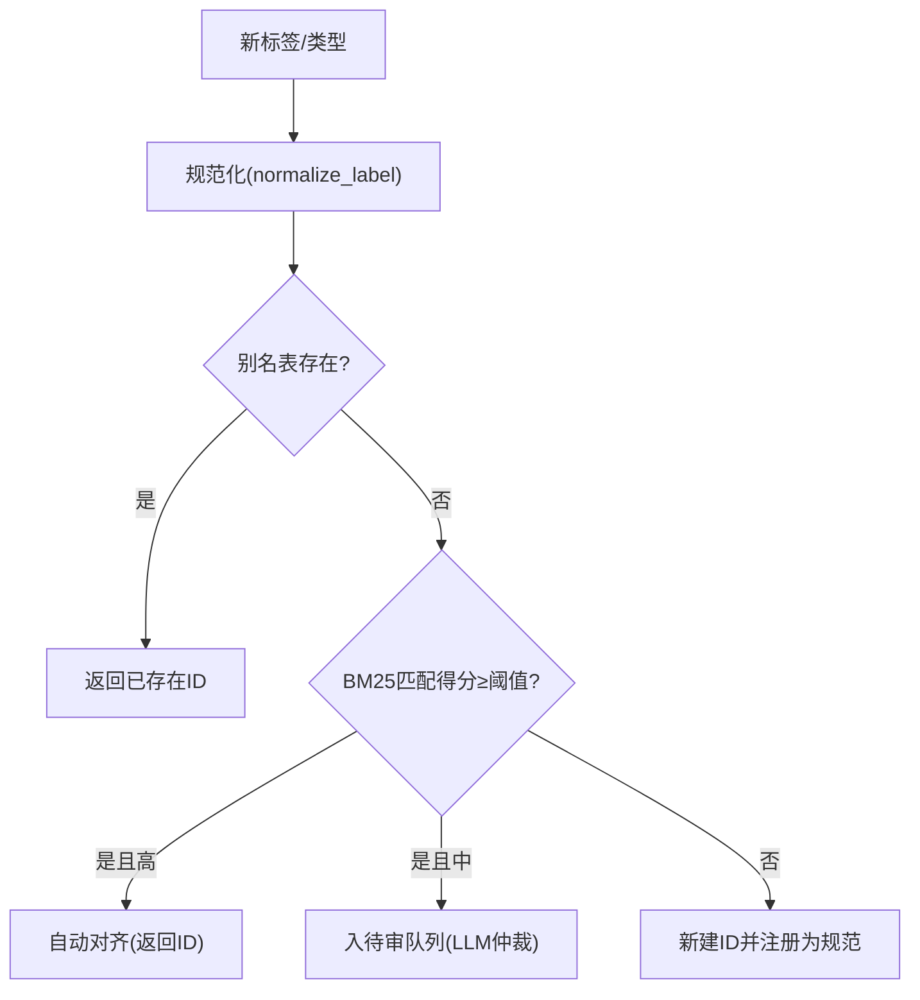

**图表来源**
- [canonical.py: 110-252:110-252](file://src/drbrain/extractor/canonical.py#L110-L252)

**章节来源**
- [canonical.py: 110-252:110-252](file://src/drbrain/extractor/canonical.py#L110-L252)

### 置信度传播
- 单跳衰减：默认乘以 0.85；不同章节根据内容可信度设定差异衰减因子。
- 多路径合并：采用概率 OR 合并（1 - ∏(1 - p_i)），体现多证据支撑的增强效果。

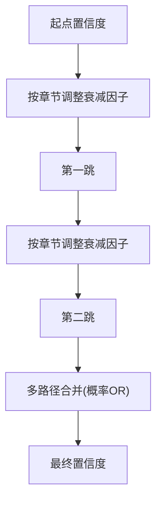

**图表来源**
- [confidence_propagation.py: 31-87:31-87](file://src/drbrain/extractor/confidence_propagation.py#L31-L87)

**章节来源**
- [confidence_propagation.py: 31-87:31-87](file://src/drbrain/extractor/confidence_propagation.py#L31-L87)

### 论文类型检测
- 启发式：基于关键词集合匹配标题/摘要/首页文本，覆盖综述、论文、论文、书籍、文档等。
- LLM 精细：当启发式不确定时，使用专用提示进行二次判断。

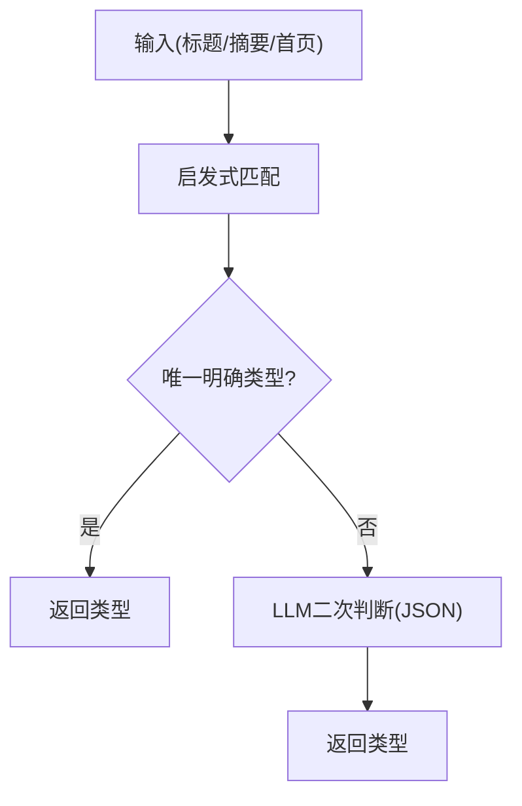

**图表来源**
- [detection.py: 61-138:61-138](file://src/drbrain/extractor/detection.py#L61-L138)

**章节来源**
- [detection.py: 61-138:61-138](file://src/drbrain/extractor/detection.py#L61-L138)

## 依赖分析
- 组件耦合
  - concept.py 依赖 llm_client.py 与提示模板；通过数据库进行幂等与持久化。
  - agent.py 依赖 llm_client.py 与提示模板；通过数据库保存阶段状态与结果。
  - reasoner.py 依赖图引擎与存储，提供工具调用接口。
  - canonical.py 依赖数据库构建 BM25 索引，支持跨论文对齐。
  - raptor.py 依赖嵌入服务与数据库，生成跨节摘要树。
- 外部依赖
  - litellm：统一多提供商 LLM 调用与回退。
  - sklearn/umap：聚类与降维。
  - networkx：图遍历与路径计算。
  - rank_bm25：BM25 检索。

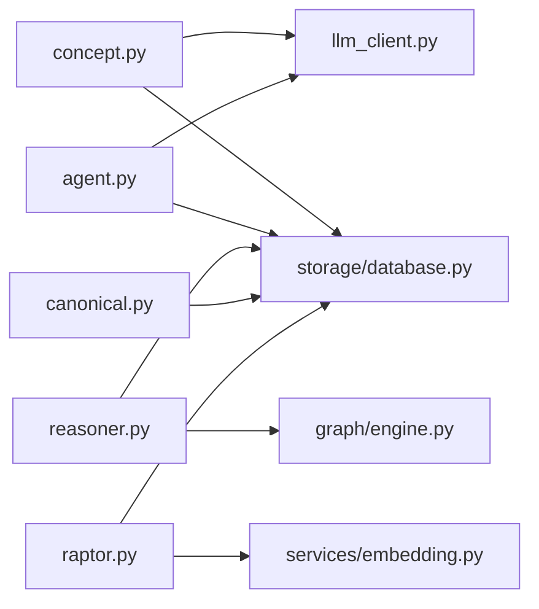

**图表来源**
- [concept.py: 14-L16:14-16](file://src/drbrain/extractor/concept.py#L14-L16)
- [agent.py: 83](file://src/drbrain/extractor/agent.py#L83)
- [reasoner.py: 16-L24:16-24](file://src/drbrain/extractor/reasoner.py#L16-L24)
- [raptor.py: 205-L209:205-209](file://src/drbrain/extractor/raptor.py#L205-L209)

**章节来源**
- [concept.py: 14-L16:14-16](file://src/drbrain/extractor/concept.py#L14-L16)
- [agent.py: 83](file://src/drbrain/extractor/agent.py#L83)
- [reasoner.py: 16-L24:16-24](file://src/drbrain/extractor/reasoner.py#L16-L24)
- [raptor.py: 205-L209:205-209](file://src/drbrain/extractor/raptor.py#L205-L209)

## 性能考虑
- 并发与限流
  - 概念抽取阶段使用信号量限制并发（默认 10），避免 LLM 速率限制与资源争用。
- 上下文裁剪
  - 对输入文本进行长度截断与质量过滤，减少无效内容带来的 token 消耗。
- 回退链与超时
  - 多模型回退链与统一超时设置，提高成功率与稳定性。
- 置信度路由
  - 通过队列分流，降低人工仲裁压力，提升吞吐。
- 向量化与检索
  - RAPTOR 在摘要层复用嵌入，减少重复计算；跨层检索利用层次化摘要提升召回。

[本节为通用指导，无需特定文件引用]

## 故障排除指南
- LLM 调用失败
  - 现象：某模型报错后继续尝试下一个，最终仍失败。
  - 处理：检查 API Key、base_url、超时设置；确认回退链顺序与可用性。
  - 参考：[llm_client.py: 66-114:66-114](file://src/drbrain/extractor/llm_client.py#L66-L114)
- JSON 解析异常
  - 现象：返回非严格 JSON 导致解析失败。
  - 处理：确保提示模板要求严格 JSON；必要时放宽格式或增加引导。
  - 参考：[ontology.txt: 14-L22:14-22](file://prompts/ontology.txt#L14-L22)、[entities.txt: 17-L18:17-18](file://prompts/entities.txt#L17-L18)、[relations.txt: 22-L23:22-23](file://prompts/relations.txt#L22-L23)、[coreference.txt: 12-L13:12-13](file://prompts/coreference.txt#L12-L13)、[refine.txt: 14-L20:14-20](file://prompts/refine.txt#L14-L20)
- Agent 幂等执行未生效
  - 现象：重复运行同一论文导致状态不一致。
  - 处理：确认数据库表存在与权限；检查状态字段与缓存加载逻辑。
  - 参考：[agent.py: 151-195:151-195](file://src/drbrain/extractor/agent.py#L151-L195)
- RAPTOR 无摘要生成
  - 现象：叶节点向量不足或聚类失败。
  - 处理：确认 PageIndex 向量已入库；检查嵌入维度与样本数量。
  - 参考：[raptor.py: 218-L227:218-227](file://src/drbrain/extractor/raptor.py#L218-L227)
- 推理工具调用失败
  - 现象：工具返回空或报错。
  - 处理：检查数据库路径与 papers 目录；确认工具参数与权限。
  - 参考：[reasoner.py: 181-L236:181-236](file://src/drbrain/extractor/reasoner.py#L181-L236)

**章节来源**
- [llm_client.py: 66-114:66-114](file://src/drbrain/extractor/llm_client.py#L66-L114)
- [agent.py: 151-195:151-195](file://src/drbrain/extractor/agent.py#L151-L195)
- [raptor.py: 218-L227:218-227](file://src/drbrain/extractor/raptor.py#L218-L227)
- [reasoner.py: 181-L236:181-236](file://src/drbrain/extractor/reasoner.py#L181-L236)

## 结论
DrBrain 的知识抽取系统以“树结构优先 + 多阶段 LLM 抽取 + 图谱构建”为核心，通过严格的提示工程与输出约束、Agent 化的幂等执行、置信队列与共识机制、以及 RAPTOR 递归摘要树，实现了从学术论文到高质量知识图谱的稳健转化。配合推理工具与规范化对齐，系统在准确性、可解释性与可扩展性方面均具备良好表现。

[本节为总结性内容，无需特定文件引用]

## 附录
- 使用模式与最佳实践
  - 提示模板：确保严格 JSON 输出；为每个阶段准备清晰的上下文与约束。
  - LLM 配置：合理设置温度与最大令牌；启用回退链；监控令牌用量。
  - 并发控制：根据 LLM 速率限制调整并发度；对大文本进行裁剪与过滤。
  - 数据质量：利用 TBox 校验与精炼阶段修复矛盾；通过队列与共识提升一致性。
- 集成点
  - 与图引擎：通过工具调用访问图结构与树摘要，支持双向一致性验证。
  - 与存储：通过数据库持久化阶段状态、结果与队列仲裁，支持幂等重放。

[本节为概览性内容，无需特定文件引用]