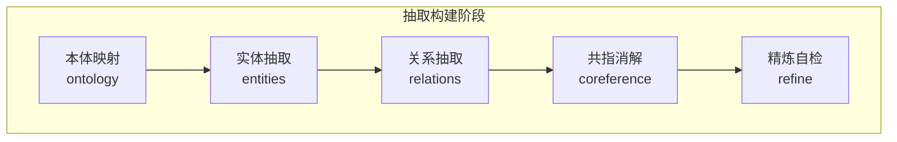
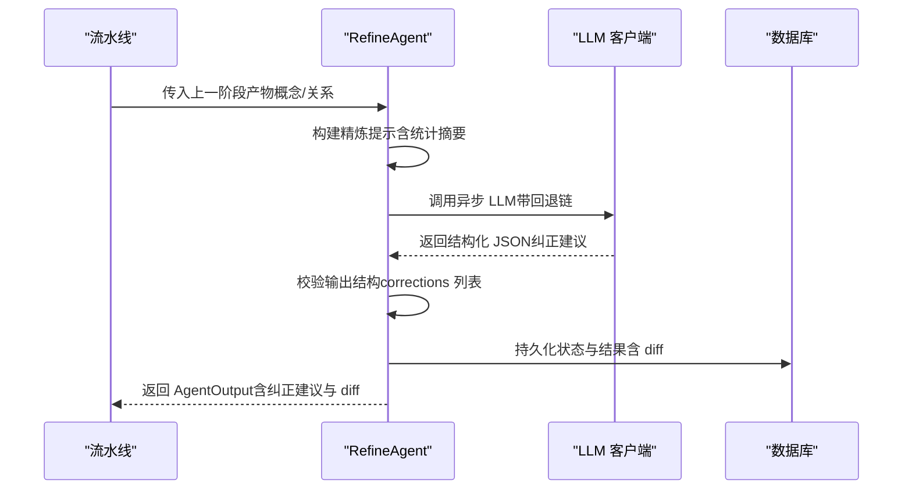
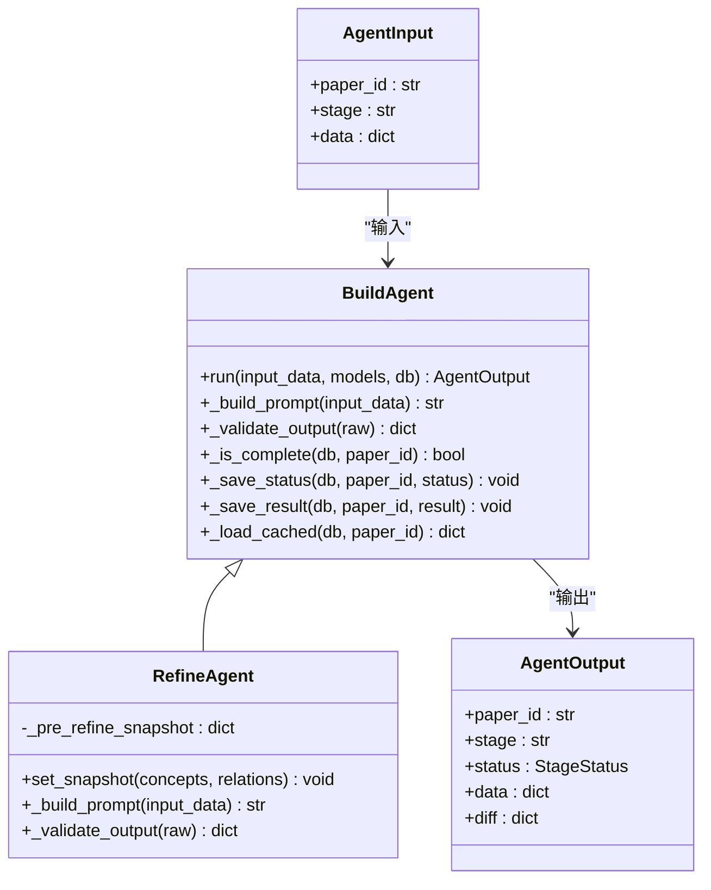
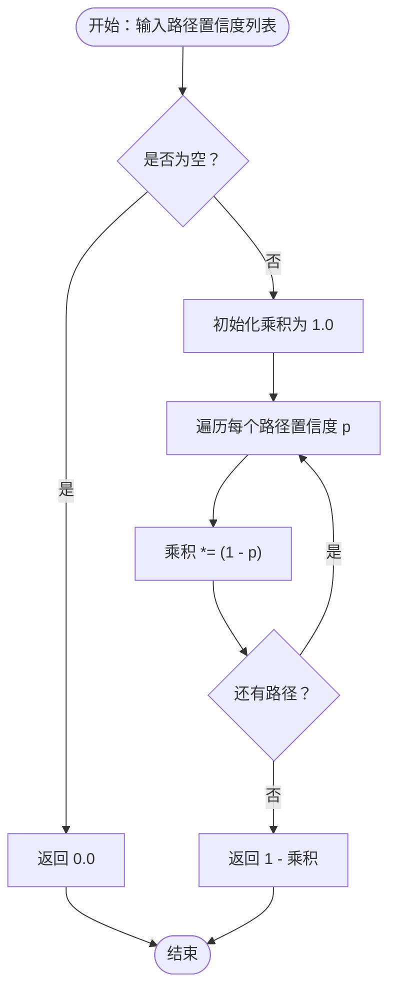
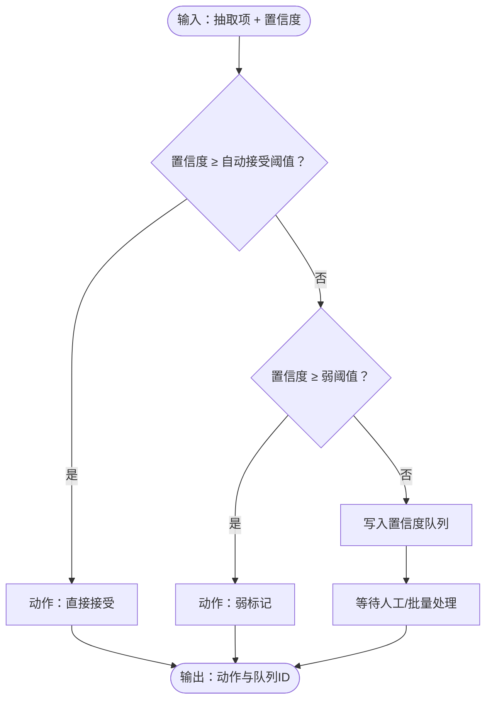
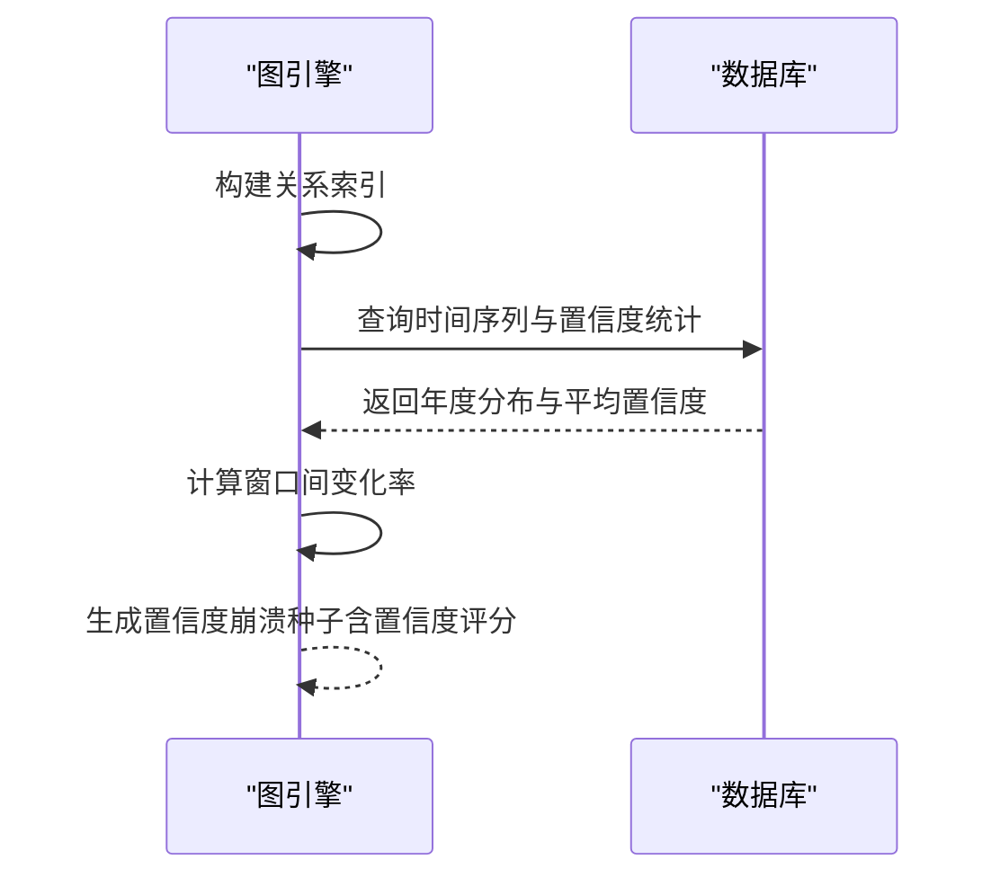
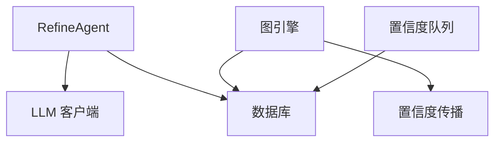

# 迭代精炼模块

<cite>
**本文档引用的文件**
- [prompts/refine.txt](file://prompts/refine.txt)
- [src/drbrain/extractor/agent.py](file://src/drbrain/extractor/agent.py)
- [src/drbrain/extractor/confidence_propagation.py](file://src/drbrain/extractor/confidence_propagation.py)
- [src/drbrain/extractor/llm_client.py](file://src/drbrain/extractor/llm_client.py)
- [src/drbrain/extractor/queue.py](file://src/drbrain/extractor/queue.py)
- [src/drbrain/storage/database.py](file://src/drbrain/storage/database.py)
- [src/drbrain/graph/engine.py](file://src/drbrain/graph/engine.py)
- [src/drbrain/services/pipeline.py](file://src/drbrain/services/pipeline.py)
- [tests/test_confidence_propagation.py](file://tests/test_confidence_propagation.py)
- [tests/test_boundary.py](file://tests/test_boundary.py)
- [tests/test_queue.py](file://tests/test_queue.py)
</cite>

## 目录
1. [简介](#简介)
2. [项目结构](#项目结构)
3. [核心组件](#核心组件)
4. [架构总览](#架构总览)
5. [详细组件分析](#详细组件分析)
6. [依赖关系分析](#依赖关系分析)
7. [性能考虑](#性能考虑)
8. [故障排除指南](#故障排除指南)
9. [结论](#结论)
10. [附录](#附录)

## 简介
本文件系统性阐述 DrBrain 的迭代精炼模块，聚焦于知识图谱抽取后的自检与纠错流程。精炼模块通过 LLM 引导的严格 JSON 输出，识别并修复抽取结果中的矛盾、冗余、缺失关系、类型错误以及低置信度问题；同时结合置信度传播机制（不确定性随多跳衰减、路径合并的概率模型）与置信度队列（路由、共识检测与批量处理），形成闭环的质量控制体系。文档还涵盖与整体抽取流水线的集成方式、数据传递格式、停止条件与最大迭代次数配置、效果评估与质量控制最佳实践。

## 项目结构
精炼模块位于抽取构建阶段的最后一步，作为独立的 BuildAgent 执行，其输入来自前序实体、关系与共指消解阶段的产物，输出为结构化的“纠正建议”及可选的前后对比差异。

**图表来源**
- [src/drbrain/services/pipeline.py:23-44](file://src/drbrain/services/pipeline.py#L23-L44)
- [src/drbrain/extractor/agent.py:317-350](file://src/drbrain/extractor/agent.py#L317-L350)

**章节来源**
- [src/drbrain/services/pipeline.py:1-109](file://src/drbrain/services/pipeline.py#L1-L109)
- [src/drbrain/extractor/agent.py:1-368](file://src/drbrain/extractor/agent.py#L1-L368)

## 核心组件
- 精炼 Agent：负责加载精炼提示、构建用户提示、调用 LLM、校验输出、持久化状态与结果，并生成前后对比差异。
- 置信度传播：在规则闭包与推理中对多跳路径进行不确定性衰减与路径合并，用于指导置信度权重与收敛判断。
- 置信度队列：根据阈值将抽取项路由到直接接受、弱标记或排队，支持批量处理与共识自动接受。
- 数据库与模式：存储抽取产物、置信度队列、研究种子等，支撑精炼与后续分析。
- 图引擎：执行符号与混合模式的规则闭包，融合嵌入得分以调整置信度。

**章节来源**
- [src/drbrain/extractor/agent.py:317-350](file://src/drbrain/extractor/agent.py#L317-L350)
- [src/drbrain/extractor/confidence_propagation.py:1-87](file://src/drbrain/extractor/confidence_propagation.py#L1-L87)
- [src/drbrain/extractor/queue.py:1-106](file://src/drbrain/extractor/queue.py#L1-L106)
- [src/drbrain/storage/database.py:1-775](file://src/drbrain/storage/database.py#L1-L775)
- [src/drbrain/graph/engine.py:124-315](file://src/drbrain/graph/engine.py#L124-L315)

## 架构总览
精炼模块在抽取流水线中承担“质量门控”的角色，其工作流如下：

**图表来源**
- [src/drbrain/extractor/agent.py:73-135](file://src/drbrain/extractor/agent.py#L73-L135)
- [src/drbrain/extractor/llm_client.py:92-114](file://src/drbrain/extractor/llm_client.py#L92-L114)
- [prompts/refine.txt:1-21](file://prompts/refine.txt#L1-L21)

**章节来源**
- [src/drbrain/extractor/agent.py:317-350](file://src/drbrain/extractor/agent.py#L317-L350)
- [src/drbrain/extractor/llm_client.py:1-154](file://src/drbrain/extractor/llm_client.py#L1-L154)

## 详细组件分析

### 精炼 Agent 实现与数据契约
- 输入契约：AgentInput 包含 paper_id、stage 与 data 字典，data 中应包含构建精炼提示所需的上下文（如概念/关系列表）。
- 提示构建：从 prompts/refine.txt 加载系统提示，结合上一阶段产物动态拼装用户提示。
- 输出契约：AgentOutput 包含状态、数据与可选 diff。精炼输出的数据键为 corrections（列表）与可选 diff（包含 before/after 统计）。
- 校验逻辑：确保 corrections 为列表且每项为字典；若存在预快照，则生成 diff。
- 持久化：通过数据库状态表记录阶段状态与结果，支持幂等重放。

**图表来源**
- [src/drbrain/extractor/agent.py:53-196](file://src/drbrain/extractor/agent.py#L53-L196)
- [src/drbrain/extractor/agent.py:317-350](file://src/drbrain/extractor/agent.py#L317-L350)

**章节来源**
- [src/drbrain/extractor/agent.py:317-350](file://src/drbrain/extractor/agent.py#L317-L350)

### 置信度传播机制
- 单跳衰减：每次跨边传播乘以衰减因子，默认 0.85。
- 分段感知衰减：不同文章段落（如 methods/results）采用不同的衰减值，以反映证据强度差异。
- 多路径合并：多个独立路径的支持通过概率 OR 合并（P = 1 - ∏(1 - p_i)），提升结论置信度。

**图表来源**
- [src/drbrain/extractor/confidence_propagation.py:67-87](file://src/drbrain/extractor/confidence_propagation.py#L67-L87)

**章节来源**
- [src/drbrain/extractor/confidence_propagation.py:1-87](file://src/drbrain/extractor/confidence_propagation.py#L1-L87)
- [tests/test_confidence_propagation.py:1-56](file://tests/test_confidence_propagation.py#L1-L56)

### 置信度队列与共识检测
- 路由策略：基于阈值将抽取项分为直接接受、弱标记与排队三类，支持自动接受阈值与弱阈值配置。
- 共识检测：当同一标签在多篇论文中出现且平均置信度达到阈值时，自动接受该标签相关的待定项。
- 批量处理：支持按类型与最高置信度过滤，统一接受或拒绝待定队列。

**图表来源**
- [src/drbrain/extractor/queue.py:10-32](file://src/drbrain/extractor/queue.py#L10-L32)

**章节来源**
- [src/drbrain/extractor/queue.py:1-106](file://src/drbrain/extractor/queue.py#L1-L106)
- [src/drbrain/storage/database.py:105-150](file://src/drbrain/storage/database.py#L105-L150)
- [tests/test_queue.py:1-42](file://tests/test_queue.py#L1-L42)

### 研究种子检测与置信度崩溃
- 研究种子：图引擎在有数据库上下文时，可检测技术悬崖、跨域同构、置信度崩溃等模式，并给出置信度评分。
- 置信度崩溃：当同一概念在连续两年窗口内的平均置信度下降幅度超过阈值时触发，提示可能的范式转移或证据失效。

**图表来源**
- [src/drbrain/graph/engine.py:354-553](file://src/drbrain/graph/engine.py#L354-L553)
- [tests/test_boundary.py:86-130](file://tests/test_boundary.py#L86-L130)

**章节来源**
- [src/drbrain/graph/engine.py:354-553](file://src/drbrain/graph/engine.py#L354-L553)
- [tests/test_boundary.py:86-130](file://tests/test_boundary.py#L86-L130)

### 精炼提示与输出规范
- 系统提示：明确要求识别矛盾、冗余、缺失关系、错误类型与低置信度，并以严格 JSON 输出纠正建议。
- 输出结构：包含 corrections 数组，每项描述具体动作（删除、添加关系、合并、重类型）及其原因；可选 diff 字段记录前后统计。

**章节来源**
- [prompts/refine.txt:1-21](file://prompts/refine.txt#L1-L21)
- [src/drbrain/extractor/agent.py:339-350](file://src/drbrain/extractor/agent.py#L339-L350)

### 与整体抽取流程的集成
- 流水线步骤：构建阶段包含本体映射、实体、关系、共指与精炼五步；精炼作为收尾环节，确保最终知识图谱质量。
- 数据传递：各阶段通过 AgentInput/AgentOutput 与数据库状态表进行幂等通信；精炼接收上一阶段产物并输出纠正建议。

**章节来源**
- [src/drbrain/services/pipeline.py:23-44](file://src/drbrain/services/pipeline.py#L23-L44)
- [src/drbrain/extractor/agent.py:352-368](file://src/drbrain/extractor/agent.py#L352-L368)

## 依赖关系分析
- 精炼 Agent 依赖 LLM 客户端的异步回退调用，保证在多模型链路下的鲁棒性。
- 置信度传播与图引擎闭包共同影响最终置信度权重，进而影响精炼对低置信度项的敏感度。
- 置信度队列与数据库模式紧密耦合，支撑路由、批量处理与共识检测。

**图表来源**
- [src/drbrain/extractor/agent.py:73-135](file://src/drbrain/extractor/agent.py#L73-L135)
- [src/drbrain/extractor/llm_client.py:92-114](file://src/drbrain/extractor/llm_client.py#L92-L114)
- [src/drbrain/graph/engine.py:124-315](file://src/drbrain/graph/engine.py#L124-L315)
- [src/drbrain/extractor/confidence_propagation.py:1-87](file://src/drbrain/extractor/confidence_propagation.py#L1-L87)
- [src/drbrain/extractor/queue.py:1-106](file://src/drbrain/extractor/queue.py#L1-L106)
- [src/drbrain/storage/database.py:105-150](file://src/drbrain/storage/database.py#L105-L150)

**章节来源**
- [src/drbrain/extractor/agent.py:1-368](file://src/drbrain/extractor/agent.py#L1-L368)
- [src/drbrain/extractor/llm_client.py:1-154](file://src/drbrain/extractor/llm_client.py#L1-L154)
- [src/drbrain/graph/engine.py:1-315](file://src/drbrain/graph/engine.py#L1-L315)
- [src/drbrain/extractor/confidence_propagation.py:1-87](file://src/drbrain/extractor/confidence_propagation.py#L1-L87)
- [src/drbrain/extractor/queue.py:1-106](file://src/drbrain/extractor/queue.py#L1-L106)
- [src/drbrain/storage/database.py:1-150](file://src/drbrain/storage/database.py#L1-L150)

## 性能考虑
- LLM 调用：使用异步回退链减少失败重试成本；温度参数设置为较低值以提高输出稳定性。
- 规则闭包：混合模式下引入嵌入评分与置信度加权，平衡符号推理与语义一致性，但会增加计算开销。
- 置信度队列：批量处理与共识检测可显著降低人工干预频率，提升吞吐。

[本节为通用性能讨论，不直接分析具体文件]

## 故障排除指南
- 精炼输出格式错误：检查系统提示与输出校验逻辑，确保 corrections 为列表且每项为字典。
- LLM 回退失败：确认模型配置链路有效，查看日志中失败尝试与最终耗时。
- 置信度崩溃误报：调整窗口划分与阈值，结合领域知识进行人工复核。
- 队列项未被自动接受：检查共识阈值与标签一致性，必要时手动批量处理。

**章节来源**
- [src/drbrain/extractor/agent.py:139-147](file://src/drbrain/extractor/agent.py#L139-L147)
- [src/drbrain/extractor/llm_client.py:66-114](file://src/drbrain/extractor/llm_client.py#L66-L114)
- [src/drbrain/extractor/queue.py:34-106](file://src/drbrain/extractor/queue.py#L34-L106)

## 结论
迭代精炼模块通过严格的提示工程与输出约束，将人类可读的错误识别与机器可执行的纠正常态化；结合置信度传播与队列机制，形成从不确定性建模到质量门控的闭环。在实际部署中，建议合理配置阈值与最大迭代次数，配合批量处理与共识检测，持续优化抽取质量与效率。

[本节为总结性内容，不直接分析具体文件]

## 附录

### 精炼参数配置与监控示例（路径指引）
- 精炼提示模板位置：[prompts/refine.txt:1-21](file://prompts/refine.txt#L1-L21)
- 精炼 Agent 类定义：[src/drbrain/extractor/agent.py:317-350](file://src/drbrain/extractor/agent.py#L317-L350)
- LLM 回退链实现：[src/drbrain/extractor/llm_client.py:66-114](file://src/drbrain/extractor/llm_client.py#L66-L114)
- 置信度传播函数：[src/drbrain/extractor/confidence_propagation.py:31-87](file://src/drbrain/extractor/confidence_propagation.py#L31-L87)
- 置信度队列路由与批量处理：[src/drbrain/extractor/queue.py:10-106](file://src/drbrain/extractor/queue.py#L10-L106)
- 数据库模式与队列表：[src/drbrain/storage/database.py:105-150](file://src/drbrain/storage/database.py#L105-L150)
- 图引擎闭包与混合模式：[src/drbrain/graph/engine.py:124-315](file://src/drbrain/graph/engine.py#L124-L315)

### 精炼效果评估与质量控制最佳实践
- 建议指标：纠正数量、前后概念/关系计数差、置信度分布变化、研究种子数量与类型变化。
- 质量控制：定期审查精炼输出的合理性，建立人工复核流程；对频繁触发的错误类型建立规则或提示优化。
- 迭代策略：设定最大迭代次数与收敛阈值，避免无限循环；结合置信度崩溃检测及时发现范式变化。

[本节为通用实践建议，不直接分析具体文件]