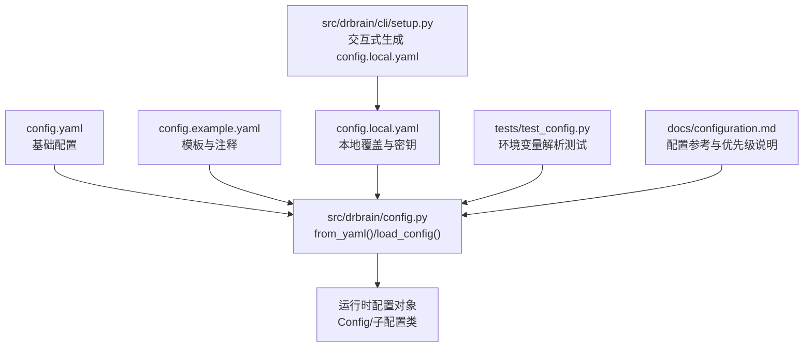
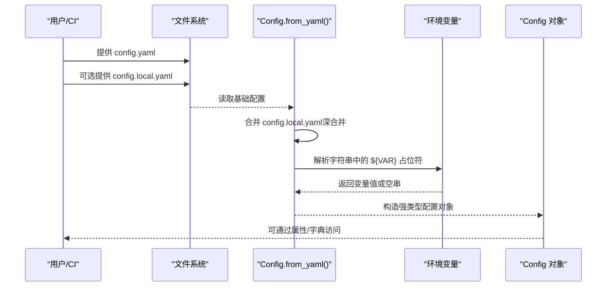
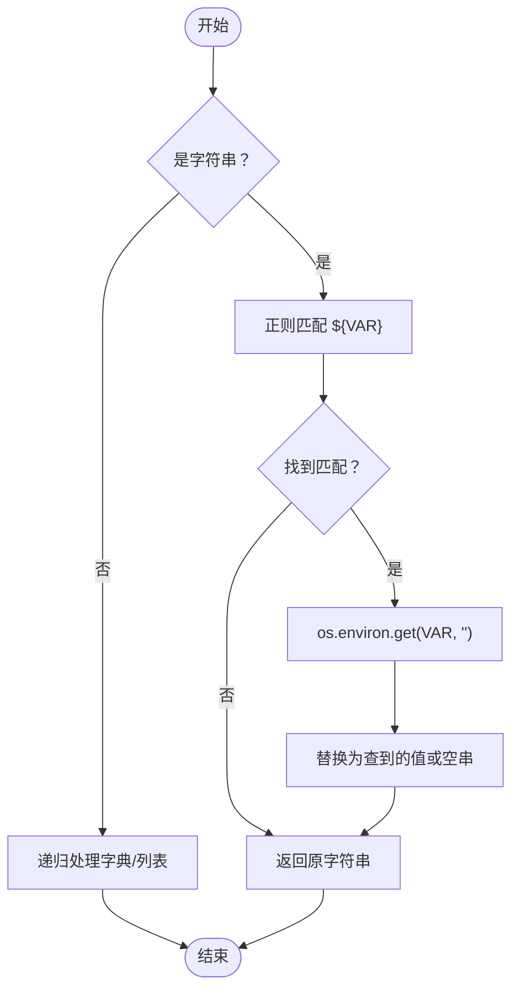
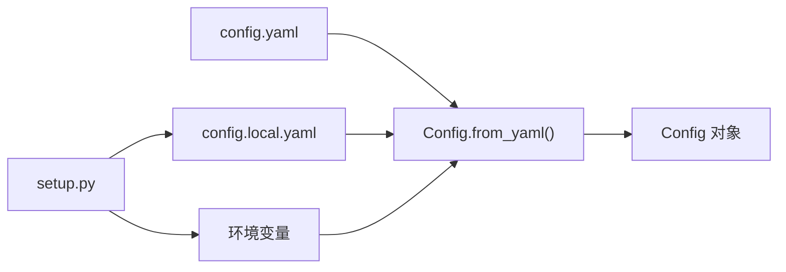

# 环境变量支持

<cite>
**本文引用的文件**
- [config.yaml](file://config.yaml)
- [config.example.yaml](file://config.example.yaml)
- [src/drbrain/config.py](file://src/drbrain/config.py)
- [src/drbrain/cli/setup.py](file://src/drbrain/cli/setup.py)
- [tests/test_config.py](file://tests/test_config.py)
- [docs/configuration.md](file://docs/configuration.md)
- [README.md](file://README.md)
</cite>

## 目录
1. [简介](#简介)
2. [项目结构](#项目结构)
3. [核心组件](#核心组件)
4. [架构总览](#架构总览)
5. [详细组件分析](#详细组件分析)
6. [依赖分析](#依赖分析)
7. [性能考量](#性能考量)
8. [故障排查指南](#故障排查指南)
9. [结论](#结论)
10. [附录](#附录)

## 简介
本文件面向 DrBrain 的“环境变量支持系统”，系统性阐述以下内容：
- ${ENV_VAR} 语法的使用方法与解析机制
- 支持的环境变量清单与用途
- 配置来源的优先级与覆盖规则
- 安全考虑与最佳实践
- 不同操作系统下的设置方法与示例
- 环境变量与配置文件的交互关系及动态加载机制

## 项目结构
围绕环境变量支持的关键文件与职责如下：
- 配置模板与示例：config.yaml、config.example.yaml
- 配置加载与解析：src/drbrain/config.py（含环境变量解析逻辑）
- 交互式初始化与快速模式：src/drbrain/cli/setup.py（读取 OS 级环境变量）
- 文档与参考：docs/configuration.md
- 测试用例：tests/test_config.py（验证环境变量解析行为）

图表来源
- [config.yaml](file://config.yaml)
- [config.example.yaml](file://config.example.yaml)
- [src/drbrain/config.py](file://src/drbrain/config.py)
- [src/drbrain/cli/setup.py](file://src/drbrain/cli/setup.py)
- [tests/test_config.py](file://tests/test_config.py)
- [docs/configuration.md](file://docs/configuration.md)

章节来源
- [config.yaml](file://config.yaml)
- [config.example.yaml](file://config.example.yaml)
- [src/drbrain/config.py](file://src/drbrain/config.py)
- [src/drbrain/cli/setup.py](file://src/drbrain/cli/setup.py)
- [docs/configuration.md](file://docs/configuration.md)

## 核心组件
- 环境变量解析器：在配置加载阶段对字符串中的 ${VAR} 模式进行递归替换，未匹配到的变量名会被替换为空字符串。
- 配置加载器：按顺序加载 config.yaml、可选的 config.local.yaml 覆盖层，并在最后应用环境变量替换。
- 快速安装模式：当使用 drbrain setup --quick 时，会从 OS 级环境变量读取默认值并写入 config.local.yaml，避免硬编码在仓库中。

章节来源
- [src/drbrain/config.py](file://src/drbrain/config.py)
- [src/drbrain/cli/setup.py](file://src/drbrain/cli/setup.py)
- [tests/test_config.py](file://tests/test_config.py)

## 架构总览
DrBrain 的配置加载流程遵循“自上而下”的优先级合并策略，最终在运行时完成环境变量替换，确保敏感信息不进入版本控制。

图表来源
- [src/drbrain/config.py](file://src/drbrain/config.py)
- [src/drbrain/cli/setup.py](file://src/drbrain/cli/setup.py)

## 详细组件分析

### 环境变量解析机制
- 匹配规则：使用正则表达式识别形如 ${VAR} 的占位符，其中 VAR 仅允许大写字母、数字与下划线，且必须以字母或下划线开头。
- 替换策略：对字典、列表与字符串进行递归遍历；字符串中的每个匹配项被替换为 os.environ.get(VAR, "")。
- 未知变量处理：未定义的变量名将被替换为空字符串，不会抛出异常。

图表来源
- [src/drbrain/config.py](file://src/drbrain/config.py)

章节来源
- [src/drbrain/config.py](file://src/drbrain/config.py)
- [tests/test_config.py](file://tests/test_config.py)

### 配置优先级与覆盖规则
- 优先级顺序（后胜先）：
  1) config.yaml（基础模板，纳入版本控制）
  2) config.local.yaml（本地覆盖与密钥，gitignore）
  3) 环境变量（运行时替换字符串中的 ${VAR}）
- 合并策略：
  - 字典采用深合并：同名键且均为字典时递归合并，否则后者覆盖前者。
  - 列表保持后者覆盖（例如模型列表、抓取回退顺序等）。
- 注意：若 config.local.yaml 不存在，环境变量占位符将无法被替换，建议通过 drbrain setup 生成该文件。

章节来源
- [config.example.yaml](file://config.example.yaml)
- [docs/configuration.md](file://docs/configuration.md)
- [src/drbrain/config.py](file://src/drbrain/config.py)

### 支持的环境变量清单与用途
以下变量在配置文件中以 ${VAR} 形式出现，可在运行时由环境变量注入。未在配置中出现的变量不会被解析。

- LLM 与模型相关
  - OPENAI_API_KEY：用于 OpenAI 提供商的模型调用
  - ANTHROPIC_API_KEY：用于 Anthropic（Claude）提供商
  - DEEPSEEK_API_KEY：用于 DeepSeek 提供商
  - ZHIPU_API_KEY：用于 Zhipu（GLM）提供商
  - BAILIAN_API_KEY：用于 Bailian（Qwen）提供商
  - MINIMAX_API_KEY：用于 MiniMax 提供商
  - MOONSHOT_API_KEY：用于 Moonshot（Kimi）提供商
  - S2_API_KEY：用于 Semantic Scholar（S2）提供商
  - OPENAI_API_KEY（嵌入场景，如 DRBRAIN_EMBED_API_KEY）：用于 OpenAI 兼容嵌入服务

- PDF 解析与提取
  - MINERU_TOKEN：MinerU API 令牌（免费/付费令牌）

- 外部服务令牌
  - DEEPXIV_TOKEN：DeepXiv 令牌（TLDR + 关键词）
  - CROSSREF_EMAIL：CrossRef 悦纳池邮箱（用于礼貌池请求）
  - OPENALEX_TOKEN：OpenAlex 令牌（更高速率限制）

- 嵌入服务（兼容 OpenAI 接口）
  - DRBRAIN_EMBED_API_KEY：OpenAI 兼容嵌入接口的 API Key
  - DRBRAIN_EMBED_API_BASE：OpenAI 兼容嵌入接口的基础 URL
  - DRBRAIN_EMBED_PROVIDER：嵌入提供者（local/openai-compat/none）
  - DRBRAIN_EMBED_MODEL：嵌入模型名称（兼容模式下）
  - DRBRAIN_EMBED_DEVICE：设备选择（auto/cpu/cuda）

- LLM 快速安装模式（OS 级环境变量）
  - DRBRAIN_LLM_PROVIDER：默认提供商（openai/anthropic/deepseek/ollama 等）
  - DRBRAIN_LLM_MODEL：默认模型名称
  - DRBRAIN_LLM_BASE_URL：默认 base_url（兼容模式）
  - DRBRAIN_MINERU_MODEL：MinerU 模型（vlm/pipeline/MinerU-HTML）
  - DRBRAIN_MINERU_OCR：是否启用 OCR（1 表示开启）
  - DRBRAIN_MINERU_FORMULA：是否解析公式（1 表示开启）
  - DRBRAIN_MINERU_TABLE：是否解析表格（1 表示开启）

- 其他
  - DRBRAIN_EMBED_DEVICE：嵌入设备选择（auto/cpu/cuda）

章节来源
- [config.yaml](file://config.yaml)
- [config.example.yaml](file://config.example.yaml)
- [src/drbrain/cli/setup.py](file://src/drbrain/cli/setup.py)
- [docs/configuration.md](file://docs/configuration.md)

### 与配置文件的交互关系与动态加载机制
- 动态加载流程：
  - 读取 config.yaml（基础）
  - 若存在 config.local.yaml，则深合并覆盖
  - 递归扫描所有字符串，将 ${VAR} 替换为环境变量值
  - 构造强类型配置对象，支持属性与字典两种访问方式
- 交互式初始化：
  - drbrain setup 会生成 config.local.yaml，将敏感信息（如 API Key）写入本地文件
  - drbrain setup --quick 会从 OS 级环境变量读取默认值，写入 config.local.yaml 并跳过交互
- 运行时可见性：
  - 未在 config.local.yaml 中显式设置的占位符，在运行时将显示为空字符串（需确保环境变量已正确设置）

章节来源
- [src/drbrain/config.py](file://src/drbrain/config.py)
- [src/drbrain/cli/setup.py](file://src/drbrain/cli/setup.py)
- [docs/configuration.md](file://docs/configuration.md)

### 不同操作系统的环境变量设置方法与示例
- Linux/macOS（Bash/zsh）
  - 导出变量：export OPENAI_API_KEY="sk-..."
  - 在当前会话生效；若需永久生效，写入 ~/.bashrc 或 ~/.zshrc
- Windows（PowerShell）
  - 设置变量：$env:OPENAI_API_KEY="sk-..."
  - 永久设置：Set-ItemEnvVar -Name "OPENAI_API_KEY" -Value "sk-..."
- CI/CD（GitHub Actions 示例）
  - 使用 secrets 注入环境变量，工作流中直接可用
- Docker（docker run）
  - docker run -e OPENAI_API_KEY="sk-..." drbrain:latest
- Kubernetes（Secrets + envFrom）
  - 将敏感信息放入 Secret，通过 envFrom 注入 Pod

章节来源
- [src/drbrain/cli/setup.py](file://src/drbrain/cli/setup.py)
- [README.md](file://README.md)

### 安全考虑与最佳实践
- 最小暴露原则
  - 将密钥与敏感参数放入 config.local.yaml（gitignore），不要写入 config.yaml
- 占位符与实际值分离
  - 在 config.yaml 中保留 ${VAR} 占位符，通过环境变量注入真实值
- 默认安全值
  - 未知变量将被替换为空字符串，避免误用默认值
- 严格命名规范
  - 变量名仅允许大写字母、数字与下划线，且以字母或下划线开头
- CI/CD 安全
  - 使用平台提供的密钥管理（如 GitHub Secrets、GitLab CI/CD Variables、Vault 等）
- 审计与验证
  - 使用 drbrain check 检查配置状态，确认占位符已被替换为有效值

章节来源
- [config.example.yaml](file://config.example.yaml)
- [docs/configuration.md](file://docs/configuration.md)
- [tests/test_config.py](file://tests/test_config.py)

## 依赖分析
- 组件耦合
  - 配置加载器与环境变量解析器紧密耦合，解析器对字符串进行递归替换
  - CLI 初始化与配置加载器解耦，但通过 OS 级环境变量实现“快速安装”能力
- 外部依赖
  - Python 标准库 os、re、yaml
  - 数据类与类型提示增强可维护性
- 潜在风险
  - 未设置环境变量时，占位符将为空字符串，可能影响功能（如 API 调用失败）
  - 变量名大小写敏感，需与配置文件一致

图表来源
- [src/drbrain/config.py](file://src/drbrain/config.py)
- [src/drbrain/cli/setup.py](file://src/drbrain/cli/setup.py)

章节来源
- [src/drbrain/config.py](file://src/drbrain/config.py)
- [src/drbrain/cli/setup.py](file://src/drbrain/cli/setup.py)

## 性能考量
- 环境变量解析为字符串扫描与替换，复杂度近似 O(N)，N 为配置文本长度
- 深合并与递归替换为线性时间，整体开销可忽略
- 建议在启动时一次性完成解析，避免重复解析

## 故障排查指南
- 症状：配置中仍显示 ${VAR} 占位符
  - 可能原因：未生成 config.local.yaml 或未设置对应环境变量
  - 处理：运行 drbrain setup 生成 config.local.yaml，并设置环境变量
- 症状：API 调用失败或速率受限
  - 可能原因：API Key 未正确注入或为空
  - 处理：检查环境变量是否正确导出，确认 drbrain check 输出
- 症状：MinerU 解析失败
  - 可能原因：MINERU_TOKEN 未设置或无效
  - 处理：设置 MINERU_TOKEN 或降级使用 PyMuPDF 回退方案
- 症状：嵌入服务报错
  - 可能原因：DRBRAIN_EMBED_API_KEY 未设置或 DRBRAIN_EMBED_API_BASE 错误
  - 处理：根据提供商调整 DRBRAIN_EMBED_PROVIDER、DRBRAIN_EMBED_API_KEY、DRBRAIN_EMBED_API_BASE

章节来源
- [tests/test_config.py](file://tests/test_config.py)
- [src/drbrain/cli/setup.py](file://src/drbrain/cli/setup.py)
- [docs/configuration.md](file://docs/configuration.md)

## 结论
DrBrain 的环境变量支持通过简洁的 ${VAR} 语法与严格的解析策略，实现了“配置即代码、密钥即环境”的安全实践。配合 config.local.yaml 的深合并与 drbrain setup 的交互式初始化，开发者可以在多平台、多环境下稳定地管理配置与密钥，同时满足 CI/CD 与生产部署的安全要求。

## 附录
- 快速检查命令：drbrain check
- 交互式初始化：drbrain setup
- 快速安装模式：drbrain setup --quick

章节来源
- [README.md](file://README.md)
- [docs/configuration.md](file://docs/configuration.md)