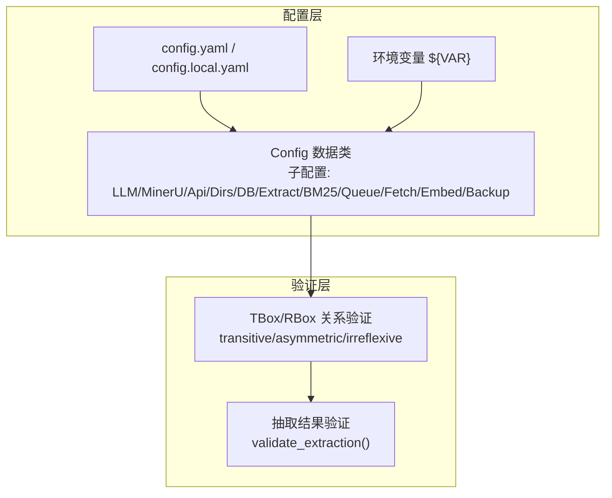
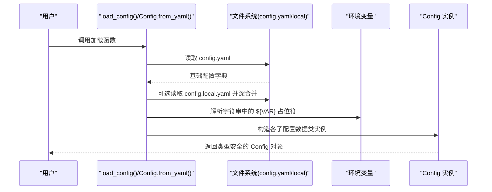
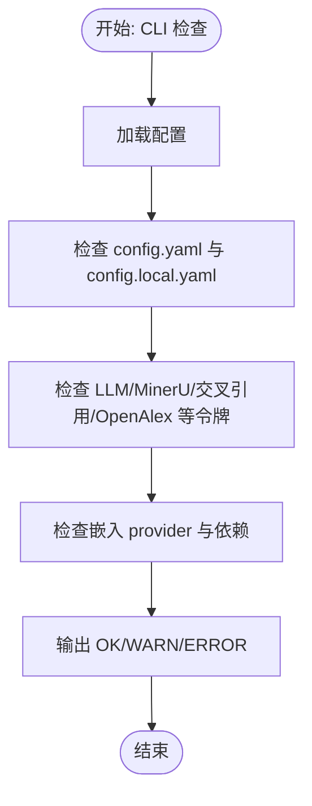
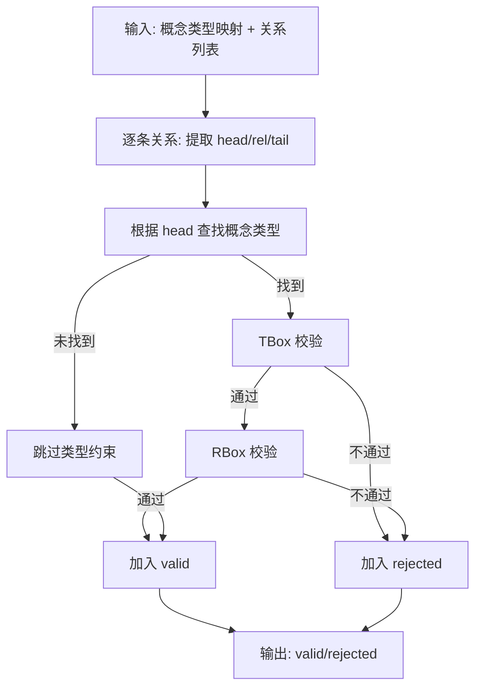
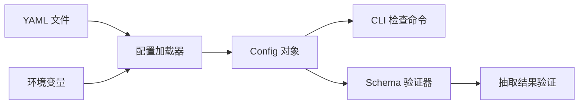

# 类型安全与验证

<cite>
**本文引用的文件**
- [src/drbrain/config.py](file://src/drbrain/config.py)
- [src/drbrain/validator/schema.py](file://src/drbrain/validator/schema.py)
- [src/drbrain/exceptions.py](file://src/drbrain/exceptions.py)
- [src/drbrain/cli/check_commands.py](file://src/drbrain/cli/check_commands.py)
- [src/drbrain/cli/setup.py](file://src/drbrain/cli/setup.py)
- [tests/test_config.py](file://tests/test_config.py)
- [tests/test_validator.py](file://tests/test_validator.py)
- [tests/test_validator_schema.py](file://tests/test_validator_schema.py)
- [docs/configuration.md](file://docs/configuration.md)
- [config.yaml](file://config.yaml)
- [config.example.yaml](file://config.example.yaml)
</cite>

## 目录
1. [简介](#简介)
2. [项目结构](#项目结构)
3. [核心组件](#核心组件)
4. [架构总览](#架构总览)
5. [详细组件分析](#详细组件分析)
6. [依赖分析](#依赖分析)
7. [性能考虑](#性能考虑)
8. [故障排查指南](#故障排查指南)
9. [结论](#结论)
10. [附录](#附录)

## 简介
本文件面向 DrBrain 的类型安全与配置验证体系，系统性阐述以下内容：
- 基于数据类的配置模型设计与类型约束
- 配置加载流程（YAML 解析、本地覆盖、环境变量解析）
- 运行期校验与错误处理机制
- 结构化关系验证（Schema-first）与推理增强
- 错误信息解读与修复建议
- 自定义验证扩展方法
- 配置热更新与重新验证策略

## 项目结构
DrBrain 将“类型安全”与“配置验证”分为两条主线：
- 配置层：以数据类承载配置项，支持字典式兼容访问与环境变量占位符解析
- 验证层：提供 TBox/RBox 关系约束与推理增强工具，用于抽取结果的合法性检查

图示来源
- [src/drbrain/config.py:182-292](file://src/drbrain/config.py#L182-L292)
- [src/drbrain/validator/schema.py:1-211](file://src/drbrain/validator/schema.py#L1-L211)

章节来源
- [src/drbrain/config.py:1-292](file://src/drbrain/config.py#L1-L292)
- [src/drbrain/validator/schema.py:1-211](file://src/drbrain/validator/schema.py#L1-L211)

## 核心组件
- 配置数据类族：LLMConfig、MinerUConfig、ApiConfig、DirsConfig、DBConfig、ExtractConfig、BM25Config、QueueConfig、FetchConfig、EmbedConfig、BackupConfig、BackupTargetConfig、Config
- 加载器：Config.from_yaml()、load_config()，支持深合并与环境变量解析
- 验证引擎：TBox/RBox 规则、关系推理增强、抽取结果批量验证
- 异常体系：DrBrainError、ConfigError、APIError、APIRateLimitError、ExtractionError、StorageError

章节来源
- [src/drbrain/config.py:44-194](file://src/drbrain/config.py#L44-L194)
- [src/drbrain/config.py:195-292](file://src/drbrain/config.py#L195-L292)
- [src/drbrain/validator/schema.py:54-211](file://src/drbrain/validator/schema.py#L54-L211)
- [src/drbrain/exceptions.py:6-28](file://src/drbrain/exceptions.py#L6-L28)

## 架构总览
配置从 YAML 到运行态的关键路径如下：

图示来源
- [src/drbrain/config.py:195-244](file://src/drbrain/config.py#L195-L244)

章节来源
- [src/drbrain/config.py:195-244](file://src/drbrain/config.py#L195-L244)

## 详细组件分析

### 配置数据类与类型约束
- 设计要点
  - 使用 dataclass 定义每个配置段，字段具备默认值，确保最小可用配置
  - 所有配置类继承 _ConfigBase，提供字典式访问与 values() 支持，便于命令行与历史代码兼容
  - Config 作为根容器，聚合所有子配置，并在 from_yaml 中逐一实例化
- 字段类型与默认值
  - LLMConfig.models: 列表，元素为字典（provider、model、api_key、base_url 等）
  - MinerUConfig: 字符串/布尔/整数等基础类型，含 OCR、公式、表格开关与最大页数限制
  - ApiConfig: 多个外部服务令牌与速率限制、缓存 TTL、邮箱等
  - DirsConfig: 各类数据目录路径
  - DBConfig: SQLite 路径
  - ExtractConfig: 并发提取上限
  - BM25Config: k1、b 参数
  - QueueConfig: 弱阈值与自动接受阈值
  - FetchConfig: 并发下载、超时、User-Agent、回退顺序、代理等
  - EmbedConfig: provider、model、device、top_k、source、hf_endpoint、api_base、api_key、batch_size
  - BackupConfig/BackupTargetConfig: SSH/Rsync 工具路径与目标备份参数
- 约束与范围
  - provider 限定集合（如 EmbedConfig.provider ∈ {"local","openai-compat","none"}）
  - device ∈ {"auto","cpu","cuda"}
  - top_k 为检索返回数量；当 provider="none" 时该字段被忽略
  - 其他数值参数在文档中给出合理范围（如 bm25.k1/b 的范围）

章节来源
- [src/drbrain/config.py:44-194](file://src/drbrain/config.py#L44-L194)
- [docs/configuration.md:194-247](file://docs/configuration.md#L194-L247)

### 配置加载与环境变量解析
- 深合并策略
  - base 与 overlay 采用递归深合并，叶子节点覆盖优先
- 环境变量解析
  - 递归扫描字符串，将 "${VAR}" 替换为环境变量值；未设置时为空字符串
- 错误处理
  - 若 base 配置文件不存在，抛出 FileNotFoundError
  - 未找到 config.local.yaml 时，仅使用 base 配置（占位符未解析）

章节来源
- [src/drbrain/config.py:250-278](file://src/drbrain/config.py#L250-L278)
- [src/drbrain/config.py:214-223](file://src/drbrain/config.py#L214-L223)

### 运行期校验与错误处理
- CLI 检查命令
  - 检查 Python 包、外部工具（MinerU、PyMuPDF）、配置文件存在性
  - 校验关键令牌与密钥是否已配置（支持占位符），缺失时发出警告
  - 对嵌入配置进行 provider 与依赖完整性检查
- 异常体系
  - 统一异常基类 DrBrainError
  - ConfigError 用于配置加载或验证错误
  - APIError/APIRateLimitError 用于外部 API 错误与限流
  - ExtractionError、StorageError 分别用于抽取与存储错误

图示来源
- [src/drbrain/cli/check_commands.py:24-200](file://src/drbrain/cli/check_commands.py#L24-L200)
- [src/drbrain/exceptions.py:6-28](file://src/drbrain/exceptions.py#L6-L28)

章节来源
- [src/drbrain/cli/check_commands.py:24-200](file://src/drbrain/cli/check_commands.py#L24-L200)
- [src/drbrain/exceptions.py:6-28](file://src/drbrain/exceptions.py#L6-L28)

### 结构化关系验证（Schema-first）
- TBox（概念类型约束）
  - 不同概念类型允许的关系集合预先定义，如 Problem 可 addresses/leaves_open/points_to 等
- RBox（关系属性约束）
  - irreflexive：不可自反（如 extends、replaces、challenges、supports、limits）
  - asymmetric：不可对称（如 extends、replaces、challenges、supports）
  - transitive：可传递（如 extends）
- 推理增强
  - enforce_transitive：基于传递性补全缺失边
  - detect_asymmetric_violations：检测对称边冲突
- 抽取结果验证
  - validate_extraction：遍历关系，结合 TBox/RBox 与标签类型推断，输出 valid/rejected

图示来源
- [src/drbrain/validator/schema.py:63-120](file://src/drbrain/validator/schema.py#L63-L120)
- [src/drbrain/validator/schema.py:140-211](file://src/drbrain/validator/schema.py#L140-L211)

章节来源
- [src/drbrain/validator/schema.py:7-51](file://src/drbrain/validator/schema.py#L7-L51)
- [src/drbrain/validator/schema.py:63-120](file://src/drbrain/validator/schema.py#L63-L120)
- [src/drbrain/validator/schema.py:140-211](file://src/drbrain/validator/schema.py#L140-L211)

### 配置热更新与重新验证
- 现状说明
  - 当前仓库未提供“配置热重载”的内置实现。CLI 检查命令会重新加载配置并输出状态
- 建议实践
  - 在需要“热更新”的场景下，建议在应用入口处捕获配置变更事件，调用 load_config() 重新构建 Config 实例
  - 对于运行期关键模块（如嵌入、外部 API），在切换配置后执行一次轻量级健康检查
  - 对抽取与图谱模块，可在变更后触发一次 validate_extraction() 以确保一致性

章节来源
- [src/drbrain/cli/check_commands.py:24-200](file://src/drbrain/cli/check_commands.py#L24-L200)
- [src/drbrain/config.py:283-292](file://src/drbrain/config.py#L283-L292)

## 依赖分析
- 配置层
  - 依赖：yaml.safe_load、os.environ、正则表达式
  - 无循环依赖，耦合度低
- 验证层
  - 依赖：dataclasses（用于 ValidationResult）
  - 无外部依赖，逻辑内聚
- CLI 层
  - 依赖：rich、typer、导入模块检测
  - 与配置层通过 load_config() 交互

图示来源
- [src/drbrain/config.py:195-244](file://src/drbrain/config.py#L195-L244)
- [src/drbrain/validator/schema.py:97-120](file://src/drbrain/validator/schema.py#L97-L120)

章节来源
- [src/drbrain/config.py:195-244](file://src/drbrain/config.py#L195-L244)
- [src/drbrain/validator/schema.py:97-120](file://src/drbrain/validator/schema.py#L97-L120)

## 性能考虑
- 配置加载
  - YAML 解析与深合并均为 O(N) 级别，N 为配置项数量
  - 环境变量解析递归扫描字符串，复杂度与字符串长度成正比
- 验证
  - TBox/RBox 校验为常数时间查询
  - enforce_transitive 使用邻接表与 BFS，复杂度近似 O(V+E)，在关系规模较小时可忽略
- 建议
  - 将大型配置拆分为多个小节，减少不必要的深合并层级
  - 对频繁访问的配置项进行缓存（如嵌入 provider 与设备选择）

## 故障排查指南
- 常见问题与定位
  - 缺少 config.local.yaml：CLI 检查会提示“未找到”，且占位符未解析
  - LLM/MinerU/交叉引用/OpenAlex 令牌缺失：检查对应字段是否仍为 "${...}" 或空字符串
  - 嵌入 provider 为 openai-compat 但缺少 api_base/api_key：需补齐或改为 local
  - 嵌入 provider 为 local 但未安装 sentence-transformers：安装依赖或改用其他 provider
- 错误信息解读
  - TBox/RBox 违规：明确指出“不允许的关系”或“自反/对称/传递性违规”
  - 抽取结果 rejected：包含具体关系与原因，便于定位上游抽取问题
- 修复建议
  - 使用 drbrain setup 生成/更新 config.local.yaml
  - 使用 drbrain check 快速诊断并输出建议
  - 对于 schema 违规，调整抽取模板或后处理逻辑

章节来源
- [src/drbrain/cli/check_commands.py:114-200](file://src/drbrain/cli/check_commands.py#L114-L200)
- [src/drbrain/validator/schema.py:63-95](file://src/drbrain/validator/schema.py#L63-L95)
- [tests/test_validator.py:6-63](file://tests/test_validator.py#L6-L63)
- [tests/test_validator_schema.py:11-147](file://tests/test_validator_schema.py#L11-L147)

## 结论
DrBrain 的类型安全与配置验证体系以“数据类 + YAML + 环境变量”为核心，辅以“CLI 检查 + Schema-first 验证 + 抽取结果校验”。该方案在保证易用性的同时，提供了清晰的错误边界与可扩展的验证能力。对于生产环境，建议配合“配置热更新 + 重新验证”的流程，确保运行态一致性。

## 附录

### 配置项一览与默认值
- LLM
  - models: 列表（元素含 provider/model/api_key/base_url）
- MinerU
  - token/model/is_ocr/enable_formula/enable_table/max_pages
- API
  - deepxiv_token/s2_api_key/s2_rate_limit/cache_ttl/crossref_email/openalex_token
- 目录
  - inbox/pending/papers/reports/cache/logs
- 数据库
  - path
- 提取
  - max_concurrent
- BM25
  - k1/b
- 质量控制
  - weak_threshold/auto_accept
- 获取
  - max_concurrent/timeout_per_fetch/user_agent/fallback_order/unpaywall_email/institutional_proxy/proxy_type
- 嵌入
  - provider/model/device/top_k/source/cache_dir/hf_endpoint/api_base/api_key/batch_size
- 备份
  - ssh_bin/rsync_bin/targets（host/user/path/port/identity_file/password/mode/compress/enabled/exclude）

章节来源
- [src/drbrain/config.py:44-194](file://src/drbrain/config.py#L44-L194)
- [docs/configuration.md:21-342](file://docs/configuration.md#L21-L342)
- [config.yaml:1-72](file://config.yaml#L1-L72)
- [config.example.yaml:1-145](file://config.example.yaml#L1-L145)

### 自定义验证扩展方法
- 新增 TBox/RBox 约束
  - 在 schema 中扩展 TBOX/RBOX 映射，新增关系属性或类型白名单
  - 如需推理增强，可在 enforce_transitive/detect_asymmetric_violations 基础上扩展
- 新增运行期校验
  - 在 CLI 检查命令中增加新字段的检查逻辑，输出 OK/WARN/ERROR
  - 对关键模块（如嵌入）增加依赖与参数校验
- 新增配置项
  - 在对应 Config 子类中添加字段与默认值
  - 更新 CLI 与文档，保持测试与示例同步

章节来源
- [src/drbrain/validator/schema.py:7-51](file://src/drbrain/validator/schema.py#L7-L51)
- [src/drbrain/cli/check_commands.py:24-200](file://src/drbrain/cli/check_commands.py#L24-L200)
- [tests/test_config.py:1-465](file://tests/test_config.py#L1-L465)