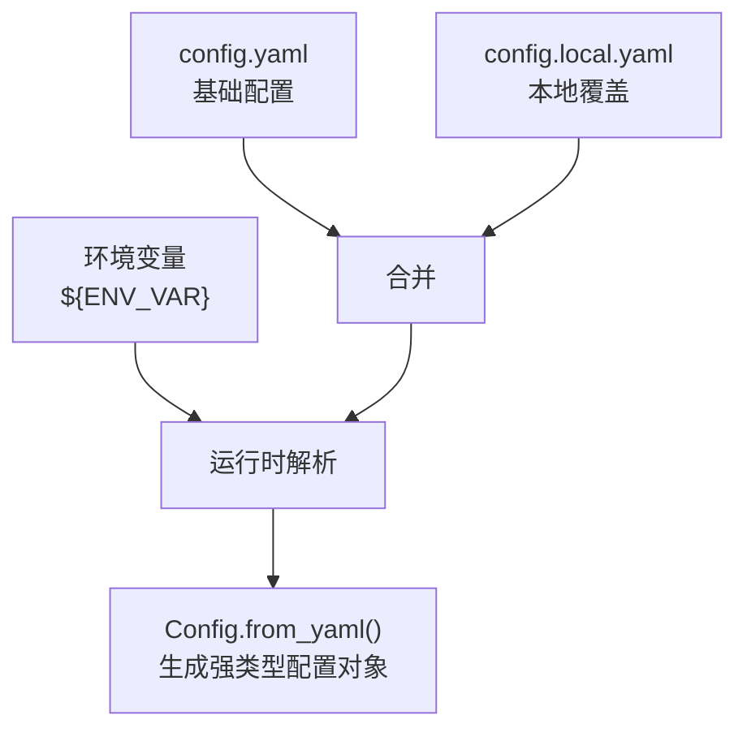
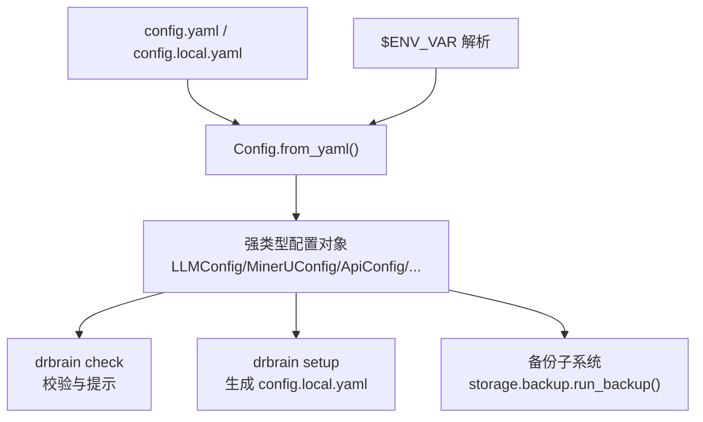

# 配置文件结构

<cite>
**本文引用的文件列表**
- [config.yaml](file://config.yaml)
- [config.example.yaml](file://config.example.yaml)
- [config.py](file://src/drbrain/config.py)
- [configuration.md](file://docs/configuration.md)
- [check_commands.py](file://src/drbrain/cli/check_commands.py)
- [setup.py](file://src/drbrain/cli/setup.py)
- [backup.py](file://src/drbrain/storage/backup.py)
- [test_config.py](file://tests/test_config.py)
</cite>

## 目录
1. [简介](#简介)
2. [项目结构与配置来源](#项目结构与配置来源)
3. [核心配置段总览](#核心配置段总览)
4. [架构概览](#架构概览)
5. [详细配置段解析](#详细配置段解析)
6. [依赖关系与约束](#依赖关系与约束)
7. [性能与资源考量](#性能与资源考量)
8. [最佳实践与常见模式](#最佳实践与常见模式)
9. [故障排查指南](#故障排查指南)
10. [结论](#结论)

## 简介
本文件系统性梳理 DrBrain 的配置文件结构，聚焦 config.yaml 及其模板 config.example.yaml，结合配置加载器与校验工具，解释各配置段的作用、数据类型、默认值、取值范围、使用场景与相互依赖，并提供最佳实践与常见配置模式，帮助用户正确、安全地配置系统。

## 项目结构与配置来源
DrBrain 的配置体系由三层来源按优先级合并：
- 基础配置：config.yaml（纳入版本控制）
- 本地覆盖：config.local.yaml（不纳入版本控制，存放密钥等敏感信息）
- 环境变量：通过 ${ENV_VAR} 语法在运行时解析

加载流程与优先级如下图所示：

图表来源
- [config.py:195-244](file://src/drbrain/config.py#L195-L244)
- [configuration.md:5-18](file://docs/configuration.md#L5-L18)

章节来源
- [config.py:195-244](file://src/drbrain/config.py#L195-L244)
- [configuration.md:5-18](file://docs/configuration.md#L5-L18)

## 核心配置段总览
- llm：大模型服务配置，支持多模型与回退链
- mineru：PDF 解析（MinerU）配置
- db：SQLite 数据库路径
- dirs：数据目录映射
- api：外部 API 访问令牌与速率限制
- bm25：全文检索参数
- extract：实体抽取阶段并发数
- queue：质量控制阈值
- fetch：下载与回退策略
- embed：文本向量嵌入配置
- backup：可选的 rsync 备份目标（不在当前 config.yaml 中）

章节来源
- [config.yaml:7-72](file://config.yaml#L7-L72)
- [config.example.yaml:9-145](file://config.example.yaml#L9-L145)
- [config.py:44-141](file://src/drbrain/config.py#L44-L141)

## 架构概览
配置加载与使用的关键组件关系如下：

图表来源
- [config.py:195-244](file://src/drbrain/config.py#L195-L244)
- [check_commands.py:24-427](file://src/drbrain/cli/check_commands.py#L24-L427)
- [setup.py:31-91](file://src/drbrain/cli/setup.py#L31-L91)
- [backup.py:199-239](file://src/drbrain/storage/backup.py#L199-L239)

## 详细配置段解析

### llm 段：大模型服务
- 作用：定义 LLM 提供商、模型、API 密钥与自定义 base_url；支持多模型回退链
- 数据类型与默认值：
  - models：列表，元素为字典，包含 provider、model、api_key、base_url
- 关键字段
  - provider：字符串，如 openai、anthropic、ollama 等（兼容 litellm）
  - model：字符串，具体模型标识
  - api_key：字符串或 ${ENV_VAR} 形式
  - base_url：字符串或 null（默认）
- 使用场景
  - 主模型失败时自动尝试下一个模型
  - 支持本地 Ollama、vLLM/SGLang、以及多家云厂商
- 取值范围与建议
  - provider 必填且需与 litellm 兼容
  - api_key 建议使用 ${ENV_VAR}，避免硬编码
  - base_url 为空表示使用提供商默认地址
- 依赖与约束
  - 至少一个模型条目；若使用 ${ENV_VAR}，需确保环境变量已设置
  - 若配置多个模型，按顺序作为回退链

章节来源
- [config.yaml:7-13](file://config.yaml#L7-L13)
- [config.example.yaml:9-66](file://config.example.yaml#L9-L66)
- [config.py:44-47](file://src/drbrain/config.py#L44-L47)
- [configuration.md:21-76](file://docs/configuration.md#L21-L76)

### mineru 段：PDF 解析（MinerU）
- 作用：PDF 文本、公式、表格提取；支持 OCR 与最大页数切分
- 数据类型与默认值：
  - token：字符串（${ENV_VAR}）
  - model：字符串，默认 vlm
  - is_ocr：布尔，默认 false
  - enable_formula：布尔，默认 true
  - enable_table：布尔，默认 true
  - max_pages：整数，默认 150
- 使用场景
  - 高质量解析 PDF；不可用时回退到 PyMuPDF
- 取值范围与建议
  - model：pipeline、vlm、MinerU-HTML
  - is_ocr：开启后忽略嵌入文本
  - max_pages：MinerU 限制约 200
- 依赖与约束
  - token 为空时使用“闪速”模式（能力受限）
  - 建议安装 mineru-open-api CLI 以获得最佳体验

章节来源
- [config.yaml:14-21](file://config.yaml#L14-L21)
- [config.example.yaml:67-76](file://config.example.yaml#L67-L76)
- [config.py:50-56](file://src/drbrain/config.py#L50-L56)
- [configuration.md:78-101](file://docs/configuration.md#L78-L101)

### db 段：数据库
- 作用：指定 SQLite 数据库路径
- 数据类型与默认值：
  - path：字符串，默认 data/drbrain.db
- 使用场景
  - 存放知识图谱与中间结果
- 取值范围与建议
  - 路径需可写；WAL 模式启用
  - 另有独立 metrics.db 存放指标

章节来源
- [config.yaml:22-23](file://config.yaml#L22-L23)
- [config.example.yaml:77-80](file://config.example.yaml#L77-L80)
- [config.py:80-81](file://src/drbrain/config.py#L80-L81)
- [configuration.md:103-115](file://docs/configuration.md#L103-L115)

### dirs 段：数据目录
- 作用：映射工作空间中的关键目录
- 数据类型与默认值：
  - inbox：字符串，默认 data/spool/inbox
  - pending：字符串，默认 data/spool/pending
  - papers：字符串，默认 data/papers
  - reports：字符串，默认 data/reports
  - cache：字符串，默认 data/cache
  - logs：字符串，默认 data/logs
- 使用场景
  - PDF 投递、失败重试、论文数据、报告、缓存、日志
- 取值范围与建议
  - 建议与实际磁盘空间匹配，预留充足空间
  - 目录不存在时可通过检查命令自动创建

章节来源
- [config.yaml:25-31](file://config.yaml#L25-L31)
- [config.example.yaml:81-89](file://config.example.yaml#L81-L89)
- [config.py:70-77](file://src/drbrain/config.py#L70-L77)
- [configuration.md:118-139](file://docs/configuration.md#L118-L139)

### api 段：外部 API
- 作用：外部服务访问令牌与速率限制
- 数据类型与默认值：
  - deepxiv_token：字符串（${ENV_VAR}）
  - s2_rate_limit：整数，默认 100
  - s2_api_key：字符串（${ENV_VAR}）
  - cache_ttl：整数，默认 86400（秒）
  - crossref_email：字符串（${ENV_VAR}）
  - openalex_token：字符串（${ENV_VAR}）
- 使用场景
  - Semantic Scholar、CrossRef、OpenAlex、DeepXiv 等
- 取值范围与建议
  - s2_rate_limit：根据 API 配额调整
  - cache_ttl：建议 24 小时（86400 秒）
- 依赖与约束
  - 令牌缺失将导致匿名访问或功能受限

章节来源
- [config.yaml:33-40](file://config.yaml#L33-L40)
- [config.example.yaml:90-98](file://config.example.yaml#L90-L98)
- [config.py:60-66](file://src/drbrain/config.py#L60-L66)
- [configuration.md:141-162](file://docs/configuration.md#L141-L162)

### bm25 段：全文检索参数
- 作用：BM25 检索的饱和与归一化参数
- 数据类型与默认值：
  - k1：浮点数，默认 1.5（范围 0.5–2.0）
  - b：浮点数，默认 0.75（范围 0–1）
- 使用场景
  - 文档检索与排序
- 取值范围与建议
  - k1 控制词频饱和度；b 控制长度归一化强度
  - 初学者可保持默认值，后续按效果微调

章节来源
- [config.yaml:41-44](file://config.yaml#L41-L44)
- [config.example.yaml:99-103](file://config.example.yaml#L99-L103)
- [config.py:90-93](file://src/drbrain/config.py#L90-L93)
- [configuration.md:164-177](file://docs/configuration.md#L164-L177)

### extract 段：实体抽取并发
- 作用：实体抽取阶段的最大并发数
- 数据类型与默认值：
  - max_concurrent：整数，默认 10
- 使用场景
  - 并发调用 LLM 进行概念抽取
- 取值范围与建议
  - 数值越高吞吐越大，但成本与限流风险上升
  - 建议与 llm 的配额与网络状况匹配

章节来源
- [config.yaml:45-47](file://config.yaml#L45-L47)
- [config.example.yaml:104-107](file://config.example.yaml#L104-L107)
- [config.py:85-87](file://src/drbrain/config.py#L85-L87)
- [configuration.md:179-192](file://docs/configuration.md#L179-L192)

### queue 段：质量控制阈值
- 作用：抽取/推理结果的质量阈值
- 数据类型与默认值：
  - weak_threshold：浮点数，默认 0.7
  - auto_accept：浮点数，默认 0.9
- 使用场景
  - 弱置信度进入人工复核队列；高置信度自动接受
- 取值范围与建议
  - 0.7 ≤ weak_threshold < auto_accept ≤ 0.9
  - 两阈值之间为待审区间

章节来源
- [config.yaml:48-51](file://config.yaml#L48-L51)
- [config.example.yaml:122-126](file://config.example.yaml#L122-L126)
- [config.py:95-99](file://src/drbrain/config.py#L95-L99)
- [configuration.md:250-265](file://docs/configuration.md#L250-L265)

### fetch 段：下载与回退策略
- 作用：PDF 获取的并发、超时、回退顺序与代理
- 数据类型与默认值：
  - max_concurrent：整数，默认 3
  - timeout_per_fetch：整数，默认 60（秒）
  - user_agent：字符串，默认 DrBrain/0.1
  - fallback_order：列表，默认 ["openalex", "arxiv", "unpaywall", "doi_direct"]
  - unpaywall_email：字符串，默认空
  - institutional_proxy：字符串，默认空
  - proxy_type：字符串，默认空（可选 "ezproxy" 或 "url_prefix"）
- 使用场景
  - 从多个来源回退抓取 PDF；支持机构代理
- 取值范围与建议
  - 并发与超时需与网络与源服务能力匹配
  - 回退顺序可根据可用性调整

章节来源
- [config.yaml:52-60](file://config.yaml#L52-L60)
- [config.example.yaml:306-329](file://config.example.yaml#L306-L329)
- [config.py:102-112](file://src/drbrain/config.py#L102-L112)
- [configuration.md:306-329](file://docs/configuration.md#L306-L329)

### embed 段：文本向量嵌入
- 作用：树节点（PageIndex + RAPTOR）的文本嵌入，非图嵌入
- 数据类型与默认值：
  - provider：字符串，默认 "local"（可选 "local"|"openai-compat"|"none"）
  - model：字符串，默认 "Qwen/Qwen3-Embedding-0.6B"
  - device：字符串，默认 "auto"（可选 "auto"|"cpu"|"cuda"）
  - top_k：整数，默认 10
  - source：字符串，默认 "modelscope"（可选 "modelscope"|"huggingface"）
  - cache_dir：字符串，默认 "~/.cache/modelscope/hub/models"
  - hf_endpoint：字符串，默认空（可选镜像地址）
  - api_base：字符串，默认空（OpenAI 兼容 API）
  - api_key：字符串，默认空（建议 ${ENV_VAR}）
  - batch_size：整数，默认 64
- 使用场景
  - 向量检索与树检索配合
- 取值范围与建议
  - provider="none" 时禁用树嵌入，仅依赖 BM25 + 树导航
  - 本地模型需安装 sentence-transformers
  - 云兼容模式需提供 api_base 与 api_key

章节来源
- [config.yaml:61-72](file://config.yaml#L61-L72)
- [config.example.yaml:108-121](file://config.example.yaml#L108-L121)
- [config.py:114-141](file://src/drbrain/config.py#L114-L141)
- [configuration.md:194-248](file://docs/configuration.md#L194-L248)

### backup 段：可选的 rsync 备份目标
- 作用：远程备份配置（不在当前 config.yaml 中）
- 数据类型与默认值：
  - ssh_bin：字符串，默认 "ssh"
  - rsync_bin：字符串，默认 "rsync"
  - targets：字典，键为目标名，值为 BackupTargetConfig
- BackupTargetConfig 字段
  - host：主机
  - user：用户名
  - path：远端路径
  - port：端口，默认 22
  - identity_file：私钥路径
  - password：密码（可选）
  - mode：传输模式，默认 "default"（可选 "default"|"append"|"append-verify"）
  - compress：是否压缩，默认 true
  - enabled：是否启用，默认 true
  - exclude：排除规则列表
- 使用场景
  - 将 data/ 目录同步至远端服务器
- 取值范围与建议
  - 仅在 config.local.yaml 中配置敏感信息
  - 默认提供本地 tar.gz 备份，无需额外配置

章节来源
- [config.example.yaml:127-145](file://config.example.yaml#L127-L145)
- [config.py:143-179](file://src/drbrain/config.py#L143-L179)
- [configuration.md:267-303](file://docs/configuration.md#L267-L303)
- [backup.py:199-239](file://src/drbrain/storage/backup.py#L199-L239)

## 依赖关系与约束
- 加载顺序与覆盖
  - config.yaml → config.local.yaml → 环境变量（后者覆盖前者）
- 字段间依赖
  - llm.api_key 与 provider/model 必须成对配置
  - embed.provider="local" 时需安装 sentence-transformers
  - embed.provider="openai-compat" 时需提供 api_base 与 api_key
  - mineru.token 为空时能力受限（闪速模式）
  - queue.weak_threshold < queue.auto_accept
- 运行时解析
  - ${ENV_VAR} 在加载时解析为环境变量值
- 校验与提示
  - drbrain check 会检测缺失令牌、目录、工具与连接性，并给出警告

章节来源
- [config.py:195-244](file://src/drbrain/config.py#L195-L244)
- [configuration.md:5-18](file://docs/configuration.md#L5-L18)
- [check_commands.py:114-403](file://src/drbrain/cli/check_commands.py#L114-L403)

## 性能与资源考量
- 并发与成本
  - extract.max_concurrent 与 fetch.max_concurrent 提升吞吐的同时增加 API 成本与限流风险
- 设备与内存
  - embed.device="cuda" 可加速本地嵌入，但需 GPU 与足够显存
  - batch_size 可根据显存情况调整，遇到 OOM 会自动下调
- 网络与超时
  - fetch.timeout_per_fetch 与 fallback_order 影响下载稳定性
- 存储与缓存
  - cache_ttl 控制外部 API 缓存有效期，平衡新鲜度与带宽
  - dirs.cache 与 logs 可重建，清理前请确认数据需求

章节来源
- [configuration.md:186-191](file://docs/configuration.md#L186-L191)
- [config.py:114-141](file://src/drbrain/config.py#L114-L141)
- [config.example.yaml:108-121](file://config.example.yaml#L108-L121)

## 最佳实践与常见模式
- 安全性
  - 所有密钥与令牌放入 config.local.yaml，不要提交到仓库
  - 使用 ${ENV_VAR} 语法，避免硬编码
- 初始化与校验
  - 使用 drbrain setup 生成 config.local.yaml
  - 使用 drbrain check 进行一次性健康检查
- 常见配置模式
  - 本地模型：provider="local"，device="auto"，model 选择合适的小模型
  - 云兼容：provider="openai-compat"，设置 api_base 与 api_key
  - 禁用嵌入：provider="none"，仅依赖 BM25 + 树导航
  - 多模型回退：llm.models 列表中按优先级排列
- 目录与存储
  - dirs 下的路径建议与磁盘空间规划一致，定期清理 cache 与 logs
  - db.path 建议指向独立磁盘分区，保证写入性能

章节来源
- [configuration.md:5-18](file://docs/configuration.md#L5-L18)
- [setup.py:31-91](file://src/drbrain/cli/setup.py#L31-L91)
- [check_commands.py:24-427](file://src/drbrain/cli/check_commands.py#L24-L427)

## 故障排查指南
- 常见问题与定位
  - 缺失 config.yaml 或 config.local.yaml：检查文件是否存在
  - 令牌未设置：llm/mineru/api/embed 等字段显示“未配置”
  - 工具缺失：MinerU CLI、sentence-transformers、外部工具未找到
  - 连接性问题：MinerU API、DeepXiv、LLM API 不可达
  - 目录权限：dirs 下目录不可写或不存在
- 排查步骤
  - 运行 drbrain check，查看错误与警告汇总
  - 按提示安装缺失包或工具
  - 设置环境变量或完善 config.local.yaml
  - 检查网络与代理配置（institutional_proxy、proxy_type）
- 单元测试参考
  - 测试覆盖了默认值、部分配置加载与环境变量解析

章节来源
- [check_commands.py:24-427](file://src/drbrain/cli/check_commands.py#L24-L427)
- [test_config.py:1-225](file://tests/test_config.py#L1-L225)

## 结论
DrBrain 的配置体系以清晰的分层与强类型的加载器为核心，结合校验与初始化工具，为不同部署场景提供了灵活而安全的配置方案。遵循本文档的配置段说明、依赖关系与最佳实践，可有效提升系统的稳定性、可维护性与性能表现。