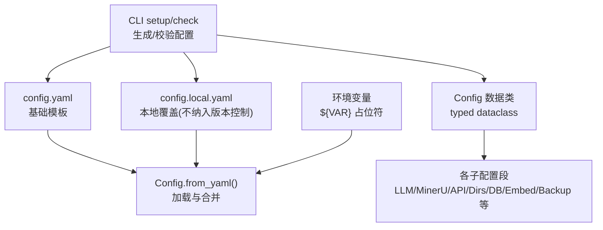
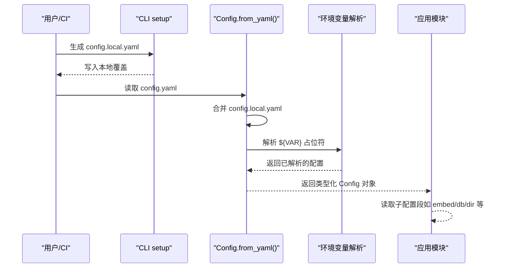
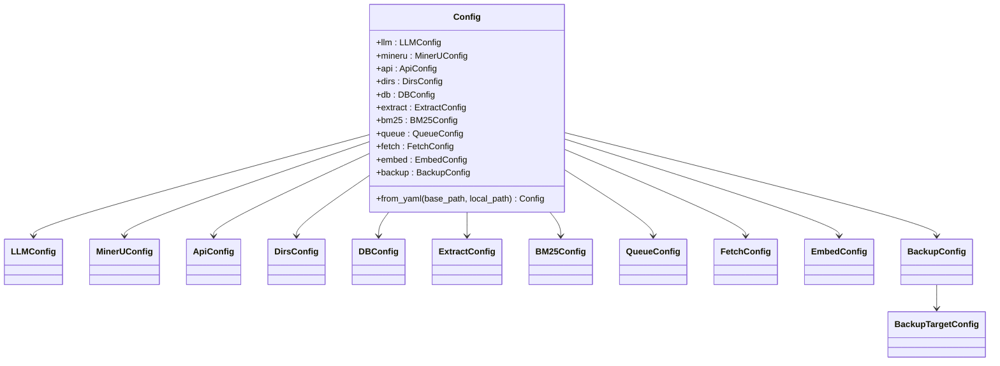
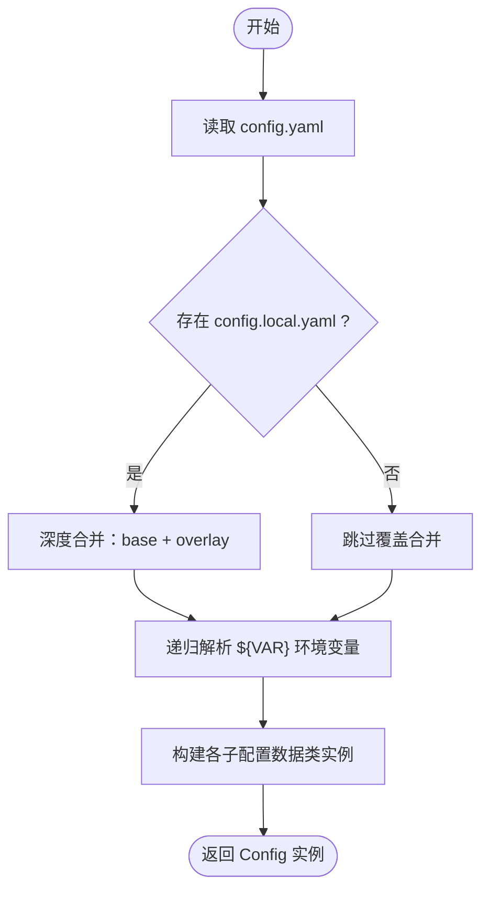
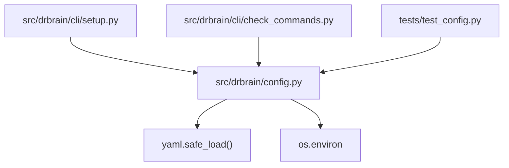

# 配置管理

<cite>
**本文引用的文件列表**
- [src/drbrain/config.py](file://src/drbrain/config.py)
- [config.yaml](file://config.yaml)
- [config.example.yaml](file://config.example.yaml)
- [docs/configuration.md](file://docs/configuration.md)
- [src/drbrain/cli/setup.py](file://src/drbrain/cli/setup.py)
- [src/drbrain/cli/check_commands.py](file://src/drbrain/cli/check_commands.py)
- [tests/test_config.py](file://tests/test_config.py)
- [CHANGELOG.md](file://CHANGELOG.md)
- [uv.lock](file://uv.lock)
</cite>

## 目录
1. [简介](#简介)
2. [项目结构与入口](#项目结构与入口)
3. [核心组件](#核心组件)
4. [架构总览](#架构总览)
5. [详细组件分析](#详细组件分析)
6. [依赖关系分析](#依赖关系分析)
7. [性能与可靠性考量](#性能与可靠性考量)
8. [故障排查与错误处理](#故障排查与错误处理)
9. [最佳实践与安全建议](#最佳实践与安全建议)
10. [配置迁移与版本兼容](#配置迁移与版本兼容)
11. [结论](#结论)

## 简介
本文件面向 DrBrain 的配置管理系统，系统化阐述配置文件结构、环境变量解析、类型安全配置、默认值覆盖、配置合并与继承规则、验证与错误处理、以及迁移与版本兼容策略。目标是帮助开发者与运维人员正确理解并高效使用配置体系，确保部署一致性与安全性。

## 项目结构与入口
- 配置类与加载器位于 Python 模块中，提供类型安全的数据类与 YAML 加载、本地覆盖、环境变量解析能力。
- 核心配置文件包括基础模板与本地覆盖模板，配合 CLI 工具生成与校验。
- 文档提供完整配置项参考与使用说明。

图表来源
- [src/drbrain/config.py:195-244](file://src/drbrain/config.py#L195-L244)
- [config.yaml:1-72](file://config.yaml#L1-L72)
- [config.example.yaml:1-145](file://config.example.yaml#L1-L145)
- [src/drbrain/cli/setup.py:31-91](file://src/drbrain/cli/setup.py#L31-L91)
- [src/drbrain/cli/check_commands.py:24-426](file://src/drbrain/cli/check_commands.py#L24-L426)

章节来源
- [src/drbrain/config.py:1-292](file://src/drbrain/config.py#L1-L292)
- [config.yaml:1-72](file://config.yaml#L1-L72)
- [config.example.yaml:1-145](file://config.example.yaml#L1-L145)
- [src/drbrain/cli/setup.py:1-588](file://src/drbrain/cli/setup.py#L1-L588)
- [src/drbrain/cli/check_commands.py:1-629](file://src/drbrain/cli/check_commands.py#L1-L629)

## 核心组件
- 类型化配置数据类：以 dataclass 形式定义各配置段，提供默认值与类型约束，同时保留字典兼容访问。
- YAML 加载与合并：从基础配置文件加载，可选地叠加本地覆盖；随后进行环境变量占位符解析。
- 环境变量解析：对字符串中的 ${VAR} 进行递归替换，未设置时为空字符串。
- 配置验证与 CLI 校验：通过 CLI 的检查命令对关键键值、外部工具、目录、数据库、API 可达性进行验证。

章节来源
- [src/drbrain/config.py:44-244](file://src/drbrain/config.py#L44-L244)
- [tests/test_config.py:1-465](file://tests/test_config.py#L1-L465)
- [src/drbrain/cli/check_commands.py:24-426](file://src/drbrain/cli/check_commands.py#L24-L426)

## 架构总览
配置系统采用“三层合并 + 环境变量解析”的设计，最终输出类型化的配置对象，供应用各模块读取。

图表来源
- [src/drbrain/config.py:195-244](file://src/drbrain/config.py#L195-L244)
- [src/drbrain/cli/setup.py:31-91](file://src/drbrain/cli/setup.py#L31-L91)
- [src/drbrain/cli/check_commands.py:24-426](file://src/drbrain/cli/check_commands.py#L24-L426)

## 详细组件分析

### 配置类与数据结构
- Config：顶层容器，聚合各子配置段。
- 子配置段：LLMConfig、MinerUConfig、ApiConfig、DirsConfig、DBConfig、ExtractConfig、BM25Config、QueueConfig、FetchConfig、EmbedConfig、BackupConfig、BackupTargetConfig。
- 字典兼容：通过混入类提供 cfg["section"]["key"] 与 cfg.get(...) 访问，便于向后兼容。

图表来源
- [src/drbrain/config.py:44-194](file://src/drbrain/config.py#L44-L194)

章节来源
- [src/drbrain/config.py:21-194](file://src/drbrain/config.py#L21-L194)

### YAML 加载与合并
- 加载顺序：config.yaml（基础）→ config.local.yaml（本地覆盖）→ 环境变量解析。
- 合并策略：深度合并，叶子节点覆盖优先，保留基础配置中未被覆盖的键。
- 异常处理：当基础配置文件不存在时抛出 FileNotFoundError。

图表来源
- [src/drbrain/config.py:195-244](file://src/drbrain/config.py#L195-L244)
- [src/drbrain/config.py:250-258](file://src/drbrain/config.py#L250-L258)
- [src/drbrain/config.py:264-278](file://src/drbrain/config.py#L264-L278)

章节来源
- [src/drbrain/config.py:195-278](file://src/drbrain/config.py#L195-L278)
- [tests/test_config.py:196-257](file://tests/test_config.py#L196-L257)

### 环境变量解析
- 支持在任意字符串中使用 ${VAR} 占位符，递归解析到环境中对应变量值。
- 未知变量将被替换为空字符串，避免运行时异常。
- 适用于所有字符串字段，包括嵌套字典与列表。

章节来源
- [src/drbrain/config.py:13-15](file://src/drbrain/config.py#L13-L15)
- [src/drbrain/config.py:264-278](file://src/drbrain/config.py#L264-L278)
- [tests/test_config.py:259-326](file://tests/test_config.py#L259-L326)

### 配置验证与 CLI 校验
- CLI 检查命令会：
  - 校验 Python 包与外部工具可用性。
  - 检查配置文件是否存在与可读。
  - 校验关键密钥（LLM、MinerU、CrossRef、OpenAlex、Embedding）是否配置或占位符未设置。
  - 校验数据目录存在性与创建缺失目录。
  - 测试数据库文件存在性与库内统计。
  - 尝试连接外部 API（MinerU、DeepXiv、LLM）以评估可达性。
- 错误与警告分级：错误导致退出码非零；警告提示但继续执行。

章节来源
- [src/drbrain/cli/check_commands.py:24-426](file://src/drbrain/cli/check_commands.py#L24-L426)
- [tests/test_cli_commands.py:764-780](file://tests/test_cli_commands.py#L764-L780)

### 配置项参考与默认值
以下为关键配置段与默认值概览（详见文档与示例文件）：
- LLM 模型：支持多模型链路，首个为主，失败自动回退；提供多种提供商模板。
- MinerU：PDF 解析器首选，支持令牌与闪速模式；可启用公式/表格解析与页数上限。
- API：外部服务令牌与速率限制、缓存 TTL、CrossRef 邮箱、OpenAlex 令牌。
- 目录：数据目录布局（inbox、pending、papers、reports、cache、logs）。
- 数据库：SQLite 路径（WAL 模式）。
- 搜索：BM25 参数 k1/b。
- 提取：实体提取阶段最大并发。
- 嵌入：provider/local/openai-compat/none；模型、设备、下载源、批大小、API 基址与密钥等。
- 备份：SSH/rsync 二进制路径与远程目标配置（主机、用户、路径、端口、密钥/密码、传输模式、压缩、启用状态、排除模式）。
- 抓取：并发抓取、超时、User-Agent、回退顺序、Unpaywall 邮箱、机构代理与代理类型。

章节来源
- [docs/configuration.md:1-342](file://docs/configuration.md#L1-L342)
- [config.yaml:1-72](file://config.yaml#L1-L72)
- [config.example.yaml:1-145](file://config.example.yaml#L1-L145)

## 依赖关系分析
- 配置加载依赖：YAML 解析、路径解析、环境变量读取。
- CLI 依赖：配置加载、外部工具检测、数据库连接、API 客户端。
- 测试依赖：配置加载、环境变量注入、临时目录与文件。

图表来源
- [src/drbrain/config.py:11-11](file://src/drbrain/config.py#L11-L11)
- [src/drbrain/config.py:5-9](file://src/drbrain/config.py#L5-L9)
- [src/drbrain/cli/setup.py:1-11](file://src/drbrain/cli/setup.py#L1-L11)
- [src/drbrain/cli/check_commands.py:1-21](file://src/drbrain/cli/check_commands.py#L1-L21)
- [tests/test_config.py:1-21](file://tests/test_config.py#L1-L21)

章节来源
- [src/drbrain/config.py:1-292](file://src/drbrain/config.py#L1-L292)
- [src/drbrain/cli/setup.py:1-588](file://src/drbrain/cli/setup.py#L1-L588)
- [src/drbrain/cli/check_commands.py:1-629](file://src/drbrain/cli/check_commands.py#L1-L629)
- [tests/test_config.py:1-465](file://tests/test_config.py#L1-L465)

## 性能与可靠性考量
- 并发与限流：提取与抓取阶段的并发参数影响吞吐与成本；建议结合外部 API 速率限制合理设置。
- 嵌入性能：provider 选择与批大小、设备选择（CPU/GPU）直接影响速度与资源占用；GPU 下可自动调整批大小。
- 缓存与 TTL：外部 API 缓存 TTL 控制重试与新鲜度平衡。
- 失败回退：LLM 模型链路与 PDF 解析器回退策略提升系统鲁棒性。

章节来源
- [docs/configuration.md:189-191](file://docs/configuration.md#L189-L191)
- [docs/configuration.md:213-247](file://docs/configuration.md#L213-L247)
- [config.yaml:52-60](file://config.yaml#L52-L60)

## 故障排查与错误处理
- 常见问题与提示：
  - 缺少 config.local.yaml：CLI 检查会提示使用基础配置且占位符未解析。
  - LLM API 密钥未配置：检查命令会警告并建议配置。
  - 外部工具不可用：MinerU CLI 不可用时回退至 PyMuPDF，并给出警告。
  - 数据目录缺失：检查命令会尝试创建缺失目录。
  - API 可达性：对 MinerU、DeepXiv、LLM 进行连通性测试，失败时给出具体原因。
- 错误处理策略：
  - 配置文件缺失：直接报错并终止。
  - 环境变量未设置：占位符解析为空字符串，后续逻辑需自行判断。
  - 外部工具/网络异常：记录警告，不影响其他检查项。

章节来源
- [src/drbrain/cli/check_commands.py:24-426](file://src/drbrain/cli/check_commands.py#L24-L426)
- [tests/test_cli_commands.py:764-780](file://tests/test_cli_commands.py#L764-L780)

## 最佳实践与安全建议
- 分层配置优先级：config.yaml（基础模板）→ config.local.yaml（本地覆盖与密钥）→ 环境变量（动态覆盖）。
- 密钥与敏感信息：仅放入 config.local.yaml（已纳入 .gitignore），或通过环境变量注入；避免提交到版本控制。
- 使用占位符：在 config.yaml 中使用 ${ENV_VAR}，在 CI/本地通过环境变量注入实际值。
- CLI 初始化：使用 drbrain setup 生成 config.local.yaml，或 drbrain setup --quick 通过环境变量快速生成。
- 校验先行：每次变更后运行 drbrain check，确保依赖、目录、密钥与 API 可达性均正常。
- 备份策略：配置备份目标于 config.local.yaml，注意 SSH 密钥与密码的安全存储。

章节来源
- [docs/configuration.md:1-18](file://docs/configuration.md#L1-L18)
- [src/drbrain/cli/setup.py:207-369](file://src/drbrain/cli/setup.py#L207-L369)
- [src/drbrain/cli/check_commands.py:24-426](file://src/drbrain/cli/check_commands.py#L24-L426)
- [SECURITY.md:24-30](file://SECURITY.md#L24-L30)

## 配置迁移与版本兼容
- 配置合并策略：config.yaml 为基础，config.local.yaml 覆盖同名字段；新增字段自动生效。
- 版本演进：随着功能迭代，新增配置段（如嵌入、备份）与默认值更新；旧版配置仍可通过默认值兼容运行。
- CLI 与文档同步：新增配置项时，需同步更新 CLI 生成逻辑、检查命令、测试与文档，确保全链路一致。
- Python 版本与依赖：项目要求 Python ≥ 3.12，锁文件与平台标记确保跨平台一致性。

章节来源
- [CHANGELOG.md:64-66](file://CHANGELOG.md#L64-L66)
- [CHANGELOG.md:95-123](file://CHANGELOG.md#L95-L123)
- [uv.lock:1-17](file://uv.lock#L1-L17)

## 结论
DrBrain 的配置系统以类型化数据类为核心，结合 YAML 加载、本地覆盖与环境变量解析，形成清晰、可维护、可扩展的配置体系。通过 CLI 初始化与检查命令，能够有效保障配置质量与运行稳定性。遵循分层优先级、密钥隔离与最小暴露原则，可在保证安全的同时获得良好的可运维性与可移植性。