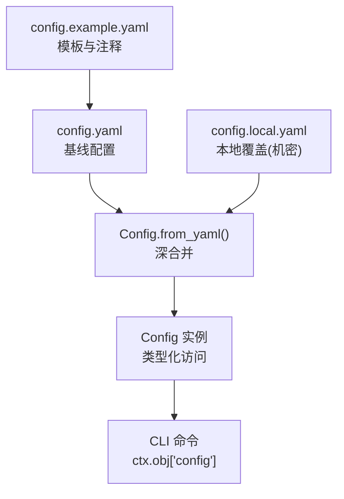
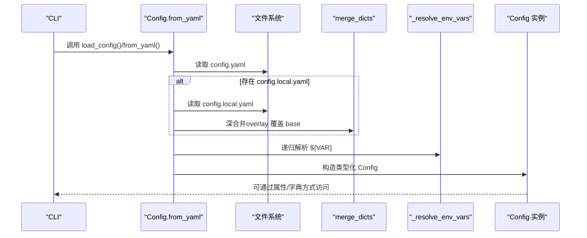
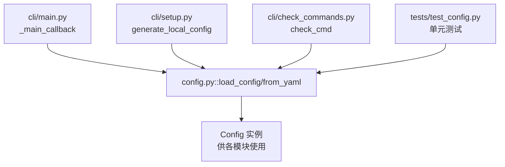

# 配置覆盖与继承

<cite>
**本文引用的文件列表**
- [config.yaml](file://config.yaml)
- [config.example.yaml](file://config.example.yaml)
- [src/drbrain/config.py](file://src/drbrain/config.py)
- [docs/configuration.md](file://docs/configuration.md)
- [src/drbrain/cli/main.py](file://src/drbrain/cli/main.py)
- [src/drbrain/cli/setup.py](file://src/drbrain/cli/setup.py)
- [src/drbrain/cli/check_commands.py](file://src/drbrain/cli/check_commands.py)
- [tests/test_config.py](file://tests/test_config.py)
</cite>

## 目录
1. [简介](#简介)
2. [项目结构与配置文件定位](#项目结构与配置文件定位)
3. [核心组件：配置加载与类型化数据类](#核心组件配置加载与类型化数据类)
4. [架构总览：配置来源与合并流程](#架构总览配置来源与合并流程)
5. [详细组件解析：覆盖与继承规则](#详细组件解析覆盖与继承规则)
6. [依赖关系分析：配置在系统中的使用点](#依赖关系分析配置在系统中的使用点)
7. [性能与可靠性考量](#性能与可靠性考量)
8. [故障排查指南：常见冲突与修复](#故障排查指南常见冲突与修复)
9. [结论](#结论)
10. [附录：最佳实践与迁移建议](#附录最佳实践与迁移建议)

## 简介
本文件系统性阐述 DrBrain 的配置覆盖与继承机制，聚焦以下关键目标：
- 明确 config.yaml 与 config.local.yaml 的关系与覆盖规则
- 记录配置继承的优先级顺序与合并策略
- 说明默认值处理与可选覆盖机制
- 提供覆盖的实际应用场景与使用示例
- 解释配置冲突的检测与解决方法
- 给出配置版本管理与迁移的最佳实践

## 项目结构与配置文件定位
- 基础模板：config.example.yaml，提供所有可用配置项的完整模板与注释说明
- 基线配置：config.yaml，纳入版本控制，定义默认值与基础行为
- 本地覆盖：config.local.yaml，存放机密与本地定制，不纳入版本控制
- 类型化加载器：src/drbrain/config.py，负责从 YAML 加载、深合并、环境变量解析，并输出类型化配置对象
- 文档参考：docs/configuration.md，给出配置项的默认值、范围与用途
- CLI 使用：CLI 在启动时加载配置，贯穿各命令执行

图表来源
- [config.example.yaml](file://config.example.yaml)
- [config.yaml](file://config.yaml)
- [src/drbrain/config.py](file://src/drbrain/config.py)
- [src/drbrain/cli/main.py](file://src/drbrain/cli/main.py)

章节来源
- [config.yaml](file://config.yaml)
- [config.example.yaml](file://config.example.yaml)
- [docs/configuration.md](file://docs/configuration.md)

## 核心组件：配置加载与类型化数据类
- Config.from_yaml：按顺序读取 config.yaml，若存在 config.local.yaml 则进行深合并；随后对字符串中的 ${VAR} 进行环境变量解析；最后构造类型化的子配置对象（如 LLMConfig、ApiConfig、DirsConfig 等）。
- merge_dicts：实现“覆盖优先”的深合并，字典键以覆盖为主，其他键保留。
- 环境变量解析：递归扫描字符串，使用正则匹配 ${VAR} 并替换为环境变量值，未设置的变量替换为空字符串。
- 类型化数据类：每个配置段对应一个 dataclass，提供默认值与属性/字典式访问兼容。

章节来源
- [src/drbrain/config.py](file://src/drbrain/config.py)
- [tests/test_config.py](file://tests/test_config.py)

## 架构总览：配置来源与合并流程
DrBrain 的配置加载遵循“三源合并”原则，优先级自低到高如下：
1) config.yaml（基线模板，含默认值与注释）
2) config.local.yaml（本地覆盖，机密与定制）
3) 环境变量（字符串中的 ${VAR} 占位符）

图表来源
- [src/drbrain/config.py](file://src/drbrain/config.py)
- [src/drbrain/cli/main.py](file://src/drbrain/cli/main.py)

章节来源
- [docs/configuration.md](file://docs/configuration.md)
- [src/drbrain/config.py](file://src/drbrain/config.py)

## 详细组件解析：覆盖与继承规则

### 优先级与合并策略
- 优先级顺序：config.yaml（基线）< config.local.yaml（覆盖）< 环境变量（最终解析）
- 合并策略：对字典采用“深合并”，同名键以覆盖为主；非字典键直接覆盖；新增顶层键保留
- 默认值：若某段缺失或为空，使用对应 dataclass 的默认值；未显式声明的键不会被注入
- 环境变量解析：仅对字符串中的 ${VAR} 进行替换，未知变量替换为空字符串

章节来源
- [src/drbrain/config.py](file://src/drbrain/config.py)
- [tests/test_config.py](file://tests/test_config.py)

### 关键配置段与默认值
- LLM 模型：支持多模型链路，首个为首选，后续作为回退；可通过 config.local.yaml 覆盖 provider、model、api_key、base_url 等
- MinerU：token、model、is_ocr、enable_formula、enable_table、max_pages 等
- 数据库：db.path
- 目录：dirs.inbox、pending、papers、reports、cache、logs
- 外部 API：api.deepxiv_token、s2_rate_limit、s2_api_key、cache_ttl、crossref_email、openalex_token
- 搜索：bm25.k1、b
- 抽取并发：extract.max_concurrent
- 队列阈值：queue.weak_threshold、auto_accept
- 抓取：fetch.max_concurrent、timeout_per_fetch、user_agent、fallback_order、unpaywall_email、institutional_proxy、proxy_type
- 嵌入：embed.provider、model、device、top_k、source、hf_endpoint、api_base、api_key、batch_size
- 备份：backup.ssh_bin、rsync_bin、targets.<name>.*

章节来源
- [config.yaml](file://config.yaml)
- [config.example.yaml](file://config.example.yaml)
- [docs/configuration.md](file://docs/configuration.md)
- [src/drbrain/config.py](file://src/drbrain/config.py)

### 实际应用场景与使用示例
- 示例一：切换 LLM 提供商与模型
  - 在 config.local.yaml 中将 llm.models 的第一个元素替换为新的 provider/model，并设置 api_key/base_url
  - 通过 drbrain setup 交互生成或手动编辑 config.local.yaml
- 示例二：启用外部 API 令牌
  - 在 config.local.yaml 中设置 api.s2_api_key、api.openalex_token、api.crossref_email 等
- 示例三：调整嵌入参数
  - 将 embed.provider 设为 openai-compat 并填写 api_base/api_key/model
  - 或设为 local 并指定 model/device
- 示例四：覆盖目录路径
  - 在 config.local.yaml 中重写 dirs.* 字段，使数据落盘到自定义位置
- 示例五：环境变量占位符
  - 在 config.yaml 中使用 ${ENV_VAR}，在运行环境中设置对应变量，实现“无文件泄露”的机密注入

章节来源
- [src/drbrain/cli/setup.py](file://src/drbrain/cli/setup.py)
- [src/drbrain/cli/check_commands.py](file://src/drbrain/cli/check_commands.py)
- [config.yaml](file://config.yaml)
- [config.example.yaml](file://config.example.yaml)

### 冲突检测与解决
- 冲突类型
  - 键重复：同名顶层键在 overlay 中出现，将完全覆盖 base 对应键
  - 字段缺失：overlay 缺失某段，使用 base 的默认值；若 base 也缺失，则使用 dataclass 默认值
  - 环境变量未设置：${VAR} 未在环境中定义时，替换为空字符串
- 检测手段
  - drbrain check 命令会检查配置文件是否存在、关键令牌是否已配置、嵌入提供者与依赖是否满足等
  - 测试用例覆盖了深合并、环境变量解析、部分配置加载等场景
- 解决建议
  - 明确覆盖意图：仅在 config.local.yaml 中放置机密与本地差异
  - 使用 drbrain setup 生成 config.local.yaml，避免手写错误
  - 对于字符串占位符，确保环境变量已正确导出
  - 若出现意外覆盖，回退到 config.yaml 或删除 config.local.yaml 中的冗余键

章节来源
- [src/drbrain/cli/check_commands.py](file://src/drbrain/cli/check_commands.py)
- [tests/test_config.py](file://tests/test_config.py)
- [src/drbrain/config.py](file://src/drbrain/config.py)

## 依赖关系分析：配置在系统中的使用点
- CLI 启动：_main_callback 在每次命令前加载配置并注入上下文
- 设置向导：setup_cmd 生成 config.local.yaml，初始化目录并验证环境
- 检查命令：check_cmd 展示配置状态、令牌与依赖检查结果
- 测试：test_config.py 验证 from_yaml、merge_dicts、环境变量解析、默认值等

图表来源
- [src/drbrain/cli/main.py](file://src/drbrain/cli/main.py)
- [src/drbrain/cli/setup.py](file://src/drbrain/cli/setup.py)
- [src/drbrain/cli/check_commands.py](file://src/drbrain/cli/check_commands.py)
- [src/drbrain/config.py](file://src/drbrain/config.py)
- [tests/test_config.py](file://tests/test_config.py)

章节来源
- [src/drbrain/cli/main.py](file://src/drbrain/cli/main.py)
- [src/drbrain/cli/setup.py](file://src/drbrain/cli/setup.py)
- [src/drbrain/cli/check_commands.py](file://src/drbrain/cli/check_commands.py)
- [tests/test_config.py](file://tests/test_config.py)

## 性能与可靠性考量
- 深合并复杂度：merge_dicts 为 O(N+M)（N、M 为两份配置的键数），通常开销极小
- 环境变量解析：递归遍历字符串，复杂度与字符串长度成正比；建议避免在大文本中滥用占位符
- 默认值与空配置：未提供配置段时，使用 dataclass 默认值，避免运行期分支判断
- 容错策略：未知环境变量替换为空字符串，便于快速失败与显式提示

章节来源
- [src/drbrain/config.py](file://src/drbrain/config.py)

## 故障排查指南：常见冲突与修复
- 症状：某些令牌显示为 ${VAR} 未解析
  - 排查：确认环境变量是否已导出；drbrain check 会提示未配置的令牌
  - 修复：在运行环境中设置对应变量，或在 config.local.yaml 中直接填写
- 症状：配置未生效或被意外覆盖
  - 排查：确认 config.local.yaml 是否存在；检查键名拼写；确认是否被上层键覆盖
  - 修复：仅在 config.local.yaml 中放置必要差异；必要时删除 overlay 键恢复默认
- 症状：嵌入提供者不可用
  - 排查：drbrain check 会提示 sentence-transformers 依赖缺失或 API 基础地址/密钥未配置
  - 修复：安装依赖或在 config.local.yaml 中补齐 openai-compat 所需字段

章节来源
- [src/drbrain/cli/check_commands.py](file://src/drbrain/cli/check_commands.py)
- [src/drbrain/config.py](file://src/drbrain/config.py)

## 结论
DrBrain 的配置体系以“模板 + 基线 + 覆盖 + 环境变量”为核心，通过类型化数据类与深合并实现清晰、可控且可扩展的配置管理。遵循“最小覆盖、明确优先级、严格默认”的原则，可有效降低配置冲突风险并提升可维护性。

## 附录：最佳实践与迁移建议
- 最佳实践
  - 将机密与本地差异放入 config.local.yaml，保持 config.yaml 清晰稳定
  - 使用 drbrain setup 自动生成 config.local.yaml，减少手写错误
  - 对字符串使用 ${ENV_VAR} 占位符，避免硬编码机密
  - 通过 drbrain check 定期校验配置与依赖
- 版本管理与迁移
  - 新增配置项：先在 config.example.yaml 中添加注释与示例，再在 config.yaml 中设置默认值
  - 迁移策略：在 config.local.yaml 中逐步引入新键，避免一次性大改
  - 回滚策略：若 overlay 引发问题，临时删除 config.local.yaml 或注释相关键
- 运维建议
  - CI/CD 中导出必要的环境变量，避免在仓库中存储机密
  - 对生产环境使用独立的 config.local.yaml，并限制其权限

章节来源
- [config.example.yaml](file://config.example.yaml)
- [config.yaml](file://config.yaml)
- [docs/configuration.md](file://docs/configuration.md)
- [src/drbrain/cli/setup.py](file://src/drbrain/cli/setup.py)
- [src/drbrain/cli/check_commands.py](file://src/drbrain/cli/check_commands.py)