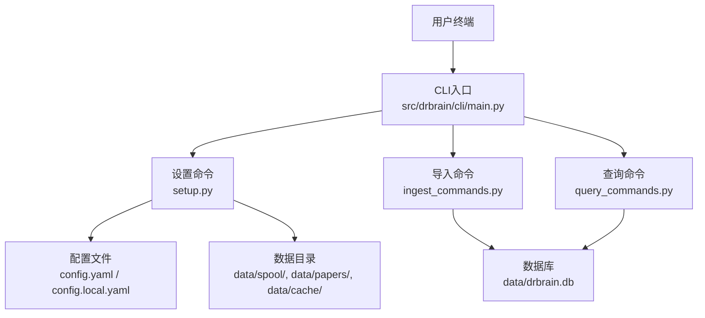
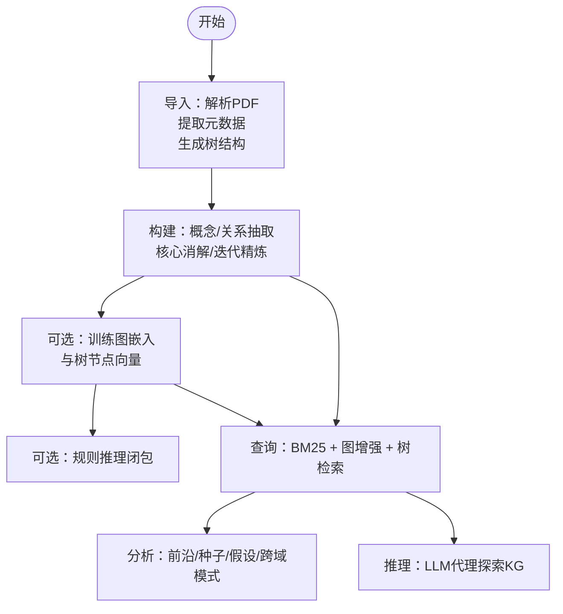
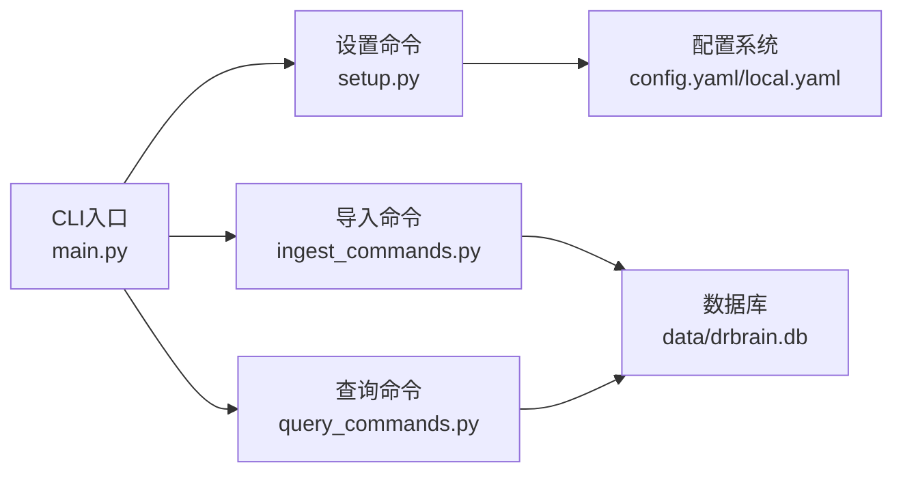

# 快速开始指南

<cite>
**本文档引用的文件**
- [README.md](file://README.md)
- [docs/getting-started.md](file://docs/getting-started.md)
- [docs/configuration.md](file://docs/configuration.md)
- [docs/cli-reference.md](file://docs/cli-reference.md)
- [docs/troubleshooting.md](file://docs/troubleshooting.md)
- [docs/embedding.md](file://docs/embedding.md)
- [docs/architecture.md](file://docs/architecture.md)
- [config.example.yaml](file://config.example.yaml)
- [config.yaml](file://config.yaml)
- [scripts/setup.sh](file://scripts/setup.sh)
- [pyproject.toml](file://pyproject.toml)
- [src/drbrain/cli/main.py](file://src/drbrain/cli/main.py)
- [src/drbrain/cli/setup.py](file://src/drbrain/cli/setup.py)
- [src/drbrain/cli/ingest_commands.py](file://src/drbrain/cli/ingest_commands.py)
- [src/drbrain/cli/query_commands.py](file://src/drbrain/cli/query_commands.py)
</cite>

## 目录
1. [简介](#简介)
2. [项目结构](#项目结构)
3. [核心组件](#核心组件)
4. [架构总览](#架构总览)
5. [详细组件分析](#详细组件分析)
6. [依赖关系分析](#依赖关系分析)
7. [性能考虑](#性能考虑)
8. [故障排除指南](#故障排除指南)
9. [结论](#结论)
10. [附录](#附录)

## 简介
本指南面向首次使用 DrBrain 的用户，帮助你在最短时间内完成安装、配置与首次论文导入及查询。你将学习到：
- 环境准备与依赖安装
- 配置生成与验证
- 基本命令使用（导入、构建、检索、分析）
- 常见问题的排查与修复
- 初始配置的最佳实践

## 项目结构
DrBrain 是一个基于 CLI 的学术知识图谱系统，采用“符号驱动 + 轻量向量”的设计，核心数据存储在 SQLite 数据库中，所有功能通过命令行工具 drbrain 提供。

图表来源
- [src/drbrain/cli/main.py:77-150](file://src/drbrain/cli/main.py#L77-L150)
- [src/drbrain/cli/setup.py:207-588](file://src/drbrain/cli/setup.py#L207-L588)
- [src/drbrain/cli/ingest_commands.py:26-111](file://src/drbrain/cli/ingest_commands.py#L26-L111)
- [src/drbrain/cli/query_commands.py:49-178](file://src/drbrain/cli/query_commands.py#L49-L178)

章节来源
- [README.md:24-41](file://README.md#L24-L41)
- [docs/getting-started.md:1-253](file://docs/getting-started.md#L1-L253)

## 核心组件
- CLI 入口：集中注册所有命令，加载配置并初始化日志。
- 设置命令：交互式生成配置、创建数据目录、校验环境。
- 导入命令：解析 PDF、提取元数据、构建树状结构。
- 查询命令：基于 BM25、图增强与树检索的多层搜索。
- 配置系统：三段式配置合并（模板、本地覆盖、环境变量）。

章节来源
- [src/drbrain/cli/main.py:77-150](file://src/drbrain/cli/main.py#L77-L150)
- [src/drbrain/cli/setup.py:207-588](file://src/drbrain/cli/setup.py#L207-L588)
- [docs/configuration.md:5-18](file://docs/configuration.md#L5-L18)

## 架构总览
DrBrain 的处理流程分为两个阶段：
- 阶段一：轻量导入（解析 PDF、交叉验证元数据、生成树结构）
- 阶段二：结构化抽取（概念与关系抽取、推理闭包、可选嵌入训练）

图表来源
- [docs/architecture.md:11-72](file://docs/architecture.md#L11-L72)
- [docs/getting-started.md:88-216](file://docs/getting-started.md#L88-L216)

章节来源
- [docs/architecture.md:11-72](file://docs/architecture.md#L11-L72)
- [docs/getting-started.md:88-216](file://docs/getting-started.md#L88-L216)

## 详细组件分析

### 安装与环境准备
- 推荐使用 uv 进行依赖同步与可执行安装，或直接从源码安装。
- 安装后运行 drbrain setup，按提示生成配置与数据目录；也可使用 --quick 跳过交互。
- 若使用 MinerU 解析 PDF，建议先安装其 CLI 工具以获得更高质量的解析结果。

章节来源
- [README.md:24-41](file://README.md#L24-L41)
- [docs/getting-started.md:9-61](file://docs/getting-started.md#L9-L61)
- [scripts/setup.sh:1-24](file://scripts/setup.sh#L1-L24)
- [pyproject.toml:69-71](file://pyproject.toml#L69-L71)

### 配置生成与验证
- drbrain setup 会生成 config.local.yaml（包含密钥），并检查 Python 包、外部工具与数据目录状态。
- 可通过 drbrain check 对环境进行诊断（包版本、外部工具、API 连通性）。
- 配置优先级：config.local.yaml > config.yaml > 环境变量（${VAR} 占位符）。

章节来源
- [docs/getting-started.md:72-86](file://docs/getting-started.md#L72-L86)
- [docs/configuration.md:5-18](file://docs/configuration.md#L5-L18)
- [src/drbrain/cli/setup.py:119-188](file://src/drbrain/cli/setup.py#L119-L188)

### 首次论文导入与构建
- 将 PDF 放入 data/spool/inbox/，运行 drbrain ingest 批量导入。
- 运行 drbrain build 完成概念与关系抽取；可使用 --skip-refine 跳过迭代精炼以节省成本。
- 可选：drbrain embed 训练图嵌入与树节点向量；drbrain closure 进行符号/混合推理闭包。

章节来源
- [docs/getting-started.md:88-165](file://docs/getting-started.md#L88-L165)
- [src/drbrain/cli/ingest_commands.py:26-111](file://src/drbrain/cli/ingest_commands.py#L26-L111)

### 检索与分析
- 使用 drbrain query 进行关键词检索，支持图增强（邻居扩展、PageRank 加权）、按类型过滤、年份筛选、单篇树检索等。
- 使用 drbrain analyze 生成知识前沿报告，结合研究种子、因果链、假设与跨域模式。
- 使用 drbrain reason 启动 LLM 代理，借助工具（搜索概念、邻域、路径）进行双向推理。

章节来源
- [docs/getting-started.md:166-216](file://docs/getting-started.md#L166-L216)
- [docs/cli-reference.md:149-224](file://docs/cli-reference.md#L149-L224)
- [docs/cli-reference.md:485-512](file://docs/cli-reference.md#L485-L512)
- [docs/cli-reference.md:552-565](file://docs/cli-reference.md#L552-L565)

### 常用命令清单（首次使用推荐）
- 初始化：drbrain setup 或 drbrain setup --quick
- 导入：drbrain ingest 或 drbrain ingest data/spool/inbox/*.pdf
- 构建：drbrain build 或 drbrain build --skip-refine
- 检索：drbrain query "关键词"
- 分析：drbrain analyze --workspace <工作区> --full
- 推理：drbrain reason "问题描述"

章节来源
- [docs/getting-started.md:88-216](file://docs/getting-started.md#L88-L216)
- [docs/cli-reference.md:7-30](file://docs/cli-reference.md#L7-L30)

## 依赖关系分析
DrBrain 的命令通过 CLI 入口统一注册，并在每个命令执行前加载配置与初始化日志。设置命令负责生成配置与数据目录，导入与查询命令分别对接数据库与服务模块。

图表来源
- [src/drbrain/cli/main.py:77-150](file://src/drbrain/cli/main.py#L77-L150)
- [src/drbrain/cli/setup.py:207-588](file://src/drbrain/cli/setup.py#L207-L588)
- [src/drbrain/cli/ingest_commands.py:26-111](file://src/drbrain/cli/ingest_commands.py#L26-L111)
- [src/drbrain/cli/query_commands.py:49-178](file://src/drbrain/cli/query_commands.py#L49-L178)

章节来源
- [src/drbrain/cli/main.py:77-150](file://src/drbrain/cli/main.py#L77-L150)
- [pyproject.toml:32-51](file://pyproject.toml#L32-L51)

## 性能考虑
- 并发与吞吐：实体抽取阶段默认并发度较高，可根据硬件与 API 限额调整。
- 向量嵌入：仅对语义完整的树节点生成向量，避免任意分块带来的噪声；GPU 下自动批大小自适应，OOM 时可降级至 CPU。
- 搜索策略：BM25 作为基础检索，图增强与树检索可显著提升相关性与定位精度。

章节来源
- [docs/architecture.md:188-210](file://docs/architecture.md#L188-L210)
- [docs/embedding.md:172-188](file://docs/embedding.md#L172-L188)

## 故障排除指南
- 命令不可用：确认已执行可编辑安装并检查 CLI 入口是否可用。
- 配置缺失：复制示例配置并运行 drbrain setup --quick。
- PDF 解析失败：MinerU 不可达时自动回退至 PyMuPDF；若解析为空，检查日志并考虑启用 OCR。
- LLM API 失败：使用 drbrain check 检查连通性，核对 API 密钥与网络访问，必要时增加超时或降低并发。
- 嵌入模型下载卡住：根据所在地区选择合适的下载源，或切换到 CPU 设备。
- 数据库锁定：SQLite WAL 模式通常不会出现锁冲突；如遇异常，检查进程与 WAL 文件状态。
- 日志定位：应用日志位于 data/logs/drbrain.log，可通过 LOGURU_LEVEL=DEBUG 提升日志级别。

章节来源
- [docs/troubleshooting.md:5-198](file://docs/troubleshooting.md#L5-L198)
- [docs/getting-started.md:217-222](file://docs/getting-started.md#L217-L222)

## 结论
通过本指南，你已经完成了 DrBrain 的安装、配置与首次论文导入与查询。建议后续逐步尝试嵌入训练、推理闭包与分析功能，以充分发挥系统的符号驱动与轻量向量检索能力。遇到问题时，优先使用 drbrain check 与日志定位，并参考故障排除章节。

## 附录

### 初始配置最佳实践
- 使用 drbrain setup 生成 config.local.yaml，妥善保存密钥。
- 在 config.yaml 中保留通用模板，在 config.local.yaml 中覆盖敏感项与本地路径。
- 通过环境变量占位符（${VAR}）集中管理密钥，避免硬编码。
- 首次运行建议启用 MinerU 并配置合适的 API 密钥，以提升解析质量。

章节来源
- [docs/configuration.md:5-18](file://docs/configuration.md#L5-L18)
- [config.example.yaml:1-8](file://config.example.yaml#L1-L8)
- [config.yaml:1-72](file://config.yaml#L1-L72)

### 常用命令参考（首次使用）
- drbrain setup --quick：快速生成配置与数据目录
- drbrain ingest：导入 inbox 中的 PDF
- drbrain build --skip-refine：抽取概念与关系
- drbrain query "关键词" --hybrid：图增强检索
- drbrain analyze --workspace <工作区> --full：知识前沿分析
- drbrain reason "问题"：LLM 代理探索

章节来源
- [docs/cli-reference.md:7-30](file://docs/cli-reference.md#L7-L30)
- [docs/cli-reference.md:110-145](file://docs/cli-reference.md#L110-L145)
- [docs/cli-reference.md:149-178](file://docs/cli-reference.md#L149-L178)
- [docs/cli-reference.md:485-512](file://docs/cli-reference.md#L485-L512)
- [docs/cli-reference.md:552-565](file://docs/cli-reference.md#L552-L565)