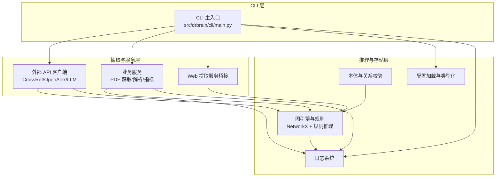
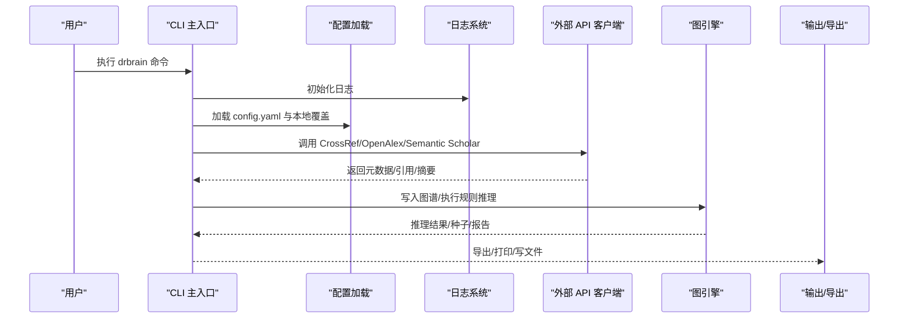
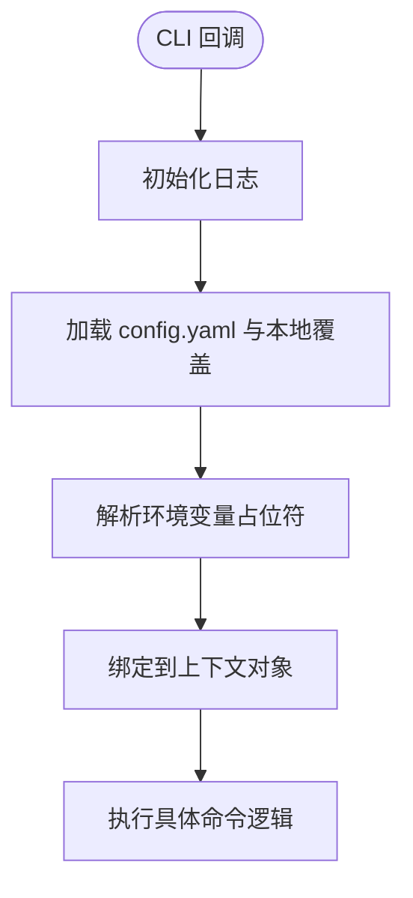
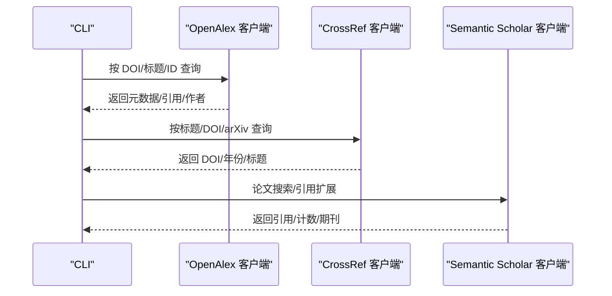
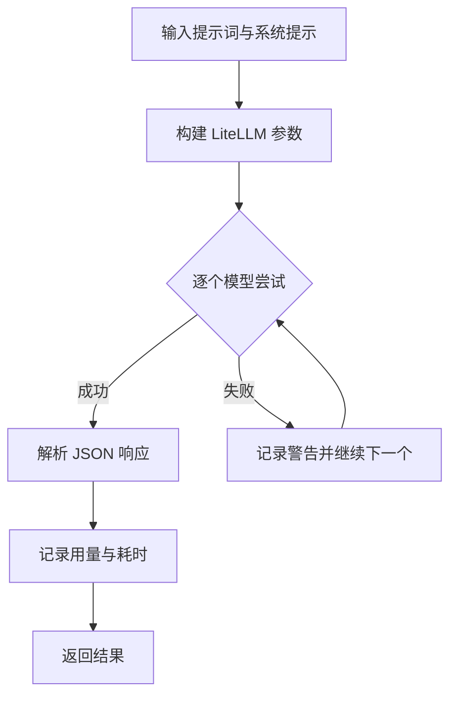
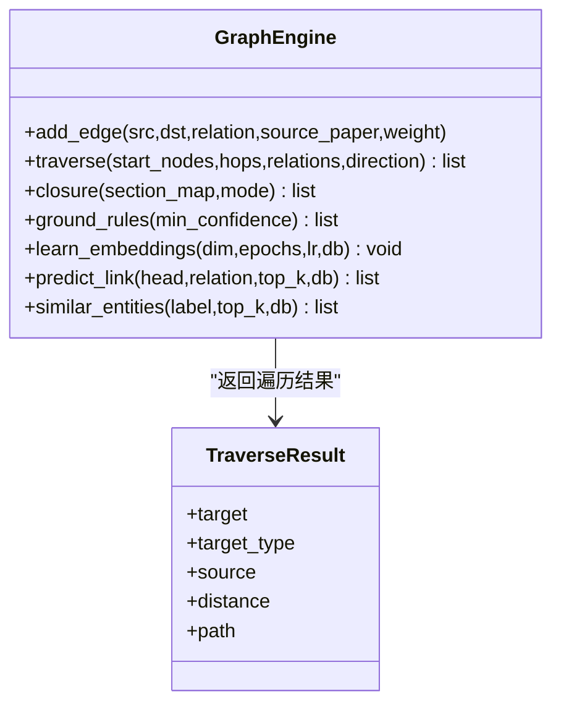
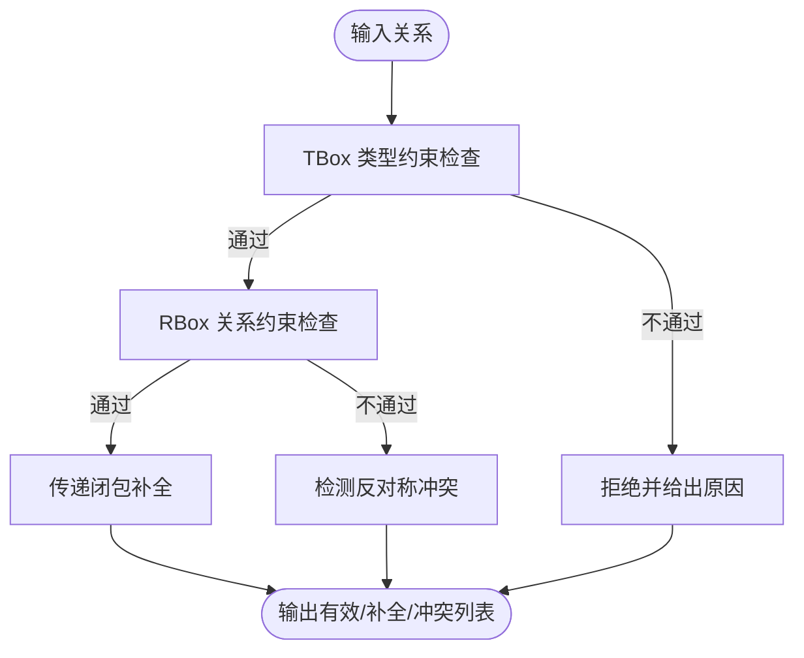
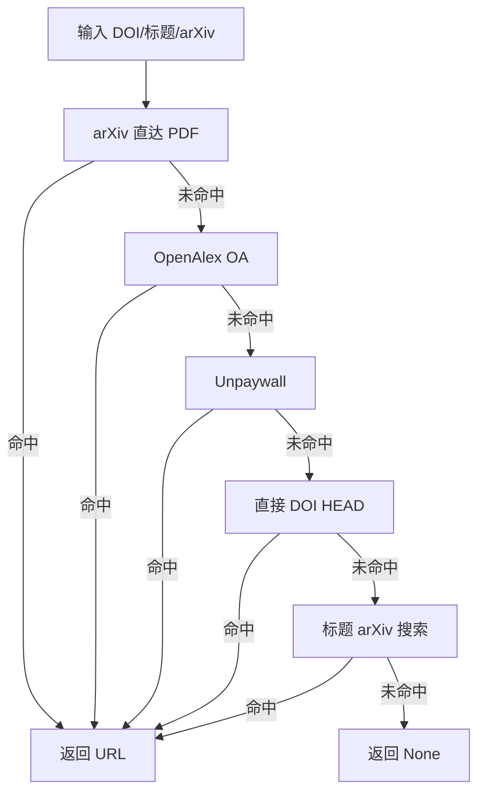
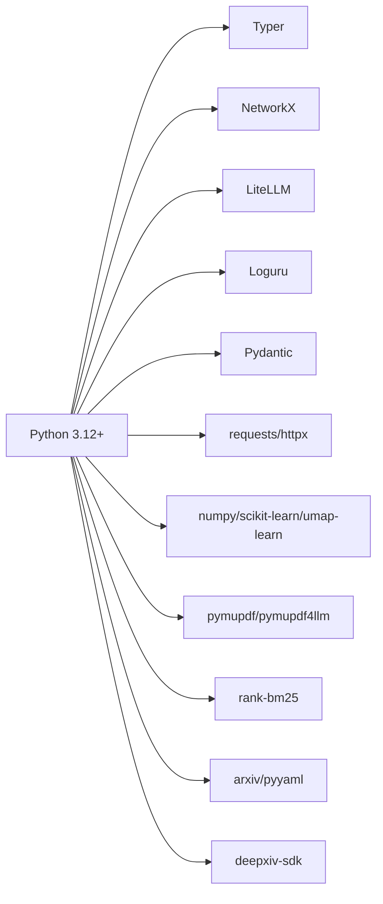

# 技术栈介绍

<cite>
**本文档引用的文件**
- [pyproject.toml](file://pyproject.toml)
- [README.md](file://README.md)
- [config.example.yaml](file://config.example.yaml)
- [src/drbrain/config.py](file://src/drbrain/config.py)
- [src/drbrain/log.py](file://src/drbrain/log.py)
- [src/drbrain/cli/main.py](file://src/drbrain/cli/main.py)
- [src/drbrain/extractor/crossref.py](file://src/drbrain/extractor/crossref.py)
- [src/drbrain/extractor/openalex.py](file://src/drbrain/extractor/openalex.py)
- [src/drbrain/extractor/llm_client.py](file://src/drbrain/extractor/llm_client.py)
- [src/drbrain/validator/schema.py](file://src/drbrain/validator/schema.py)
- [src/drbrain/graph/engine.py](file://src/drbrain/graph/engine.py)
- [src/drbrain/providers/webtools.py](file://src/drbrain/providers/webtools.py)
- [src/drbrain/services/fetch.py](file://src/drbrain/services/fetch.py)
</cite>

## 目录
1. [引言](#引言)
2. [项目结构](#项目结构)
3. [核心组件](#核心组件)
4. [架构总览](#架构总览)
5. [详细组件分析](#详细组件分析)
6. [依赖分析](#依赖分析)
7. [性能考虑](#性能考虑)
8. [故障排除指南](#故障排除指南)
9. [结论](#结论)
10. [附录](#附录)

## 引言
本技术栈介绍面向 DrBrain 项目的开发者与使用者，系统梳理项目采用的核心技术与框架、版本要求、技术选型原因以及在系统中的职责分工。重点覆盖以下方面：
- Python 3.12+ 的语言与生态要求
- Typer 命令行框架与 CLI 架构
- NetworkX 图论库与规则推理
- LiteLLM 统一大语言模型接口
- Loguru 日志体系
- Pydantic 风格的数据验证与配置加载
- 外部 API 集成（CrossRef、OpenAlex、Semantic Scholar）
- 第三方服务支持（MinerU、Web 提取服务）

同时，提供依赖管理建议、常见问题排查与最佳实践，帮助新加入的开发者快速上手并高效扩展。

## 项目结构
DrBrain 采用模块化分层组织，核心目录与职责如下：
- src/drbrain/cli：Typer CLI 入口与命令子系统
- src/drbrain/extractor：外部 API 客户端与抽取器（CrossRef、OpenAlex、LLM 客户端等）
- src/drbrain/graph：基于 NetworkX 的图引擎与规则推理
- src/drbrain/validator：本体与关系约束校验
- src/drbrain/services：业务服务（PDF 获取、解析、指标等）
- src/drbrain/providers：外部服务桥接（如 Web 提取）
- src/drbrain/storage：持久化与路径管理
- 配置与文档：config.example.yaml、README.md、各 docs 子文档

**图表来源**
- [src/drbrain/cli/main.py:1-150](file://src/drbrain/cli/main.py#L1-L150)
- [src/drbrain/extractor/crossref.py:1-180](file://src/drbrain/extractor/crossref.py#L1-L180)
- [src/drbrain/extractor/openalex.py:1-421](file://src/drbrain/extractor/openalex.py#L1-L421)
- [src/drbrain/extractor/llm_client.py:1-154](file://src/drbrain/extractor/llm_client.py#L1-L154)
- [src/drbrain/graph/engine.py:1-800](file://src/drbrain/graph/engine.py#L1-L800)
- [src/drbrain/validator/schema.py:1-211](file://src/drbrain/validator/schema.py#L1-L211)
- [src/drbrain/services/fetch.py:1-345](file://src/drbrain/services/fetch.py#L1-L345)
- [src/drbrain/providers/webtools.py:1-135](file://src/drbrain/providers/webtools.py#L1-L135)
- [src/drbrain/config.py:1-292](file://src/drbrain/config.py#L1-L292)
- [src/drbrain/log.py:1-68](file://src/drbrain/log.py#L1-L68)

**章节来源**
- [README.md:1-112](file://README.md#L1-L112)
- [pyproject.toml:1-104](file://pyproject.toml#L1-L104)

## 核心组件
本节从技术选型与版本要求出发，逐一说明核心组件的作用与在系统中的定位。

- Python 3.12+
  - 版本要求：>=3.12（明确写入项目元数据）
  - 作用：统一运行时、标准库与第三方包兼容性；为高性能计算与并发提供基础
  - 依赖管理：使用 uv 进行同步安装与可复现环境构建

- Typer CLI 框架
  - 作用：提供命令式交互入口，组织 ingest、build、query、export 等子命令
  - 设计：命令回调中统一初始化日志与加载配置，保证全局一致性
  - 位置：CLI 主入口位于 src/drbrain/cli/main.py

- NetworkX 图论库
  - 作用：构建与操作多源异构学术知识图谱，支持规则推理、路径搜索与嵌入学习
  - 设计：以 MultiDiGraph 表示实体与关系，结合规则与嵌入进行闭包与补全
  - 位置：图引擎位于 src/drbrain/graph/engine.py

- LiteLLM 统一大语言模型接口
  - 作用：抽象多种 LLM 提供商（OpenAI、Anthropic、Ollama 等），支持回退链与统一调用
  - 设计：配置驱动的模型列表，按顺序尝试直至成功，自动记录用量与耗时
  - 位置：客户端封装位于 src/drbrain/extractor/llm_client.py

- Loguru 日志记录
  - 作用：零配置、带轮转、stderr 警告输出的日志系统
  - 设计：会话级 ID、格式化输出、控制台与文件双通道
  - 位置：日志初始化与工具函数位于 src/drbrain/log.py

- Pydantic 数据验证与配置加载
  - 作用：通过 dataclass 提供类型化配置，支持 YAML 加载、本地覆盖与环境变量解析
  - 设计：Config.from_yaml 深合并本地覆盖，递归解析 ${VAR} 环境变量
  - 位置：配置定义与加载位于 src/drbrain/config.py

- 外部 API 集成
  - CrossRef：DOI 解析、标题匹配与 arXiv 映射
  - OpenAlex：工作检索、参考文献获取、作者信息提取、批量查询
  - Semantic Scholar：论文搜索与引用扩展（通过 cite 抽取器与解析器）
  - 位置：对应客户端位于 src/drbrain/extractor/ 下

- 第三方服务支持
  - MinerU：高质量 PDF 解析（优先方案），支持公式与表格识别
  - Web 提取服务：qt-web-extractor，用于网页渲染与文本抽取
  - 位置：MinerU 与 Web 提取桥接分别位于解析器与 providers 目录

**章节来源**
- [pyproject.toml:7-51](file://pyproject.toml#L7-L51)
- [src/drbrain/cli/main.py:1-150](file://src/drbrain/cli/main.py#L1-L150)
- [src/drbrain/graph/engine.py:1-800](file://src/drbrain/graph/engine.py#L1-L800)
- [src/drbrain/extractor/llm_client.py:1-154](file://src/drbrain/extractor/llm_client.py#L1-L154)
- [src/drbrain/log.py:1-68](file://src/drbrain/log.py#L1-L68)
- [src/drbrain/config.py:1-292](file://src/drbrain/config.py#L1-L292)
- [src/drbrain/extractor/crossref.py:1-180](file://src/drbrain/extractor/crossref.py#L1-L180)
- [src/drbrain/extractor/openalex.py:1-421](file://src/drbrain/extractor/openalex.py#L1-L421)
- [src/drbrain/providers/webtools.py:1-135](file://src/drbrain/providers/webtools.py#L1-L135)

## 架构总览
下图展示 DrBrain 的端到端处理流程：CLI 启动 → 配置与日志初始化 → 外部 API 与服务调用 → 图构建与规则推理 → 输出与导出。

**图表来源**
- [src/drbrain/cli/main.py:80-92](file://src/drbrain/cli/main.py#L80-L92)
- [src/drbrain/config.py:195-244](file://src/drbrain/config.py#L195-L244)
- [src/drbrain/log.py:32-60](file://src/drbrain/log.py#L32-L60)
- [src/drbrain/extractor/crossref.py:49-84](file://src/drbrain/extractor/crossref.py#L49-L84)
- [src/drbrain/extractor/openalex.py:116-148](file://src/drbrain/extractor/openalex.py#L116-L148)
- [src/drbrain/graph/engine.py:124-315](file://src/drbrain/graph/engine.py#L124-L315)

## 详细组件分析

### CLI 与配置加载
- CLI 主入口集中注册所有命令，并在回调中完成日志初始化与配置加载，确保后续模块可直接读取全局配置与日志句柄
- 配置系统支持：
  - YAML 基础配置与本地覆盖（深合并）
  - 环境变量 ${VAR} 占位符解析
  - 类型化 dataclass 结构，提供 dict-like 兼容访问

**图表来源**
- [src/drbrain/cli/main.py:80-92](file://src/drbrain/cli/main.py#L80-L92)
- [src/drbrain/config.py:195-244](file://src/drbrain/config.py#L195-L244)
- [src/drbrain/log.py:32-60](file://src/drbrain/log.py#L32-L60)

**章节来源**
- [src/drbrain/cli/main.py:1-150](file://src/drbrain/cli/main.py#L1-L150)
- [src/drbrain/config.py:1-292](file://src/drbrain/config.py#L1-L292)
- [src/drbrain/log.py:1-68](file://src/drbrain/log.py#L1-L68)

### 外部 API 客户端（CrossRef/OpenAlex/Semantic Scholar）
- CrossRef：支持按标题、DOI、arXiv ID 查询，内置标题清洗与相似度判断，提升匹配准确率
- OpenAlex：提供工作检索、DOI 解析、参考文献获取、作者信息提取与批量查询，支持抽象文本重建
- Semantic Scholar：论文搜索与引用扩展，配合缓存与重试策略

**图表来源**
- [src/drbrain/extractor/openalex.py:47-148](file://src/drbrain/extractor/openalex.py#L47-L148)
- [src/drbrain/extractor/crossref.py:49-179](file://src/drbrain/extractor/crossref.py#L49-L179)
- [src/drbrain/extractor/citation.py:37-50](file://src/drbrain/extractor/citation.py#L37-L50)

**章节来源**
- [src/drbrain/extractor/openalex.py:1-421](file://src/drbrain/extractor/openalex.py#L1-L421)
- [src/drbrain/extractor/crossref.py:1-180](file://src/drbrain/extractor/crossref.py#L1-L180)

### LLM 客户端与统一接口（LiteLLM）
- 支持多提供商统一调用，按配置顺序尝试，失败自动回退
- 自动记录 token 使用量与耗时，便于成本与性能监控
- 提供同步与异步两种调用方式，满足不同场景

**图表来源**
- [src/drbrain/extractor/llm_client.py:66-89](file://src/drbrain/extractor/llm_client.py#L66-L89)

**章节来源**
- [src/drbrain/extractor/llm_client.py:1-154](file://src/drbrain/extractor/llm_client.py#L1-L154)

### 图引擎与规则推理（NetworkX + 规则）
- 基于 NetworkX 的 MultiDiGraph 存储实体与关系
- 规则推理包括：辩论生成、缺口填补、间接演化、研究网络、传递闭包、路径规则等
- 可选混合模式：结合 TransE 嵌入评分对推断边进行置信度加权

**图表来源**
- [src/drbrain/graph/engine.py:33-122](file://src/drbrain/graph/engine.py#L33-L122)

**章节来源**
- [src/drbrain/graph/engine.py:1-800](file://src/drbrain/graph/engine.py#L1-L800)

### 本体与关系校验（Schema）
- TBox：概念类型与其允许的关系集合
- RBox：关系的语义约束（如不可反身、反对称、传递性）
- 提供三类能力：单边关系校验、传递闭包补全、反对称冲突检测

**图表来源**
- [src/drbrain/validator/schema.py:63-94](file://src/drbrain/validator/schema.py#L63-L94)

**章节来源**
- [src/drbrain/validator/schema.py:1-211](file://src/drbrain/validator/schema.py#L1-L211)

### PDF 获取与下载（多阶段回退）
- 多阶段回退策略：arXiv → OpenAlex OA → Unpaywall → 直接 DOI → 标题 arXiv 搜索
- 支持机构代理（ezproxy/url_prefix）与内容类型校验
- 代理 URL 转换与下载流式写入，确保 PDF 正确性

**图表来源**
- [src/drbrain/services/fetch.py:13-49](file://src/drbrain/services/fetch.py#L13-L49)

**章节来源**
- [src/drbrain/services/fetch.py:1-345](file://src/drbrain/services/fetch.py#L1-L345)

### Web 提取服务桥接
- 通过外部 qt-web-extractor 服务进行网页渲染与内容抽取
- 支持超时控制、错误处理与健康检查
- 返回标准化字段：URL、标题、Markdown 文本、HTML、图片、提取时间戳

**章节来源**
- [src/drbrain/providers/webtools.py:1-135](file://src/drbrain/providers/webtools.py#L1-L135)

## 依赖分析
- 语言与工具链
  - Python >=3.12：统一运行时与生态
  - uv：依赖同步与可复现安装
  - hatchling：构建后端
- 核心运行时依赖
  - Typer：CLI 框架
  - NetworkX：图结构与算法
  - LiteLLM：LLM 统一接口
  - Loguru：日志
  - Pydantic：数据验证与配置
  - requests/httpx：HTTP 客户端
  - rich/scikit-learn/numpy/umap-learn：显示与向量/降维
  - pymupdf/pymupdf4llm：PDF 解析（MinerU 作为首选）
  - rank-bm25：关键词检索
  - arxiv/pyyaml：arXiv API 与 YAML 支持
  - deepxiv-sdk：深度知识图谱 SDK
- 可选办公文档支持
  - python-docx/python-pptx/openpyxl：Office 文件解析

**图表来源**
- [pyproject.toml:32-51](file://pyproject.toml#L32-L51)

**章节来源**
- [pyproject.toml:1-104](file://pyproject.toml#L1-L104)

## 性能考虑
- 并发与限流
  - LLM 抽取并发上限由配置控制，避免资源争用
  - 外部 API 客户端内置重试与退避，降低瞬时失败影响
- 检索与嵌入
  - BM25 与向量检索结合，减少无关结果
  - 嵌入模型设备选择（auto/cpu/cuda）与批大小可调
- 图推理
  - 规则推理与传递闭包在子图上增量执行，降低全图扫描开销
  - 可选 TransE 嵌入评分融合，平衡符号推理与向量相似度

[本节为通用性能讨论，无需特定文件引用]

## 故障排除指南
- 日志定位
  - 使用 Loguru 的会话级 ID 与格式化输出，快速定位命令与异常来源
  - 建议在 data/logs 目录下查看 drbrain.log 与 validation.log
- LLM 调用失败
  - 检查模型列表顺序与可用性，确认 API Key 与 base_url 配置
  - 关注回退链日志，定位具体失败的提供商
- 外部 API 错误
  - CrossRef/OpenAlex/Semantic Scholar 客户端均包含异常捕获与重试
  - 检查邮箱/令牌配置与速率限制
- PDF 获取失败
  - 确认 Unpaywall 邮箱、机构代理配置与网络可达性
  - 使用 HEAD 请求与内容类型校验，避免非 PDF 资源

**章节来源**
- [src/drbrain/log.py:1-68](file://src/drbrain/log.py#L1-L68)
- [src/drbrain/extractor/llm_client.py:66-89](file://src/drbrain/extractor/llm_client.py#L66-L89)
- [src/drbrain/extractor/crossref.py:82-84](file://src/drbrain/extractor/crossref.py#L82-L84)
- [src/drbrain/extractor/openalex.py:146-148](file://src/drbrain/extractor/openalex.py#L146-L148)
- [src/drbrain/services/fetch.py:167-216](file://src/drbrain/services/fetch.py#L167-L216)

## 结论
DrBrain 的技术栈围绕“符号驱动的知识图谱 + 轻量化向量检索”展开，通过 Typer 提供一致的 CLI 体验，以 LiteLLM 统一 LLM 能力，借助 NetworkX 实现规则推理与路径分析，结合 CrossRef、OpenAlex、Semantic Scholar 等外部 API 完成元数据与引用的跨源整合。Loguru 与类型化配置保障了可观测性与可维护性。该组合既满足 AI agent 的自动化需求，也兼顾了学术研究的严谨性与可解释性。

[本节为总结性内容，无需特定文件引用]

## 附录

### 依赖管理与安装建议
- 使用 uv 进行依赖同步与可复现安装
- 建议在虚拟环境中安装，避免系统包冲突
- 首次安装后运行 drbrain setup，按提示填写 API Key 与令牌

**章节来源**
- [README.md:24-36](file://README.md#L24-L36)
- [config.example.yaml:1-145](file://config.example.yaml#L1-L145)

### 配置模板与环境变量
- 将 config.example.yaml 复制为 config.yaml 或通过 drbrain setup 生成 config.local.yaml
- 使用 ${ENV_VAR} 语法从环境变量注入敏感信息
- 常用环境变量：OPENAI_API_KEY、CROSSREF_EMAIL、OPENALEX_TOKEN、DEEPXIV_TOKEN、MINERU_TOKEN 等

**章节来源**
- [config.example.yaml:1-145](file://config.example.yaml#L1-L145)
- [src/drbrain/config.py:283-292](file://src/drbrain/config.py#L283-L292)