# 核心功能特性

<cite>
**本文档引用的文件**
- [README.md](file://README.md)
- [docs/getting-started.md](file://docs/getting-started.md)
- [docs/architecture.md](file://docs/architecture.md)
- [src/drbrain/cli/main.py](file://src/drbrain/cli/main.py)
- [skills/paper-ingest/SKILL.md](file://skills/paper-ingest/SKILL.md)
- [skills/kg-build/SKILL.md](file://skills/kg-build/SKILL.md)
- [skills/paper-query/SKILL.md](file://skills/paper-query/SKILL.md)
- [skills/graph/SKILL.md](file://skills/graph/SKILL.md)
- [skills/kg-reason/SKILL.md](file://skills/kg-reason/SKILL.md)
- [skills/research-analysis/SKILL.md](file://skills/research-analysis/SKILL.md)
- [skills/citation-tracking/SKILL.md](file://skills/citation-tracking/SKILL.md)
- [skills/export/SKILL.md](file://skills/export/SKILL.md)
- [skills/import/SKILL.md](file://skills/import/SKILL.md)
- [src/drbrain/storage/export.py](file://src/drbrain/storage/export.py)
- [src/drbrain/services/zotero_import.py](file://src/drbrain/services/zotero_import.py)
- [src/drbrain/report/analyzer.py](file://src/drbrain/report/analyzer.py)
</cite>

## 目录
1. [简介](#简介)
2. [项目结构](#项目结构)
3. [核心组件](#核心组件)
4. [架构总览](#架构总览)
5. [详细组件分析](#详细组件分析)
6. [依赖关系分析](#依赖关系分析)
7. [性能考量](#性能考量)
8. [故障排查指南](#故障排查指南)
9. [结论](#结论)
10. [附录](#附录)

## 简介
本文件面向使用者与开发者，系统化梳理 DrBrain 的八大核心功能模块：论文导入（Ingest）、知识抽取（Build）、智能检索（Query）、知识图谱（Knowledge Graph）、符号推理（Reasoning）、分析报告（Analyze）、引用管理（Citations）、导出导入（Export/Import）。每个模块均包含功能概述、技术特点、典型使用场景与价值说明，并以表格形式呈现关键信息，帮助快速建立对系统能力的整体认知。

## 项目结构
DrBrain 采用“命令行工具 + 模块化技能”的设计：CLI 聚合各子命令，技能文档定义可被 AI Agent 使用的工作流；核心处理逻辑分布在 storage、services、extractor、graph、query、report 等子模块中。数据层以 SQLite 为核心，配合向量嵌入表实现轻量检索增强。

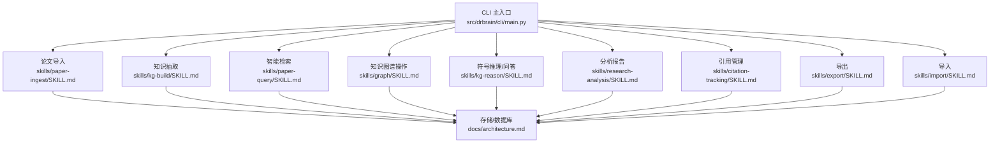

图表来源
- [src/drbrain/cli/main.py:94-142](file://src/drbrain/cli/main.py#L94-L142)
- [docs/architecture.md:212-237](file://docs/architecture.md#L212-L237)

章节来源
- [docs/architecture.md:1-314](file://docs/architecture.md#L1-L314)
- [src/drbrain/cli/main.py:1-150](file://src/drbrain/cli/main.py#L1-L150)

## 核心组件
以下表格从“功能概述、技术特点、使用场景、价值”四个维度，对八大核心模块进行概览式对比，便于快速定位与选型。

| 模块名称 | 功能概述 | 技术特点 | 典型使用场景 | 价值 |
| --- | --- | --- | --- | --- |
| 论文导入（Ingest） | 将 PDF 解析为结构化内容与元数据，完成跨源身份校验与树状结构化 | MinerU/PyMuPDF 解析、5 源元数据交叉验证、LLM 结构化树 | 新增论文到库、批量处理 arXiv 下载、处理扫描版 PDF | 建立可检索的结构化基座，确保后续抽取与检索质量 |
| 知识抽取（Build） | 5 阶段 LLM 管道：本体扩展、实体抽取、关系抽取、共指消解、迭代精炼 | 并发实体抽取（10 叶节点并发）、Typed Concept/Edge、可跳过精炼 | 构建知识图谱、增量更新、训练嵌入、规则闭包 | 形成可解释、可审计的结构化知识，支撑多维检索与推理 |
| 智能检索（Query） | BM25 关键词检索 + 图增强 + PageIndex 树检索（深度阅读） | 多路融合：邻居扩展、PageRank 加权、树节点向量预筛 | 主题检索、类型过滤、年份筛选、按论文深度阅读 | 提升查全与查准，兼顾广度探索与深度回读 |
| 知识图谱（Knowledge Graph） | 类型级 TBox 与关系级 RBox 规则体系，支持 TransE 嵌入与路径规则 | 8+4 推理规则、T-norm 传递闭包、嵌入驱动路径挖掘 | 直接图遍历、最短路径、共享概念分析、复杂查询 | 强化语义连通性，发现隐含关系与知识缺口 |
| 符号推理（Reasoning） | LLM 工具调用 + 双向验证：检索→探索→假设→验证→修订 | 可视化因果链、置信传播、反事实分析、跨域同构检测 | 对比方法优劣、验证假设、追踪因果链条、识别矛盾 | 将检索结果转化为可解释的证据链与研究建议 |
| 分析报告（Analyze） | 统一的知识前沿报告：种子检测、因果链、关键节点、假设生成、跨域同构 | 可选全量模块：反事实、假设、同构；可选 LLM 摘要与子图描述 | 文献综述、研究策略制定、识别新兴/衰落趋势 | 输出可落地的研究机会清单与高层摘要 |
| 引用管理（Citations） | 引文双向追踪、共享参考分析、引文校验（匹配库内论文） | 引文邻域、未链接信号（潜在前沿）、引用验证 | 发现相关工作、校验写作引文、识别平行研究 | 揭示隐藏连接，避免重复劳动，完善学术脉络 |
| 导出导入（Export/Import） | BibTeX/RIS/Markdown 导出；Zotero/BibTeX/Endnote 导入 | 多格式输出、作者名规范化、DOI/页码映射、本地/Web API 导入 | 迁移至外部管理器、生成参考文献、构建阅读清单 | 无缝对接外部工具链，保障元数据完整性 |

章节来源
- [README.md:41-66](file://README.md#L41-L66)
- [docs/getting-started.md:88-252](file://docs/getting-started.md#L88-L252)
- [docs/architecture.md:154-314](file://docs/architecture.md#L154-L314)

## 架构总览
DrBrain 的整体流程由“导入 → 抽取 → 检索/推理 → 报告/导出”构成，强调“知识图谱是真相之源”，向量仅用于检索增强而非知识表示。

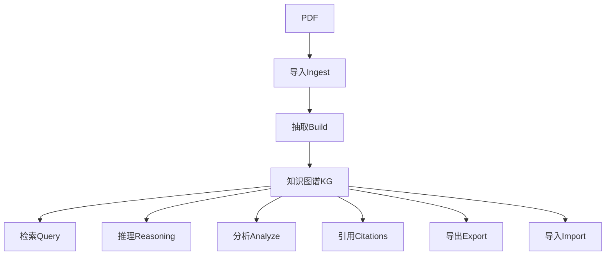

图表来源
- [docs/architecture.md:11-21](file://docs/architecture.md#L11-L21)

章节来源
- [docs/architecture.md:1-314](file://docs/architecture.md#L1-L314)

## 详细组件分析

### 论文导入（Ingest）
- 功能概述
  - 将 PDF 转为 Markdown，进行 5 源元数据交叉验证，再由 LLM 结构化为 PageIndex 树，形成可检索的 section tree.json。
- 技术特点
  - MinerU/PyMuPDF 解析、跨源 ID 校验（arXiv/CrossRef/S2/OpenAlex/DeepXiv）、树结构化、状态机推进（uploaded）。
- 使用场景
  - 批量入库、arXiv 下载处理、失败诊断与重试、与后续抽取/检索流程衔接。
- 价值
  - 为高质量抽取与检索奠定基础，确保元数据与结构一致可靠。

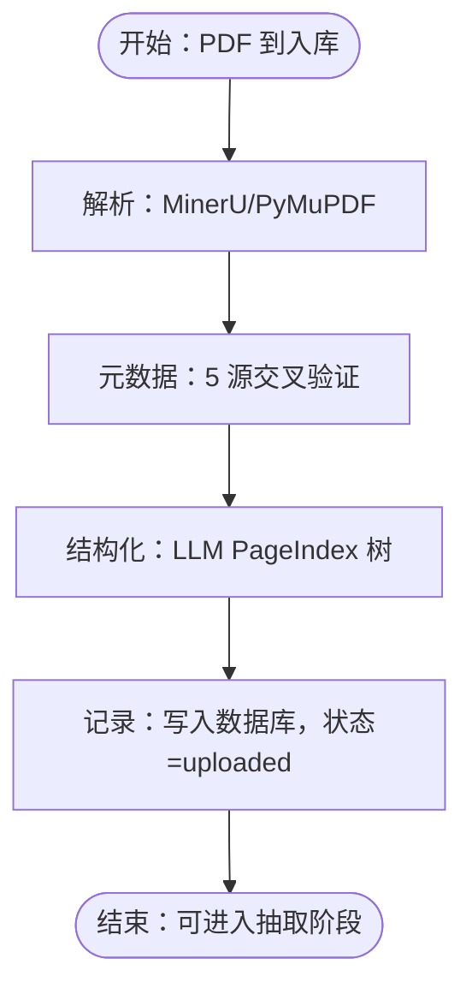

图表来源
- [docs/architecture.md:25-47](file://docs/architecture.md#L25-L47)
- [skills/paper-ingest/SKILL.md:16-44](file://skills/paper-ingest/SKILL.md#L16-L44)

章节来源
- [docs/architecture.md:25-47](file://docs/architecture.md#L25-L47)
- [skills/paper-ingest/SKILL.md:1-98](file://skills/paper-ingest/SKILL.md#L1-L98)

### 知识抽取（Build）
- 功能概述
  - 通过 5 阶段 LLM 管道：本体扩展、实体抽取（并发）、关系抽取、共指消解、迭代精炼，产出 Typed Concept/Edge。
- 技术特点
  - 并发实体抽取（10 叶节点并发）、可跳过精炼、状态机推进（extracted）。
- 使用场景
  - 首次构建、增量更新、训练嵌入、规则闭包。
- 价值
  - 形成可解释、可审计的结构化知识，支撑检索、推理与分析。

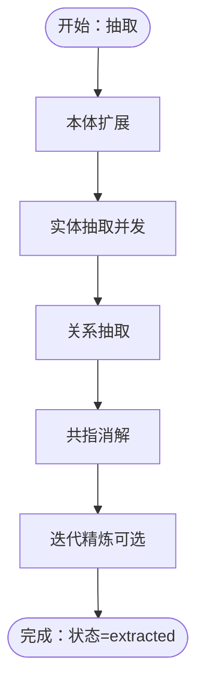

图表来源
- [docs/architecture.md:48-71](file://docs/architecture.md#L48-L71)
- [skills/kg-build/SKILL.md:31-43](file://skills/kg-build/SKILL.md#L31-L43)

章节来源
- [docs/architecture.md:48-71](file://docs/architecture.md#L48-L71)
- [skills/kg-build/SKILL.md:1-139](file://skills/kg-build/SKILL.md#L1-L139)

### 智能检索（Query）
- 功能概述
  - BM25 关键词检索、图增强（邻居扩展/PageRank 加权）、树检索（PageIndex + RAPTOR）。
- 技术特点
  - 过滤器组合（类型/论元/年份/置信度）、邻居扩展、混合排序、树节点向量预筛。
- 使用场景
  - 主题检索、类型/论元过滤、按论文深度阅读、图邻域扩展。
- 价值
  - 平衡广度与深度，提升查全与查准。

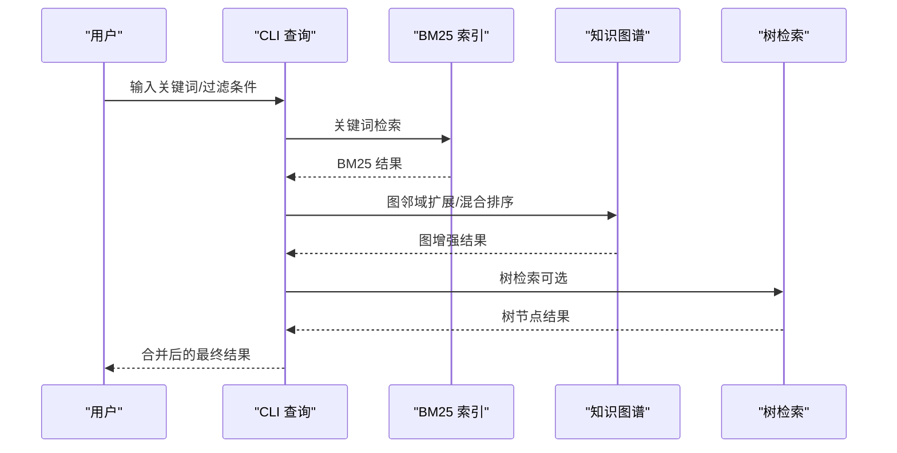

图表来源
- [docs/architecture.md:188-210](file://docs/architecture.md#L188-L210)
- [skills/paper-query/SKILL.md:22-58](file://skills/paper-query/SKILL.md#L22-L58)

章节来源
- [docs/architecture.md:188-210](file://docs/architecture.md#L188-L210)
- [skills/paper-query/SKILL.md:1-96](file://skills/paper-query/SKILL.md#L1-L96)

### 知识图谱（Knowledge Graph）
- 功能概述
  - TBox 类型体系 + RBox 推理规则，支持 TransE 嵌入与路径规则，实现符号推理与嵌入辅助推断。
- 技术特点
  - 8+4 条规则、T-norm 传递闭包、嵌入驱动路径挖掘、复杂查询（交并补）。
- 使用场景
  - 直接图遍历、最短路径、共享概念分析、复杂查询。
- 价值
  - 强化语义连通性，发现隐含关系与知识缺口。

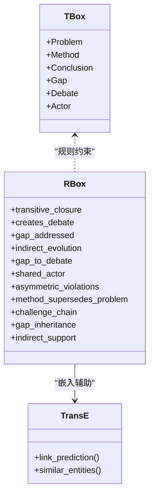

图表来源
- [docs/architecture.md:75-128](file://docs/architecture.md#L75-L128)

章节来源
- [docs/architecture.md:75-128](file://docs/architecture.md#L75-L128)
- [skills/graph/SKILL.md:1-126](file://skills/graph/SKILL.md#L1-L126)

### 符号推理（Reasoning）
- 功能概述
  - LLM 工具调用 + 双向验证：检索→探索→假设→验证→修订，支持因果链、置信传播、反事实分析、跨域同构。
- 技术特点
  - 可视化因果链、置信传播、反事实影响评估、跨域子图相似性。
- 使用场景
  - 方法对比、假设验证、因果链条追踪、矛盾化解。
- 价值
  - 将检索结果转化为可解释的证据链与研究建议。

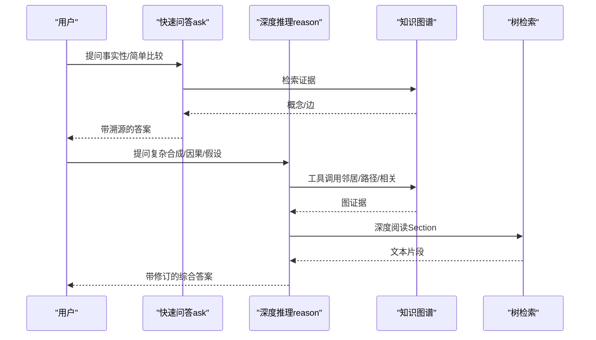

图表来源
- [docs/architecture.md:154-175](file://docs/architecture.md#L154-L175)
- [skills/kg-reason/SKILL.md:31-66](file://skills/kg-reason/SKILL.md#L31-L66)

章节来源
- [docs/architecture.md:154-175](file://docs/architecture.md#L154-L175)
- [skills/kg-reason/SKILL.md:1-105](file://skills/kg-reason/SKILL.md#L1-L105)

### 分析报告（Analyze）
- 功能概述
  - 统一的知识前沿报告：种子检测、因果链、关键节点、假设生成、跨域同构；可选 LLM 摘要与子图描述。
- 技术特点
  - 可选全量模块、跨论文洞察、执行摘要生成、子图自然语言描述。
- 使用场景
  - 文献综述、研究策略制定、识别新兴/衰落趋势。
- 价值
  - 输出可落地的研究机会清单与高层摘要。

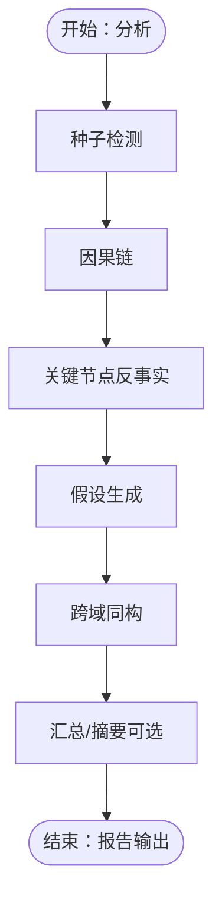

图表来源
- [docs/architecture.md:154-175](file://docs/architecture.md#L154-L175)
- [skills/research-analysis/SKILL.md:22-53](file://skills/research-analysis/SKILL.md#L22-L53)
- [src/drbrain/report/analyzer.py:9-134](file://src/drbrain/report/analyzer.py#L9-L134)

章节来源
- [docs/architecture.md:154-175](file://docs/architecture.md#L154-L175)
- [skills/research-analysis/SKILL.md:1-110](file://skills/research-analysis/SKILL.md#L1-L110)
- [src/drbrain/report/analyzer.py:1-231](file://src/drbrain/report/analyzer.py#L1-L231)

### 引用管理（Citations）
- 功能概述
  - 引文双向追踪、共享参考分析（未链接信号）、引文校验（匹配库内论文）。
- 技术特点
  - 引文邻域、未链接信号（潜在前沿）、引用验证。
- 使用场景
  - 发现相关工作、校验写作引文、识别平行研究。
- 价值
  - 揭示隐藏连接，避免重复劳动，完善学术脉络。

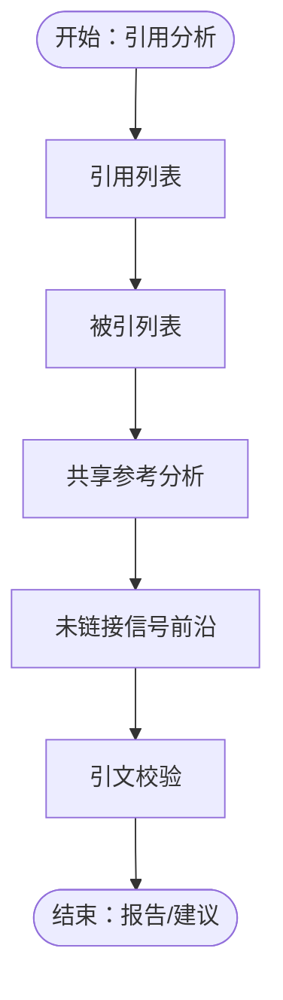

图表来源
- [skills/citation-tracking/SKILL.md:23-46](file://skills/citation-tracking/SKILL.md#L23-L46)
- [docs/architecture.md:154-175](file://docs/architecture.md#L154-L175)

章节来源
- [skills/citation-tracking/SKILL.md:1-88](file://skills/citation-tracking/SKILL.md#L1-L88)
- [docs/architecture.md:154-175](file://docs/architecture.md#L154-L175)

### 导出导入（Export/Import）
- 功能概述
  - 导出：BibTeX/RIS/Markdown；导入：Zotero（本地/Web API）、BibTeX、Endnote（XML/RIS）。
- 技术特点
  - 多格式输出、作者名规范化、DOI/页码映射；本地/远程导入、集合映射、占位记录。
- 使用场景
  - 迁移至外部管理器、生成参考文献、构建阅读清单、合并多个收藏。
- 价值
  - 无缝对接外部工具链，保障元数据完整性。

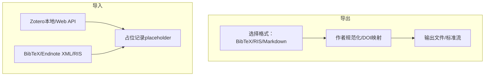

图表来源
- [skills/export/SKILL.md:14-41](file://skills/export/SKILL.md#L14-L41)
- [skills/import/SKILL.md:13-32](file://skills/import/SKILL.md#L13-L32)
- [src/drbrain/storage/export.py:68-179](file://src/drbrain/storage/export.py#L68-L179)
- [src/drbrain/services/zotero_import.py:118-281](file://src/drbrain/services/zotero_import.py#L118-L281)

章节来源
- [skills/export/SKILL.md:1-86](file://skills/export/SKILL.md#L1-L86)
- [skills/import/SKILL.md:1-91](file://skills/import/SKILL.md#L1-L91)
- [src/drbrain/storage/export.py:1-180](file://src/drbrain/storage/export.py#L1-L180)
- [src/drbrain/services/zotero_import.py:1-719](file://src/drbrain/services/zotero_import.py#L1-L719)

## 依赖关系分析
- 命令聚合
  - CLI 将所有子命令统一注册，便于 Agent 调用与自动化编排。
- 数据与服务
  - 存储层以 SQLite 为核心，配合向量表与缓存表，支撑检索与推理。
- 模块耦合
  - 抽取与检索/推理存在强耦合（概念/边），但检索/推理对抽取结果具有弱依赖（可离线运行）。
- 外部集成
  - 支持多种元数据源与第三方工具（Zotero、MinerU、arXiv、OpenAlex 等）。

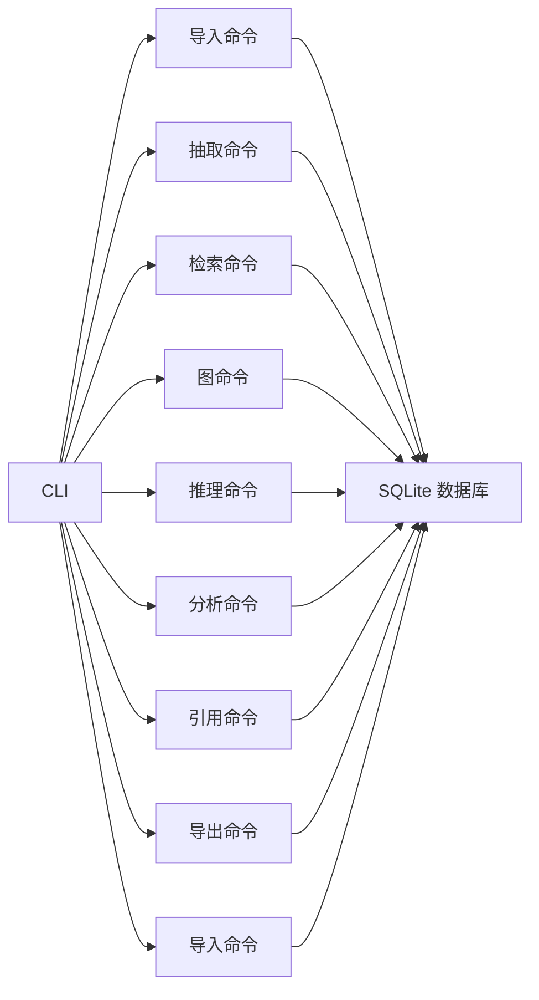

图表来源
- [src/drbrain/cli/main.py:94-142](file://src/drbrain/cli/main.py#L94-L142)
- [docs/architecture.md:212-237](file://docs/architecture.md#L212-L237)

章节来源
- [src/drbrain/cli/main.py:1-150](file://src/drbrain/cli/main.py#L1-L150)
- [docs/architecture.md:212-237](file://docs/architecture.md#L212-L237)

## 性能考量
- 轻量化向量
  - 仅对 PageIndex 节点与 RAPTOR 摘要进行向量嵌入，避免任意文本切片带来的噪声与开销。
- 并发与批处理
  - 实体抽取阶段 10 叶节点并发；翻译与批导出等场景采用并发执行。
- 索引与缓存
  - BM25 索引与 API 缓存减少重复计算；原子写确保崩溃安全。
- 内存与 I/O
  - SQLite WAL 模式支持高并发读写；向量表与树向量表分离存储，降低热路径压力。

章节来源
- [docs/architecture.md:267-298](file://docs/architecture.md#L267-L298)

## 故障排查指南
- 环境检查
  - 使用环境诊断命令检查包、外部工具与 API 连通性。
- 数据质量
  - 审计扫描覆盖元数据、概念完整性、边一致性与图结构；支持 PDF 预校验。
- 失败定位
  - 导入失败会进入待处理目录，查看失败明细；抽取失败通常与模型配置或网络有关。
- 常见问题
  - MinerU 不可用时自动回退到 PyMuPDF；无向量模式下仍可使用 BM25 + LLM 导航。

章节来源
- [docs/getting-started.md:217-222](file://docs/getting-started.md#L217-L222)
- [docs/architecture.md:296-298](file://docs/architecture.md#L296-L298)

## 结论
DrBrain 以“知识图谱是真相之源”为核心理念，结合符号推理与轻量向量检索，提供从论文导入、知识抽取、智能检索、图谱操作、符号推理、分析报告、引用管理到导出导入的完整闭环。其模块化设计与 CLI/技能体系，既满足个人研究者日常使用，也为 AI Agent 自动化工作流提供了坚实基础。

## 附录
- 快速上手流程（端到端）
  - 导入 → 抽取 → 训练树向量（可选）→ 规则闭包（可选）→ 检索/推理/分析/导出/导入
- 相关文档
  - Getting Started、CLI Reference、Configuration、Architecture、Embedding、Troubleshooting、Glossary、Contributing

章节来源
- [docs/getting-started.md:88-252](file://docs/getting-started.md#L88-L252)
- [README.md:68-77](file://README.md#L68-L77)