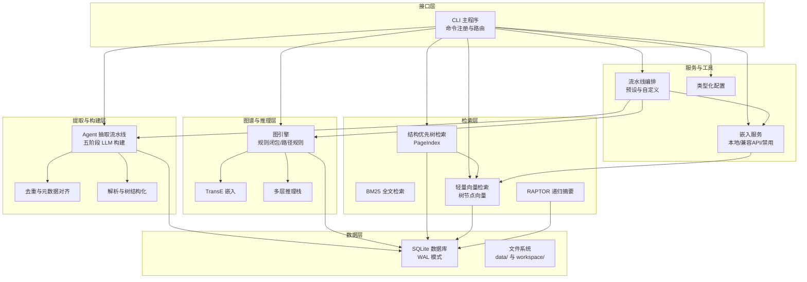
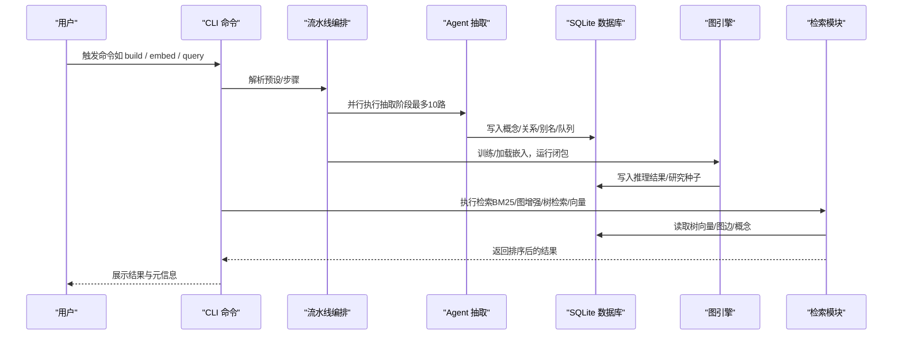
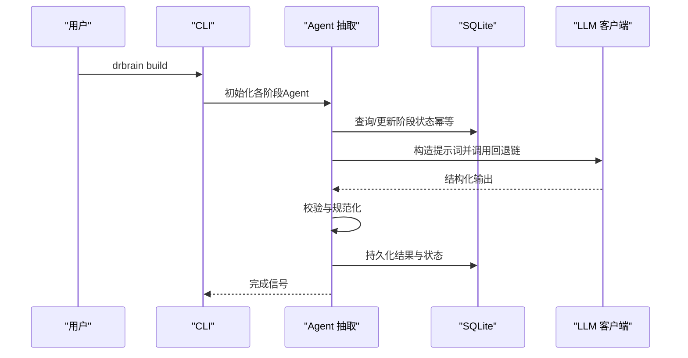
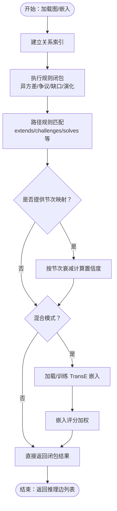
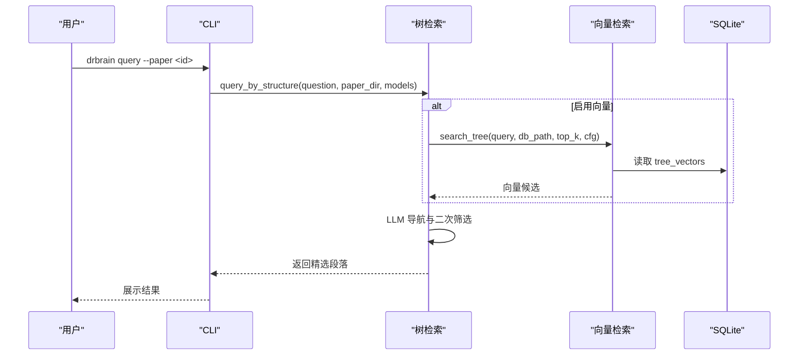
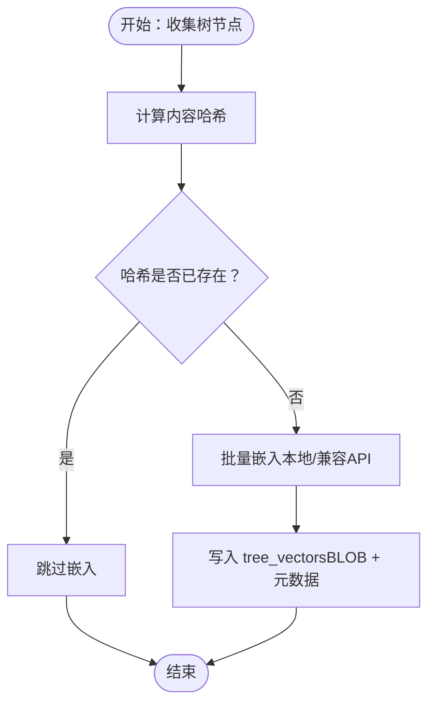
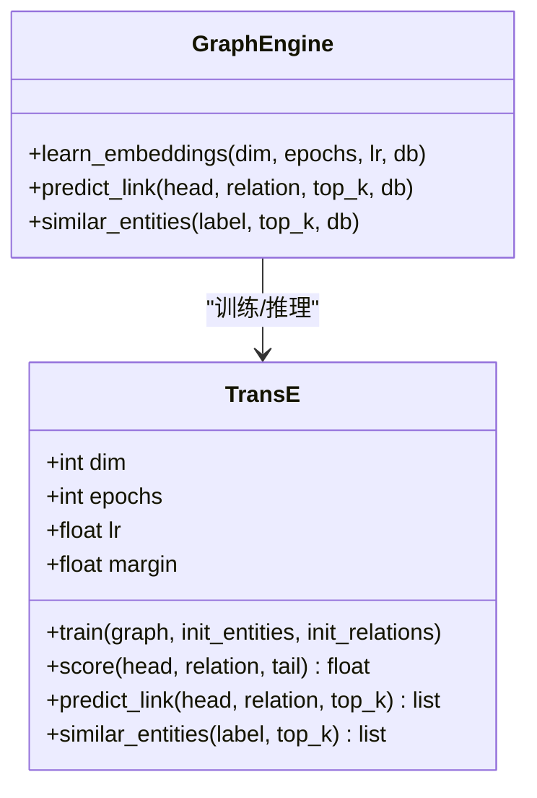
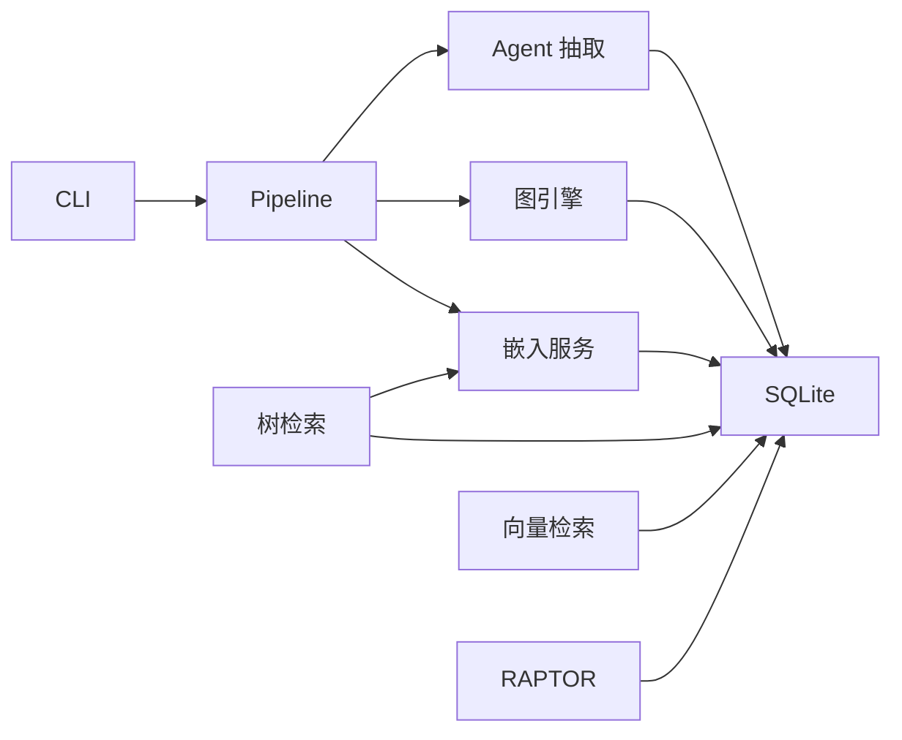

# 系统架构概览

<cite>
**本文档引用的文件**
- [README.md](file://README.md)
- [docs/architecture.md](file://docs/architecture.md)
- [src/drbrain/__init__.py](file://src/drbrain/__init__.py)
- [src/drbrain/config.py](file://src/drbrain/config.py)
- [src/drbrain/cli/main.py](file://src/drbrain/cli/main.py)
- [src/drbrain/extractor/agent.py](file://src/drbrain/extractor/agent.py)
- [src/drbrain/graph/engine.py](file://src/drbrain/graph/engine.py)
- [src/drbrain/query/tree_retrieval.py](file://src/drbrain/query/tree_retrieval.py)
- [src/drbrain/storage/database.py](file://src/drbrain/storage/database.py)
- [src/drbrain/services/pipeline.py](file://src/drbrain/services/pipeline.py)
- [src/drbrain/services/embedding.py](file://src/drbrain/services/embedding.py)
- [src/drbrain/graph/embedding.py](file://src/drbrain/graph/embedding.py)
- [src/drbrain/extractor/confidence_propagation.py](file://src/drbrain/extractor/confidence_propagation.py)
- [src/drbrain/graph/path_reasoning.py](file://src/drbrain/graph/path_reasoning.py)
- [prompts/extract_concepts.txt](file://prompts/extract_concepts.txt)
- [prompts/ontology.txt](file://prompts/ontology.txt)
</cite>

## 目录
1. [引言](#引言)
2. [项目结构](#项目结构)
3. [核心组件](#核心组件)
4. [架构总览](#架构总览)
5. [详细组件分析](#详细组件分析)
6. [依赖关系分析](#依赖关系分析)
7. [性能考量](#性能考量)
8. [故障排查指南](#故障排查指南)
9. [结论](#结论)

## 引言
本系统以“符号驱动 + 轻量化向量”为核心理念，围绕学术论文构建可查询的知识图谱，并通过规则化推理与向量检索相结合的方式，提供从文献解析、知识抽取、图谱构建到智能搜索与发现的完整能力。系统强调“知识图谱是事实来源”，向量仅用于增强检索（语义完整的树节点），不参与推理；在“provider=none”的情况下，系统完全回归BM25与LLM导航。

## 项目结构
DrBrain采用模块化分层设计，主要分为以下层次：
- 命令行入口与子应用：CLI主程序统一调度各类功能命令（导入导出、索引、查询、构建、嵌入、图谱分析等）
- 数据层：SQLite数据库承载所有结构化数据与元数据，支持WAL模式提升并发读写
- 提取与构建层：基于Agent的五阶段抽取流水线，完成本体扩展、实体抽取、关系抽取、共指消解与迭代精炼
- 图谱与推理层：基于NetworkX的图引擎，提供规则闭包、路径规则、TransE嵌入与多层推理栈
- 检索层：结构优先的树检索（PageIndex）与轻量向量检索（仅树节点），支持跨论文折叠检索与RAPTOR递归摘要
- 配置与工具：类型化配置、日志、缓存、批处理与服务封装

**图表来源**
- [src/drbrain/cli/main.py:77-146](file://src/drbrain/cli/main.py#L77-L146)
- [src/drbrain/storage/database.py:10-156](file://src/drbrain/storage/database.py#L10-L156)
- [src/drbrain/extractor/agent.py:53-196](file://src/drbrain/extractor/agent.py#L53-L196)
- [src/drbrain/graph/engine.py:33-122](file://src/drbrain/graph/engine.py#L33-L122)
- [src/drbrain/query/tree_retrieval.py:215-380](file://src/drbrain/query/tree_retrieval.py#L215-L380)
- [src/drbrain/services/embedding.py:504-547](file://src/drbrain/services/embedding.py#L504-L547)
- [src/drbrain/services/pipeline.py:14-50](file://src/drbrain/services/pipeline.py#L14-L50)

**章节来源**
- [README.md:1-112](file://README.md#L1-L112)
- [docs/architecture.md:1-314](file://docs/architecture.md#L1-L314)

## 核心组件
- 类型化配置系统：集中管理LLM、解析器、API、目录、数据库、抽取并发、BM25参数、队列阈值、下载与嵌入等配置项，支持环境变量占位符解析与本地覆盖
- Agent抽取流水线：将五阶段抽取封装为独立Agent，具备幂等性、重试与结构化I/O契约，支持并行与可插拔提示词
- 图引擎与规则闭包：基于NetworkX的多源图，提供遍历、闭包与路径规则推断，支持混合模式（符号+嵌入）与增量闭包
- 结构优先检索：以PageIndex树为基础，LLM主导的逐层筛选与按需加载，避免全量上下文传输；向量作为预过滤或禁用
- 轻量嵌入服务：仅对语义完整的树节点生成向量，支持本地模型、OpenAI兼容API与禁用模式，向量存储于SQLite
- 流水线编排：提供full/quick/embed三种预设与自定义步骤链，便于批量处理与工作流自动化

**章节来源**
- [src/drbrain/config.py:182-292](file://src/drbrain/config.py#L182-L292)
- [src/drbrain/extractor/agent.py:53-196](file://src/drbrain/extractor/agent.py#L53-L196)
- [src/drbrain/graph/engine.py:124-315](file://src/drbrain/graph/engine.py#L124-L315)
- [src/drbrain/query/tree_retrieval.py:215-380](file://src/drbrain/query/tree_retrieval.py#L215-L380)
- [src/drbrain/services/embedding.py:504-547](file://src/drbrain/services/embedding.py#L504-L547)
- [src/drbrain/services/pipeline.py:14-50](file://src/drbrain/services/pipeline.py#L14-L50)

## 架构总览
系统遵循“知识图谱是事实来源”的设计哲学，将符号规则与向量检索解耦：
- 符号推理：规则闭包、路径规则、异方差检测、研究种子识别
- 向量检索：仅针对PageIndex叶子节点与RAPTOR摘要节点，提供轻量向量加速检索
- 数据持久化：单一SQLite文件（WAL），配合原子写入策略，确保一致性与可靠性
- 扩展性：支持多种嵌入提供者与禁用模式，适配不同硬件与隐私要求

**图表来源**
- [src/drbrain/services/pipeline.py:53-90](file://src/drbrain/services/pipeline.py#L53-L90)
- [src/drbrain/extractor/agent.py:73-135](file://src/drbrain/extractor/agent.py#L73-L135)
- [src/drbrain/graph/engine.py:626-740](file://src/drbrain/graph/engine.py#L626-L740)
- [src/drbrain/query/tree_retrieval.py:742-800](file://src/drbrain/query/tree_retrieval.py#L742-L800)

**章节来源**
- [docs/architecture.md:3-314](file://docs/architecture.md#L3-L314)

## 详细组件分析

### 组件A：Agent抽取流水线（五阶段概念抽取）
- 设计要点
  - 每个阶段封装为独立Agent，具备系统提示词、输入输出验证与幂等状态跟踪
  - 第一阶段本体扩展：引导LLM为六类概念定义领域子类
  - 第二阶段实体抽取：并发处理叶子节点，输出带置信度与节次证明
  - 第三阶段关系抽取：基于TBox关系类型连接概念
  - 第四阶段共指消解：合并重复标签
  - 第五阶段迭代精炼：自我审查与差异对比
- 关键流程

**图表来源**
- [src/drbrain/extractor/agent.py:73-135](file://src/drbrain/extractor/agent.py#L73-L135)
- [prompts/extract_concepts.txt:1-47](file://prompts/extract_concepts.txt#L1-L47)
- [prompts/ontology.txt:1-23](file://prompts/ontology.txt#L1-L23)

**章节来源**
- [src/drbrain/extractor/agent.py:53-368](file://src/drbrain/extractor/agent.py#L53-L368)
- [prompts/extract_concepts.txt:1-47](file://prompts/extract_concepts.txt#L1-L47)
- [prompts/ontology.txt:1-23](file://prompts/ontology.txt#L1-L23)

### 组件B：图引擎与规则闭包
- 设计要点
  - 基于NetworkX的多源有向图，支持邻居查询、广度优先遍历与路径规则匹配
  - 规则闭包：异方差检测、争议创建、缺口解决、间接演化、缺口到争议、共享作者网络、传递闭包与路径规则
  - 混合模式：TransE嵌入评分加权，路径置信度通过关系合成距离计算
  - 增量闭包：针对种子节点构建子图，减少全图扫描开销
- 关键流程

**图表来源**
- [src/drbrain/graph/engine.py:124-315](file://src/drbrain/graph/engine.py#L124-L315)
- [src/drbrain/graph/path_reasoning.py:131-212](file://src/drbrain/graph/path_reasoning.py#L131-L212)
- [src/drbrain/extractor/confidence_propagation.py:44-87](file://src/drbrain/extractor/confidence_propagation.py#L44-L87)

**章节来源**
- [src/drbrain/graph/engine.py:124-315](file://src/drbrain/graph/engine.py#L124-L315)
- [src/drbrain/graph/path_reasoning.py:24-55](file://src/drbrain/graph/path_reasoning.py#L24-L55)
- [src/drbrain/extractor/confidence_propagation.py:1-87](file://src/drbrain/extractor/confidence_propagation.py#L1-L87)

### 组件C：结构优先检索（PageIndex + 轻量向量）
- 设计要点
  - PageIndex：先读取树骨架（不含正文）→ LLM迭代导航 → 按需加载正文，避免发送全文
  - 自适应深度：大骨架采用顶层导航→分支展开→叶子选择；小骨架一次性选择
  - 向量预过滤：当启用向量时，先用向量召回候选，再由LLM二次筛选
  - 跨论文折叠检索：对所有树向量进行余弦相似度打分，支持合并融合与RRF融合
  - RAPTOR集成：两阶段树遍历（按层下降）+ 折叠回退，token效率更高
- 关键流程

**图表来源**
- [src/drbrain/query/tree_retrieval.py:215-380](file://src/drbrain/query/tree_retrieval.py#L215-L380)
- [src/drbrain/services/embedding.py:710-786](file://src/drbrain/services/embedding.py#L710-L786)

**章节来源**
- [src/drbrain/query/tree_retrieval.py:1-876](file://src/drbrain/query/tree_retrieval.py#L1-L876)
- [src/drbrain/services/embedding.py:504-786](file://src/drbrain/services/embedding.py#L504-L786)

### 组件D：轻量嵌入服务（仅树节点）
- 设计要点
  - 仅对PageIndex叶子节点与RAPTOR摘要节点生成向量，避免任意文本块嵌入
  - 支持本地SentenceTransformer、OpenAI兼容API与禁用模式
  - GPU自适应批大小：通过一次GPU内存剖析，动态估算最大样本数
  - 增量更新：基于内容哈希判断是否需要重新嵌入
- 关键流程

**图表来源**
- [src/drbrain/services/embedding.py:598-704](file://src/drbrain/services/embedding.py#L598-L704)

**章节来源**
- [src/drbrain/services/embedding.py:1-786](file://src/drbrain/services/embedding.py#L1-L786)

### 组件E：TransE嵌入与链接预测
- 设计要点
  - TransE目标函数：h + r ≈ t，使用负采样与铰链损失训练
  - 支持链接预测与实体相似度检索，结果可持久化至数据库
  - 可增量训练：从数据库加载已有向量作为热启动
- 关键流程

**图表来源**
- [src/drbrain/graph/embedding.py:8-117](file://src/drbrain/graph/embedding.py#L8-L117)
- [src/drbrain/graph/engine.py:626-740](file://src/drbrain/graph/engine.py#L626-L740)

**章节来源**
- [src/drbrain/graph/embedding.py:1-117](file://src/drbrain/graph/embedding.py#L1-L117)
- [src/drbrain/graph/engine.py:626-740](file://src/drbrain/graph/engine.py#L626-L740)

## 依赖关系分析
- 组件耦合
  - CLI是控制中心，依赖所有子系统；Pipeline协调Agent、图谱与嵌入
  - Agent与数据库强耦合（状态表、幂等与缓存），与提示词文件弱耦合
  - 图引擎依赖数据库加载/持久化边，依赖TransE进行混合推理
  - 检索模块依赖数据库读取树向量与图边，依赖嵌入服务提供向量
- 外部依赖
  - LLM：通过回退链支持多提供商（OpenAI、Anthropic、Ollama等）
  - 嵌入：本地SentenceTransformer或OpenAI兼容API
  - 存储：SQLite（WAL）、文件系统（PDF/Markdown/树JSON）

**图表来源**
- [src/drbrain/cli/main.py:77-146](file://src/drbrain/cli/main.py#L77-L146)
- [src/drbrain/services/pipeline.py:53-90](file://src/drbrain/services/pipeline.py#L53-L90)
- [src/drbrain/storage/database.py:10-156](file://src/drbrain/storage/database.py#L10-L156)

**章节来源**
- [src/drbrain/cli/main.py:1-150](file://src/drbrain/cli/main.py#L1-L150)
- [src/drbrain/storage/database.py:1-775](file://src/drbrain/storage/database.py#L1-L775)

## 性能考量
- 并发与吞吐
  - 实体抽取阶段并发度高（默认10路），显著缩短构建时间
  - 向量嵌入支持GPU自适应批大小，依据一次GPU剖析结果动态调整
- 存储与I/O
  - 使用SQLite WAL模式提升并发读写；文件写入采用临时文件+原子重命名，保证崩溃安全
  - 树向量采用BLOB存储，按节点维度校验，避免维度不一致导致的错误
- 检索效率
  - PageIndex树检索避免全量上下文传输，LLM为主导的迭代筛选
  - RAPTOR两阶段遍历优先在高层节点打分，降低token消耗
  - 跨论文折叠检索支持向量与BM25融合与RRF融合，兼顾准确率与多样性

[本节为通用性能讨论，无需特定文件引用]

## 故障排查指南
- 配置问题
  - 确认配置文件加载顺序：基础配置 → 本地覆盖 → 环境变量解析
  - 若嵌入失败，检查provider设置与网络访问（本地/兼容API/禁用）
- 数据一致性
  - 使用原子写入策略避免部分写入；若出现异常，检查临时文件是否成功重命名
  - 数据库迁移与版本记录自动完成，若升级后异常，检查schema_versions表
- 推理与检索
  - 若闭包无结果，确认图中是否存在相关边；混合模式下检查TransE是否训练成功
  - 若树检索命中率低，检查树节点内容是否正确生成与向量化
- 日志与会话
  - CLI回调中记录会话ID与命令参数，便于定位问题

**章节来源**
- [src/drbrain/config.py:195-292](file://src/drbrain/config.py#L195-L292)
- [src/drbrain/storage/database.py:175-200](file://src/drbrain/storage/database.py#L175-L200)
- [src/drbrain/services/embedding.py:504-547](file://src/drbrain/services/embedding.py#L504-L547)
- [src/drbrain/cli/main.py:80-92](file://src/drbrain/cli/main.py#L80-L92)

## 结论
DrBrain以“符号驱动 + 轻量化向量”为核心设计，将规则推理与结构优先检索有机结合，既保证了可解释性与审计性，又提供了高效的检索体验。通过类型化配置、幂等Agent抽取、SQLite单库与原子写入、以及可插拔的嵌入提供者，系统在个人研究工具场景下具备良好的可用性与扩展性。建议在生产环境中结合实际硬件条件选择合适的嵌入提供者，并利用流水线预设与自定义步骤实现批量化与自动化。