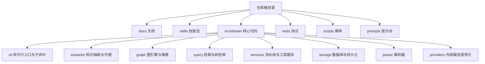
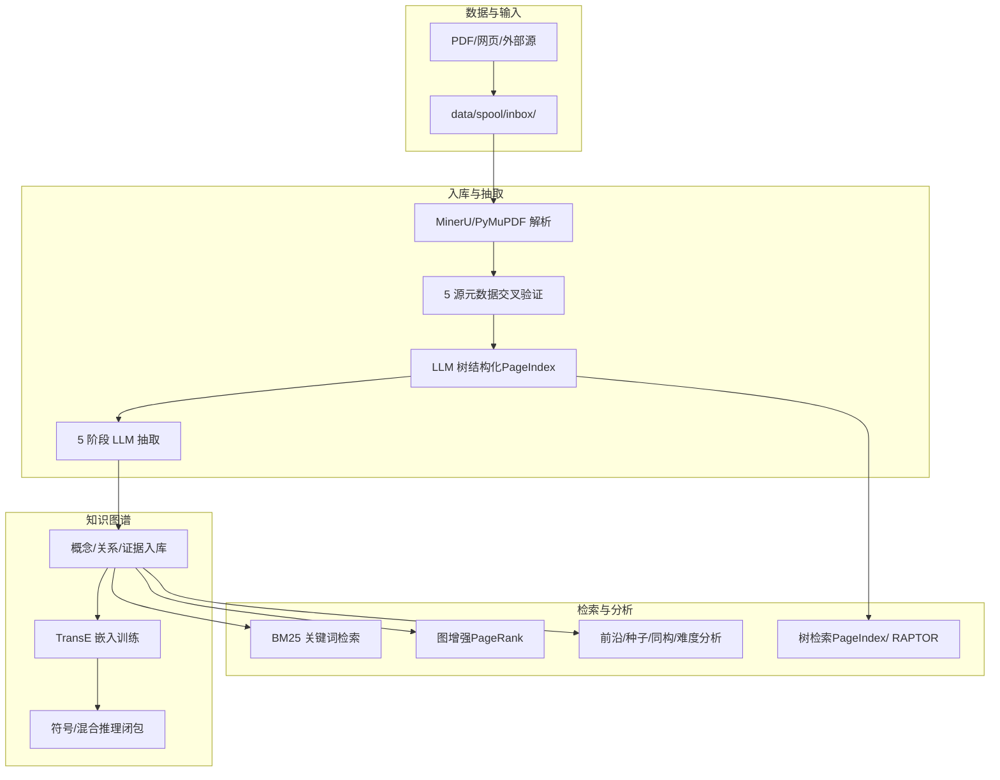
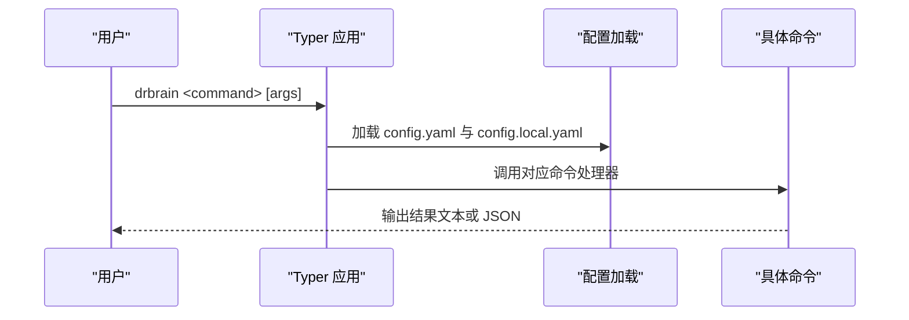
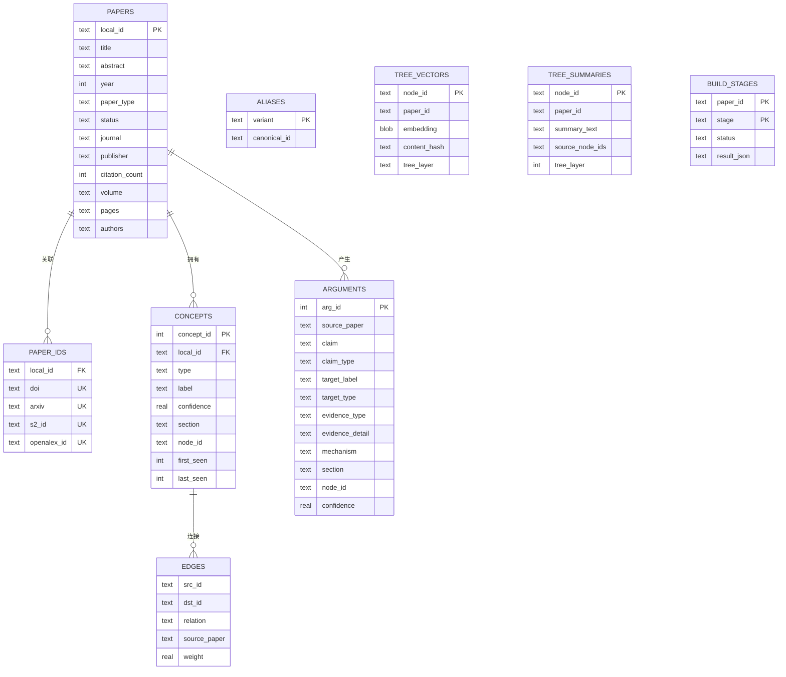
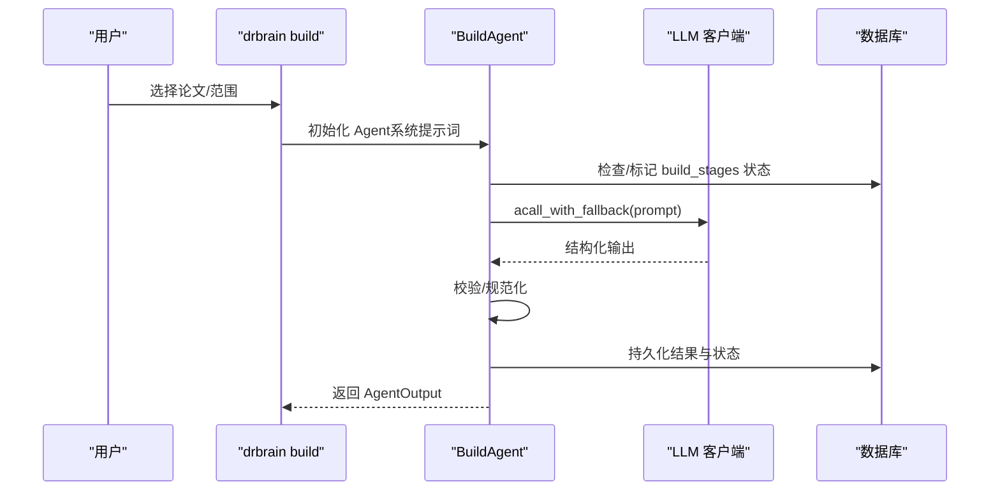
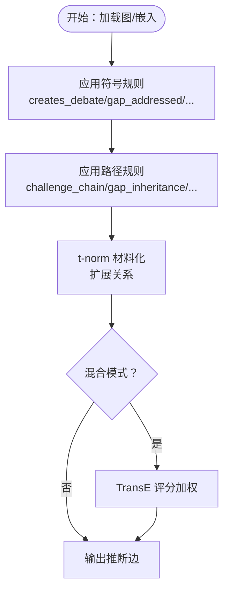
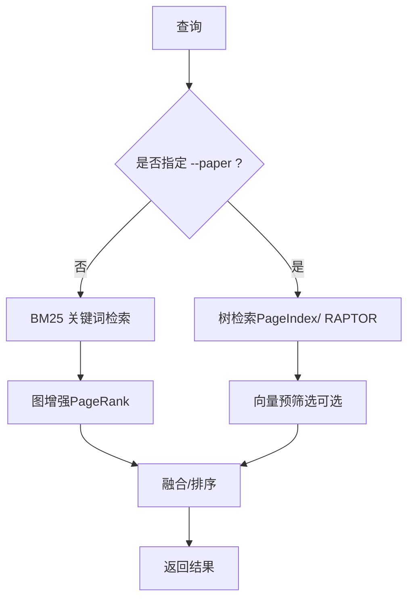
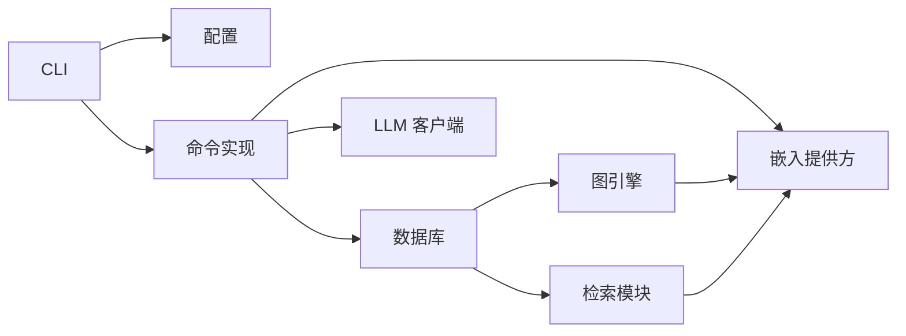

# 项目概述

<cite>
**本文档引用的文件**
- [README.md](file://README.md)
- [docs/getting-started.md](file://docs/getting-started.md)
- [docs/architecture.md](file://docs/architecture.md)
- [docs/cli-reference.md](file://docs/cli-reference.md)
- [src/drbrain/cli/main.py](file://src/drbrain/cli/main.py)
- [src/drbrain/config.py](file://src/drbrain/config.py)
- [src/drbrain/storage/database.py](file://src/drbrain/storage/database.py)
- [src/drbrain/graph/engine.py](file://src/drbrain/graph/engine.py)
- [src/drbrain/services/pipeline.py](file://src/drbrain/services/pipeline.py)
- [src/drbrain/extractor/agent.py](file://src/drbrain/extractor/agent.py)
- [src/drbrain/query/tree_retrieval.py](file://src/drbrain/query/tree_retrieval.py)
- [skills/paper-ingest/SKILL.md](file://skills/paper-ingest/SKILL.md)
- [skills/kg-build/SKILL.md](file://skills/kg-build/SKILL.md)
- [main.py](file://main.py)
</cite>

## 目录
1. [引言](#引言)
2. [项目结构](#项目结构)
3. [核心组件](#核心组件)
4. [架构总览](#架构总览)
5. [详细组件分析](#详细组件分析)
6. [依赖关系分析](#依赖关系分析)
7. [性能考量](#性能考量)
8. [故障排查指南](#故障排查指南)
9. [结论](#结论)
10. [附录](#附录)

## 引言
DrBrain 是一个“符号驱动”的学术知识图谱系统，强调“以知识图为源真”，通过规则推理与轻量向量检索实现可审计、可解释的科研发现。系统围绕“论文入库—结构化抽取—知识图谱构建—符号推理—智能检索—分析与导出”完整闭环设计，既适合初学者快速上手，也为有经验的开发者提供可扩展的技术架构与丰富的命令行接口。

- 核心价值：将论文库转化为可查询、可推理、可可视化的知识图谱，支持因果链追踪、研究前沿识别、跨域迁移发现与假设生成。
- 设计理念：符号推理优先（8+4条规则），向量仅用于语义完整的树节点检索，不引入向量数据库；SQLite 单库持久化，原子写入保障数据安全。
- 技术特色：PageIndex + RAPTOR 的分层树检索、TransE 图嵌入、Section 本体溯源、并发抽取、代理式流水线。

**章节来源**
- [README.md:15-66](file://README.md#L15-L66)
- [docs/architecture.md:3-21](file://docs/architecture.md#L3-L21)

## 项目结构
仓库采用按功能域划分的模块化组织方式，核心目录与职责如下：
- docs：官方文档（入门、架构、CLI 参考、配置、故障排查等）
- skills：面向 AI Agent 的技能包，便于在编码工具中直接调用 DrBrain 能力
- src/drbrain：核心代码库，包含 CLI、抽取器、图引擎、查询、服务、存储、解析器、提供商等
- tests：覆盖各模块的功能测试与集成测试
- scripts：安装与批处理脚本
- prompts：抽取阶段使用的系统提示词模板

**图表来源**
- [docs/architecture.md:11-21](file://docs/architecture.md#L11-L21)
- [src/drbrain/cli/main.py:10-75](file://src/drbrain/cli/main.py#L10-L75)

**章节来源**
- [docs/architecture.md:11-21](file://docs/architecture.md#L11-L21)
- [src/drbrain/cli/main.py:10-75](file://src/drbrain/cli/main.py#L10-L75)

## 核心组件
- CLI 与命令体系：基于 Typer 构建，统一入口 app，按功能拆分子应用（graph、ws）与命令组（ingest/build/query/export 等）
- 配置系统：Typed Config 数据类，支持 YAML 加载、本地覆盖、环境变量解析
- 数据库：SQLite（WAL 模式），集中管理论文、概念、边、别名、证据、嵌入、树向量等
- 抽取流水线：Agent 化的 5 阶段 LLM 流水线，具备幂等、重试、校验与缓存
- 图引擎：NetworkX 多重有向图 + 规则闭包，支持 TransE 嵌入与路径规则
- 检索：BM25 关键词检索 + 图增强（PageRank 加权）+ 结构化树检索（PageIndex + RAPTOR）
- 服务：流水线编排、导入导出、元数据修复、指标面板、文档检查等

**章节来源**
- [src/drbrain/cli/main.py:77-146](file://src/drbrain/cli/main.py#L77-L146)
- [src/drbrain/config.py:182-292](file://src/drbrain/config.py#L182-L292)
- [src/drbrain/storage/database.py:159-258](file://src/drbrain/storage/database.py#L159-L258)
- [src/drbrain/extractor/agent.py:53-196](file://src/drbrain/extractor/agent.py#L53-L196)
- [src/drbrain/graph/engine.py:33-122](file://src/drbrain/graph/engine.py#L33-L122)
- [src/drbrain/query/tree_retrieval.py:1-13](file://src/drbrain/query/tree_retrieval.py#L1-L13)

## 架构总览
DrBrain 的端到端工作流分为两个阶段：轻量化入库与结构化抽取构建知识图谱；随后进行嵌入训练、符号/混合推理与检索增强。

**图表来源**
- [docs/architecture.md:25-72](file://docs/architecture.md#L25-L72)
- [docs/architecture.md:129-150](file://docs/architecture.md#L129-L150)
- [docs/architecture.md:188-210](file://docs/architecture.md#L188-L210)

**章节来源**
- [docs/architecture.md:25-72](file://docs/architecture.md#L25-L72)
- [docs/architecture.md:129-150](file://docs/architecture.md#L129-L150)
- [docs/architecture.md:188-210](file://docs/architecture.md#L188-L210)

## 详细组件分析

### CLI 与命令体系
- 入口：Typer 主应用，统一加载配置与日志；每个命令注册为独立函数
- 子应用：graph（图探索）、ws（工作区）
- 常用命令：setup、ingest、build、embed、closure、query、export、analyze、repair、translate 等
- 输出：默认人类可读，支持 --json/--jsonl 机器可读输出

**图表来源**
- [src/drbrain/cli/main.py:80-92](file://src/drbrain/cli/main.py#L80-L92)
- [src/drbrain/cli/main.py:94-146](file://src/drbrain/cli/main.py#L94-L146)

**章节来源**
- [src/drbrain/cli/main.py:77-146](file://src/drbrain/cli/main.py#L77-L146)
- [docs/cli-reference.md:7-46](file://docs/cli-reference.md#L7-L46)

### 配置系统（Typed Config）
- 支持子配置：LLM、MinerU、API、目录、数据库、抽取并发、BM25、队列阈值、抓取策略、嵌入、备份等
- 加载流程：合并 base 与 local，递归解析 ${ENV_VAR}，构造 Typed Config 对象
- 用途：贯穿 CLI、抽取、检索、嵌入、导出等模块

**章节来源**
- [src/drbrain/config.py:44-292](file://src/drbrain/config.py#L44-L292)

### 数据库与模式（SQLite + WAL）
- 表结构概览：papers、paper_ids、concepts、edges、arguments、aliases、embeddings、tree_vectors、tree_summaries、confidence_queue、build_stages、schema_versions 等
- 特性：WAL 模式支持并发读写；自动迁移；外键约束；索引优化
- 写入安全：文件写入采用 tmp->rename 原子替换

**图表来源**
- [src/drbrain/storage/database.py:10-156](file://src/drbrain/storage/database.py#L10-L156)
- [src/drbrain/storage/database.py:259-416](file://src/drbrain/storage/database.py#L259-L416)

**章节来源**
- [src/drbrain/storage/database.py:159-258](file://src/drbrain/storage/database.py#L159-L258)
- [docs/architecture.md:212-265](file://docs/architecture.md#L212-L265)

### 抽取流水线（Agent 化 5 阶段）
- 阶段：Ontology 扩展 → Entity 抽取（并发）→ Relation 抽取 → Coreference 合并 → Refine 自检
- Agent 协议：统一输入/输出契约、系统提示词、幂等状态表 build_stages、失败重试、缓存回放
- 并发：实体抽取阶段 10 叠并发；翻译使用线程池并发分块

**图表来源**
- [src/drbrain/extractor/agent.py:73-136](file://src/drbrain/extractor/agent.py#L73-L136)
- [src/drbrain/services/pipeline.py:23-50](file://src/drbrain/services/pipeline.py#L23-L50)

**章节来源**
- [src/drbrain/extractor/agent.py:53-196](file://src/drbrain/extractor/agent.py#L53-L196)
- [src/drbrain/services/pipeline.py:53-90](file://src/drbrain/services/pipeline.py#L53-L90)
- [skills/kg-build/SKILL.md:31-43](file://skills/kg-build/SKILL.md#L31-L43)

### 图引擎与推理（符号/混合闭包）
- 图结构：NetworkX MultiDiGraph，支持多关系、权重、来源纸张
- 推理规则：8 条符号规则 + 4 条嵌入规则（混合模式），支持路径规则与 t-norm 材料化
- 嵌入：TransE 训练/预测/相似度，支持增量训练与持久化
- 研究种子检测：技术悬崖、跨域同构、信心坍缩、争议区、停滞问题等

**图表来源**
- [src/drbrain/graph/engine.py:124-315](file://src/drbrain/graph/engine.py#L124-L315)
- [src/drbrain/graph/engine.py:626-741](file://src/drbrain/graph/engine.py#L626-L741)

**章节来源**
- [src/drbrain/graph/engine.py:124-315](file://src/drbrain/graph/engine.py#L124-L315)
- [docs/architecture.md:108-129](file://docs/architecture.md#L108-L129)

### 检索与树检索（PageIndex + RAPTOR）
- BM25：关键词检索，支持类型过滤、年份过滤、置信度阈值、工作区限制
- 图增强：N 跳扩展 + PageRank 加权重排
- PageIndex 树检索：自适应深度导航（大骨架→顶层→分支→叶子），LLM 主导，向量预筛选
- RAPTOR：递归摘要树，两阶段遍历（层级下探 + 叶层回退），支持跨论文折叠检索

**图表来源**
- [src/drbrain/query/tree_retrieval.py:215-380](file://src/drbrain/query/tree_retrieval.py#L215-L380)
- [src/drbrain/query/tree_retrieval.py:484-647](file://src/drbrain/query/tree_retrieval.py#L484-L647)

**章节来源**
- [src/drbrain/query/tree_retrieval.py:1-13](file://src/drbrain/query/tree_retrieval.py#L1-L13)
- [src/drbrain/query/tree_retrieval.py:215-380](file://src/drbrain/query/tree_retrieval.py#L215-L380)
- [src/drbrain/query/tree_retrieval.py:484-647](file://src/drbrain/query/tree_retrieval.py#L484-L647)

### 入门与典型用例
- 快速上手：安装 → setup → 入库 → 抽取 → 嵌入 → 闭包 → 查询/分析
- 典型用例：
  - 将 PDF 转为知识图谱：paper-ingest 技能 + kg-build 技能
  - 搜索论文中的特定段落：query --paper <id>
  - 发现研究前沿：analyze --full 或 frontier
  - 跨域方法迁移：transfers
  - 假设生成与双向推理：reason --bidirectional

**章节来源**
- [docs/getting-started.md:88-216](file://docs/getting-started.md#L88-L216)
- [skills/paper-ingest/SKILL.md:28-74](file://skills/paper-ingest/SKILL.md#L28-L74)
- [skills/kg-build/SKILL.md:29-119](file://skills/kg-build/SKILL.md#L29-L119)

## 依赖关系分析
- 组件耦合
  - CLI 依赖配置加载与命令实现
  - 抽取流水线依赖 LLM 客户端与数据库状态表
  - 图引擎依赖数据库边集合与嵌入缓存
  - 检索模块依赖数据库树向量与嵌入提供方
- 外部依赖
  - LLM 提供方（litellm 兼容）：OpenAI、Anthropic、Ollama 等
  - 嵌入提供方：本地 sentence-transformers、OpenAI 兼容、禁用 none
  - 外部 API：arXiv、CrossRef、OpenAlex、Semantic Scholar、USPTO 等

**图表来源**
- [src/drbrain/cli/main.py:80-92](file://src/drbrain/cli/main.py#L80-L92)
- [src/drbrain/config.py:283-292](file://src/drbrain/config.py#L283-L292)
- [src/drbrain/graph/engine.py:760-785](file://src/drbrain/graph/engine.py#L760-L785)
- [src/drbrain/query/tree_retrieval.py:520-525](file://src/drbrain/query/tree_retrieval.py#L520-L525)

**章节来源**
- [src/drbrain/cli/main.py:80-92](file://src/drbrain/cli/main.py#L80-L92)
- [src/drbrain/config.py:283-292](file://src/drbrain/config.py#L283-L292)
- [src/drbrain/graph/engine.py:760-785](file://src/drbrain/graph/engine.py#L760-L785)
- [src/drbrain/query/tree_retrieval.py:520-525](file://src/drbrain/query/tree_retrieval.py#L520-L525)

## 性能考量
- 轻量向量：仅对 PageIndex/ RAPTOR 的语义完整节点进行嵌入，避免任意切片带来的噪声
- 并发抽取：实体抽取阶段 10 叠并发，显著缩短构建时间
- 嵌入提供方：支持 none 模式，完全不启用向量；本地模型可离线运行
- 索引与缓存：BM25 索引可重建；API 响应缓存可重用
- 数据库：WAL 模式提升并发读写；原子写入避免部分写导致的数据损坏

**章节来源**
- [docs/architecture.md:269-295](file://docs/architecture.md#L269-L295)
- [src/drbrain/query/tree_retrieval.py:520-525](file://src/drbrain/query/tree_retrieval.py#L520-L525)

## 故障排查指南
- 环境检查：drbrain check 检测依赖、工具、API 连通性与数据目录状态
- 数据质量：drbrain audit 应用 15 条严重级别规则扫描元数据、概念完整性、边一致性
- 常见问题
  - PDF 解析失败：检查 MinerU/PyMuPDF 是否可用；确认 PDF 未加密或损坏
  - LLM 抽取失败：检查模型列表与密钥；确认网络连通
  - 向量不可用：确认嵌入提供方配置；必要时使用 provider=none

**章节来源**
- [docs/getting-started.md:217-222](file://docs/getting-started.md#L217-L222)
- [docs/cli-reference.md:31-45](file://docs/cli-reference.md#L31-L45)
- [docs/cli-reference.md:23-29](file://docs/cli-reference.md#L23-L29)

## 结论
DrBrain 以“符号驱动 + 轻量向量”的方式，将学术论文转化为可查询、可推理、可可视的知识图谱。其清晰的模块边界、完善的命令行接口、可审计的推理链路与稳健的数据层设计，使其既能满足个人研究者的一站式需求，也能为 AI 编码 Agent 提供强大的基础设施支撑。

## 附录

### 常用命令与参数速览（节选）
- setup：初始化配置、目录与环境
- ingest：从 inbox 解析 PDF，跨源元数据校验，树结构化
- build：抽取概念/关系/证据，支持 --skip-refine
- embed：训练 TransE 嵌入；--tree 生成树节点向量
- closure：符号/混合闭包，支持 --rule、--mine-rules、--ground
- query：BM25 + 图增强；--paper 使用树检索；支持类型/年份/置信度过滤
- export/style/import/repair/translate/backup/audit 等

**章节来源**
- [docs/cli-reference.md:9-794](file://docs/cli-reference.md#L9-L794)

### 公共接口与返回值约定（示例）
- 命令输出：默认人类可读，支持 --json/--jsonl；错误通过日志与退出码反馈
- 抽取输出：AgentOutput 包含 paper_id、stage、status、data、diff（可选）
- 检索输出：树检索返回 {node_id, title, content, source} 列表；跨论文检索返回 {node_id, paper_id, score, tree_layer}

**章节来源**
- [src/drbrain/extractor/agent.py:43-51](file://src/drbrain/extractor/agent.py#L43-L51)
- [src/drbrain/query/tree_retrieval.py:328-379](file://src/drbrain/query/tree_retrieval.py#L328-L379)
- [src/drbrain/query/tree_retrieval.py:451-478](file://src/drbrain/query/tree_retrieval.py#L451-L478)