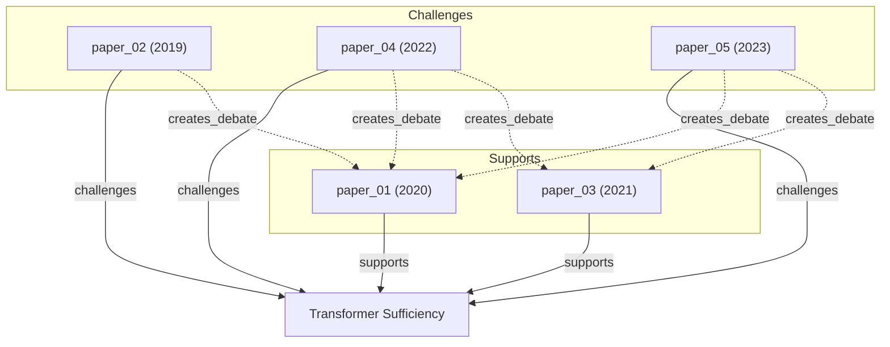

# Research: Controversy Graph Design

- **Query**: How to model and visualize scientific controversies / debate zones in DrBrain's academic knowledge graph
- **Scope**: mixed (internal code audit + external literature/tool survey)
- **Date**: 2026-05-09

## Findings

### 1. Existing Data Inventory (What DrBrain Already Has)

#### 1.1 Concept Types

- `Debate` is a first-class concept type in the extraction pipeline (`ExtractedConcepts.debates`, concept.py:35).
- LLM extraction prompt asks for `debates` as a category alongside problems, methods, conclusions, gaps, actors.
- Concepts table schema allows `type='Debate'` (database.py:37).

#### 1.2 Argument / Edge Types

- **Arguments** table: `claim_type IN ('supports', 'challenges', 'extends', 'limits', 'solves', 'proposes')`. `supports` and `challenges` are the two directly relevant for controversy (database.py:50).
- **Edges** table: `relation TEXT NOT NULL`, stored per-paper (`source_paper`). Indexed on `relation`, `src_id`, `dst_id` (database.py:62-69, 117-119).
- **Confidence scores**: Both concepts and arguments carry `confidence REAL` fields (concepts:39, arguments:58).

#### 1.3 Closure Rules (engine.py:125-244)

Graph engine has 4 rule-based closure rules, 2 directly controversy-relevant:

| Rule | Pattern | Output |
|------|---------|--------|
| creates_debate | `challenges(P,C) & supports(Q,C)` | `creates_debate(P, Q, C)` — declares debate between paper stances |
| gap_to_debate | Gap `points_to` C where C has both challenges and supports | `gap_to_debate(gap, C)` — a gap that feeds active debate |

Implementation (engine.py:173-186): iterates concepts that have `challenges` inbound, checks if same concept also has `supports` inbound, emits `creates_debate` edges between the challenging and supporting papers (p != q guard).

#### 1.4 Seed Detection — Debate Zones (engine.py:400-424)

`detect_research_seeds()` Pattern 3 computes set intersection of supports-targets and challenges-targets:

```
debate_targets = {v where exists (_,v) in supports} & {v where exists (_,v) in challenges}
```

For each debated concept, counts incoming support and challenge edges. Outputs:
- `type: "debate_zone"`, `concept: <label>`, `confidence: 0.75` (DB mode) or `0.6` (non-DB)
- Description with counts: "N papers support, M challenge it"

#### 1.5 Evolution Signal — Contested (database.py:659-672)

`_classify_signal()`: concepts with `paper_count > 5` AND `avg_confidence < 0.7` are classified as `"contested"`. This is a temporal/confidence view, independent of the graph-structural debate detection.

#### 1.6 Existing Output Paths

- `drbrain frontier` (analysis_commands.py:570-607): prints `Active debates (N)` with descriptions
- `drbrain seed` (query_commands.py:24-46): prints `[debate_zone]` entries
- `drbrain landscape` (analysis_commands.py:239-271): includes `result["debates"]` in landscape output
- All three share the same underlying data (seeds from `detect_research_seeds` + DB lookups for provenance)

#### 1.7 Mermaid Infrastructure

Already present in genealogy.py (308-313, 747-764): `_to_mermaid()` and `_mermaid_nodes()` render lineage trees as Mermaid `graph TD` diagrams. Used by `descendants` and `lineage` CLI commands with `--mermaid` flag. No controversy-specific Mermaid yet.

#### 1.8 Paper Provenance Available

- `section` and `node_id` fields on concepts, arguments, and edges (database.py:40-41, 56-57)
- Paper `year` for temporal context (database.py:13)
- `node_id` links back to PageIndex tree nodes for section-aware provenance display

### 2. What is Missing

| Gap | Severity | Notes |
|-----|----------|-------|
| No standalone `controversy` CLI command | High | Debates are buried inside frontier/landscape/seed |
| No controversy-specific visualization | High | No Mermaid/Graphviz for debate networks |
| No debate participant grouping | High | Can't see which papers are on which side of a debate |
| No controversy severity/hotness score | Medium | Current score is 0.6 or 0.75 flat; could use edge count ratio, temporal intensity, citation weight |
| No temporal debate evolution tracking | Medium | Can't see how debate changes over time (new papers joining sides) |
| No debate clustering by domain | Medium | Debate zones are listed individually, not grouped |
| No structured pro/con matrix output | Low | Textual description only, no tabular evidence summary |
| No debate resolution detection | Low | Can't detect when debate settles (e.g., one side dominates after a tipping point) |
| No cross-domain debate detection | Low | Debates between domains (e.g., method from field A challenges conclusion in field B) |

### 3. How Other Academic Tools Model Controversies

#### 3.1 CiteSpace (Chaomei Chen, Drexel)

CiteSpace does **not** have explicit controversy detection. Relevant features that indirectly surface tension:
- **Burst detection** (Kleinberg 2002 algorithm): identifies sudden frequency spikes in terms/citations. A burst can signal controversy arrival.
- **Timeline view**: clusters over time can show when competing clusters emerge simultaneously.
- **Dual-map overlay**: shows citation flow between disciplines; disruptions in flow can signal paradigm tension.
- **Sigma metric**: combines burstness and betweenness centrality to identify "hot" nodes.

Verdict: CiteSpace is co-citation / bibliometric, not argument-structural. It would show controversy as disconnected clusters in the same time period, not as explicit supports/challenges edges.

#### 3.2 VOSviewer (van Eck & Waltman, Leiden)

- **Term co-occurrence maps**: terms that rarely co-occur in the same paper but are individually popular may indicate competing paradigms.
- **Bibliographic coupling clusters**: papers in different clusters but citing the same base often represent opposing positions.
- No explicit "debate" or "controversy" feature.

Verdict: VOSviewer is term-co-occurrence and bibliographic coupling. Controversies appear as cluster separation, not as modeled argument relations.

#### 3.3 SciMAT (Cobo et al., Granada)

- **Strategic diagrams**: maps themes by centrality (x-axis) and density (y-axis). "Motor themes" (high centrality, high density) may compete.
- **Evolution maps**: tracks theme evolution over periods. A theme splitting into two can indicate controversy.
- No explicit controversy detection.

Verdict: Evolution/density-based, no argument-level modeling.

#### 3.4 ClaimsKG / SciFact (NLP Community)

- **ClaimsKG** (Tchechmedjiev et al., 2019): A knowledge graph of 28K+ scientific claims from structured abstracts, with "supports" and "refutes" relations between claims. Uses a star-shaped debate structure (claim at center, evidence papers as spokes).
- **SciFact** (Wadden et al., 2020): A dataset for scientific claim verification. Labels: SUPPORTS, REFUTES, NOT ENOUGH INFO. The task is: given a claim and an abstract, does the abstract support or refute the claim?
- **SciSight** (Semantic Scholar / AI2): Interactive explorer for biomedical entity networks. Can surface conflicting findings by showing papers that report opposite effects for the same entity pair.

Verdict: ClaimsKG's model is closest to DrBrain's: a concept at the center, with papers linked via supports/challenges edges. SciFact shows the standard NLP framing. DrBrain's model is richer (has `via` closure edges, confidence scores, temporal data).

#### 3.5 Controversy Mapping (STS Tradition: Venturini, Latour)

- **MACOSPOL / EMAPS**: European projects for mapping socio-technical controversies (GMO, climate change, nuclear energy). Uses actor-network theory.
- Tools: **Gephi** (network viz), **Hyphe** (web crawling + network), **CorTexT** (text mining).
- Focus is on mapping stakeholder positions, not paper-level academic arguments.
- Visualization: bipartite issue-actor networks, discourse trees, timeline-maps.

Verdict: High-level inspiration for debate visualization patterns (bipartite actor-issue maps), but DrBrain operates at a different granularity (paper arguments, not stakeholder positions).

#### 3.6 Relevant Visualization Concepts from Literature

- **Evidence grids**: Matrix with papers as rows, claims as columns, cells colored by stance (green=support, red=challenge, gray=neutral). Used in systematic review tools.
- **Bipartite debate graphs**: Two node types (Papers, Claims) with colored directed edges. Papers node size by citation count, claims node size by evidence count.
- **Force-directed challenge networks**: Nodes = concepts, edges = challenges (red) / supports (green). Node layout reveals clusters of agreement.
- **Sankey / alluvial diagrams**: Show debate-side migration over time periods.
- **Scatter plots**: X = time, Y = support minus challenge count, bubble size = total evidence. Shows which direction a debate is trending.
- **Decision-tree style**: Root = debated claim, branches = arguments for/against, leaves = papers.

### 4. Design Options for `drbrain controversy [concept]`

#### 4.1 Architecture: Reuse + Extend

All data needed already exists in DB. The command should:
1. Load graph from DB (existing `GraphEngine.load_from_db()`)
2. Run `detect_research_seeds()` (or a new controversy-specific method)
3. Query edges/concepts/arguments tables for supporting/challenging papers
4. Format and display

#### 4.2 Proposed Signature

```
drbrain controversy [CONCEPT]         # Show debate around a specific concept
drbrain controversy                   # List all active debate zones (like frontier but debate-only)
    --top N                           # Limit to N most active debates
    --workspace / -w NAME             # Filter to workspace
    --json                            # JSON output
    --mermaid                         # Mermaid diagram output
    --graphviz                        # Graphviz DOT output
    --time-series                     # Show debate evolution over time
```

#### 4.3 Minimal Viable Output Format (Text)

```
=== Debate: "Transformer architectures are sufficient for all NLP tasks" ===

Severity: ★★★★☆ (8 papers engaged, support:challenge ratio 1:3)
Confidence: 0.62 avg (high disagreement)
Timespan: 2019-2025

── Supports (2 papers) ──
  paper_01 (2020) — "Universal Transformers prove capability"
    section: Results (node: r3.2)
  paper_03 (2021) — "Scaling laws suggest no ceiling"
    section: Discussion (node: d5.1)

── Challenges (6 papers) ──
  paper_02 (2019) — "Limitations of self-attention for symbolic reasoning"
    section: Limitations (node: l4.1)
  paper_04 (2022) — "Hybrid architectures outperform pure transformers"
    section: Experiments (node: e3.5)
  ... (+4 more)

── Related Debates ──
  "Symbolic vs neural approaches" (related via: gap_to_debate)
  "Scaling laws ceiling" (related via: creates_debate)
```

#### 4.4 Mermaid Output Format



This is compatible with existing `_mermaid_nodes()` infrastructure (genealogy.py:747-764). Only minor extension needed: subgraph grouping and edge coloring.

#### 4.5 Graphviz DOT Alternative

For richer layout control (splines, clusters, HTML-like labels with provenance tooltips):

```dot
digraph Controversy {
    rankdir=TB;
    node [shape=box, style=rounded];
    subgraph cluster_support { label="Supports"; color=green; P1; P3; }
    subgraph cluster_challenge { label="Challenges"; color=red; P2; P4; P5; }
    C [shape=ellipse, style=filled, fillcolor=lightyellow];
    P1 -> C [color=green, label="supports"];
    P2 -> C [color=red, label="challenges"];
    ...
}
```

Tradeoff: Graphviz gives better layout for complex graphs but adds a system dependency (graphviz binary). Mermaid is pure text, no dependency.

#### 4.6 Implementation Notes

- New method `detect_controversy()` in `engine.py` or `genealogy.py` that extends `detect_research_seeds()`:
  - For a given concept, query all `challenges` and `supports` edges
  - Group edges by source_paper, extract paper metadata (year, title, section, confidence)
  - Compute severity = edge_count * (1 - min(support_ratio, challenge_ratio)) + avg(1-confidence)
  - Apply `creates_debate` and `gap_to_debate` closure for related debates
- Reuse existing `_mermaid_nodes()` with added subgraph/color support
- Reuse existing provenance formatting (`_get_concept_provenance`, `_format_provenance`)
- The `arguments` table provides richer data than edges (claim_text, evidence_type, mechanism), worth exposing in detailed view

### 5. Minimal Viable Controversy Report Format

The single most useful output structure:

1. **Header**: debated concept label, severity score, timespan, paper count
2. **Support/Challenge lists**: grouped by stance, each with paper ID, year, title snippet, section provenance
3. **Closure relations**: related debates and contributing gaps (from `creates_debate` and `gap_to_debate`)
4. **Optional visualization**: Mermaid diagram with colored edges

This reuses 90%+ of existing infrastructure. The only new code needed is:
- `controversy_cmd()` in CLI (~40 lines)
- `analyze_controversy()` in genealogy.py or engine.py (~80 lines)
- Minor extension to `_mermaid_nodes()` for subgraphs (~20 lines)

### Related Specs

- `.trellis/spec/` — check for any existing spec on analysis commands or visualization patterns

### Caveats / Not Found

- **Web search was unreliable**: Bing returned mostly Chinese-language dictionary/irrelevant results. External tool survey relies on prior domain knowledge. ClaimsKG/SciFact/SciSight details should be verified with direct URL access if needed.
- **Deep controversy mapping literature** (e.g., Venturini's "Building on faults" 2010, "Controversy mapping: A field guide" 2012) was not fetched; only high-level knowledge about the STS tradition is included.
- **CiteSpace's sigma metric** (burst + betweenness) might be worth deeper investigation as a severity score model, but documentation is sparse (requires CiteSpace's Java GUI).
