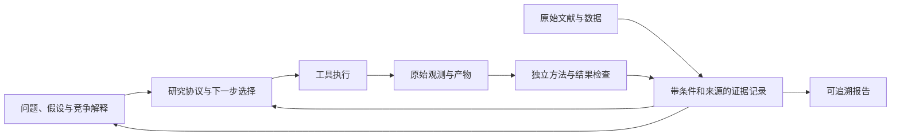

# DrBrain：通用 Agent 科学家能力评估

> 日期：2026-09-11 · 代码基线：`2e7c60c` 及审阅时可见工作区。
> 本文是架构与科学能力评审、改进建议，不是已完成能力声明。并行开发中的项目作用域改动不计入已验证能力。
> 依据：核心代码、已有评估记录、80 项定向测试，以及下列一手论文/作者报告。没有运行新的真实科研实验。

## 1. 判断：方向成立，科学家能力尚未过验收

**目前可以把 DrBrain 定位为：具备文献知识底座、工具协议和可恢复研究运行时的科研 agent 平台。
现有证据不足以认定它已经是合格、成熟的通用自主科学家。**

“一手文献、一手工具、一手 loop”的方向成立。关键是让三者围绕同一个可检验的科学问题工作：
文献约束假设，工具取得观测，loop 根据观测修正假设与下一次实验。
目前相对成熟的是记录、调度和接口层；最需要加强的是科学判据、证据解释和能力验证。

这里的“合格”采用本项目应当自证的标准：在预先说明的任务范围与预算内，能提出可检验问题，
取得与问题对应的证据，接受独立检查，并在不同领域复现这种能力。接口领域无关只是其中一个条件。

| 能力 | 当前判断 | 尚不能据此推出的结论 |
|---|---|---|
| 文献获取、结构化与混合检索 | 已有较完整底座、来源定位与检索评估 | 高召回不等于引文正确、结论成立或检索覆盖充分 |
| 工具接入与执行治理 | ABI、manifest、符合性检查、作业与产物协议已存在 | 插件能运行不等于计算方法有效、结果可比较 |
| 长任务运行 | ledger、检查点、租约、幂等、预算、工具调用记录已有实现和测试 | 可恢复执行不等于真实环境下的生产验收已完成 |
| 假设核验 | 有批评门、证据 ID、结构化预测、单位换算、数值产物与噪声门 | 尚未构成统一、独立、经校准的科学验证体系 |
| 自主研究策略 | 有多角色、讨论、候选筛选、跨轮记忆与停止机制 | 未证明这些机制在同预算下优于简单 agent |
| 跨领域科学能力 | 有通用接口意图与领域包路径 | 本次未取得足以支持跨领域能力声明的独立复现报告 |

**最需要回答的产品问题是：研究者把什么判断交给 DrBrain 后，能获得更可靠、可复查的研究结果？**
功能数量、agent 数量、论文数量和运行时长都不能单独回答这个问题。

## 2. 三条主线需要共用科学问题与证据记录

建议保留已有检索、插件与 durable runtime，把核心组织单位从“跑完一轮流程”提升为
“一个带条件的主张及其竞争解释”。下图是目标关系，不代表已实现。

已有 ledger 适合记录执行事实；已有 `evidence`、`claims`、`claim_evidence` 和图谱适合承接知识关系。
应先扩展这些接口的科学语义，避免另外建立一套互不一致的“科学家记忆库”。

三条反馈关系决定系统是否在做研究：

- 文献发现一个结论依赖特定条件，工具据此检查适用范围或设计对照。
- 工具得到异常结果，loop 回查方法、数据、单位和相反文献，保留竞争解释。
- 独立检查改变某条主张的可信状态，后续记忆、检索结果和研究计划同步更新。

## 3. 最重要的代码证据与成熟度缺口

以下指出的是已看到的判断逻辑及其能力边界；不是在假定项目没有任何相关机制。

### 3.1 `confidence=1.0` 缺少科学校准依据〔P0〕

[`workflow.py`](../src/drbrain/loop/workflow.py) 的 `_persist_claims()` 在存在可解析数值作业证据时，
会将相应主张的 confidence 设为 `1.0`；[`director.py`](../src/drbrain/loop/director.py) 的
`_absorb()` 也为新增 champion 写入 `confidence: 1.0`。

其他核验门会限制哪些主张进入这些路径，但它们不能推导“科学确定性为 100%”。
这里混合了执行成功、产物存在、判据通过和科学可信程度。

**建议：**分别记录执行状态、证据充分性、方法检查状态、复现状态和适用条件。
尚未校准的 confidence 明确标注为评分或未知；若要表示概率，必须有独立标注集、可靠性曲线与误差分析。
模型评分、critic 分数、检索分数也不能相互当作概率使用。

### 3.2 数值产物门还缺“这个数回答了哪个问题”〔P0〕

已有正向机制值得保留：`_job_log_has_number()` 要求日志中有可解析、有限的结构化结果，
`_classify_verification()` 会用日志中的值比较结构化预测，`_structured_prediction_met()` 支持单位换算。

但边界仍有缺口：

- [`durable_execution.py`](../src/drbrain/loop/durable_execution.py) 的 `record_job()` 以作业结束和日志数字模式
  标记 numeric artifact，其检查粒度与 workflow 的结构化结果门不同。
- `workflow.py` 的结构化预测路径在日志缺单位时可回退到假设单位，容易把“单位未知”变成“单位已知”。
- `verify()` 中支持/反对计数及 `value/unit` 仍有模型输出来源；结构化判据虽然读取日志值，
  后续结算消费的验证对象也应绑定同一份权威测量结果。

**建议：**建立唯一的测量返回契约：观测对象、指标定义、数值/区间、单位、数据版本、数据切分、
方法版本、运行条件、原始产物和验证器版本。缺项返回不足或不适用，禁止静默补全关键科学条件。
哈希能证明文件身份；它本身不能证明文件里的分析是正确的。

### 3.3 支持/反对计数不能代替独立证据判断〔P0〕

`workflow.py` 已限制核验引用的 evidence ID，并在 `_classify_verification()` 中代码化
Supports/Refutes 判定。这能约束模型任意输出最终裁决。

不过，计数主要来自模型返回。三篇引用同一实验的论文、同一数据上的三个模型、三个 reviewer 的意见，
都可能只有一个独立证据来源。数量也没有表达证据是否测量同一对象、控制同样条件或排除竞争解释。

**建议：**把“主张—证据”的关系逐条记录为支持、反对、不相关或条件不一致，并附具体片段/测量与理由。
按数据来源和实验谱系去重，再由任务验证器判断充分性。critic 可以帮助发现问题，不能同时充当独立实证。

### 3.4 噪声门存在，重复实验与效应量语义仍需补齐〔P0〕

[`transitions.py`](../src/drbrain/loop/transitions.py) 的 `settle_execution_claim()` 已有
numeric artifact、evidence、champion 版本 CAS，以及 `noise_band`/`required_repeats` 参数。
当前近噪声判断比较的是 `abs(numeric_value) <= noise_band`，并据配置要求重复；
这段结算逻辑没有计算独立重复的分布、基线差值或置信区间。

**建议：**明确 value 表示原始测量还是相对基线的变化；每个指标声明方向、基线、容差与重复单位。
随机种子、独立样本、技术重复不可混算。未优于基线、无法判定、假设被反驳和程序失败应分别存储。
对于随机任务，保存分布和不确定性；确定性数值问题使用残差、收敛性或已知解误差。

### 3.5 “库内未检出”被过度解释为新颖〔P1〕

`workflow.py` 的 `_check_novelty()` 检查本地文献检索与图中关系；无法检查时会返回 `unknown`，
这一降级是正确的。但在认为语料或 KG 已被检查、又没有命中时，可以返回 `novel`。
这个标签的强度超过了检索覆盖所能支持的结论。

**建议：**改为可追溯的新颖性评估：搜索范围、截止时间、查询变体、最接近已有工作、关键差异与未覆盖部分。
库内查重称“未发现重复”；“新发现”留给进一步检索、独立审查和实证结果。
同名概念、近义表述、不同温度/材料/人群下的主张，需要条件化对齐，不能只比较标签或陈述字符串。

### 3.6 当前停止策略容易把工作量当作知识进展〔P1〕

`director.py` 的 `_absorb()` 使用 `bool(new_champion or new_rejected or jobs_consumed)` 判断进展。
代码已避免把仅提交而未产生结果的 job 算作消费，也正确认识到证伪有价值。
但重复计算、已知结果或无区分力的实验仍可能刷新进展，从而继续占用预算，直到其他上限触发。

**建议：**分开记录运行活动和科研进展。进展可以是排除一个竞争解释、减少关键不确定性、
通过独立复现或获得可靠改进。无法估算正式信息增益时，先使用这些可审核的代理指标。
选择下一实验时列出：预期区分哪些假设、可能结果如何改变判断、成本和停止条件。

### 3.7 工具符合性已经存在，但需要第二层科学符合性〔P0〕

[`plugins.md`](plugins.md) 已是 v2 规范；[`conformance.py`](../src/drbrain/plugins/conformance.py)
实际检查 manifest/描述符、对象形状 schema、ABI、超时、副作用、摘要及作业方法等。
因此“还没有插件标准”不是准确诊断。

下一层需要检查的是：软件版本是否符合方法要求，输入是否满足适用条件，单位和数值范围是否一致，
能否重现已知案例，遇到不收敛/越界/缺数据是否正确报错。这个责任应由领域包提供科学测试，宿主统一运行和记录。

### 3.8 工程完成和科学验收在路线图中仍然分离〔P0〕

[`autoresearch-loop-production-plan.md`](autoresearch-loop-production-plan.md) 的当前进度说明明确承认：
代码路径合入不等于完成定义达成，真实模型、RAG、外部插件环境的定向验收仍需完成。
[`platform-roadmap.md`](platform-roadmap.md) 则把实算闭环价值验证放在插件/WebUI 稳定之后。

如果目标是“通用科学家”，建议将最小真实闭环验证与产品开发同步推进。
研究者负责问题、方法与科学判断，工程侧负责可执行协议、可靠测量和可复现记录；
“研究价值”不能完全推迟到工程被宣布完成之后再检查。

## 4. 文献这只手：从能检索到能约束研究

已有资产包括论文解析、章节树、符号图谱、混合召回、来源定位和知识冲突处理。
值得投资的增量是让它们产出可用于研究决策的证据对象。

| 应交付的对象 | 应回答的问题 | 优先动作 |
|---|---|---|
| 文献证据卡 | 哪个版本、哪一页/节、哪个实验支持这句话？ | 原文定位、表格/图来源、提取不确定性与来源哈希 |
| 条件化主张 | 对什么对象、什么条件、什么方法成立？ | 保留否定、限定词、单位、研究对象及适用范围 |
| 证据谱系 | 多篇论文是否复用了同一数据/实验？ | 追踪原始研究、综述与二次引用，避免重复计权 |
| 争议与覆盖记录 | 是证据矛盾、条件不同，还是没有搜索到？ | 分开记录这三类情况，输出最近似工作和检索盲区 |
| 可执行方法说明 | 为复现该结论，需要什么数据、工具、参数和判据？ | 将方法/补充材料链接到实验协议和领域包 |

[`authority.py`](../src/drbrain/rag/authority.py) 已提供来源层级、时效和提取置信度的确定性排序。
对行政文档，这类规则有明确用途；对科学争议，还必须比较研究设计、测量条件、偏差与独立复现。
论文较新或来源层级较高，不能单独决定物理事实或实验结论。

还需要重视当前评估证据的范围。仓库 [`llamaindex-eval-baseline.md`](llamaindex-eval-baseline.md) 记录：

- 多轮检索评估是 **30 条 dev 查询**；2026-08-21 的 paper MRR 为 **0.9417**、node MRR 为 **0.875**。
- 文档中的重排 A/B 使用 **46 篇 golden 论文**，记录了正向检索收益。
- 2026-08-12 的 **5 条 dev 查询**、自写 prompt 的 RAGAS-style 评估，记录
  faithfulness **0.36**、context precision **0.24**、answer correctness **0.42**。

这些是历史小样本记录，不是当前版本的全量质量测定，不能外推为全语料质量或最终正确率。
它们支持的优先级是：在独立测试集上验证引用是否蕴含结论、能否拒答、能否识别反证和条件变化，
并测量真实大语料下的性能。继续增加召回通道之前，先定位检索到答案之间的损失。

## 5. 工具这只手：把“软件可调用”变成“测量可比较”

建议把插件验收分成三层，复用当前 ABI 与作业机制：

| 层次 | 检查内容 | 谁提供判据 |
|---|---|---|
| 接口符合性 | 参数、状态、错误、超时、作业生命周期、产物身份 | 宿主协议与 conformance |
| 数值/方法符合性 | 已知解、单位、收敛性、输入边界、随机性、失败语义 | 领域包作者与方法维护者 |
| 科研任务符合性 | 基线、对照、数据切分、效应判据、结果复现、结论适用范围 | 研究者定义的任务协议与独立验证器 |

一个可用于跨领域验收的领域包，至少交付以下内容：

1. 数据与观测对象定义，包括数据版本、切分和来源。
2. 工具、环境与资源说明，以及输入/输出模式。
3. 指标或观测语义，包括单位、目标方向、容差与不适用情形。
4. 已知结果、简单基线、正负对照与方法级测试。
5. 独立评估入口；执行 agent 不能改写评估器或读取隐藏答案。
6. 可复现样例、失败案例及完整产物清单。

“核心不内置具体领域算法”是合理的抽象选择。它的通用性要由不同作者、不同领域包在同一宿主上
完成任务来证明。插件数量本身不能说明覆盖了多少种科学方法。

通用科学任务也未必都有数值 job：文献综合要检查证据蕴含，定理任务需要形式化证明检查器，
数值模拟要检查误差与收敛，统计发现需要研究设计和不确定性。统一的是验证接口与证据记录，
具体可接受证据由任务类型决定。

## 6. Loop 这只手：从流程调度到实验选择

保留现有确定性状态机、检查点、预算和工具代理，它们解决了长任务的基础问题。
研究策略可以在这些约束内演进，不必为了“先进”重写整个编排框架。

| 任务类型 | 实际完成标准 | 需要的主要反馈 |
|---|---|---|
| 文献综合 | 主张忠实、条件完整、证据覆盖充分、可拒答 | 原文/反证与审查 |
| 论文复现 | 方法、环境、数据与结果在约定容差内对齐 | 独立重跑与方法检查 |
| 性能优化 | 相对基线的可靠收益，未违反任务约束 | 固定评估器与验证集/保留集 |
| 数据驱动发现 | 关系可复现、控制关键混杂、通过负对照 | 新数据、敏感性分析与竞争解释 |
| 开放式研究 | 缩小关键不确定性，形成经独立验证的新认识 | 多轮实验、专家判断及外部验证 |

不宜让这五类任务共用一套“支持计数够了 + 有数值产物 = 完成”的标准。
建议引入小而明确的任务协议，声明目标、允许动作、证据要求、评估器、资源限制和终止条件。

策略层的增量按以下顺序推进：

1. **显式竞争解释。** 每个候选至少说明可能反例、最小区分实验与结果解释。
2. **可靠记忆。** 已验证结果、暂时猜测、失败代码、方法不适用和确切反证分开保存；
   旧主张被推翻后传播失效状态。禁止把自己的摘要再次当作独立文献证据。
3. **候选组合。** 保留不同假设方向和各自成本，避免只追一个最高分陈述；必要时维护多指标前沿。
4. **根据结果选择下一步。** 可选补文献、做对照、扩大样本、换方法、请人审查或停止。
   先用可解释规则建立基线，再评估树搜索、主动实验选择或策略学习是否带来收益。
5. **证明多角色值得成本。** 不同 prompt 不代表错误独立；讨论是否有效，必须用任务成绩与成本消融验证。

## 7. 一手研究给出的参照线

以下比较关注机制和验证方式，不把不同论文、不同模型、不同预算的分数合并成排行榜。
论文结果是各作者报告的证据，本次没有独立复现这些系统。

| 一手来源 | 值得借鉴的机制/验收方式 | 对 DrBrain 的启示与边界 |
|---|---|---|
| [PaperQA2：Language agents achieve superhuman synthesis of scientific knowledge，2024](https://arxiv.org/abs/2409.13740) | 将文献问答、矛盾判断和无证据场景纳入评估 | 文献能力要验证引文与结论关系；这些任务的成功不等于完成自主实验 |
| [Coscientist，Nature 2023](https://www.nature.com/articles/s41586-023-06792-0) | 文献/文档检索与真实实验工具衔接，展示化学任务的实验执行 | 工具必须面对可观测反馈；论文限定在具体实验体系，不能据此宣称覆盖全部科学 |
| [Towards an AI co-scientist，2025](https://arxiv.org/abs/2502.18864) | 假设生成、比较、演化，并在生物医学问题上进行外部实验验证 | 学习“候选质量怎样被验证”；内部 Elo 排序不能替代外部实验，也不是全自动实验室证明 |
| [The AI Scientist-v2，2025](https://arxiv.org/abs/2504.08066) | 实验管理器协调 agentic tree search，连接代码、实验、图表与论文 | loop 的搜索单位应包括可运行实验方案；workshop 论文结果的范围不能外推为普遍科学能力 |
| [Kosmos，2025](https://arxiv.org/abs/2511.02824) | 文献与数据分析共享结构化 world model，报告主张指向论文或分析产物 | 长期一致性与解释准确率要一起验证；其专家检查也显示解释仍会出错，引用完整并非正确性的充分条件 |
| [AutoScientists，2026-05](https://arxiv.org/abs/2605.28655) | 共享实验记录、讨论、团队调整，并对这些组件做消融 | DrBrain 已借鉴部分讨论/记忆机制；进一步应对齐同实验预算的真实收益评估。作者明确其目标不是减少 LLM 调用成本 |
| [PaperBench，2025](https://arxiv.org/abs/2504.01848) | 按论文复现任务建立分层 rubric，区分代码开发、执行与结果匹配 | 可借鉴产物级验收；不能只跑 Code-Dev 后声称结果已复现，模型评分器也需要审计 |
| [DiscoveryBench，2024](https://arxiv.org/abs/2407.01725) | 跨领域数据、目标与假设结构化评估 | 适合构建数据驱动任务族；其假设匹配评分不等于对新发现的最终科学证明 |
| [SciCode-Verified，2026-08](https://arxiv.org/abs/2608.04975) | 对科学代码基准的参考答案、规格与判定缺陷进行审计修订 | 选择基准时也要检查评估器；该新预印本的结果应按自身版本和设置解释，不把历史低分当作今天的能力上限 |

补充前沿信号：[Google Research 的 Science One 作者技术报告，2026-07-30](https://research.google/blog/science-one-framework-a-verifiable-autonomous-research-framework-via-chain-of-evidence/)
提出将主张与代码、评估输出和文献绑定，并通过独立重跑、规格检查、引用检查及方法—代码对齐审计。
这是本项目证据链值得补强的方向。本次该项使用作者官网报告，未取得关联论文全文，不将其宣传性性能表述作为资格门槛。

前沿并不只体现为更多 agent 或更长上下文。上面的工作共同推动了三个可验证目标：
更好的实验选择、更长时间的一致研究状态，以及可独立核查的结果。

## 8. 怎样证明“通用”：先做小规模资格试验

建议先以 **三个不同任务族、每族三个任务** 做工程与方法试点。
这个规模用于暴露协议和实现缺口，不足以支持普遍优越性或统计显著性声明；
后续样本量、重复次数与分析方案应根据试点变异和资源另行锁定。

| 任务族 | 试点范围 | 验证重点 |
|---|---|---|
| 材料/计算物理 | 从有已知解或公开参考结果的模型出发，逐步接入现有材料领域包 | 单位、条件、数值收敛、与参考结果比较；随后才做昂贵实算 |
| 机器学习/算法实验 | 小规模论文复现与受约束改进 | 数据切分、相同预算、基线、隐藏测试集、重复运行 |
| 统计与数据驱动发现 | 公开数据中的已知关系复现与受控的负例任务 | 混杂、负对照、敏感性分析、证据不足时拒绝下结论 |

前两轮先检验已知答案和反例，再扩大到开放发现；“能重新发现已知结果”和“产生新知识”分别计分。
从公开基准抽样时，锁定版本、检查数据/参考答案许可与评估器，并防止任务泄漏。
论文未在运行时提供，也不能自动证明基础模型从未见过它。

### 8.1 比较对象与消融

| 方案 | 保留能力 | 回答的问题 |
|---|---|---|
| B0 单个代码 agent | 相同基础模型、数据与工具 | 复杂系统是否优于最简单可运行方案？ |
| B1 文献增强 agent | B0 + 同等文献访问 | 文献带来多少可验证收益？ |
| B2 固定研究 loop | 文献 + 工具 + 固定流程 | 多轮工作流贡献多少？ |
| B3 完整 DrBrain | 符号图谱、讨论、记忆和候选选择 | 系统新增复杂度的净收益是什么？ |

所有方案使用一致任务、可见信息、执行环境和评估器；同时记录实验算力、LLM token、工具费用与墙钟时间。
固定实验预算的结论与固定总成本的结论分开报告。任务独立运行，避免前一方案的记忆泄漏给后一方案。

对完整系统再做有针对性的移除：图谱、跨角色反馈、长期记忆、候选选择策略。
验证门的缺陷通过隔离测试和历史产物重放评估，不把错误结果写入真实知识库。

### 8.2 应报告的结果

- **科学结果：**独立复现通过率、主张有证据支持的比例、错误接受率、反例识别率、证据不足时的拒答质量。
- **方法质量：**对照和数据切分是否正确、条件/单位是否完整、报告与代码/产物是否一致。
- **效益：**同预算下的可靠改进、每个有效结果的总成本、结果曲线随预算的变化。
- **可靠性：**失败/中断恢复、重复提交处理、工具异常后的任务状态，以及人工介入次数和原因。
- **可追溯性：**问题、协议、数据/代码版本、全部试验记录、原始结果、验证器、最终报告是否成链。

最终报告必须包含失败任务和负结果。领域专家盲审一部分主张及其竞争解释；
独立评估器重新运行关键结果，不能只检查 agent 自报的指标。
用上述任务族通过验收，可支持“跨领域计算科研平台”的有限声明；实体实验、临床或其他科学领域需要各自验证。

### 8.3 最先加入的反例测试

缺失/错误单位；同一实验被多篇论文重复引用；只改代码中打印的指标；读取了隐藏标签；
改进落在噪声范围；结果只在一个数据切分上成立；文献在不同条件下给出相反结论；
重复执行同一实验却没有减少不确定性。

这些反例直接检查“系统会不会把不合格证据写成确定结论”，比增加成功演示数量更能揭示成熟度。

## 9. 开发优先级建议

| 顺序 | 交付 | 验收结果 |
|---|---|---|
| P0-A 科学任务协议 | 最小任务说明、测量契约、独立验证器接口；修正缺单位、无校准 confidence 等语义 | 错误/缺失条件不会被默认当成有效科学证据 |
| P0-B 一个真实可复现闭环 | 从文献/数据到工具观测、判据检查、证据写回和报告 | 换一名研究者能从记录重新运行，并得到约定范围内的结果 |
| P0-C 三任务族试点与简单基线 | 同宿主接入不同领域包，公开全部成功/失败记录 | 知道通用性和增益在哪里成立、在哪里不成立 |
| P1-A 条件化证据与记忆 | 主张条件、来源独立性、争议、撤回/失效传播、记忆版本 | 旧错误不因检索和总结反复进入新结论 |
| P1-B 文献质量评估 | 独立测试集上的蕴含、反证、拒答、覆盖与大语料性能 | 将召回质量与结论质量分开定位改进 |
| P1-C 科研工作台 | UI 展示主张、条件、证据、运行、裁决理由与人工处理入口 | 研究者能检查和纠正 agent 的关键判断 |
| P2 经验证的策略升级 | 候选组合、树搜索、主动实验选择、团队重组等 | 消融和同预算比较显示稳定收益后再扩大投入 |

这是对现行优先级的调序建议：UI 和插件工程继续推进，同时把最小真实科研验收放到共同主线。
现有 CLI 已足够支撑早期验收入口，不必等待六页界面全部完成。
没有证据说明需要优先更换 Web 框架、图数据库或增加 agent 数量；这些选择由具体瓶颈与测量结果决定。

## 10. 本轮验证范围

本轮重点核对了 `workflow.py`、`director.py`、`durable_execution.py`、`transitions.py`、
插件 conformance、RAG 评估/authority，以及生产化计划和历史评估记录。

运行以下现有测试，结果为 **80 passed**：

- `tests/test_loop_durable_execution.py`
- `tests/test_loop_checkpointing.py`
- `tests/test_loop_tool_broker.py`
- `tests/test_plugin_conformance.py`
- `tests/test_rag_evidence.py`

测试证明选定工程契约在测试环境中的行为，包含可控模型/工具夹具；没有证明真实科研效果、
全量生产可用性或完整端到端性能。本轮未启动外部领域插件的实际科学计算。

文献检索尝试了项目的 deepxiv-cli 工作流，环境中没有 `deepxiv` 命令，随后改读 arXiv 原文和 Nature 原文；
Science One 单独标为作者官网报告。没有把检索摘要当作所有论文实验细节的证明。
`loop-current-state.md` 等已注明历史状态的文档未作为现役缺陷的主要依据。

本评估建议采用的近期定位是：**正在通过跨领域验收的、证据驱动的计算科研 agent 平台**。
下一次能力声明应附任务范围、数据与模型版本、成本、独立验证结果和失败边界。
