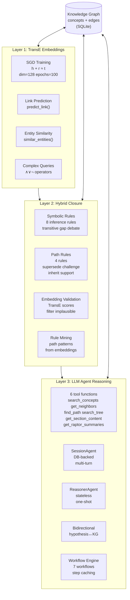
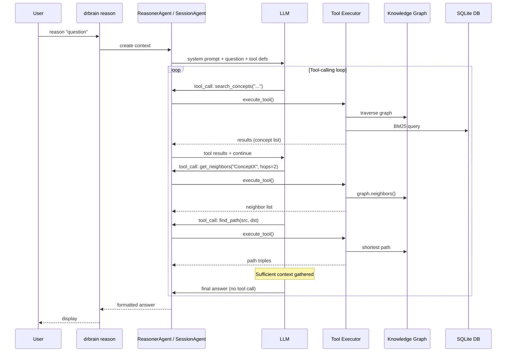
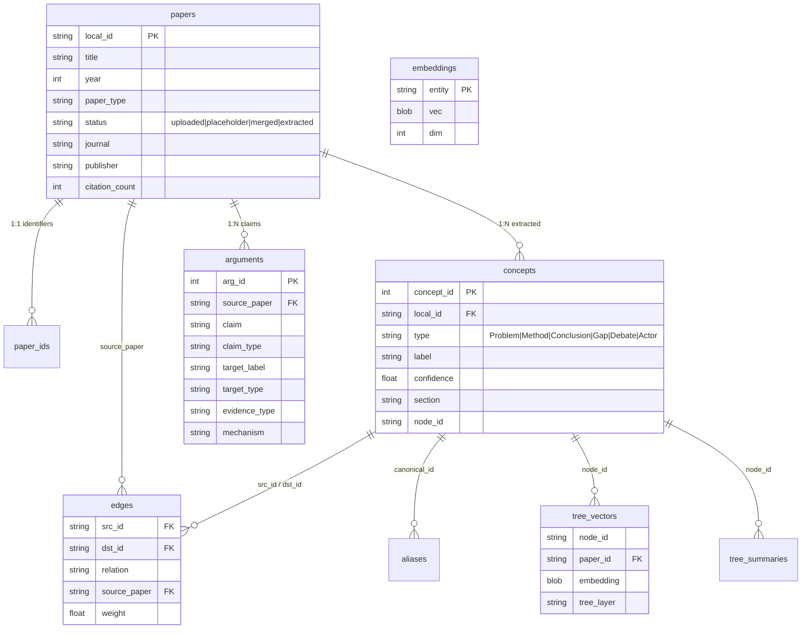

# Architecture

## Philosophy

DrBrain is **symbol-driven with lightweight vectors**. BM25 and rule-based symbolic reasoning form the core. Vectors are used only for semantically-complete tree nodes (PageIndex sections, RAPTOR summaries) to enhance retrieval -- never for arbitrary text chunks. There is no vector database dependency. `provider=none` disables vectors entirely, falling back to BM25 + LLM navigation.

Every design decision follows from a single principle: **the knowledge graph is the source of truth**. Concepts, relations, and inference rules are explicit, auditable, and human-readable. Vectors serve retrieval, not knowledge representation.

---

## System Overview

```mermaid
flowchart LR
    subgraph Input["Data In"]
        PDF[("PDF")]
        WEB[("Web URL")]
        ZOT["Zotero / BibTeX"]
    end

    subgraph Phase1["Phase 1: Ingest"]
        PARSE["MinerU<br/>PyMuPDF fallback"]
        META["5-source metadata<br/>arXiv CrossRef S2 OA DeepXiv"]
        TREE["LLM tree<br/>structuring"]
        TREE_JSON[("tree.json")]
    end

    subgraph Phase2["Phase 2: Build"]
        ONTO["Ontology<br/>Extension"]
        ENT["Entity<br/>Extraction"]
        REL["Relation<br/>Extraction"]
        COREF["Coreference<br/>Resolution"]
        REFINE["Iterative<br/>Refinement"]
    end

    subgraph Graph["Knowledge Graph"]
        KG[(("Concepts<br/>+ Edges<br/>(SQLite)"))]
        EMBED["TransE<br/>Embeddings"]
        CLOSURE["Rule Closure<br/>8+4 rules"]
        RAPTOR["RAPTOR<br/>Summaries"]
    end

    subgraph Query["Query & Reason"]
        BM25["BM25<br/>Search"]
        TREE_SEARCH["Tree<br/>Retrieval"]
        AGENT["LLM Agent<br/>tool-calling"]
        WF["Workflow<br/>Engine"]
    end

    subgraph Analysis["Analysis"]
        LINEAGE["Lineage"]
        PARADIGM["Paradigm"]
        FRONTIER["Frontier"]
        ISOMORPHISM["Isomorphism"]
    end

    PDF --> PARSE
    WEB --> PARSE
    ZOT --> META
    PARSE --> META
    META --> TREE
    TREE --> TREE_JSON

    TREE_JSON --> ONTO
    ONTO --> ENT
    ENT --> REL
    REL --> COREF
    COREF --> REFINE

    REFINE --> KG
    KG --> EMBED
    EMBED --> CLOSURE
    KG --> RAPTOR

    KG --> BM25
    KG --> TREE_SEARCH
    KG --> AGENT
    KG --> WF

    AGENT --> Analysis
    WF --> Analysis
    CLOSURE --> Analysis
```

---

## Ingestion Pipeline

### Phase 1: Ingest (Lightweight)

The `drbrain ingest` command runs a lightweight pipeline that extracts the paper's structure and metadata. No concept extraction happens here.

```
PDF → MinerU/PyMuPDF → Markdown
    → 5-source metadata cross-validation → paper_ids + papers tables
    → LLM tree structuring → tree.json
    → Status: uploaded
```

**Steps:**

1. **Parse** (`parser/mineru/` subpackage): MinerU CLI converts PDF to Markdown. Falls back to `pymupdf4llm.to_markdown()` when MinerU is unavailable. PDFs over 150 pages are split into chunks.

2. **Identify** (`extractor/concept/dedup.py`, `parser/mineru/metadata.py`): Cross-validates metadata from 5 sources -- arXiv, CrossRef, Semantic Scholar, OpenAlex, DeepXiv. Stores `title`, `year`, `doi`, `arxiv`, `s2_id`, `openalex_id` in `paper_ids`, and `journal`, `publisher`, `citation_count` in `papers`. Extracts abstract from `tree.json`.

3. **Tree** (`parser/pageindex/` subpackage): LLM structures the markdown into a hierarchical tree with section summaries. Each node has a title, summary, and optional content. The tree is stored as `papers/<id>/tree.json`.

4. **Record**: Paper inserted with status `uploaded`.

### Phase 2: Build (5-Stage LLM Extraction)

The `drbrain build` command runs a 5-stage LLM pipeline that extracts structured knowledge from the paper's section tree.

```
tree.json → [Stage 1: Ontology Extension]
          → [Stage 2: Entity Extraction]  (10-way concurrent)
          → [Stage 3: Relation Extraction]
          → [Stage 4: Coreference Resolution]
          → [Stage 5: Iterative Refinement] (skippable)
          → Status: extracted
```

**Stage 1 -- Ontology Extension:** The LLM suggests domain-specific subcategories under the 6 TBox types. For example, under `Method` it might suggest `OptimizationAlgorithm`, `RegularizationTechnique`, or `ArchitectureDesign`.

**Stage 2 -- Entity Extraction:** Per leaf-node concept extraction with subcategory labels. Runs 10 leaf nodes concurrently for throughput.

**Stage 3 -- Relation Extraction:** The LLM connects concepts using TBox-defined relations (e.g., `addresses`, `extends`, `challenges`, `solves`). Relations are typed and directed.

**Stage 4 -- Coreference Resolution:** The LLM identifies duplicate entity labels across sections and merges them.

**Stage 5 -- Iterative Refinement:** The LLM self-reviews the extraction for contradictions and errors. Skippable via `--skip-refine` to save time and API cost.

**Post-Build -- Session Injection (optional):** When `build --session` is used, a structured extraction summary is injected into a persistent `SessionAgent` session via `inject_context()`. The summary covers paper ID, concepts by type, relations, coreference merges, and refinement corrections. This context is then available to subsequent `reason --session` calls.

Paper status transitions: `uploaded` -> `extracted` (after successful build). Papers with status `placeholder` are citation-only records that haven't been ingested.

**Incremental build:** `build` is incremental by default. It selects papers whose status is not `extracted` OR that were touched (via `updated_at`) since the last successful `build` watermark. Each successful build records `set_last_run('build')`. Use `build --all` to force re-extraction of every paper regardless of state.

---

## Incremental Update System

DrBrain's pipeline (`build`, `closure`, `embed`, `index`) is **incremental by default** — adding one paper to an N-paper library no longer forces N LLM extractions or a full-graph scan. The mechanism rests on three pillars introduced in schema v8:

1. **`updated_at` columns** on `papers`, `concepts`, `edges`. Every centralized write method (`insert_paper`, `insert_edge`, `set_paper_field`, `touch_paper`, ...) bumps the timestamp. SQLite's `CURRENT_TIMESTAMP` has second precision.

2. **Stage watermarks** in `vector_metadata` (`last_run:<stage>`). Each stage records when it last ran successfully. The next run compares `max(papers.updated_at)` against the watermark to decide whether to skip or process.

3. **Dirty detection helpers** on `Database`: `get_dirty_papers()` (status != `extracted`), `get_papers_since(ts)`, `get_last_run(name)` / `set_last_run(name)`.

| Stage | Incremental behavior | Full mode |
|-------|---------------------|-----------|
| `build` | Select dirty/touched papers only | `--all` rebuilds every paper |
| `closure` | `closure_incremental()`: 2-hop neighborhood of changed concepts' labels | `--full` scans the whole graph |
| `embed` (TransE) | `train_incremental()`: warm-start all vectors, train only on edges from dirty papers with a shortened epoch budget | `--retrain` clears and retrains from scratch |
| `embed --tree` | Per-node content-hash skip (unchanged paper text not re-embedded) | always full per paper |
| `index` (BM25) | No-op if `max(updated_at) <= last_run('index')` | `--rebuild` forces full rebuild |
| `pipeline` | Each step runs in incremental mode | `--full` flag propagates to all steps |

`delete_paper` participates in the system: it touches neighbor papers sharing the deleted concepts' edges and clears the closure/embed/index watermarks, so the next pipeline run re-evaluates instead of skipping.

---

## Knowledge Graph

### TBox (Type-Level)

The type-level ontology defines 6 concept types:

| Type | Description |
|------|-------------|
| **Problem** | A research problem or challenge |
| **Method** | A technique, algorithm, or approach |
| **Conclusion** | A concluding insight or takeaway |
| **Gap** | An identified gap in the literature |
| **Debate** | A controversy or disagreement in the field |
| **Actor** | A person, organization, or research group |

Edge relations between concepts:

| Relation | Meaning |
|----------|---------|
| `addresses` | Method addresses a Problem |
| `leaves_open` | Approach leaves a Gap open |
| `points_to` | Concept points to future work or another concept |
| `proposes` | Method or Actor proposes something |
| `extends` | Method extends an existing method |
| `replaces` | Method replaces an older method |
| `solves` | Method solves a Problem |
| `supports` | Concept supports another |
| `challenges` | Concept challenges another |
| `limits` | Concept limits/restricts another |
| `constrains` | Concept constrains another |
| `affiliated_with` | Actor is affiliated with an institution |
| `contains` | Section contains a sub-section or concept (structural, auto-generated) |

### RBox (Relation-Level)

The relation-level inference system has 11 rules:

**Rules in `closure()`:**
- `transitive_closure` -- if A→B and B→C then A→C
- `creates_debate` -- if A supports X and B challenges X, creates a debate
- `gap_addressed` -- if a Gap has leaves_open and addresses, it is addressed
- `indirect_evolution` -- method lineage through extends + replaces chains
- `gap_to_debate` -- a Gap pointing to a debated target
- `shared_actor` -- papers sharing an Actor create implicit connections
- `asymmetric_violations` -- detects symmetry violations (supports vs challenges) (logged, not inferred)

**Rules in `apply_path_rules()`:**
- `method_supersedes_problem` -- a method that solves a problem supersedes it
- `challenge_chain` -- transitive challenge propagation
- `gap_inheritance` -- gaps propagate through extends relations
- `indirect_support` -- multi-hop support chains

**Hybrid closure:** The `--mode hybrid` variant weights inferred edges by TransE embedding scores. Path confidence is computed via relation composition distance.

### 3-Layer Reasoning Stack

Inspired by papers 2202.07412, 2306.08302, and 2511.11017.



### LLM Agent Reasoning Flow



When using bidirectional mode (`-b`), the agent additionally validates candidate
answers against KG constraints (TBox types, RBox relation rules) and revises them
in a multi-round loop (`--max-rounds`, default 3).

---

## Reasoning Modules

### Causal Chains
`extractor/causal_chain.py` -- `build_causal_chains()`, `find_chains_from()`, `find_path()`. Traces causal relationships through the graph: which concepts cause (or are caused by) which other concepts, with multi-hop chain building.

### Confidence Propagation
`extractor/confidence_propagation.py` -- Multi-hop confidence decay with default decay factor 0.85. Section-aware variant weights confidence differently based on which section the concept came from.

### Counterfactual Analysis
`extractor/counterfactual.py` -- Node removal impact analysis. What happens to the graph if a concept is removed? Measures connectivity impact and identifies critical nodes.

### Cross-Domain Isomorphism
`extractor/isomorphism.py` -- Subgraph similarity by relation signature. Finds structurally similar subgraphs across domains, enabling cross-domain knowledge transfer. CLI via `drbrain isomorphism` with Jaccard + label similarity scoring. See also [[workflows]] for structured reasoning workflows.

### Hypothesis Generation
`extractor/hypothesis.py` -- Generates actionable research hypotheses from gaps, debates, technology cliffs, and confidence collapse patterns.

### Knowledge Genealogy
`graph/genealogy/` subpackage -- Concept lineage trees (`evolve`, in `lineage.py`), academic offspring tracking (`descendants`), domain landscape with timeline/gaps/debates (`landscape.py`), paradigm shift detection (`paradigm.py`), cross-domain method transfer discovery (`transfer.py`), display rendering (`display.py`). All features include PageIndex provenance via `_get_concept_provenance()`. Text tree and Mermaid renderers show provenance inline.

### Rule Closure Engine
`graph/engine_closure.py` -- Symbolic rule-based inference (8 rules in `closure()`) plus path-level rules (4 rules in `apply_path_rules()`). Handles transitive closure, debate detection, gap propagation, and T-norm path materialization. Supports `--mode hybrid` with embedding-weighted edge confidence. The `closure_incremental(seed_nodes)` variant restricts rule application to the 2-hop neighborhood of seed concept labels — used by the incremental `closure` command to avoid full-graph scans when only a few papers changed.

### Embedding-Grounded Closure
`graph/engine_embeddings.py` -- TransE embedding-grounded validation for inferred edges. Computes path confidence via relation composition distance and filters implausible edges.

### Complex Graph Queries
`graph/query_embeddings.py` -- TransE complex query operators: project, intersect, union, negate. Supports `∧∨¬` logical queries over entity/relation embeddings.

### Path Reasoning
`graph/path_reasoning.py` -- Hybrid tree+graph path reasoning. Traverses from tree sections through related concepts into the graph, combining PageIndex tree navigation with graph traversal.

### Workflow Engine
`extractor/session_agent.py` -- Structured reasoning workflow engine with 7 built-in workflows (`review`, `gap-analysis`, `impact`, `compare`, `frontier`, `lineage`, `paradigm`). Workflow orchestrator executes steps sequentially with result caching (temperature=0 results cached, temperature>0 skipped). Includes workflow visualizer for pipeline diagrams and result summaries. CLI via `drbrain reason --workflow <name>`. For a full guide, see [Workflows](workflows.md).

### Session Management
`cli/session_commands.py` -- Persistent reasoning session CRUD via `drbrain session`. Commands: `new`, `ask`, `chat`, `list`, `delete`, `export`. Sessions use `SessionAgent` for multi-turn, DB-backed context continuity across CLI invocations. For deep-dive, see [Sessions](sessions.md).

### Graph Export
- `storage/graph_export.py` -- Export knowledge graphs to GraphML, JSON-LD, and Cypher formats. CLI via `drbrain graph export --format graphml|jsonld|cypher` (for Neo4j/Gephi/RDF tooling).
- `storage/okf_export.py` -- Export the knowledge graph as an **OKF (Open Knowledge Format) v0.1** markdown bundle: one `.md` per concept (`concepts/{type}/{slug}.md`) with YAML frontmatter (`type`, `title`, `tags`, `timestamp`) and a markdown body where edges become cross-links and arguments become quote blocks. Human- and agent-readable; `git clone`/`cat` consumable. CLI via `drbrain export-okf <bundle>`.

### Missing Modules

Additional modules not covered in the sections above:

#### Services
- `services/graph_to_text.py` -- LLM-powered subgraph-to-text description, used by `drbrain graph describe`
- `services/http_utils.py` -- HTTP retry decorator with exponential backoff for external API calls

#### Extractors
- `extractor/argument.py` -- Argument unit extraction and validation (claim, evidence, mechanism)
- `extractor/detection.py` -- Paper type classification (survey, empirical, theoretical, etc.)
- `extractor/citation.py` -- Citation expansion via OpenAlex + Semantic Scholar + CrossRef
- `extractor/citation_check.py` -- In-text citation verification against local library
- `extractor/canonical.py` -- Label normalization + SmartAligner for cross-section concept dedup
- `extractor/queue.py` -- Confidence queue resolution (accept/reject low-confidence items)
- `extractor/openalex.py` -- OpenAlex API client (works, authors, concepts, sources)
- `extractor/crossref.py` -- CrossRef API client (metadata, references, DOIs)
- `extractor/cache.py` -- Persistent API response cache with TTL-based eviction

#### Storage
- `storage/inbox.py` -- Inbox scanning and pending queue management (`pending.jsonl`)
- `storage/citation_graph.py` -- Citation graph queries (refs, citing papers, shared references)
- `storage/connection.py` -- WAL-mode database connection helper with thread safety

### Structure-First Retrieval
`query/tree_retrieval.py` -- Full PageIndex implementation. Iterative tree-search with adaptive depth navigation. Small skeletons get one-shot selection; large skeletons get top-level -> branch selection -> leaf selection.

### RAPTOR Recursive Semantic Tree
`extractor/raptor.py` -- Implements RAPTOR (2401.18059). Recursive embedding → UMAP → GMM+BIC clustering → LLM summarization on PageIndex leaf nodes. Builds multi-layer summary tree with `source_node_ids` provenance chains. Stored in `tree_summaries` and `tree_vectors` tables.

### Rule Mining
`extractor/rule_miner.py` -- Mines path rules from TransE relation vectors. Activated via `drbrain closure --mine-rules`. Discovers patterns like "if X addresses Y and Y extends Z, then X is likely to address Z."

---

## Search

### BM25 (`query/bm25.py`)
Standard BM25 over concept labels, arguments, and paper metadata. No vector embeddings required. The index is rebuilt via `drbrain index`.

### Graph-Enhanced Search
- `--neighbors N`: After BM25 retrieval, expand by N hops of directed graph traversal. Results include `_via_graph`, `_source_seed`, `_distance`, `_path` metadata.
- `--hybrid`: Applies multiplicative PageRank boost [1.0, 2.0] to re-rank BM25 results by graph centrality.

### PageIndex Tree Retrieval
- `--paper <id>`: Bypasses BM25. Performs **hybrid tree search** on a specific paper's section tree — LLM-guided branch/leaf selection (primary) augmented by vector similarity pre-filtering (auxiliary). Falls back to pure LLM navigation when vectors are unavailable.
- Collapsed tree mode: `query_cross_paper()` flattens all tree nodes (PageIndex + RAPTOR summaries), embeds the query, and retrieves by cosine similarity across papers. Used by ReasonerAgent's `search_tree` tool.

### RAPTOR Integration
`extractor/raptor.py` builds the recursive semantic tree. `services/embedding.py::build_paper_tree_vectors` bridges PageIndex embeddings + RAPTOR summarization. `drbrain embed --tree` executes both in one pass. RAPTOR summaries are consumed by ReasonerAgent (`get_raptor_summaries` tool) and isomorphism (`enrich_isomorphisms_with_raptor`).

### Embedding Queries (`graph query`)
Complex queries over TransE embeddings: projection, intersection, union, negation. Requires `drbrain embed`.

### Lightweight Text Embeddings
`drbrain embed --tree` generates SBERT embeddings for tree nodes (PageIndex leaves + RAPTOR summaries) via `build_paper_tree_vectors`. Stored in `tree_vectors` table with `tree_layer` tags (`pageindex`, `raptor_L1`, etc.). `search_tree()` performs brute-force cosine similarity over all tree vectors. Provider options: `local` (sentence-transformers, default: Qwen3-Embedding-0.6B), `openai-compat` (any OpenAI-compatible `/v1/embeddings` API), `none` (disable vectors). Reference: ScholarAIO embedding engine.

---

## Data Layout

```
data/
├── spool/
│   ├── inbox/            # PDFs awaiting ingest (auto-classified)
│   └── pending/          # Failed ingests + pending.jsonl
├── papers/<id>/          # Per-paper directory
│   ├── source.pdf        # Original PDF
│   ├── raw.md            # Parsed markdown (MinerU/PyMuPDF)
│   ├── tree.json         # Structured section tree (PageIndex)
│   └── images/           # Extracted figures and tables
├── drbrain.db            # Main SQLite database (WAL mode)
├── metrics.db            # LLM token usage tracking
├── cache/                # API response cache (rebuildable)
├── logs/                 # Application logs (loguru, rotating)
├── backups/              # tar.gz backups
└── reports/              # Per-paper JSON analysis reports

workspace/<name>/         # Paper subsets
├── workspace.yaml        # Metadata
└── refs/papers.json      # Paper list

config.yaml               # Base config (checked in)
config.local.yaml         # Local overrides + secrets (gitignored)
```

### Database Schema (`storage/database.py`)

Key tables:
- `papers` -- title, year, journal, paper_type, status, abstract, citation_count
- `paper_ids` -- doi, arxiv, s2_id, openalex_id (cross-reference)
- `concepts` -- label, type, confidence, section, node_id, source_paper
- `edges` -- src_id, dst_id, relation, source_paper, confidence, node_id, section
- `arguments` -- claim, claim_type, target, section, node_id, source_paper
- `aliases` -- canonical_id, variant (for dedup)
- `embeddings` -- TransE entity/relation vectors
- `tree_vectors` -- per-node embeddings (node_id, paper_id, embedding BLOB, content_hash, tree_layer)
- `tree_summaries` -- RAPTOR recursive summaries (node_id, paper_id, summary_text, source_node_ids, tree_layer)
- `vector_metadata` -- embedding signature tracking (key, value); also stores `last_run:<stage>` watermarks for incremental updates
- `citation_cache` -- expanded citations from APIs
- `queue` -- pending confidence items for human review
- `build_stages` -- per-paper pipeline stage status (paper_id, stage, status, result_json) for agent idempotency
- `schema_versions` -- versioned migrations (currently v8)

The database uses **WAL mode** for concurrent read/write access. Schema migrations are versioned in `schema_versions` and applied automatically on `Database.__init__` via `_migrate()`. Each migration detects the target column/table via `PRAGMA table_info` and uses `ALTER TABLE` (idempotent). Current version 8 (`change_tracking`) added `updated_at` columns to `papers`/`concepts`/`edges` — the foundation of the incremental update system.

**Centralized writes:** `Database` is the sole write surface. All `INSERT`/`UPDATE`/`DELETE` go through `Database` methods (`insert_paper`, `set_paper_field`, `merge_papers`, `upsert_build_stage`, etc.). Application-layer code must not write raw SQL — this guarantees `updated_at` is bumped, transactions are used for multi-step operations, and column allowlists prevent injection via dynamic field names. Read-only `SELECT` is tolerated in callers.



### Atomic Writes

All file writes use the **tmp -> rename** pattern for crash safety:
1. Write to `<path>.tmp`
2. `os.rename(<path>.tmp, <path>)`

---

## Key Design Decisions

### Lightweight Vectors for Retrieval
Vectors are used only for semantically-complete tree nodes (PageIndex sections, RAPTOR summaries) to accelerate retrieval. Never for arbitrary text chunks. `provider=none` disables all vectors, falling back to pure BM25 + LLM navigation. Embeddings are stored in SQLite alongside everything else -- no separate vector database.

### SQLite with WAL
A single SQLite file with WAL mode is the only database. Simple, portable, no server needed. Concurrent reads work well under WAL mode. Appropriate for a personal research tool.

### Atomic Writes (tmp -> rename)
Throughout the codebase, file writes go to a temporary file first, then atomically rename into place. This prevents partial writes from corrupting state.

### Typed Config
`Config` is a typed dataclass (`config.py`) with sub-configs: `LLMConfig`, `MinerUConfig`, `APIConfig`, `DirsConfig`, `DBConfig`, `ExtractConfig`, `BM25Config`, `QueueConfig`. Loaded from `config.yaml` (checked in) overlaid by `config.local.yaml` (gitignored, contains secrets). Environment variable placeholders `${VAR_NAME}` are resolved at load time.

### LLM Fallback Chain
`acall_with_fallback()` iterates through the configured model list. First successful parse wins. Returns `None` if all models are exhausted. Supports any litellm provider (OpenAI, Anthropic, Ollama, plus OpenAI-compatible endpoints like DeepSeek, Zhipu, Bailian).

### Section Provenance
The `section` field flows from LLM extraction through the database and into all reasoning layers. This enables section-aware confidence decay, counterfactual weighting, isomorphism signatures, and hypothesis evidence grounding.

### Symbol-Driven Reasoning
Graph closure rules, transitive closure, asymmetric detection, causal chains, confidence propagation, counterfactuals, and isomorphism detection are all rule-based. Zero embeddings required for core reasoning.

### Agent-Based Pipeline
The 5-stage LLM pipeline (`extractor/agent.py`) wraps each stage as a dedicated `BuildAgent` subclass (OntologyAgent, EntityAgent, RelationAgent, CorefAgent, RefineAgent). Agents have independent system prompts, input/output validation contracts, and idempotency guards via `build_stages` DB table. Inspired by 2511.11017's agent-based KG construction workflow.

### Concurrent Extraction
Stage 2 (entity extraction) runs with 10-way concurrency on leaf nodes. Translation uses ThreadPoolExecutor for concurrent chunk translation.

### Data Quality
`drbrain audit` applies 15 severity-graded rules covering paper metadata, concept integrity, edge consistency, and graph structure. PDF pre-validation detects encryption and corruption before ingest. Three non-blocking quality gates run during ingest.

### Incremental by Default
The pipeline (`build`/`closure`/`embed`/`index`) is incremental by default — see [Incremental Update System](#incremental-update-system) above. Adding one paper to an N-paper library only re-processes the new paper and its 2-hop neighborhood; existing embeddings are warm-started and micro-adjusted rather than discarded. Stage watermarks (`last_run:<stage>` in `vector_metadata`) drive the skip logic. `--all` / `--full` / `--retrain` escape hatches force full rebuilds when needed.

### Centralized Write Surface
`Database` is the only component that writes to SQLite. Application code calls methods like `set_paper_field`, `merge_papers`, `upsert_build_stage` — never raw `INSERT`/`UPDATE`/`DELETE`. This enforces `updated_at` bumping, transactional multi-step operations (e.g. `merge_papers` runs concept/argument/edge migration + source deletion in one `BEGIN`/`COMMIT`), and column-name allowlists. Read-only `SELECT` remains tolerated in callers.

### New Modules (v0.1.0a2)

| Area | Key files | What |
|------|-----------|------|
| Providers | `providers/webtools.py`, `providers/uspto_odp.py`, `providers/uspto_ppubs.py` | Web extraction via qt-web-extractor, USPTO patent search (ODP + PPUBS) |
| Citation styles | `services/citation_styles.py` | 4 built-in styles (APA, Vancouver, Chicago, MLA) + dynamic custom style loading |
| Document inspection | `services/document.py` | Structured Office document summaries (DOCX, PPTX, XLSX) without GUI |
| Federated search | `services/fsearch.py` | Cross-source search: local DB + arXiv with ingested annotation |
| Pipeline | `services/pipeline.py` | Step chaining with presets (full/quick/embed) and custom step lists |
| Metadata enrichment | `services/enrich.py` | CrossRef backfill for missing fields, scrub-suspect detection |
| Metrics panel | `services/metrics_panel.py` | User behavior analytics: top keywords, most-read papers, weekly trends |
| Parser benchmark | `services/parser_benchmark.py` | Compare MinerU, PyMuPDF, pymupdf4llm output with timing stats |
| Proceedings | `storage/proceedings.py` | JSON-backed conference proceedings registry |
| Explore silos | `storage/explore.py` | Lightweight JSONL discovery collections with keyword search |
| Bilingual setup | `cli/_setup_i18n.py` | 78 translation keys for EN/ZH interactive setup wizard |
