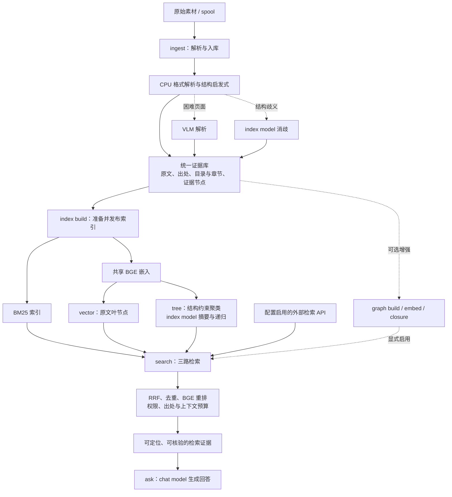

CLI 与 RAG 数据流重排方案，2026-09-15。

状态：根据本轮讨论整理的目标职责与命名，尚未修改 CLI 实现。当前代码的实际路径见 [RAG 管线全景](reviews/rag-pipeline-panorama-2026-09-15.md)。

**你的理解基本成立：素材经过尽量便宜的解析和结构化，进入统一证据存储；在同一份素材上准备 BM25、vector、融合 PageIndex/RAPTOR 能力的 tree，检索融合后再回答。知识图谱以后消费这些证据，再作为可选检索路加入。**

需要明确三个边界。

1. 文档结构与语义摘要是两层工作。标题、章节、页码、段落、目录关系通常可以先用格式解析与启发式规则提取；困难页面按需使用 VLM，结构歧义按需使用 index model。RAPTOR 的聚类可以在 CPU 执行，但接受一个新语义区域后生成其摘要，仍是 index model 的常规工作，不能算作只在解析失败时才发生的兜底调用。“大部分不用模型”是应当测量的效率目标。
2. 文件系统目录、文档章节与语义主题可以共用一个节点注册表和读取接口，但关系含义不同。目录表达材料组织，章节表达阅读顺序，主题表达语义成员关系；同一段证据可以属于多个主题。展示成文件系统式目录，不意味着把所有关系限制为一个单父节点目录树，也不需要另建一套 PageIndex SDK 文献库。
3. tree 路不是把两棵树各查一遍。它在同一份证据上使用结构约束的语义组织、区域摘要和层次展开。查询时可以用向量、关键词与启发式预算选入口和展开；需要推理的导航再交给 chat model。启发式导航和模型导航的质量、延迟与调用量需要分别验收，不能因采用了新名字就视为完成了融合算法。

目标主线如下：

模型调用按工作职责分配，不按某个算法库的名字分配。

| 工作 | 默认计算方式 | 模型角色 |
| --- | --- | --- |
| 常规格式解析、目录与章节识别、定位 | CPU 与启发式规则 | 无 LLM |
| 扫描页、困难图文页面理解 | 按页调用 OCR/VLM | parser/VLM 独立配置 |
| 结构消歧、语义区域摘要 | 按需调用并缓存 | index model：Spark 4B |
| 原文、摘要、查询嵌入 | BGE CPU，共享计算及版本身份 | embed |
| 问题与片段重排 | BGE CrossEncoder CPU | rerank |
| 复杂查询导航、最终回答 | 有预算的推理调用 | chat model：DeepSeek |

构建过程不能因 index model 不可达而静默改用 chat model。查询过程也不应因为缺索引就临时提交原文、重新解析或建树。

**CLI 的主要入口收敛为 `ingest → index build → search / ask`。** 使用者只需区分素材、索引、证据和回答，不必分别手动运行 PageIndex、RAPTOR 和 embedding 才能完成一次索引准备。

| 目标命令 | 用户可理解的职责 | 完成时保证 |
| --- | --- | --- |
| `drbrain ingest <素材或目录>` | 解析、身份去重、保存原件与规范正文、登记结构和出处 | 素材可定位且可恢复；准确报告待索引状态 |
| `drbrain index build` | 增量准备已启用的检索路及共享依赖，并发布一个可查询版本 | search/ask 能读取这一版本；失败阶段不会报 ready |
| `drbrain index status` | 查看每路就绪状态、版本、待处理数量和失败原因 | 区分已入库、已建索引、可检索 |
| `drbrain index verify` | 校验正文、节点、向量、成员关系与版本的一致性 | 报告缺失、过期、无法定位等实际问题 |
| `drbrain search "问题"` | 三路检索、融合、重排，返回证据 | 返回来源、正文定位、路由和版本，不生成最终答案 |
| `drbrain ask "问题"` | 使用相同检索链，附加回答生成 | 回答引用实际读取的证据 |
| `drbrain graph build` | 从已入库的树证据抽取概念、关系和论证 | 图谱对象可以追溯至材料节点 |
| `drbrain graph embed` | 训练知识图谱嵌入 | 与 BGE 文本嵌入职责明确分开 |
| `drbrain graph closure` | 图谱规则推理与关系增强 | 增强事实保留推导及来源 |

`search` 不生成最终答案，不等于保证全程零 LLM；如果所选 tree 导航策略需要推理，会使用配置的 chat model，并在调用统计中体现。默认召回路只保留 `bm25/vector/tree`；以后增加 `graph` 是显式配置，不成为入库或普通 RAG 的前置条件。

LlamaIndex 用作 BM25、向量检索、融合与回答编排的框架。优先复用其 BM25Retriever、VectorStoreIndex/向量存储适配接口；统一 tree 通过检索器接口接入。文本切分、证据 ID 和向量身份由项目统一管理，不能让框架另切一套无法对应原文的片段。BM25 与向量索引的持久化方式仍需满足规范正文只存一次、共享向量和版本一致性的约束；若标准组件的默认存储不满足约束，就适配其接口并做一致性测试。

外部 API 分两类处理：模型 API 绑定上述明确角色；外部资料检索 API 作为可配置的来源适配器，转换为同一证据格式，保留 URL、来源及可获得的正文定位。检索结果是否入库应是显式动作，不把一次外部搜索自动变成永久材料。

当前命名迁移应按下表处理。它定义最终归属，不表示直接给每个旧函数增加一个别名即可完成。

| 当前入口 | 目标归属 | 迁移要点 |
| --- | --- | --- |
| `ingest` | 保留 | 移除生产必写的旧 MD/树 JSON 副本，落实统一正文与出处 |
| `rag prepare`、`rag prepare --unified`、`rag index`、`embed --tree` | `index build` | 合并阶段调度；共享嵌入，采用同一发布协议，不再要求用户选择两套索引库 |
| 顶层 `index`，目前只重建旧 BM25 | `index build` 的词法索引阶段 | 全文、向量、tree 的依赖由构建器计算；高级用户可显式限定检索路 |
| 当前全文检索入口、RAG 检索入口 | `search` | 使用与 ask 相同的证据检索服务 |
| 旧 `search` 中的文献元数据筛选 | `library search` | 保留书目检索能力，与证据检索语义区分 |
| 旧 `query` 中的概念/关系与图遍历 | `graph query` | 旧 `--paper` 文档证据检索迁入 `search --paper` |
| `fsearch` | `search` 的来源选择 | 本地与外部 provider 可配置，默认来源必须明确 |
| `ask` | 保留 | 复用 search 的路由、筛选与索引版本 |
| 顶层 `build` | `graph build` | 不再让“build”同时暗示全文索引和 KG 抽取 |
| `embed --graph`、裸 `embed` | `graph embed` | 旧调用保留一段兼容期并给出迁移提示；不静默改变裸命令含义 |
| 顶层 `closure` | `graph closure` | 图谱能力集中在 graph 命名空间 |
| PageIndex/RAPTOR 独立实验入口 | 评测或开发命令 | 不作为生产主线的必要步骤 |

兼容期内，旧命令的退出码与 JSON 输出契约继续保持，迁移提示写 stderr。旧 `search/query` 与新入口存在语义差异，必须分别验证过滤参数和结果类型，不能简单重定向。帮助页优先展示新的数据流；兼容入口在明确迁移周期后退出主帮助页。

重构的验收顺序如下：

1. 固定命令职责与状态契约，先写 CLI 测试：入库完成不等于所有索引 ready；缺索引错误给出的补救命令必须确实准备查询所需产物。
2. 修复统一树已确认的结构权重、摘要失败重试、嵌入复用和导航问题，使它满足[原子化计划](unified-tree-atomic-plan.md)的实际契约。
3. 统一构建和读取入口：`index build` 发布的 generation 被 `search` 和 `ask` 同时读取；三路使用同一证据身份，tree 确实展开区域成员，而不是重复一次 vector 检索。
4. 调整 CLI 注册、帮助页、旧命令兼容层和调用方。生产主线不再暴露 `--unified` 作为新旧数据库选择开关。
5. 用 PDF、TeX、SciBase Markdown 的小样本走真实 CLI 验收；记录 CPU/VLM/LLM 调用占比、耗时、缓存复用、出处正确性和各路状态。测试失败不得标记全部完成。
6. 审计并复用现有 10k 入库结果，补齐缺失索引；验证增量重复运行无多余解析、嵌入和摘要调用，再验收可选 graph 路。

这个重构的完成标准，是同一套证据能沿清楚的命令主线完成入库、准备、检索和回答，并保留未来图谱增强的入口。名称调整与索引接入需要一同验收；当前代码尚未满足这些条件。
