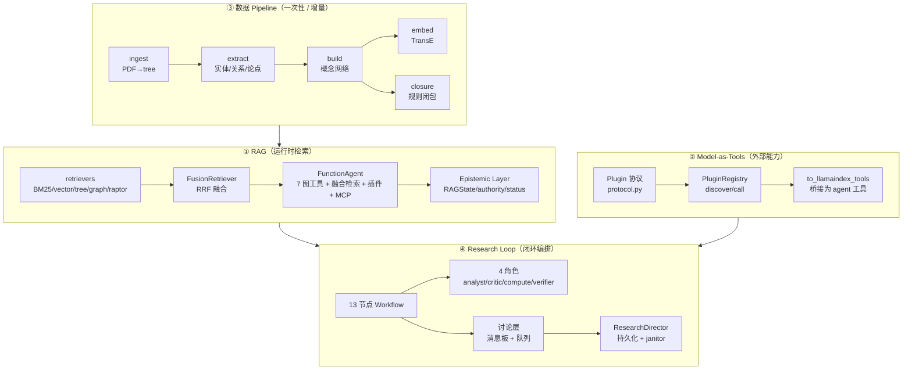
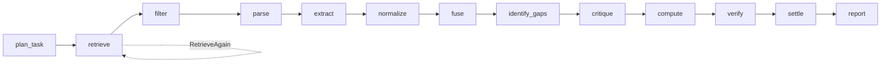
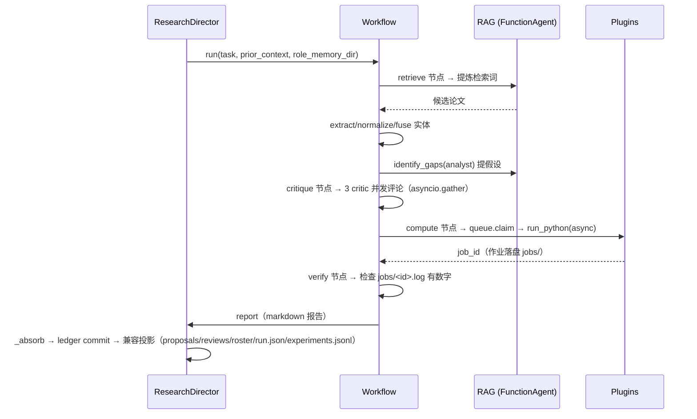

# DrBrain 完整架构 — RAG · Pipeline · Model-as-Tools · Research Loop

> 版本：2026-08-15 现役 · 覆盖四块核心设计：轻量向量 RAG、数据 Pipeline、Model-as-Tools 插件层、对标 AutoScientists 的研究 Loop。
> 本文是**当前代码的权威描述**——所有模块名、类名、方法名、配置字段均来自 `src/drbrain/` 实际实现，非设计愿景。

---

## 目录

1. [系统总览](#一系统总览)
2. [RAG 设计](#二rag-设计)
3. [数据 Pipeline 设计](#三数据-pipeline-设计)
4. [Model-as-Tools 设计](#四model-as-tools-设计)
5. [Research Loop 设计（对标 AutoScientists）](#五research-loop-设计对标-autoscientists)
6. [三块如何协同](#六三块如何协同)
7. [目录与配置](#七目录与配置)
8. [当前状态与下一步](#八当前状态与下一步)

---

## 一、系统总览

DrBrain 是一个 **符号驱动的学术知识图谱 + 轻量向量检索 + 多 agent 研究闭环** 系统。它把"读文献 → 建图 → 检索 → 提假设 → 讨论 → 实算 → 核验 → 沉淀"整条科研自动化链串成三个正交但协同的层：



**设计哲学**（贯穿全部四块）：

- **知识图谱是唯一事实源**（source of truth）。概念、关系、规则显式、可审计、人类可读；向量只服务检索，不服务知识表示。
- **领域无关核心 + 外部插件**：推理核心（检索/抽取/编排）不绑定任何学科；材料模型、DFT、软件能力走插件外部加载。换学科 = 换插件，不动核心。
- **确定性骨架 + agent 化节点**：Loop 是确定的 13 节点 DAG，只在需要推理的节点（提假设、评论、计算、核验）挂 agent；agent 的输出用 JSON contract 约束，下游代码做确定性分类与门控。

---

## 二、RAG 设计

目录：`src/drbrain/rag/`（15 模块）。

### 2.1 核心定位

RAG 层全面接管 LlamaIndex 的检索/合成/Agent/评估，但**保持符号优先**：

- BM25 与规则化符号推理是核心；向量只用于语义完整的树节点（PageIndex 章节、RAPTOR 摘要），从不对任意文本块做向量。
- 无向量数据库依赖；`provider=none` 可完全禁用向量，回退到 BM25 + LLM 导航。

### 2.2 检索器（retrievers.py）

| 检索器 | 说明 |
|---|---|
| `BM25Retriever` | 持久化 BM25，全文/标题/概念/论点检索 |
| `VectorStoreIndex` | 语义完整节点（树节点/RAPTOR 摘要）的向量 |
| `DrbrainTreeRetriever` | PageIndex 树结构，LLM 优先 + 向量合并，支持父章节扩展 |
| `DrbrainGraphRetriever` | 图邻域检索（概念网络 + TransE 相似） |
| `DrbrainRAPTORRetriever` | RAPTOR 两阶段树遍历检索 |

### 2.3 融合检索（fusion.py）

`FusionRetriever` 对多条腿做 **RRF（Reciprocal Rank Fusion）** 融合：

```python
build_fusion_retriever(cfg, vector_index, bm25_retriever, custom_retrievers, ...)
get_retrievers(cfg, db, graph)  # 按 llamaindex.retrievers 配置装配 legs
```

- **模式**：`reciprocal_rank`（标准 RRF，k=60）或 `weighted`（带 `weights` 的加权 RRF）。
- **容错**：单腿失败 → 记录 `RetrievalStatus` 并跳过；全部腿失败 → 抛 `RetrievalError`（拒绝合成，不降级成空结果）。
- **ACL 后置过滤**：`acl_filter` 在检索层强制租户隔离（`metadata[key]` 匹配，缺 key 默认拒绝），不把"别泄密"交给 prompt。

### 2.4 Agent（agent.py）

`build_agent(cfg, db, graph, plugins_dir, mcp_servers)` 构建 `FunctionAgent`，工具面 = 三部分：

1. **7 个图工具**（`agent_tools.execute_tool` 分发的标准工具：查概念/邻居/论文文本/引文等）。
2. **融合检索工具 `search_documents`**（`_build_retrieval_tool`：只有在磁盘上真有 index/legs 时才注册，否则退回 8 图工具）。
3. **外部插件工具**（`PluginRegistry.to_llamaindex_tools`）+ **MCP 工具**（`mcp_tools.py`，任意 stdio MCP server 接入）。

`DrbrainLLM` 桥接 LiteLLM，支持 `api_keys` 列表轮转（round-robin）与 per-agent 固定 key（`resolve_agent_key`）。

### 2.5 Epistemic Layer（权威/状态/status）

生产级 RAG 围绕 **Entity / Event / Claim / Evidence / State / Verification** 六元组：

| 模块 | 职责 |
|---|---|
| `state.py` — `RAGState` | 逐轮填充的对话状态机（`entity_ids`/`intent`/`attribute`/`period`/`tenant_id`/`user_id`/`snapshot_id`），支持 `resolve_reference` 指代消解 |
| `authority.py` | 同一 label 冲突 claim 的**确定性**消解（权威层级 → `valid_from` 新鲜度 → 抽取置信度），不交给 LLM 猜；区分 `stale`（事实过期）与 `no_evidence`（无候选） |
| `status.py` | 检索/合成的状态分类（`classify_failure` → `RetrievalStatus`） |

### 2.6 评估与重排

`eval.py`（RAG 评估）、`rerank.py`（重排）、`engine.py`（T5 查询引擎）补全检索质量闭环。

---

## 三、数据 Pipeline 设计

一次性/增量数据流水线，产出 RAG 与 Loop 消费的知识图谱。

```mermaid
flowchart LR
    PDF["PDF/URL/Zotero"] --> PARSE["parser<br/>MinerU + PageIndex 树"]
    PARSE --> META["5 源元数据<br/>arXiv/CrossRef/S2/OA/DeepXiv"]
    PARSE --> EXT["extractor<br/>LLM 抽取"]
    EXT --> ENT["实体抽取"] & REL["关系抽取"] & CORE["共指消解"] & REF["迭代精修"]
    ENT & REL & CORE & REF --> KG[(("概念网络<br/>SQLite schema v15"))]
    KG --> EMB["embed<br/>TransE 嵌入"]
    KG --> CLOSURE["closure<br/>规则闭包 8+4"]
    KG --> RAPTOR["RAPTOR 摘要"]
```

### 3.1 Ingest（parser/）

- **MinerU** PDF 解析 + **PageIndex** 树解析器：把 PDF 结构化成章节树（`tree.json`），这是后续 RAG 树检索的语义单元。
- 5 源元数据归一（arXiv / CrossRef / Semantic Scholar / OpenAlex / DeepXiv）。

### 3.2 Build（extractor/ + graph/）

- **LLM 抽取**：实体（concept）、关系（relation）、论点（argument/claim）、共指消解、迭代精修。
- **概念网络**：概念节点 + 关系边，落 SQLite（`src/drbrain/storage/`，schema v15，集中化写入）。
- **嵌入**：TransE 图嵌入（`graph/` 的 learn/predict/similar，支持增量训练）。
- **闭包**：规则闭包推断新关系（8 基础规则 + 4 扩展规则）。
- **RAPTOR**：两阶段树遍历摘要。

### 3.3 现状规模（大规模语料）

概念网络 ~60 万节点 + 共现 ~2200 万边 + 嵌入 ~60 万×10 维（语料工作区 local-only，不入版本库）。

---

## 四、Model-as-Tools 设计

目录：`src/drbrain/plugins/`（只 ship 接口抽象）+ `research/plugins/`（具体插件，外部加载）。

### 4.1 插件协议（protocol.py）

```python
Plugin(name, description, plugin_type, backend, input_schema,
       summary_fields, on_failure, timeout_s)
PluginResult(status, data, evidence, error)
ResultStatus  # OK / TIMEOUT / INVALID_INPUT / MODEL_UNAVAILABLE / NO_RESULT
```

- `plugin_type`：`model`（训练好的模型）/ `software`（软件/DFT 工具）/ `data`（数据源）/ `formula`。
- `backend`：`subprocess`（外部进程）/ `inprocess`（进程内函数）/ `static`。
- `on_failure` + `timeout_s`：降级语义（失败 → 调用方弃权，异常不传播进推理循环）。

### 4.2 注册表（registry.py）

```python
PluginRegistry.register(plugin, handler)   # 幂等注册
PluginRegistry.discover(plugin_dir)        # 从外部目录 import 每个 *.py 的 register()
PluginRegistry.call(name, arguments)       # 带超时 + 异常分类的调用
PluginRegistry.to_llamaindex_tools()       # 桥接为 LlamaIndex FunctionTool
```

- `discover` 逐模块 import，坏插件只跳过不影响其余。
- `call` 永不因插件侧失败抛异常：超时 → `TIMEOUT`，schema 不符 → `INVALID_INPUT`，其他 → `MODEL_UNAVAILABLE`，无输出 → `NO_RESULT`。

### 4.3 插件分层（关键设计决策）

外部能力分两层，决定"人预写"还是"agent 自写"：

| 层 | 内容 | 例子 | 谁写 |
|---|---|---|---|
| **Layer 1 预写模型插件** | 稳定可复用的训练模型 | `predict_flatness`(GBDT 平带度)、`predict_formation_energy`/`predict_band_gap`(Route A)、`predict_research_gaps`(DRT-GNN)、`generate_synthesis_route`(Route C)、引文网络 | 人预写成插件 |
| **Layer 2 clone-skill + 自写 DFT** | 软件使用 + 需要 agent 现场决定内容的计算 | `read_skill`/`list_skills`（读克隆的 hpc-qe/hpc-lammps/materials-env skill）、`run_python`(mode=async) + `check_job`(轮询后台作业)、`sciverse_search`/`sciverse_paper_schema`(数据) | agent 现场自写代码 + 轮询 |

**核心原则**：预测材料性质这类需要"算证据结果"的任务，人不用预写——agent 通过 `run_python(mode=async)` 自主写 DFT 代码、落盘作业、`check_job` 轮询、查日志找问题修复。跑一次一小时的 DFT，中途检查日志路径是 agent 的事。

现役 29 个插件（`research/plugins/`，local-only），覆盖模型/软件/数据三类。

---

## 五、Research Loop 设计（对标 AutoScientists）

目录：`src/drbrain/loop/`（8 个执行模块 + package init）。

### 5.1 对标结论

drbrain 的 Loop **对齐 AutoScientists（mims-harvard/AutoScientists）的机制语义，不复刻其运行时**。AutoScientists 的运行时是「1 orchestrator + 10 独立 Claude Code session + 本地 Node 服务 ClawInstitute（workshop 消息板 + workspace 版本化文件）」；drbrain 是「单进程 LlamaIndex Workflow 的 13 节点 DAG + 进程内消息板/队列」。对表如下：

| AutoScientists 机制 | drbrain 落地 |
|---|---|
| 独立 agent session（自带 CLAUDE.md + memory） | 4 角色 agent-backed 节点（`build_node_agent(role=...)` 换 system prompt） |
| workshop 消息板（post/comment，8 种 post type） | `discussion.py` — `MessageBoard` |
| queue.md（pending/claims + If-Match 乐观锁 claim） | `discussion.py` — `ResearchQueue`（`claim()` 跳过 pending，version 计数对齐 If-Match） |
| **Discussion-Before-Queuing**（proposal 需 ≥1 非作者 comment） | `critique` 节点：多 critic 并发评论 → 非作者门 → 入队 |
| monitor janitor（stale claim release） | `director._janitor_scan` |
| durable run ledger（run / step / attempt / event） | `store.py` + `state.py` + `transitions.py`；`ledger.sqlite3`（WAL）是新 run 的事实源，旧文件是兼容投影 |
| teams/roster.md 团队名单 | `director._save_roster` |
| HEARTBEAT Mode Selector（Discussion/No-Team/Normal） | `state["mode"]`（discussion/execute）+ pending 跨轮传递 |

### 5.2 13 节点 Workflow（workflow.py）



| # | 节点 | 角色 | 职责 |
|---|---|---|---|
| 1 | `plan_task` | — | 解析研究任务 |
| 2 | `retrieve` | — | agent 提炼检索词 → `_direct_search` 抓候选（确定性插件检索，非融合） |
| 3-7 | `filter`/`parse`/`extract`/`normalize`/`fuse` | — | 清洗/解析/抽取实体/归一化/融合候选 |
| 8 | `identify_gaps` | **analyst** | 从证据提可证伪假设（statement+prediction+falsification 三字段，禁止占位符），T6 去重 |
| 9 | `critique` | **critic** × N | **讨论门**：多 critic 并发评论 → 非作者门 → 入队/标 pending |
| 10 | `compute` | **compute** | 从 queue claim（拒绝 pending），`run_python(async)` 实算，返回 job_id |
| 11 | `verify` | **verifier** | 只统计证据 Supports/Refutes/Orthogonal；T4 实算门（job 落盘有数字才算 verified） |
| 12 | `settle` | — | 核验结论写回 KG claims 表 |
| 13 | `report` | — | agent 生成结构化 markdown 报告（`_build_template_report` 兜底） |

### 5.3 角色分化（roles.py，T1）

四个 agent-backed 节点用**不同的 system prompt + 严格的 JSON OUTPUT CONTRACT**，领域无关：

| 角色 | 契约 | 关键约束 |
|---|---|---|
| `ANALYST` | `{"gaps":[...], "hypotheses":[{statement,prediction,falsification,conditions}]}` | 必须三字段齐全；缺 prediction 直接丢弃；禁止「缺少机制/证据不足/需进一步研究」占位符（AutoScientists ROLE-ANALYST Rule 2：documentation ≠ work）；不同假设必须不同 prediction |
| `CRITIC` | `{"hypotheses":[{statement,score,flaw}]}` | 只从假设本身推理，不检索不算；低分 DISCARD 被代码门过滤 |
| `COMPUTE` | `{"results":[{statement,job_id,computed}]}` | 唯一职责是跑实验落盘；evidence 是 job_id + 落盘文件，不是 computed 文字摘要 |
| `VERIFIER` | `{"verifications":[{statement,supports,refutes,orthogonal,evidence}]}` | 只报证据计数，下游代码从计数推导 verdict；不实算、不编造 |

### 5.4 讨论层（discussion.py，本次新增）

**消息板 `MessageBoard`** + **研究队列 `ResearchQueue`**，对齐 ClawInstitute workshop/workspace：

- `MessageBoard.post(post_type, author, content)` / `comment(...)` / `non_author_comments(post_id, author)`；8 种 post type：`[PROPOSAL]/[RESULT]/[DISCUSSION]/[NEAR-MISS]/[AUDIT]/[DISCUSSION-TRIGGER]/[DISCUSS-DONE]/[TEAM-REFORMED]`。
- `ResearchQueue.add` / `claim(agent)` / `release`；`claim()` 跳过 `discussion_pending=True` 条目（镜像 ROLE-GPU Step 3「拒绝 claim 未讨论 proposal」），线程锁保证原子（单进程 If-Match 等价），`version` 单调递增对齐版本号。

**Discussion-Before-Queuing 门**（`critique` 节点，灵魂机制）：

1. analyst 提的每个 hypothesis 作为 `[PROPOSAL]` post 到消息板（author=analyst）。
2. **N 个 critic agent 并发**（`asyncio.gather`，`n_critics` 默认 3）各自独立评审，评论归到对应 proposal。
3. 每个 proposal 检查 `non_author_comments`（author≠analyst）：
   - **≥1 非作者评论** → 取均值分，`mean < 阈值` 或全 DISCARD → `discarded`（不入队）；否则 `critiqued` → 入队 `discussion_pending=False`。
   - **无评论** → `proposed`，入队 `discussion_pending=True`（下一轮补评论，不 DISCARD）。

### 5.5 编排与持久化（director.py）

`ResearchDirector` 是纯协调者（对齐 AutoScientists「orchestrator 只 launch + harvest，不训练」）。新 run 的持久化顺序是 **ledger 事务提交 → 兼容文件投影**：

- `workspace/autoresearch/ledger.sqlite3` 是独立于知识图谱主库的 SQLite/WAL 运行账本，包含 `research_runs`、`research_steps`、`research_attempts`、`research_events`。`TransitionService` 是唯一的 run/step 状态写入口。
- 每个 cycle 先在同一 ledger 事务中结算 step/attempt 并追加 snapshot event，再生成既有 Markdown、JSON、trace 和 JSONL 文件。若投影中断，下一次 `ResearchDirector.run()` 按 `last_projected_event` 重放已提交的 cycle。
- 旧 topic 首次接入只写一条 `legacy_snapshot_imported` 事件，不重写历史文件。PR 1 只保证 cycle 边界与投影恢复；节点级 Context checkpoint/resume 属于后续阶段，未完成 cycle 会保留为 `unknown` 审计记录。

- **循环**：`while cycles < max_cycles` → `_run_cycle`（建 workflow 跑一轮）→ `_absorb`（分类 champion/dead-end）→ 落盘 → stagnation 检测 → adapt。
- **兼容投影文件**（`workspace/autoresearch/<topic>/`）：

| 文件 | 职责 |
|---|---|
| `workspace/autoresearch/ledger.sqlite3` | 新 run 的 canonical run/step/attempt/event ledger（WAL；不并入知识图谱 schema） |
| `run.json` | 运行时续跑状态（cycles/no_gain/adaptations/pending/mode/时间戳） |
| `champion.md` / `dead_ends.md` | 已验证结论 / 已否定假设 |
| `knowledge/patterns.md` | 获胜模式 + 死胡同 + 耗尽方向 |
| `knowledge/role-{critic,verifier}.md` | per-agent 跨轮记忆（T7） |
| `knowledge/proposals.md` / `reviews.md` | 讨论消息板落盘（T8，pending 假设不写 review） |
| `teams/roster.md` | 团队名单（T8） |
| `results/cycle-NNN.md` | 每轮结果 |
| `traces/cycle-NNN.json` | 完整 ResearchState 可审计快照 |
| `logs/experiments.jsonl` / `sessions.jsonl` / `janitor.jsonl` | 兼容审计投影 + 会话 + janitor 记录 |
| `jobs/` | compute 作业落盘（run_python async 的 .py/.json/.log） |

- **T8 endorsement**：`_critic_vetoes_direction`（critic 独立否决当前方向 → 结构性转向）。
- **T-janitor**：`_janitor_scan` 扫描 stale 作业（有 claim 无数值结果 → 释放 + 警告不信任其证据）。
- **Mode Selector**：每轮从 `rs.hypotheses` 收集 `status=="proposed"` 的 pending，落盘 `run.json` 并注入下一轮 `prior_context`（「上轮提出但未讨论完的假设，本轮 critic 需重新独立评审」）。

### 5.6 实算门（T4 反伪造）

`verify` 只信任 `job_id` → `jobs/<id>.log` **存在且含可解析数字**；空/缺失 → 降级为 prediction。这是防「幻影 KEEP」的硬门（对齐 ROLE-GPU「result.stdout 是硬输出」）。

---

## 六、三块如何协同

一个完整的 loop 周期里，三块的协作：



**关键数据流**：

- Loop 的 agent 节点通过 `build_node_agent(role=...)` 复用 RAG 的 `build_agent`（7 图工具 + 融合检索 + 插件 + MCP），所以**讨论/计算/核验时 agent 能现场查文献、查图、调插件**。
- `compute` 节点通过 `run_python` 插件把 DFT 作业落盘到 `jobs/`，`verify` 节点通过 `check_job` 的落盘产物做硬门核验。
- 每轮结束 director 先把结论（champion/dead-end/讨论记录/作业）提交进 ledger，再更新工作区投影；下一轮作为 prior_context 注入，形成**跨轮记忆闭环**。

---

## 七、目录与配置

### 7.1 关键目录

```
src/drbrain/
├── rag/            # RAG：fusion/agent/retrievers/authority/state/status/eval/rerank/mcp_tools
├── plugins/        # 只 ship 插件接口抽象：protocol/registry/backends
├── loop/           # 研究闭环：workflow/roles/discussion/director/events
├── extractor/      # LLM 抽取、reasoning、API clients
├── graph/          # 图引擎、TransE、规则闭包
├── storage/        # SQLite（schema v15）、导出、workspace、paths
├── parser/         # MinerU PDF、PageIndex 树
├── query/          # BM25、RAPTOR 树检索
├── services/       # 嵌入、审计、修复、enrich、translate、zotero 等
└── providers/      # web 抽取、USPTO 专利检索

research/plugins/   # 29 个具体插件（local-only，不入版本库）
docs/               # 本文档所在：架构/设计/现状
```

### 7.2 关键配置（config.yaml + config.local.yaml）

| 段 | 关键字段 |
|---|---|
| `llm` | `models[0]` 主模型（如 deepseek-v4-flash）、`api_keys` 轮转、`base_url` |
| `llamaindex` | `retrievers`（bm25/vector/tree/graph/raptor legs）、`fusion_mode`（reciprocal_rank/weighted）、`storage_dir` |
| `embed` | `top_k`、向量 provider（`none` 禁用向量） |
| `api` | `sciverse_token`（data 插件鉴权，从 config.local.yaml 读，不硬编码） |
| `db` / `dirs` | 数据库路径、papers 目录 |

---

## 八、当前状态与下一步

### 8.1 已落地（现役）

- ✅ RAG：LlamaIndex 全接管（fusion + FunctionAgent + Epistemic Layer + MCP 接入）。
- ✅ Pipeline：ingest → build → embed → closure 全链路。
- ✅ Model-as-Tools：接口抽象 + 29 插件（模型/软件/数据三层，Layer 1 预写 + Layer 2 clone-skill 自写 DFT）。
- ✅ Loop：13 节点 + 4 角色 + 讨论层（消息板 + 非作者门 + queue claim + roster + Mode Selector），53 测试全绿，真实 deepseek-v4-flash 端到端跑通（3 critic 并发 + 讨论产物落盘 + compute 提交 run_python 作业）。

### 8.2 已识别缺口（未做 / pending）

1. **实算未跑到真数值**：10 分钟真实跑里 compute 还停在 `print("test")` 占位代码，未到真正 GPAW/ASE 能带计算（需 30-60 分钟长跑）。
2. **团队 self-organize 形成**：roster 目前是固定团队，AutoScientists 的 `[DISCUSSION-TRIGGER]`→`[DISCUSS-DONE]`→`[TEAM-REFORMED]` 投票成组未实现。
3. **pending 跨轮补评论后重新 claim**：pending 已注入 prior_context，但 critic 重新评审旧 pending 的完整路径未接。
4. **loguru `%d` 占位符 bug**：`director.py`/`workflow.py` 部分 `logger.info` 用 `%d`（loguru 需 `{}`），日志数字丢失。
5. **真实 LLM 验证超时**：10 分钟 timeout 会杀掉 verify 消费 compute 结果之前的部分轮次。

### 8.3 下一步建议

1. 30-60 分钟真实长跑，验证 compute 真的算出 DFT 数值 + verify 硬门消费结果。
2. 补齐团队 self-organize 与 pending 跨轮重新 claim。
3. 修 loguru `%d` 占位符。
