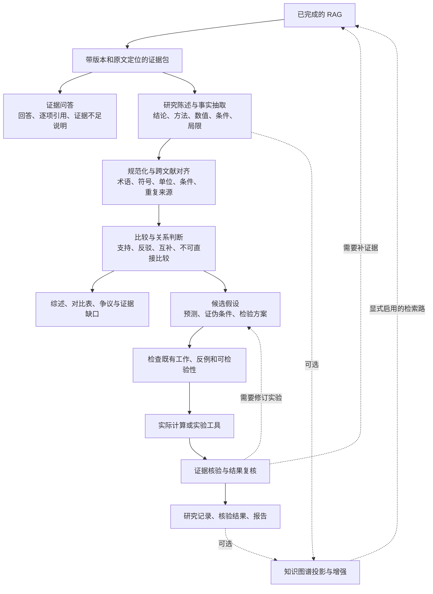

RAG 完成后的应用与研究层，2026-09-15。

前提：统一正文与树、BM25/vector/tree 三路检索、融合重排和证据定位已经完成。本方案讨论如何消费这些能力，不扩展当前正在修复的 RAG 核心。

**下一层最值得先做的是证据结构化与跨文献比较。它能支撑可靠问答、综述、矛盾分析和假设生成，也能在以后为知识图谱提供有出处的材料。** 自动研究循环建立在这层之上；简单问答不必执行完整研究循环。

这里有五层职责，不必分别建设五套存储或五套模型服务。

| 层 | 解决的问题 | 应产生的结果 |
| --- | --- | --- |
| 证据与陈述 | 论文具体说了什么，依据在哪里 | 可定位的原文证据、陈述、适用条件、作者报告与本系统推断的区分 |
| 比较与综合 | 多篇材料能否放在一起比较，结论是否一致 | 条件对齐的比较表、支持/反驳关系、重复来源归并、证据缺口 |
| 研究规划 | 接下来验证什么，怎样判断结果 | 可检验假设、预测量、检验方法、证伪条件、计算预算 |
| 执行与验证 | 推理或计算是否真正发生，结果能否复查 | 工具任务 ID、实际产物、结果解析、核验记录与明确失败状态 |
| 运行与沉淀 | 如何续跑、复用已有结论、交付成果 | 有版本的运行记录、断点、报告、陈述及证据关系；可选 KG 增强 |

证据接口是这一切的边界。RAG 至少提供稳定证据 ID、材料与节点修订、索引 generation、真实页码或行/字符定位、正文片段、校验信息和命中路由。上层可以按引用继续读取上下文，但不重新提交原件、不重新建树，也不为每个研究任务复制一份文献全文。项目已有 `Evidence/EvidenceBundle` 类型可用于收敛这个接口。[现有证据类型](../src/drbrain/loop/events.py#L17)

陈述记录应把“谁说了什么”与“系统判断它是什么关系”分开。一个实用的最小结构包括：陈述正文、陈述类型、实体或研究对象、适用条件、可选数值与单位、来源证据引用、抽取版本；支持/反驳关系另记录依据和判断过程。不同领域通过条件字段扩展，不把模型写成只认识 arXiv 或某一种物理量。

跨文献比较需要先对齐条件。例如两篇论文给出的参数不同，可能来自单位、温度、边界条件或方法定义不同；没有完成这些检查，不能直接标成“矛盾”。同一结果在摘要、正文和另一篇综述中重复出现，也不能算作三份独立验证。规范化与融合层应实际完成这些工作。

这一层同时服务两种产品：普通问答从证据直接回答；研究分析在陈述与关系上组织综述、方法对比、争议和待补证据。提出“研究空白”时需要说明检索范围与已有证据，检索未命中本身不能证明某个问题从未被研究。

之后才是更完整的研究循环：提出可证伪假设，检查已有工作和反例，安排计算或实验，读取真实工具产物，核对结果，再决定接受、修订或放弃假设。核验记录应明确通过了哪些检查；一次模型评审或工具成功退出不能单独充当研究结论成立的依据。

项目已经有可复用基础。本次是定向源码检查，没有运行这些层的完整验收。

| 现有模块 | 已看到的实现 | 下一步应关注的边界 |
| --- | --- | --- |
| `loop/events.py` | Evidence、EvidenceBundle、Hypothesis 等结构，包含证据身份与预测/证伪字段 | 与新 RAG 输出对接，字段不丢失，未知出处不伪造 |
| `loop/workflow.py` | 检索、抽取、假设、评审、计算、验证、沉淀、报告等步骤 | 从字符串候选升级为可追溯陈述与比较结果 |
| `loop/roles.py` | analyst、critic、compute、verifier 的职责提示 | 角色分工要体现在工具范围、输入输出和核验要求上 |
| `loop/tool_space.py`、`tool_broker.py` | 能力选择与调用边界 | 真实工具结果和模型叙述明确区分，错误进入运行状态 |
| `loop/store.py`、`checkpointing.py` | 运行账本和断点机制 | 重试、恢复、版本一致性与幂等性 |

当前最具体的缺口在研究循环前半段：`parse_pdf()` 只是传递选中的候选；`extract()` 主要返回字符串实体列表；`normalize()` 和 `fuse()` 也只是透传实体列表。这里尚未形成真正的术语与条件对齐、跨文献关系判断。RAG 已负责解析入库后，上层的 `parse_pdf` 应改成准确描述证据读取职责的步骤。[当前实现](../src/drbrain/loop/workflow.py#L1526)

**可以先独立推进“证据包 → 陈述 → 条件对齐 → 跨文献比较 → 带引用报告”这一条短闭环。** 不需要等待复杂自动实验，也不需要先有完整知识图谱。

建议验收一个具体任务：给定一个问题和若干篇已选材料，生成方法或结论比较表。每个比较项必须能展开到原文；条件不一致时解释差异；有冲突时提供双方证据；缺证据时保留未知；补充一篇材料后只更新受影响的结果。

可按下面顺序推进，源码范围主要在 loop 与分析服务，避免接管另一位开发者正在修的 tree/RAG 文件：

1. 固定 EvidenceBundle 的消费契约，确认所需上下文能够按节点读取，保留材料、节点和索引版本。
2. 以有出处的陈述结构替代仅有字符串实体的中间结果，并区分原文报告与系统推断。
3. 实现真正的规范化和比较关系；优先覆盖术语/单位/条件不一致、重复引用、互相冲突、证据不足。
4. 生成可核验的比较表或小型综述，检查引用覆盖和陈述是否得到原文支持。
5. 在这条短闭环通过后，再接假设、评审、真实工具计算、验证和恢复流程。

RAG 接口开发期间可以用经过人工核对的固定证据包做契约测试；这只验证上层行为。RAG 合并后再运行真实 CLI 完整验收，不能把接口测试当成整条生产链通过。

模型服务可以沿用现有分工：Spark 4B 继续承担索引工作；DeepSeek 承担上层分析、规划、评审与回答。多个研究角色可以复用同一个模型端点，分别计量并限制工具范围；若以后需要便宜的离线事实抽取，再显式配置 extract 角色。真正的数值计算或模拟通过能力/工具接口执行。

持久化继续遵守一份正文和稳定引用：材料与树沿用主库，陈述及证据关系复用现有主库写入接口，运行状态复用 RunLedger；只保存确有必要的计算产物和交付报告。知识图谱以后从这些陈述、关系和核验记录生成，并保存到原始证据的链接，无须再次解析整批材料。
