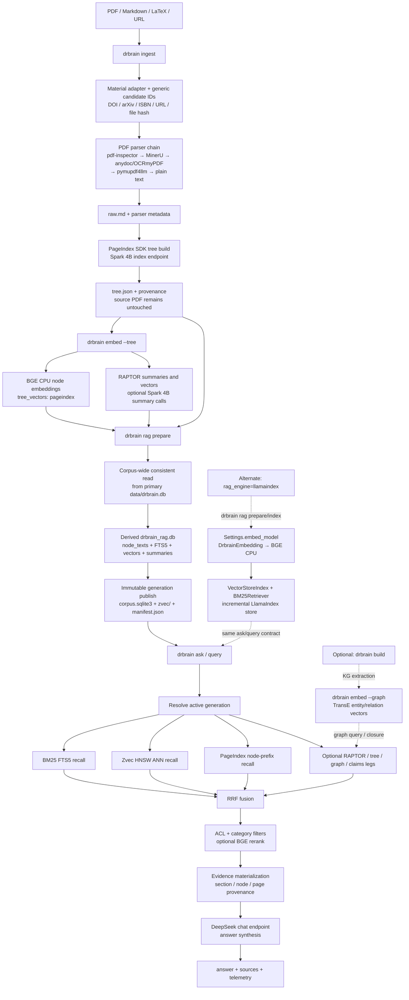

# RAG layer

## Current contract

The RAG layer is a retrieval service over stored papers and derived evidence units. It is independent of the CLI and loop orchestration and can be used directly from Python.

## Unified write path and compatibility

New papers have exactly one text fact: the canonical store in the main
database. `ingest` writes the revision, its contiguous blocks and one published
leaf per block; the original material (plus attachments) is copied under
`data/papers/<id>/`; no `raw.md` or `tree.json` is generated, and a canonical
write failure rolls the whole paper back and reports it as failed instead of
publishing a record without its body. (`ingest-link` still writes its
extracted markdown as `raw.md`; that flow is a known remaining writer until it
is migrated too.)

`drbrain rag prepare` defaults to the unified index (canonical FTS, shared
vectors, hierarchy, one published tree generation). `--legacy-sql` keeps the
deprecated derived `drbrain_rag.db` working copy available for deployments
whose readers have not migrated yet; it is opt-in, and `--unified` remains
accepted as a compatibility alias. Existing SQL working copies and published
generations stay readable and are never deleted by a prepare run.

The tree leg reads the published unified generation (search → navigation →
read receipts → leaf text). When a SQL corpus exists, every leaf is verified
against the same node id and content revision in its `node_texts` projection,
so BM25/vector/tree cannot mix revisions. When no SQL corpus exists (the
default unified deployment), a tree-only request is served from the generation
alone and every other requested leg is reported `source_unavailable`; a
missing generation is fail-closed (ask reports `source_unavailable` with the
prepare hint). The older readers (`query --paper`, `embed --tree`, the
per-paper PageIndex/RAPTOR retrievers, `translate`, the legacy tree/raw
inspection helpers) remain read-only compatibility paths for papers ingested
before this change; they simply have no input for new papers.

## Retrieval path

1. The indexer reads stored paper sections, PageIndex nodes, RAPTOR summaries, concepts, and arguments.
2. Independent retrievers produce ranked candidates: BM25, vector, tree/PageIndex, RAPTOR, and graph-aware retrieval.
3. `FusionRetriever` combines legs with reciprocal-rank fusion or weighted fusion.
4. Optional ACL post-filtering removes candidates without matching scope metadata.
5. Optional reranking refines the fused candidate set.
6. The result preserves source, paper, section, node, and score provenance for synthesis and audit.

Each leg is isolated. A degraded or unavailable leg is recorded in retrieval trace and does not invalidate candidates returned by other legs.

## Complete CLI pipeline

The current production path is a text RAG path; knowledge-graph construction is
an optional branch and is not required to prepare or query the SQL RAG index.



The critical commands are therefore:

```bash
uv run drbrain ingest <material>
uv run drbrain embed --tree
uv run drbrain rag prepare
uv run drbrain ask "your question" --json
```

`drbrain embed --graph` trains TransE entity/relation vectors in the
`embeddings` table; it does not populate `tree_vectors` or the Zvec index. A
bare `drbrain embed` remains a compatibility alias for `--graph`, but production
scripts should state the mode explicitly. `rag prepare` in SQL mode does not
create missing document embeddings; it packages the vectors already produced by
`embed --tree`.

When `llamaindex.rag_engine=llamaindex`, `drbrain rag prepare` (or `rag index`)
uses LlamaIndex's `VectorStoreIndex` and `BM25Retriever`. Its
`Settings.embed_model` is `DrbrainEmbedding`, which delegates to the same
configured BGE provider. That mode embeds PageIndex documents while building the
LlamaIndex store; it is an alternate publication path, not a second embedding
model in the SQL+Zvec path.

## Storage architecture

SQLite is the authoritative store for paper metadata, projected PageIndex text,
FTS5, claims, and the immutable `corpus.sqlite3` generation.  Vector search is a
derived sidecar selected with `retrieval.vector_backend`.  Production configs use
`zvec`: `rag prepare` builds an HNSW index from the generation's PageIndex vectors
and publishes it under the same generation directory as the SQLite snapshot.  A
query therefore pins text and ANN results to one generation.  `sqlite` remains
available for small fixtures and compatibility, where the vector leg reranks the
BM25 candidate pool in process.  Zvec load or query failures are surfaced in the
vector leg trace; they are never silently replaced by a different backend.

```text
primary SQLite (papers, KG, artifacts)
            │  rag prepare
            ▼
derived generation/
├── corpus.sqlite3       authoritative text + FTS snapshot
├── zvec/                optional HNSW PageIndex ANN sidecar
└── manifest.json        generation + embedding + vector backend identity
```

## Evidence semantics

PageIndex sections and RAPTOR summaries are logical evidence units. Long documents may have physical fragments with parent checksums and character offsets. A response must cite the logical unit and retain enough provenance to locate the source artifact.

## Agent boundary

The RAG agent exposes retrieval and knowledge validation tools. MCP tools are not special-cased in the agent; they enter through the shared capability catalog and return the standard invocation envelope.

## Verification

```bash
uv run pytest tests/test_rag* tests/test_retrieval* -q
uv run ruff check src/drbrain/rag
```

For a new retriever, implement the retriever contract, add a source label, emit trace data for success and degradation, and test provenance and ACL behavior.
