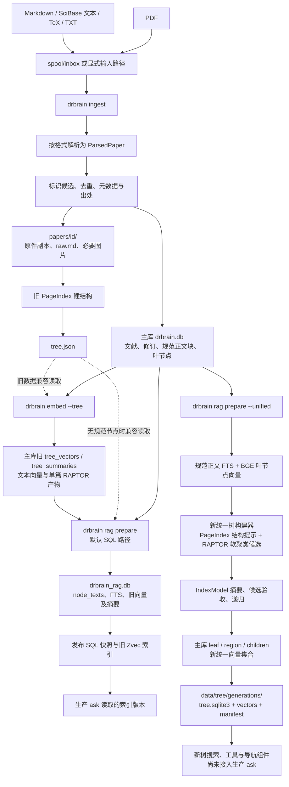
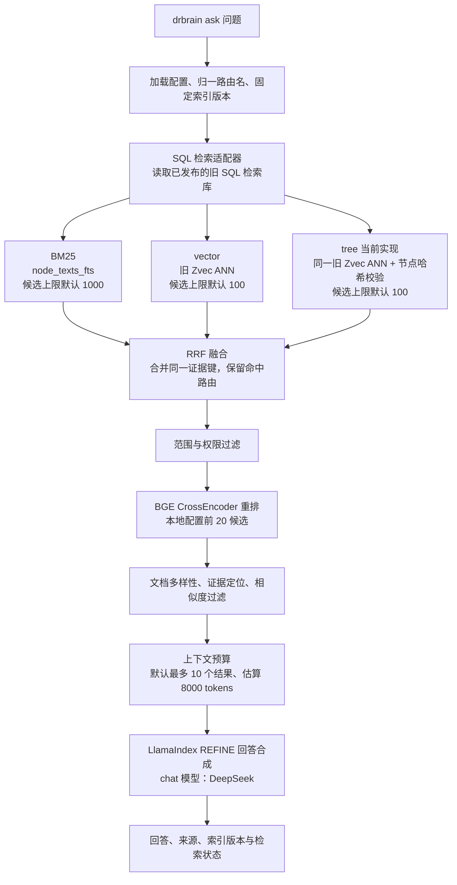

当前 RAG 管线全景，核对至 `51c6507`，2026-09-15。

**现在是旧生产检索链路与新统一树构建链路并存。对外路由名已经归一为 BM25、vector、tree，但生产 `ask` 的 tree 还没有接上新统一树导航。** 因此，当前不能称为已经跑通了设计中的三路 RAG。

以下描述当前代码与仓库本地配置；不代表本次重新验证了模型端点或全量语料。原设计见[统一树设计](../unified-tree-rag-design.md)，验收要求见[原子化计划](../unified-tree-atomic-plan.md)，具体缺陷见[代码审核报告](unified-tree-3a2d546-review-2026-09-15.md)。

从素材到索引，实际存在下面两条准备路径：

`spool` 是输入目录及处理账本这一层；当前 `ingest` 不传路径就读 `data/spool/inbox/`，也接受文件或目录。它记录处理状态，支持重试；当前实现保留输入文件，向论文目录复制原件。[CLI 入口](../../src/drbrain/cli/ingest_commands.py#L353)

PDF 一般先尝试 **pdf-inspector**；未获得结果时进入 MinerU，再尝试 anydoc、条件启用的 OCRmyPDF、pymupdf4llm，最后提取纯文本。MinerU 可以被配置跳过；OCR 也不是每篇必经步骤。Markdown/TXT 直接读取，TeX 经过 LaTeX 转 Markdown。SciBase 在这里是素材来源，其导出的文本按实际格式处理。[PDF 解析](../../src/drbrain/parser/mineru/parser.py#L287)、[文本与 TeX 解析](../../src/drbrain/parser/material.py#L112)

`ingest` 随后做身份解析与元数据补充，写文献记录、规范正文块和来源定位。它仍然同时写 `raw.md`，调用旧 PageIndex 结构流程生成 `tree.json`。新规范存储已加入，但尚未替代这些旧写入；新规范写入和旧建树也存在各自的失败状态，不能只看文献记录存在就认定所有索引已准备好。[入库实现](../../src/drbrain/cli/_helpers/db_ingest.py)、[规范正文写入](../../src/drbrain/services/canonical_content.py)

**旧生产路径需要区分“计算向量”和“准备检索库”。** `embed --tree` 计算文本向量，并可构建旧的单篇 RAPTOR 摘要，写入 `tree_vectors/tree_summaries`；读取文本时已经支持规范节点优先、旧文件兼容。默认 `rag prepare` 则把规范节点投影到 `drbrain_rag.db`，复制已有的旧格式向量及摘要，然后发布 SQL 快照和 Zvec 索引。它不会通过这一操作自动补齐新统一树向量。[旧嵌入入口](../../src/drbrain/services/embedding.py#L783)、[检索库准备](../../src/drbrain/rag/preparation.py#L32)

**新路径由 `rag prepare --unified` 启动。** 它维护主库规范正文的 FTS、统一向量集合、区域摘要层和发布版本；构建器已经具有 PageIndex 临时结构提示、RAPTOR 全局/局部软聚类、摘要验收和递归组织等组件。这里描述的是已写出的构建流程，不表示算法契约已经全部满足：审核仍发现结构权重未生效、摘要失败被计为完成、重复嵌入等问题。[统一准备入口](../../src/drbrain/cli/rag_commands.py#L192)、[准备服务](../../src/drbrain/tree/prepare.py#L103)、[构建器](../../src/drbrain/tree/builder.py)

在线问答目前实际这样执行：

本地配置仍写着 `retrievers: [bm25, vector, pageindex, raptor]`，但代码把 `pageindex` 和 `raptor` 都折叠成 `tree`，只贡献一路 RRF 排名。因此当前是**三个路由名**，并非四路独立召回。[路由归一](../../src/drbrain/rag/legs.py#L21)

断点就在 tree 的实现：SQL `_tree_leg()` 调用 `query_zvec_evidence()`，读取与 vector 同一套旧 Zvec 索引，再校验 `node_texts` 的身份与哈希。它没有调用新 `TreeSearch/TreeNavigator` 遍历新树，也没有在线执行设计中的主题到成员证据导航。新树即使在 `data/tree` 构建和发布成功，也不会因此自动被生产 `ask` 使用。[生产调度](../../src/drbrain/rag/engine.py#L334)、[当前 tree 路由](../../src/drbrain/rag/sql_retrie.py#L209)

当前报错提示还有一处容易误导操作：SQL `ask` 缺索引时会建议 `rag prepare --unified`，但其实际读取入口仍是旧 SQL 发布体系。不能据这条提示判断新旧链路已连接。[提示实现](../../src/drbrain/rag/engine.py#L138)

融合后，SQL 层执行 BGE 重排及文档多样性选择，LlamaIndex 层继续做相似度和上下文预算处理，并用 REFINE 合成回答。重排器不可用时有降级状态；候选上限、重排数量和上下文预算是不同参数。LlamaIndex 在这里负责适配、后处理与回答合成，**不是另一条召回路由，也不是另一种嵌入模型**。[SQL 融合与重排](../../src/drbrain/rag/sql_retrie.py#L510)、[问答后处理](../../src/drbrain/rag/engine.py#L259)

若配置改成 `rag_engine: llamaindex`，还会走另一套旧索引实现：`rag index` 构建 LlamaIndex 的 BM25 和 VectorStoreIndex，后者通过 DrBrain 的 embedding 适配器调用配置的 BGE 模型；tree 则使用旧文件结构检索器。这条分支同样没有接上新的统一树导航，不能靠切换引擎完成新算法接入。[索引构建](../../src/drbrain/rag/indexer.py#L175)、[旧结构检索器](../../src/drbrain/rag/retrievers.py)

各命令的实际责任如下；表中是行为说明，不是要求重跑现有 10k 语料。

| 命令 | 当前职责 | 模型需求或前置条件 |
| --- | --- | --- |
| `ingest` | 解析、身份与元数据、保存原件与规范正文，同时生成旧结构文件 | PDF 解析本身不依赖 DeepSeek；旧结构和部分分类阶段仍可能调用 LLM |
| `embed --tree` | 旧文本向量和旧单篇 RAPTOR 产物 | BGE；RAPTOR 摘要调用旧 LLM 配置链 |
| `rag prepare` | 默认准备旧 SQL 检索库并发布，读取已有旧格式向量 | 不会代替向量计算，也不会自动切换到新树 |
| `rag prepare --unified` | 新规范 FTS、统一向量、统一树层次及其版本发布 | BGE + IndexModel；无 KG 构建前置条件 |
| `rag index` | SQL 模式发布现有检索库；LlamaIndex 模式构建其 BM25/向量索引 | SQL 模式不是完整的 ingest→索引准备替代入口 |
| `ask` | 检索、融合、重排、上下文选择、回答 | 需要相应已发布索引；回答调用 chat 模型 |
| `build` → `embed --graph` → `closure` | 概念/关系抽取、TransE、图谱推理 | 属于可选知识图谱分支，不是纯文献 RAG 的必要步骤 |
| 裸 `embed` | 仍按兼容行为执行图谱嵌入 | 当前不等于 `embed --tree` 或统一树准备 |

`embed --graph` 虽然已经显式提供，裸 `embed` 的历史兼容行为仍保留在实现里。[embed CLI](../../src/drbrain/cli/build_commands.py#L495)

模型分工的本地配置与接入情况如下：

| 角色 | 本地配置 | 当前边界 |
| --- | --- | --- |
| 索引、结构、摘要 | Spark X2.5 4B，服务名 `spark-x25-4b` | 新统一树摘要使用 IndexModel；旧 ingest 和 `embed --tree` 仍保留旧配置链，角色改造尚未覆盖所有调用 |
| 在线导航、回答 | `deepseek-flash` | 生产回答使用 chat 配置；设计中的新统一树在线推理导航尚未接入生产 |
| 嵌入 | `BAAI/bge-small-en-v1.5`，CPU | 为文本和查询生成向量；新旧向量存储仍并存，尚未实现全流程只计算一份 |
| 重排 | `BAAI/bge-reranker-base`，CPU | CrossEncoder 计算问题与候选文本的相关性，区别于向量余弦排名 |

因此，“建索引应该用 4B、问答用 DeepSeek”仍是明确分工，但目前不能据配置表断言所有旧入口都已经严格按这个角色体系工作。尤其新树导航尚未接入，不能把它写成已经在生产调用 DeepSeek 导航。[新索引角色绑定](../../src/drbrain/tree/prepare.py)、[回答模型选择](../../src/drbrain/rag/llm.py#L200)

存储也还处在过渡状态。下面是默认或当前配置的位置，运行时指定其他 root 时会相应变化；表示代码会维护的位置，不表示每篇论文都已经产生全部文件。

| 位置 | 保存内容 | 当前读取者 |
| --- | --- | --- |
| 原素材目录 / `data/spool/inbox/` | 输入原件、处理账本关联的输入 | ingest；输入原件保留 |
| `data/papers/<id>/` | 原件副本、`raw.md`、`tree.json`、必要图片 | 旧管线及兼容读取 |
| `data/drbrain.db` | 文献身份、规范正文块、新树节点及关系、摘要；同时仍有旧向量表 | 入库、新树准备、其他业务 |
| `data/drbrain_rag.db` | 节点正文投影、FTS、旧向量和摘要 | 旧 SQL 索引准备与发布 |
| `data/llamaindex/generations/` | 已发布 SQL 快照和旧 Zvec 索引；切换引擎时则是相应 LlamaIndex 产物 | 当前生产 ask |
| `data/tree/vectors/` 与 `data/tree/generations/` | 新统一向量工作集合，以及 `tree.sqlite3`、向量副本、manifest 等发布产物 | 新统一树组件，尚非生产 ask 入口 |

统一存储的基础已经写出来，但重复正文、旧结构文件、两套发布体系仍然存在。当前最关键的后续工作，是修好统一树内部已确认的算法和状态问题，再把生产 BM25/vector/tree 与 `ask` 接到同一套规范节点、向量和树版本；之后才能按原计划验收最小存储与真正的三路检索。
