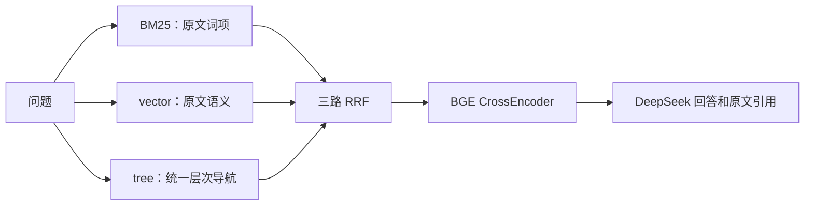

# 统一 Tree RAG：结构约束的软聚类与证据导航

2026-09-15。状态：源码审阅后的算法设计，尚未实现或完成效果验证。本文件取代 `pageindex-raptor-storage-plan.md` 的旧四路方案。

## 1. 目标与设计决定

外部只保留 **BM25、vector、tree 三路**。tree 是项目内新设计的一种检索算法：**文档结构参与语义分组，分组统一产生摘要父节点，查询在同一个层次索引中导航并读取原文。** 不先持久化一套 PageIndex 树和一套 RAPTOR 树，再将两套检索结果串联或融合。

借用 RAPTOR 允许多父的设计，底层可以是分层 DAG、可以有多个根；产品接口仍叫 tree。只有一个节点注册表、一个父子成员关系表、一个构建器、一个摘要服务和一个查询状态机。

每篇不自动生成 `content.md`、`tree.json`、`structure.json`、`pages.json`、SDK 文档目录或 RAPTOR pickle。**一份原始材料，规范化内容与统一树进入主 SQLite；FTS 和 Zvec 是整个语料库共享的派生索引。**

## 2. 源码依据：复用什么，改变什么

两位 subagent 已分别审阅实际源码；详细覆盖和限制见 [RAPTOR 审阅](research/raptor-source-audit-2026-09-14.md)、[PageIndex 审阅](research/pageindex-source-audit-2026-09-14.md)。本地调用点见 [DrBrain 接入审计](research/drbrain-tree-integration-audit-2026-09-14.md)。

| 来源 | 固定版本 | 直接依据 | 本方案的改变 |
| --- | --- | --- | --- |
| RAPTOR | `7da1d48a7e1d7dec61a63c9d9aae84e2dfaa5767` | global/local UMAP、GMM 软分配、BIC、递归摘要、全层 collapsed 检索；可注入已有 Node/向量 | 分配受到文档结构先验影响；加入统一父节点接受规则、可靠停止条件及来源定位 |
| PageIndex | `bfbd4b305cd3f0f39a5094779627a2c93634ad79` | 文档结构提取、页面/章节范围、读取成本与路由成本思想、Agent 按结构阅读原文 | 结构成为统一分组算法的输入；连续页优化不原样套到跨篇节点；查询使用新的统一节点工具 |

上游没有实现本文件定义的联合算法。结构条件化概率、统一分组选择、跨层交叉导航及存储适配是新增部分；是否提高质量与效率需要对照实验，不能把项目内新设计表述为已证明的学术原创或最优算法。

固定版本 PageIndex 本地 browse 主要枚举文献，README 将其 File System 标为 Cloud-only。本方案建设的是本地统一索引，不把未公开的 Cloud File System 当成已取得的源码能力。

## 3. 一个数据模型

### 3.1 正文只存一次

主库中的规范化 `content_blocks` 是唯一可检索正文。每个 block 记录：

- 文献与内容修订、顺序、准确文本及 hash；
- 真实 PDF 页/版面来源，或 MD/TeX 行与字符来源；
- 文档结构路径、标题锚点、阅读顺序；
- 规范化变换和 parser provenance。

block 的连接规则要能确定地重建规范化正文，不能因为分块丢掉分隔符、标点、公式、表格或标题外的 residual 内容。超过模型预算时，在保留来源范围的前提下细分，不以字符串截断代替切块。

PageIndex 计算得到的原始结构先作为内存中的结构提示：保留它的范围、标题路径与顺序，但不另存一份独立 PageIndex tree。它的父子页范围可能重叠，故应先建立不重复的正文覆盖，再产生叶节点。

### 3.2 统一节点与成员

```text
TreeNode
  id / revision
  kind: leaf | region
  leaf: 引用 content_block 及必要子范围
  region: 摘要、标题、生成契约
  children: 下层节点 ID
  provenance: 从叶引用及成员关系解析
```

`region` 可以对应连续的一节，也可以概括跨篇主题。两者使用同一构造过程、同一种成员关系和相同的读取协议；不各建一张树表。分组理由（结构提示、语义聚类或两者）仅作为审计属性。

原文不写入多个父节点。父节点保存即时 children 和新产生的摘要；叶覆盖集合按需解析并去重，不在每一层复制整份叶 ID 列表。跨篇父节点没有伪造的单篇页码。

节点身份包含内容/成员修订，不采用上游临时四位编号或 RAPTOR 局部整数作为全库身份。相同文字在不同文献中保留不同出处；内容 hash 用于复用计算，不抹去来源。

## 4. 新建树算法

### 4.1 输入与初始化

输入：规范化 blocks、PageIndex 得到的结构提示、已有 BGE 向量、一个 `IndexModel`。

先建立 leaf 节点、标题锚点和完整正文覆盖。每个叶向量只计算一次，同时供外部 vector 路和本 tree 算法使用。PageIndex 结构提示生成候选分组，不直接变成必须保存的第二棵树。

### 4.2 结构条件化的软分组

每轮对当前 frontier 使用 RAPTOR 的降维/GMM 思路产生软概率。随后在同一分配步骤里引入结构先验，而不是在检索结束后拼接两个分数：

\[
\widetilde p(k\mid i) =
\frac{p_{GMM}(k\mid i)\exp(\lambda A(i,k))}
{\sum_j p_{GMM}(j\mid i)\exp(\lambda A(i,j))}.
\]

`A(i,k)` 是节点与簇之间的文档结构相容性，范围 `[0,1]`：从原始 GMM 概率定义并固定簇的暂定画像，排除被评估节点自身，比较同篇材料的标题路径公共前缀及结构锚点。来源分布按唯一原文范围的 token 量加权，避免软多父把同一出处反复计入。上层 region 使用其真实来源分布，不强行指定一个所属文献。

跨文献的结构相容项取0，表示不增加这项先验。归一化后，同篇簇概率提高仍可能压低跨篇簇概率；因此该公式确实存在同篇偏置，不能把它称为对跨篇召回完全中性。跨篇多证据评测是选择 lambda 的必需约束。

此处只有一次有明确输入的先验修正，避免用已修正结果反复强化自身。`lambda=0` 是不加结构先验的消融条件；必须保持其余聚类参数、随机种子与分配逻辑一致，才可与 RAPTOR 比较。不能把整个系统在 lambda=0 时称为与原 RAPTOR 等价。

修正后的概率经软阈值生成成员组，允许同一节点属于多个组。PageIndex 的连续章节分组提示也进入同一候选集合。相同成员集合先归一去重，之后只经过一次摘要流程。

这一步需要分别在上游 global GMM 和各 global 子集的 local GMM 内接入 posterior，并保留每层原有的阈值与局部索引映射。不能拿最终离散 label 当成概率，也不能将 global/local 概率相乘后统一阈值化，再声称 lambda=0 复现原成员关系。参数传递和未归属节点处理必须显式测试。`lambda` 和相容性细节在固定开发题集上选择，不凭直觉宣称某个数值最优。

### 4.3 用读取代价决定是否增加父节点

每个候选组都走同一接受过程：

1. 检查来源覆盖、成员合法性、摘要输入预算、重复覆盖及递归是否收缩。
2. 用摘要输出上限预估增加该父节点是否值得，避免为显然不合适的组调用模型。
3. 通过共享 `IndexModel` 生成候选摘要。
4. 用实际摘要长度、实际覆盖和索引成本重新检查，通过才发布父节点。

成本思想来自 PageIndex，公式需要重新定义。初始可检验代理是：不分组时读取成员的代价，与“读取父摘要再读取一个候选子分支”的代价相比。前者按唯一来源范围计算，后者计入摘要及实际工具开销；不能把多个文献页码相加后套连续 PDF 页范围公式。

该代理只刻画单目标且路由有效的情况，不是所有查询的延迟保证。需要多条证据时，还要计入多个子分支、重叠覆盖和 residual 内容；实验中必须分别测单证据与多证据问题。摘要变短不等于内容完整，不能仅凭压缩率通过质量门。

没有收益的候选组不产生父节点；原节点仍在统一索引中。小集合可停止为多根，不为制造“一棵完整树”的外观强造摘要。

### 4.4 同一个摘要与嵌入过程

所有被接受的 region 使用一个摘要服务，由相同 `IndexModel` 角色执行。结构分组与语义分组若成员、范围、顺序和摘要契约一致，只生成一份摘要。成员不同或契约不同，则需要各自的新信息，不能仅因文字相似而复用。

缓存键包括成员修订、覆盖/顺序约定、prompt、模型修订、tokenizer 和预算。新的父摘要才计算新 embedding。相同模型角色共用并发限流器，不让两个上游各自启动的线程池叠加冲击 Spark 4B。

### 4.5 停止、覆盖与规模

每个父节点只能引用已存在的下层节点；成员集合必须产生实际合并。达到层数/成本预算、frontier 不收缩、分组重复或没有可接受父节点时停止。所有未提升的节点保留为 frontier，所有原文仍可直接读取和检索。

软多父可能放大摘要数量，因此记录每层父子比、覆盖重复率、模型 token 和索引大小，并设置明确构建预算。未分配节点、模型失败与有效停止是不同状态，不能全部标记 ready。

算法目标覆盖整个集合，而不是只在 BM25 候选文献中建树。先在小集合验证完整构建；10k 需要有界批次及跨批 frontier 汇总，仍使用同一个构建器和节点模型。分批会改变聚类结果，属于需单独消融的规模近似，不能宣称与一次性全局 GMM 等价。

## 5. 一个 tree 查询算法

```text
问题
  → 在同一索引的所有层产生入口节点
  → 单个有状态导航器：展开 / 读取 / 回到父节点 / 查文内邻域
  → 校验实际读取的原文证据
  → 返回一个 tree 排名
```

入口延续 RAPTOR collapsed 思想，允许从叶、中间摘要或高层摘要开始。query embedding 可与外部 vector 路共享计算，但 tree 的搜索对象包含摘要，之后还会执行层次导航。它不依赖 BM25 的候选 paper 列表。

导航器借鉴 PageIndex 的“先理解结构，再读具体内容”，但只操作统一节点：

| 工具 | 行为 |
| --- | --- |
| `search_nodes(query, scope)` | 全层节点搜索；可针对问题的另一部分重新寻找入口 |
| `expand(node_id)` | 返回该节点的 children、摘要和来源概况 |
| `read(node_id, range)` | 读取确定的原文范围；父摘要与原文明确区分 |
| `parents(node_id)` | 沿同一成员关系反向查找，支持转向同主题的其他成员 |
| `read_scope(document, anchor)` | 按文档结构锚点读上下文、相邻片段和章节范围 |

这样可以从跨篇主题进入原文，从原文回到主题，再进入另一篇相关证据；也可直接命中原文。不存在必须先完成的“RAPTOR 检索阶段”和随后独立的“PageIndex 检索阶段”。

执行器保存已读集合、已展开节点、版本、预算和未解决问题；验证工具参数与所有来源引用。最终返回的原文候选必须来自实际读取记录，不能把模型生成的 node_id、页码或摘要引用当作证明。

同一叶子的多个父节点和访问路径只形成一个候选，保留访问来源，不重复加票。parents 从同一 children 表反向查询，文内邻域从原文顺序和结构锚点派生；不隐藏第二套边表。预算耗尽时输出可审计的 partial 状态。tree 不生成最终答案交给另一路拼接；它返回带出处的证据排名，最终答案统一在外层生成。

复用 PageIndex 的解析/工具实现时，不调用其固定 native chat 去隐式建文档库。上游 Agent 配置不自动携带 chat_backend，因此在线模型实例必须明确绑定 DeepSeek endpoint；通用 MD/TeX 通过行与字符范围读取，不冒充 OCR 页。

## 6. 统一存储

| 内容 | 唯一持久化位置 |
| --- | --- |
| 原始 PDF/TeX/MD | 已有材料库的文件；需要托管时只托管一份，原输入不删除 |
| 规范化正文及来源映射 | `drbrain.db` 的 content_blocks |
| 叶/区域节点、摘要、成员关系、修订与任务状态 | 同一个 `drbrain.db`；扩展现有表与统一写入 API |
| BM25 | 主库内 FTS external-content 索引，正文引用 content_blocks |
| 原文与摘要向量 | 共享 Zvec 索引；主库记录模型、ID、修订和校验信息，不再保存第二份浮点向量副本 |

外部 vector 查询同一个 ANN 中的原文叶；tree 查询原文叶和 region。索引可能由引擎产生多个物理文件，但不为每篇、每种算法建立一套目录。FTS/ANN 的倒排与搜索结构是必要索引开销，不是另一份可编辑正文。

Markdown/JSON 树、PageIndex 兼容视图和报告只在显式导出或临时适配时生成，不参与日常必须同步的事实存储。固定版本发布是显式能力；正文修订与 ANN 必须匹配，旧答案引用需要保留对应修订，不能覆盖后假装仍可追溯。

迁移旧 10k 时，先读 `raw.md/tree.json`、SDK 产物与主库，按 hash 和来源范围归并到统一记录。旧材料和旧结果本阶段不删除；之后的清理另以已验证的冗余清单处理，不在测试中自动执行。

## 7. 三路与模型角色



| 角色 | 负责工作 | 当前目标 endpoint |
| --- | --- | --- |
| `index_model` | 所有建树判断、标题/区域摘要、结构与语义分组摘要 | Spark 4B |
| `chat_model` | tree 在线导航、最终回答 | DeepSeek |
| `embedding_model` | 原文与新增摘要向量 | BGE CPU |
| `rerank_model` | 融合候选的 query–evidence CrossEncoder 打分 | BGE reranker CPU |

一个 index 角色不等于只允许一个模型部署；它引用命名 endpoint，可替换部署。建树算法不再分别维护 PageIndex 模型地址和 RAPTOR 模型地址，也不通过全局环境变量在 index/chat 间切换。

配置只注册 `retrievers: [bm25, vector, tree]`。tree 内部节点层数、分组来源和访问路径不增加外层 RRF 路数。初始预算沿用 BM25约1000、vector约100、tree最多约100，融合头部20–50个用 BGE 重排，最终按出处去重、多样性和 token 预算取约8–10个上下文。数量是上限与待验收配置，不要求 tree 每次读满100个节点。

## 8. 实施与验证

实现顺序从统一正文和节点契约开始，再实现联合分组/摘要，最后实现统一导航和三路 CLI。上游源代码固定版本保留许可证，通过窄接口复用所需函数；不直接安装研究仓库全部依赖，也不以改名 SQL LIKE 作为完成 tree。

无知识图谱前置条件的 CLI 流程：`spool → ingest → rag prepare → ask`。ingest 登记正文和结构提示；prepare 增量建立 FTS、共享向量和统一层次；ask 只查询，不提交文档或隐式建树。构建全程只用 index_model，查询才用 chat_model。

先写并通过这些契约：原输入 hash 不变；正文覆盖完整；模型角色请求实际到正确 endpoint；同一正文/向量不重复保存；多父/多根可读；未分配、重复分组、空摘要、线程异常、超预算都有明确行为；三路只注册一次；返回证据都有读取记录和精确来源；迁移 dry-run 不写入。

对照组使用真实算法：BM25+vector；增加原生 PageIndex；增加 RAPTOR collapsed；增加简单串联方案；增加本统一 tree。统一 corpus 修订、模型和最终上下文预算，额外模型调用成本也单独报告。

本算法的消融包括：lambda=0 去除结构条件化、去掉结构候选分组、去掉父节点成本门、强制只从根进入、禁止父节点/文内邻域跳转、分批与完整小集合构建。它们分别验证每一项新增机制，不把“用了两个库”当作算法有效的证明。

两位源码审阅者已对新算法另做反向审查：[RAPTOR 约束](research/unified-tree-algorithm-review-raptor.md)、[PageIndex 约束](research/unified-tree-algorithm-review-pageindex.md)。本版已吸收其关于两级后验、先验偏置、父节点成本假设、覆盖和单存储的修正；这些静态审查不代替运行验证。

问题覆盖精确术语/公式、单篇结构关系、跨篇多证据综合；材料覆盖 PDF、TeX、SciBase MD。评价原文证据召回、引用正确性、答案可支持性、P50/P95时间、构建/查询token、缓存命中和磁盘占用。先用固定且人工核对来源的小题集定位问题；统计效果结论需要足够的独立评测数据。

当前文档给出可实现、可证伪的新算法方案。现有10k不重跑全量 ingest；先以存储审计与小样本确认迁移及算法契约，再推进规模验收。
